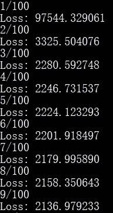

# 线性回归基础

> 原文：<https://medium.datadriveninvestor.com/fundamental-of-linear-regression-8306aee2a15d?source=collection_archive---------3----------------------->

## 用 Python 从头开始构建一个简单的线性回归模型！

## 开始之前，让我们设定目标:

1.  了解线性回归的基本原理。
2.  理解用梯度下降算法优化线性回归模型的参数。
3.  用 Python 从头开始构建一个简单的线性回归模型。
4.  在 Sklearn 库中实现线性回归模型。

根据维基百科的定义，监督学习是一种机器学习任务，它学习一种基于一组输入输出数据将输入映射到输出的函数。线性回归是最简单的监督学习算法之一，它是从统计学“借用”来的。

在我们深入线性回归的数学和算法之前，让我们考虑一个简单的问题:

假设我们有如下表所示的工资和工作经验数据:

**Source:** [**https://www.kaggle.com/**](https://www.kaggle.com/)

> 数据电子表格可在此下载[。](https://docs.google.com/spreadsheets/d/1mROKl21pI-z2dc-hCqRJlhwjbSVyb_JS4pHHlIR-FOc/export?gid=0&format=csv)

**Plot of the data in Spreadsheet**

现在，假设你正在寻找一份工作，并希望在发送简历之前预测期望的薪水。显然，很难根据上面的情节做出预测。所以，这里有**线性回归**来帮你解决。如前所述，线性回归是将**独立**(又名**预测器/输入/特征**)变量映射到**相关**(又名**响应/输出/目标**)变量的函数。在这种情况下，自变量是经验，因变量是工资。我注意到在这种情况下只有一个独立变量。这就是我们所说的 [**简单线性回归**](https://en.wikipedia.org/wiki/Simple_linear_regression) 。

 [## 编码器解码器序列:多长是太长？数据驱动的投资者

### 在机器学习中，很多时候我们处理的输入是序列，输出也是序列。我们称这样的一个…

www.datadriveninvestor.com](https://www.datadriveninvestor.com/2020/03/24/encoder-decoder-sequences-how-long-is-too-long/) 

> 现在让我们看看简单线性回归背后的数学！

相信你对“ **y = mx + c”，**很熟悉吧？这是一个包含两个变量的线性方程。现在，看上面数据的曲线图。你能从上面的图表中注意到经验和薪水之间的线性关系吗？

设 **x** 为经验， **y** 为工资。通过将 y 近似为 x 的线性函数，

**Simple linear regression which involved only one independent variable**

或者更一般地说

**General equation for linear regression where n is the number of independent variables**

这里，h(x)是将输入 x 映射到输出 y 的预测模型。θj 是线性回归模型的参数(权重)。(注:θo 通常被称为偏差项)
因此，现在我们的目标是获得权重和偏差的最佳值，这将最小化**实际值(y)** 和**预测值(h(x))** 之间的误差。选择误差平方和作为评估该模型的度量。误差平方和函数称为**成本(**又称**损失)函数**，J(θ)。

**Note: The superscript (i) here is simply the index of data, and has nothing to do with mathematical exponent. And, m is the number of data, which is 30 in this case.**

**“为什么平方误差？”**

> 因为有正负误差会相互抵消。所以这里的“平方”是必要的，以避免正负抵消。

**“还有，为什么求和前面有 1/2？”**

> 这只是因为数学上的方便，当我们求一阶导数时，2 会被 1/2 抵消。我们将在下面的梯度下降算法中看到它。

在定义了成本函数 J(θ)之后，我们将通过优化算法来最小化 J(θ)。

## 梯度下降算法

[**梯度下降**](https://en.wikipedia.org/wiki/Gradient_descent) 是一种最小化函数的迭代优化算法。为了通过梯度下降算法找到函数的最小值，我们通过与函数在当前点的梯度的负值成比例的步长迭代地更新θj。让我们来看看相关的方程和可视化。

**Parameter θj is updated in every iteration according to this equation.**

梯度下降算法如下图所示。

**Source:** [**https://donsoft.io/deep-learning-with-rnns/images/gradient_descent_cropped.gif**](https://donsoft.io/deep-learning-with-rnns/images/gradient_descent_cropped.gif)

为了计算 J(θ)的梯度以更新权重θj，我们对θj 取偏导数:

**Look at second step to third step, the term 2 and 1/2 cancelled out each other as mentioned before.**

迭代算法:

**This is known as Batch Gradient Descent**

> 还有两种其他类型的梯度下降，即随机梯度下降(SGD)和小批量梯度下降，这将在即将发布的帖子中介绍。

## Python 实现

好了，算够了。现在，我们到了激动人心的部分，我们将用 Python 代码构建一个线性回归模型。还记得我们在本帖开头看到的数据吗？我们将使用它来训练我们的线性回归模型，根据多年的经验来预测工资。当您浏览代码时，您可能想知道什么是' @ '操作符。嗯，简单来说就是矩阵乘法。供您参考，Python 3.5 在 2014 年引入了[操作符](https://www.python.org/dev/peps/pep-0465/)。

**导入相关库:**

`[Pandas](https://pypi.org/project/pandas/)`库将用于从 csv 文件中读取数据。由于我们将根据矩阵形式执行算法，因此需要`[NumPy](https://pypi.org/project/pandas/)`库来帮助计算。最后，`[matplotlib](https://pypi.org/project/matplotlib/)`用于绘制结果以便更好的可视化。

**定义梯度下降算法的功能:**

首先，我们初始化两个数组，即`**loss_history**`和`**gradient_history**`，以保存每次迭代的历史损失值和梯度值。对于每次迭代，每个数据的预测值被计算为一个数组(`**h**`)。'【T6]'的操作可以如下图所示，其中θ是权重的向量。结果是每个 x 值的预测 y 值的向量。

**There are 30 pairs of (x, y) in our data, so the superscript is indicating the index of the respective data.**

然后，通过从预测值中减去实际 y 值来计算每个数据的误差。

所以，在我们的 Python 代码中，`**h-y**` 代表长度为 30 的错误向量:

损失或成本(`**J**`)通过使用之前定义的等式来计算(`**np.sum(error ** 2) / 2**`)，该等式为:

然后，基于之前导出的等式计算损失(成本)函数的梯度:

因此，在我们的 Python 代码中，`**gradients = x.T @ e**`是分别计算关于θ0 和θ1 的损失(成本)函数梯度的运算:

最后，我们更新权重(`**weights -= alpha * gradients**`)。

**加载数据:**

请注意，y 值被除以 1000，因此我们在优化后不会获得非常大的权重值。这样做时，需要格外小心，无论何时我们做预测，结果必须乘以 1000 才能得到正确的预测。

**运行梯度下降算法获得权重的最优值:**

训练前权重初始化为 0。学习率设置为 0.001，迭代次数设置为 500。

**剧情:**

## 结果

**A part of output in terminal during the training (gradient descent optimization) process.**

**Figure showed that a linear line (computed through gradient descent algorithm) is fitted according to the dataset.**

在获得优化的权重之后，预测模型可以写成简单的线性方程`**h = 24.802723 + 9.596797x**`。
现在假设我有 3 年的工作经验:
所以，我的期望工资，h = 24.802723 + 9.596797(3)，也就是$53.593114‬‬k.

从上面的损失与迭代的关系图(仅显示前 100 次迭代)中，我们可以观察到损失非常迅速地向最小值收敛。这是因为在这种情况下，学习率 0.001 被认为很高。现在，让我们改变学习速度并观察结果。

**learning rate = 0.0001 (low)**

**learning rate = 0.001 (high)**

**learning rate = 0.002 (too high)**

从图中可以看出，当学习率为 0.0001 时，损失值非常缓慢地向最小值收敛。当学习率增加到 0.001 时，损失值以更高的速率向最小值收敛。然而，当学习率增加到 0.002 时，损失值根本没有向最小值收敛！这是因为梯度从正值到负值振荡(幅度越来越大！)在整个迭代中。让我们观察下面的梯度与迭代的关系图，以便有更好的视觉效果。

**graph of gradients against each iteration (learning rate = 0.0001)**

**graph of gradients against each iteration (learning rate = 0.001)**

**graph of gradients against each iteration (learning rate = 0.002)**

**“在学习率= 0.002 的情况下，为什么梯度在开始时看起来直到第 60 次迭代才发生变化？”**

> 实际上，梯度确实从一开始就在振荡，但是由于图形的缩放比例而无法观察到。让我们观察前 25 次迭代的放大图，如下所示。

## Sklearn 线性回归的实现

现在，让我们尝试使用一个机器学习库，即`[**scikit-learn**](https://pypi.org/project/scikit-learn/)`。据官网介绍，该库提供了简单高效的预测数据分析工具。

**导入相关库:**

**加载数据:**

**权重和偏差的优化:**

**绘制结果:**

**结果:**

正如我们所看到的，通过使用 scikit-learn 库训练的模型(线性方程)与我们从零开始获得的模型大致相似。但是，需要注意的一点是，scikit-learn 库中实现的`**LinearRegression**`是使用 [**普通最小二乘法**](https://en.wikipedia.org/wiki/Ordinary_least_squares) 计算的，这是一个封闭形式的解，而不是迭代梯度下降算法。

## 结论

希望到现在为止，您已经理解了线性回归以及梯度下降算法的基础，并且能够用 Python 构建一个简单的线性回归模型。在这篇文章的例子中，只有一个特征(独立变量)用于预测输出。那么，如果我们有一个包含映射到一个或多个输出的多个要素的数据集呢？在这种情况下，我们称之为多元线性回归。处理多元线性回归的概念与简单线性回归的概念相同。

## 参考

1.  [https://en.wikipedia.org/wiki/Supervised_learning](https://en.wikipedia.org/wiki/Supervised_learning)
2.  https://www.youtube.com/playlist?list=PLA89DCFA6ADACE599