# 逻辑回归基础

> 原文：<https://medium.datadriveninvestor.com/fundamental-of-logistic-regression-4244cbc9aa3c?source=collection_archive---------2----------------------->

## 在 Python 中从头开始构建逻辑回归模型！

## 开始之前，让我们设定目标:

1.  理解逻辑回归的基本原理。
2.  用 Python 从头开始构建一个简单的逻辑回归模型。
3.  在 Sklearn 库中实现 logistic 回归模型。

[**逻辑回归**](https://en.wikipedia.org/wiki/Logistic_regression) 是机器学习中的线性分类器之一。它是机器学习中最简单的分类算法之一。与预测输出为连续值的线性回归不同，逻辑回归根据概率生成分类(离散值)输出。例如，逻辑回归模型可用于预测电子邮件是垃圾邮件还是非垃圾邮件。

> "为什么我们不能使用线性回归通过使用阈值来预测分类值？"

让我们来看一个例子。考虑下图所示的数据集。

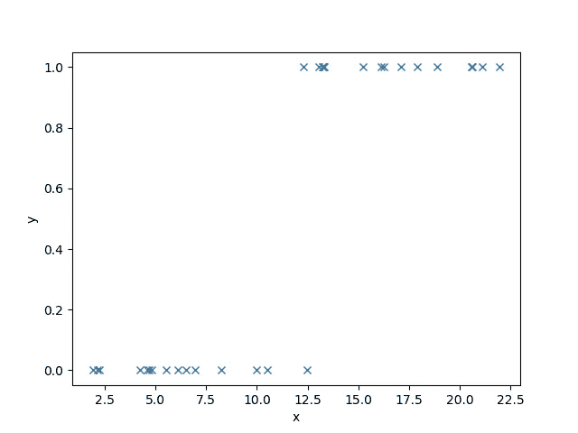

Figure: Sample dataset that the y value either takes 0 or 1.

通过对数据集应用线性回归算法，我们可以得到如下所示的最佳拟合线。

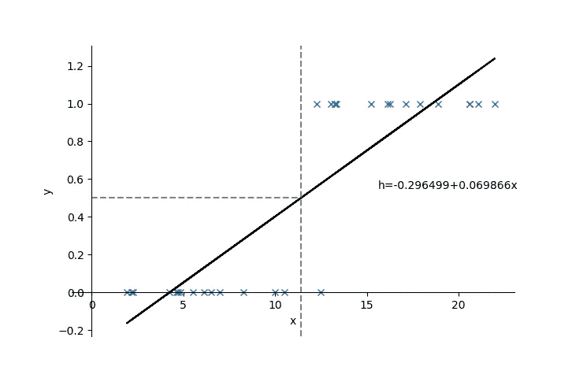

Figure: Best-fit line generated by using linear regression algorithm.

通过将阈值设置为 0.5，任何低于 0.5 的预测 y 值都将被视为 0，否则将被视为 1。我们可以观察到，在这种情况下，线性回归在分类数据方面几乎完美无缺。但是，如果我们的数据如下:

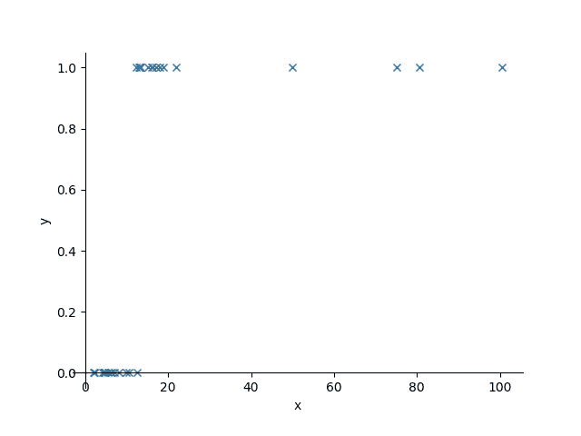

Figure: Another sample dataset.

让我们试着在它上面实现线性回归。

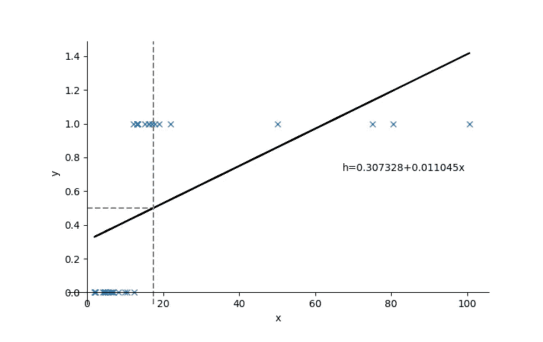

Figure: Best-fit line generated by linear regression.

显然，在这种情况下有大量的错误分类数据，表明线性回归不适合于分类问题。

为了解决这个问题，通过 sigmoid 函数将线性回归模型压缩到[0，1]的范围内。Sigmoid 函数简单地表示范围为 0 到 1 的 S 形函数。这一特性使其适合作为概率的估计，概率也在 0 到 1 之间。因此，我们可以根据估计的概率对数据进行分类。

> 注意，现在我们需要基于**概率(sigmoid 函数)**而不是线性回归模型来优化我们的权重(θ)。

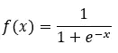

Sigmoid function.

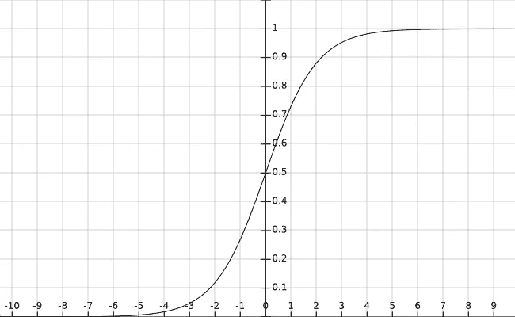

**Graph of sigmoid function y = 1/(1+exp(-x))**

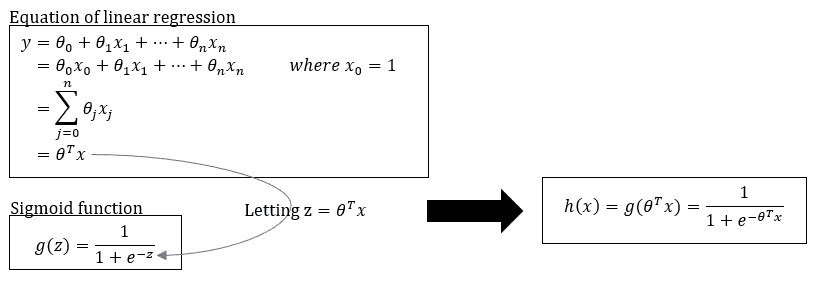

Figure: Illustration of squashing linear equation into sigmoid function.

为了满足对 sigmoid 函数选择的数学好奇，让我们在下一节查看一个更简单的解释。

## 为什么是乙状结肠函数？

> "在统计学中，逻辑(logit)模型用于模拟某一类或某一事件的概率. "

考虑 **m 个数据**有 **n 个特征(x₁，x₂，…，xₙ)** ，**目标变量(y)** 不是 0 就是 1。

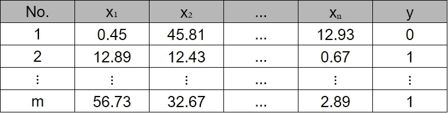

设 **p** 为 **y=1** 的概率，由此**p/(1–p)**将为对应的[奇数](https://www.statisticshowto.com/log-odds/)。

> 假设:**自变量(x)** 与 [**对数奇数**](https://en.wikipedia.org/wiki/Logit) 之间存在**线性关系**。

> "为什么我们不能假设自变量(x)和概率(p)之间的线性关系？"

> 好吧，让我们检查一下。概率 p 的范围是[0，1]，而对数奇数的范围是(-∞，∞)。并且由于自变量(x)可以是任意实数，因此 x 的加权和可以在范围(-∞，∞)内，这与对数奇数的范围相吻合，而不是概率的范围。

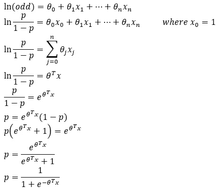

从上面的推导中， **p = 1/(1+exp(-θᵀx))** 也就是 **sigmoid(逻辑)函数**。

如上所述，由于 sigmoid 函数在范围[0，1]内，因此它符合概率的范围。因此，事件 y=1 的概率 p 可通过下式安全估算:

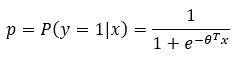

而事件 y=0 的概率是**1–p**。

> 从概率(p)中，我们可以通过应用简单的阈值来确定分类输出 y，其中如果 p<0.5y = 0，如果 p≥0.5y = 1。

> “如何获得权重的最佳值？”

为了回答这个问题，我们需要在下一节引入一个叫做可能性的术语。

## 最大似然估计

设 p = h(x)，那么 **P(y=1|x) = h(x)** 和**P(y = 0 | x)= 1–h(x)**。

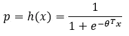

P(y|x)可以更简洁地写成:

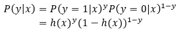

对于上例中的 m 个数据， [**似然函数**](https://en.wikipedia.org/wiki/Likelihood_function) **，L(θ)** 可以写成:

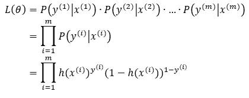

> 似然函数是模型对样本数据的拟合优度相对于模型参数(θ)的度量。

我们现在的目标是获得权重(θ)的最佳值，这将最大化似然函数 L(θ)。由于优化过程(最大化似然性)涉及微分，因此求和比乘法更容易实现。因此，我们取似然函数的自然对数(称为对数似然):

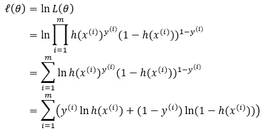

所以现在我们的目标函数是对数似然，ℓ(θ).类似地，与线性回归一样，我们将实施梯度下降算法来搜索使ℓ(θ).最大化的权重

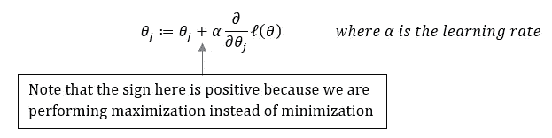

**Parameter θj is updated in every iteration according to this equation.**

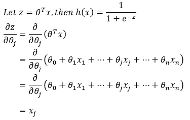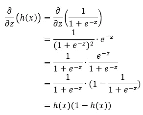

通过使用链式法则，

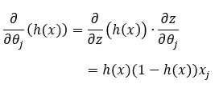

为了计算ℓ(θ的梯度)来更新权重θj，我们对θ **ⱼ** 取偏导数:

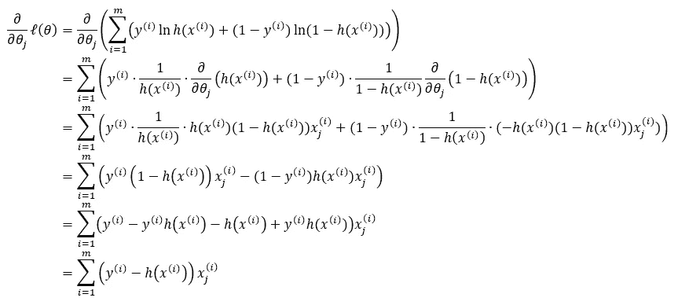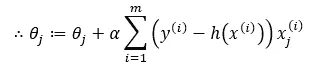

## Python 中从头开始的逻辑回归

这就是所有的数学。现在，让我们用一个用 Python 实现的例子来体验一下。

让我们看看乳腺癌诊断(良性(B)或恶性(M))的数据集:

Source: [https://www.kaggle.com/](https://www.kaggle.com/)

> 在此下载数据集[。](https://www.kaggle.com/shankarat/breast-cancer/download/ZB7v5vIxh1VfTqqnUsqU%2Fversions%2FWXNrAH2EOhtFdfZUTrGE%2Ffiles%2Fbreast%20cancer.csv?datasetVersionNumber=1)

**导入相关库:**

*   **scikit-learn** —导入 train_test_split 方法和 LabelEncoder 类。train_test_split 用于将数据分成训练集和测试集。LabelEncoder 用于将分类数据转换为数字(0 或 1)。
*   **numpy** —用于矩阵和向量计算。
*   **熊猫** —用于从 csv 文件导入数据。
*   **matplotlib** —用于绘制混淆矩阵

> 点击[此处](https://www.dataschool.io/simple-guide-to-confusion-matrix-terminology/)了解混淆矩阵的解释。

**乙状结肠功能:**

**预测概率函数:**

**预测功能:**

**梯度下降:**

**剧情混乱矩阵功能:**

Source: [https://scikit-learn.org/0.21/auto_examples/model_selection/plot_confusion_matrix.html#sphx-glr-auto-examples-model-selection-plot-confusion-matrix-py](https://scikit-learn.org/0.21/auto_examples/model_selection/plot_confusion_matrix.html#sphx-glr-auto-examples-model-selection-plot-confusion-matrix-py)

**准备数据:**

**训练和评估:**

**结果:**

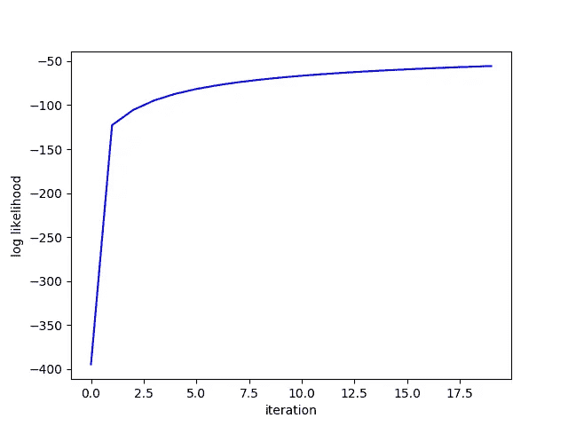

从图中，我们可以观察到对数似然值在梯度下降算法的每次迭代中收敛到最大值。

从上面的混淆矩阵中，我们可以观察到所有 71 个良性病例和 43 个恶性病例中的 42 个被正确分类。

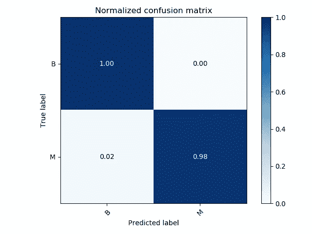

如从标准化混淆矩阵观察到的，预测良性病例的准确度是 100%，而预测恶性病例的准确度是 98%。

## **从 Sklearn 库实现逻辑回归模型:**

**导入相关库:**

**准备数据:**

**培训和评估:**

**结果:**

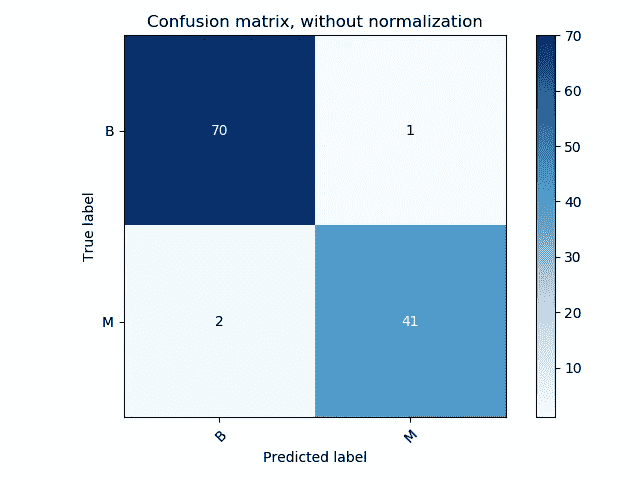

从上面的混淆矩阵中，我们可以观察到 71 个良性病例中的 70 个和 43 个恶性病例中的 41 个被正确分类。

预测良性病例的准确率为 99%，而预测恶性病例的准确率为 95%。

## 结论

在我们刚刚处理的例子中，只有两个类需要分类，这就是所谓的二进制分类。然而，在实际应用中，总会有两个以上的类别需要分类，例如水果分类。涉及到两个以上分类的逻辑回归称为****【soft max 回归】**。我们将在以后的文章中讨论 softmax 回归。**

** [## 将定义 2020 年就业前景的五大数据科学和机器学习趋势|数据驱动…

### 数据科学和 ML 是 2019 年最受关注的趋势之一，毫无疑问，它们将继续发展…

www.datadriveninvestor.com](https://www.datadriveninvestor.com/2020/02/19/five-data-science-and-machine-learning-trends-that-will-define-job-prospects-in-2020/) 

感谢您的阅读。希望你喜欢我的文章，并从中获得有用的信息。

## 参考

[1][https://en.wikipedia.org/wiki/Logistic_regression](https://en.wikipedia.org/wiki/Logistic_regression)

[https://en.wikipedia.org/wiki/Logit](https://en.wikipedia.org/wiki/Logit)

[3][https://en.wikipedia.org/wiki/Likelihood_function](https://en.wikipedia.org/wiki/Likelihood_function)

[4][https://www . data school . io/simple-guide-to-confusion-matrix-terminals/](https://www.dataschool.io/simple-guide-to-confusion-matrix-terminology/)

[http://cs229.stanford.edu/notes/cs229-notes1.pdf](http://cs229.stanford.edu/notes/cs229-notes1.pdf)**