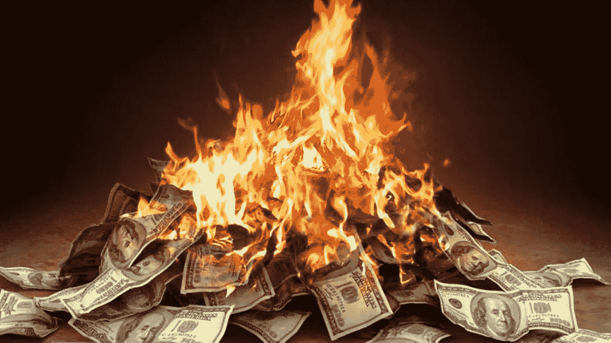

# 燃烧速度——五分钟基础知识

> 原文：<https://medium.datadriveninvestor.com/fundamentals-in-five-minutes-burn-rate-f4d765d5cd39?source=collection_archive---------8----------------------->

## 五分钟内总结的燃烧率，供需要了解的创始人参考！

这是有史以来第一份《五个基本点》,这是一种新的形式，我选择一个与初创企业创始人相关的复杂话题，挑战自己，用一篇不超过五分钟的文章来总结它。

今天的主题是关于燃烧率。它是什么，如何使用，如何工作，为什么它很重要。

我能在五分钟内全部搞定吗？你需要读到最后才能找到答案！让我们用 5 分钟的时间开始吧！

**什么是燃烧率？**

烧钱率是一家公司净损失的表现。当我们谈论烧钱率时，通常是指公司每月“烧钱”的数额。

烧钱率的计算方法是用公司的收入减去支出。净亏损的数字是公司烧了多少钱。

 [## 在科技中心外创业？It 的 3 个论据|数据驱动的投资者

### 所以你不在像旧金山、纽约、伦敦、北京、特拉维夫或班加罗尔这样的顶级创业生态系统中？许多…

www.datadriveninvestor.com](https://www.datadriveninvestor.com/2020/03/15/startup-outside-a-tech-hub-3-arguments-for-it/) 

衡量一家公司的平均燃烧率很重要，因为它可以让我们了解公司的损失。对于管理层和董事会来说，这是一个至关重要的指标，就像燃烧率随时间的变化一样。燃烧速率的变化与平均燃烧速率相结合，比仅仅依靠平均燃烧速率更能洞察实际情况。

**它是如何使用的？**

烧钱率让我们能够洞察支出和现金流，对于随着增长而出现净亏损的公司来说，这是一个有用的指标。

消耗率通常被平均并除以企业的总现金余额，得到所谓的“现金跑道”。这条跑道简单明了地表达了公司在资金耗尽之前还有多长时间，并为需要做出的各种决策提供了信息。

*举个例子:如果一家公司在银行有 300 万美元的存款，他们的平均月消耗率是 30 万美元，那么它的跑道是 10 个月。这意味着，假设消耗率保持不变，他们在用完之前还有十个月的现金。*

董事会可以设定一个燃烧率范围，以便管理层在该范围内运作，从而随着公司的发展，为公司的现金状况提供确定性。例如，通过将烧钱率保持在恒定的 30k 美元，董事会可以计划何时需要确定地提高下一次。

燃耗率还用于对运营费用进行汇总评估，是衡量企业资本效率的一个有用指标。

最后，燃烧速率可用作性能基准。相似的企业应该有相似的燃烧率，比较有助于评估绩效。在这种情况下，燃烧率可以给我们一个粗略的指标，相对于同行，一个企业可能是精简或臃肿。

**燃烧速率如何随时间变化？**

这很简单。燃烧率是一个净损失数字，因此收入或支出的任何变化都会影响燃烧率。

一般来说，假设营业费用保持不变，销售收入的增加将降低燃烧率，并延长公司的跑道。

假设收入保持不变，不断增加的运营支出将增加消耗率，并缩小公司的跑道。

在现实世界中，燃烧速率与这两个因素成比例变化，因此评估燃烧速率随时间的变化至关重要。

**为什么燃烧率很重要？**

现金是任何生意的关键。如果一个企业没有可靠的收入来源，或者它需要花费比它能够带来的更多的钱来满足增长预期，那么烧钱率是一个需要跟踪的必要指标。

通过这种方式，烧钱率对于任何尚未盈利、需要在成长过程中仔细记录现金的企业都是有用的。

然而，与任何其他会计指标一样，燃烧率需要在企业内其他相关指标的背景下进行查看，以真实反映其健康状况和绩效。然而，对于初创企业的健康状况来说，烧钱率可以非常快速、清晰、有用地反映初创企业的现金状况。

*就这样，我们都完成了！燃烧率全部总结在五分钟之内。*

如果你喜欢这种格式，并且觉得这篇文章很有用，那么请点击“鼓掌”按钮，并随时与其他可能会发现这篇文章有用的创始人分享。

下次再见，我的名字是 [*艾丹·肯尼利*](http://www.aidankenealy.com/) ，高成长初创公司的专业创始人教练和顾问，帮助你，初创公司的创始人，每天都比昨天更好。