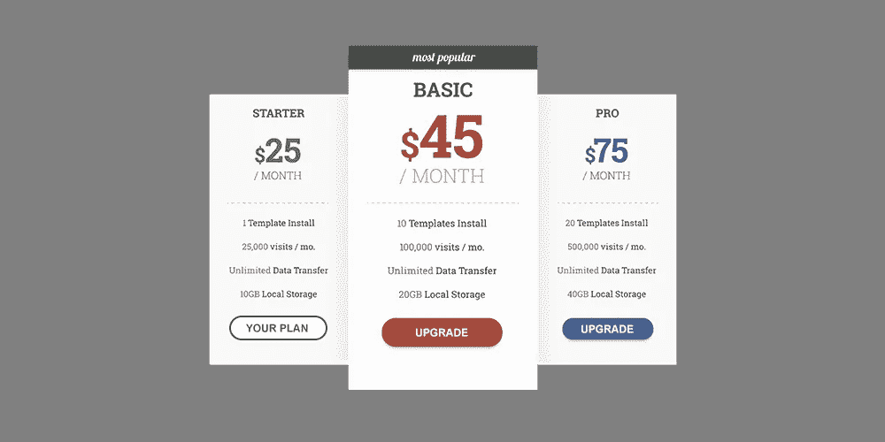

# SaaS 定价模型——五分钟基础知识

> 原文：<https://medium.datadriveninvestor.com/fundamentals-in-five-minutes-saas-pricing-models-3e6aced2aff1?source=collection_archive---------1----------------------->

## SaaS 定价模型在五分钟内为需要了解的创始人总结！

大家好，这是《五分钟基础》,我选择了一个与初创企业创始人相关的话题，挑战自己在五分钟或更短的时间内总结一下。

今天的主题是 SaaS 定价模型。我们将讨论它们是什么，以及它们各自的优缺点。

首先让我们设置场景。

定价模型是我们构建可重复销售流程和创造经常性收入的基础。它们旨在实现您为客户提供的价值与您因提供软件即服务而获得的收入之间的平衡。

 [## 数据驱动始于数据素养|数据驱动的投资者

### 光是听到“数据”这个词就令人生畏。老实说，只有 21%的全球员工对自己的工作充满信心

www.datadriveninvestor.com](https://www.datadriveninvestor.com/2020/03/22/data-driven-starts-with-data-literacy/) 

为太少的报酬提供太多的价值，你将不会为你的业务增长提供足够的资源。为过高的报酬提供过低的价值，会限制你吸引顾客的能力，也会限制你的成长。

*现在场景设置好了。让我们跳进我们的 SaaS 定价模型。有很多内容需要讨论，所以让我们开始吧！*

**免费增值**

免费增值通常是许多人听到 SaaS 这个词时想到的默认定价模式。

这种模式允许用户无限期地使用你的产品或服务的“基本”版本，上面有分层的产品。

免费版本在某种程度上受到限制，以鼓励用户在看到付费版本的价值后升级到付费版本。

使用免费增值模式的主要原因是消除价格障碍，促进消费者接受你的产品。由于没有价格壁垒，免费增值产品可以被设计用于病毒式传播和快速用户采用。

另一方面，免费用户需要一种资源来支持，因此当采用免费增值模式时，公司面临着承担成本而没有收入保证来补偿的风险。

***进一步分考虑:***

由于缺乏价格，免费增值模式可以吸引不太适合公司产品的客户。这意味着他们可以看到高流失率的结果。

此外，如果该公司成功地通过免费服务解决了人们的问题，就很难让客户相信升级的价值。

*好了，免费增值到此结束，现在谈谈固定价格。*

**固定价格**

固定价格模型是最简单的 SaaS 定价模型，其中为产品或服务设定了固定价格。

这种模式通常被拥有单一产品和单一的、定义明确的客户角色的公司所采用。

固定价格模式的主要好处是很容易向消费者清楚地表达报价，从而简化销售和营销流程。

固定价格模式的主要缺点是缺乏灵活性。如果单一优惠对客户不起作用，他们会去别的地方。

***进一步分考虑:***

固定价格模型存在价值泄露的风险，其中定价过高或过低都会对收入和客户接受度产生重大影响。

此外，由于所有用户都被收取相同的价格，无论他们的使用情况如何，统一费率价格无法从离群客户那里收回大量使用的成本。

*对，这就结束了固定价格。接下来，使用定价，也称为随用随付。*

**使用定价**

使用定价模式是指消费者只为他们在给定时间段内使用的东西付费。这种模型允许提供者和消费者改变他们的服务和消费成本。

使用定价模式的主要优势在于，它允许客户管理不稳定的需求。通过随使用而扩展，对服务有不稳定需求的客户可以通过只为他们使用的服务付费来更好地管理他们的开支。

使用定价的主要缺点是，它会使销售者很难预测经常性收入。可变用途等同于可变收入。因此，现收现付模式会导致在某些情况下难以预测可能的收入。

***进一步分考虑:***

现收现付模式为客户提供了较低的入门成本和无限的可扩展性。因此，采用这种模式的公司可以很好地服务于大客户和小客户。

此外，对重度用户收取适当的费用，这意味着公司没有承担离群客户大量使用的成本的风险，就像你在固定价格模式下看到的那样。

*好了，现在使用定价已经结束，让我们继续讨论分层定价。*

**分级定价**

分层定价模式是指公司以递增的价格提供不同层次的服务“包”。

这种模式几乎总是事实上的“saas”模式，其功能仅限于价格匹配的包层。这通常被称为“基本、标准和专业”选项，或者类似的选项。

分层定价模式的主要优势在于，它既提供了一条清晰的追加销售吸引客户的途径，又提供了一种为多个买家角色提供解决方案的简单方法。

这种模式的主要缺点是很难获得正确的层组合。很容易使产品供应过于复杂，并使层级定价与市场需求不一致。这可能需要时间和数据来获得正确的组合，这可能会限制新的较小公司的早期用户增长。

*好了，这就结束了分层定价，现在让我们继续讨论每用户定价。*

**按用户定价**

按用户定价是指公司以固定价格向个人用户出售其产品或服务的使用权。如果购买者需要两个账户，他们支付两个，如果他们需要 100 个，他们支付 100 个。

按用户定价是一种流行的模型，因为它简单且易于管理。它本身也可以以可预测的方式进行扩展。收入与用户采用率成正比。

按用户定价的主要缺点是很难获得真正的价值。每用户模型很容易被“欺骗”,其中一个用户帐户可以在许多客户之间使用。(我们都做过这个！)

*好了，这就结束了按用户定价，现在是时候讨论按功能定价了。*

**按功能定价**

对于每个功能，定价会根据可用功能的列表来划分层级。随着客户在各个定价层中的进展，他们可以获得更多的功能。

按功能定价模式的主要优势是易于追加销售，新功能为升级提供了强大的动力。还可以对功能进行定价，以确保资源密集型或高价值功能的公平成本回收。

这种模式的主要缺点是，很难将这些特性与价格组合相匹配。如果做得不好，客户会很快打消购买你产品的念头。

*随着每项功能定价的完成，我们进入了最后一个定价模型，即上述所有模型的组合！*

**以上皆有。**

将软件交付为服务的美妙之处在于，您可以自由地创建任何您想要的定价模型。一家公司可以混合搭配本视频中讨论的所有定价模式的元素，以创造出符合其需求的产品。

SaaS 定价模型的适应性和无尽的可选性使得软件即服务在我们的软件商业化中变得如此普遍。

交付软件即服务允许快速定价创新和测试，但如果管理不善，也很容易增加复杂性和混乱。

这样看来，Saas 定价对于创始人来说是一把真正的双刃剑。

这就是为什么作为 SaaS 的创始人，花时间不断审查你的定价和你采用的模式是一项非常重要的任务，要嵌入到你正在进行的待办事项列表中。

就这样，我想我们完成了！SaaS 定价模型在五分钟内总结完毕。

如果你喜欢这种格式，并且觉得这篇文章很有用，那么请点击“鼓掌”按钮，并随时与其他可能会发现这篇文章有用的创始人分享。

直到下一次，我的名字是 [*Aidan Kenealy*](http://www.aidankenealy.com/) ，高增长创业公司的专业创始人教练和顾问，帮助你，创业公司的创始人，每天都比昨天更好。