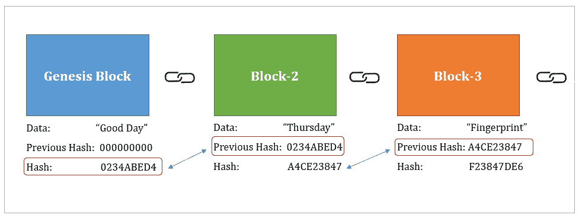

# 区块链基础

> 原文：<https://medium.datadriveninvestor.com/fundamentals-of-blockchain-180de46b472f?source=collection_archive---------4----------------------->

> 你有没有想过，我们是否可以不通过银行这样的中介机构，直接把钱转给别人？你是否曾因订票时产生的在线交易费用而感到沮丧？你认为我们提供给第三方的关于我们的数据安全吗？你有没有想过一个系统，在其中我们可以存储我们的数据与高度隐私和信任？你听说过比特币吗，它是如何实现的？所有上述问题以及更多的问题都将由区块链来回答，这是一项可以改变我们看待一切的方式的技术，一项可以融入任何领域的技术，无论数据出现在哪里。在这个博客中，我将解释区块链的基本原理。

**什么是区块链？**

在高级视图中，我们可以将区块链定义为一系列或一列块，其中每个块都以密码方式相互连接。这些块构成了基于我们使用区块链的上下文的数据。

 [## 区块链降低商品交易的风险和成本|数据驱动的投资者

### 我们将讨论 DLTs 在商品领域的当前实现，包括贸易和供应链管理…

www.datadriveninvestor.com](https://www.datadriveninvestor.com/2020/06/17/blockchain-reduces-risk-and-costs-in-trading-commodities/) 

**区块链的街区是由什么组成的？**

一个块主要由以下部分组成:
1) **块号**
2) **Nonce** :该字段是一个整数，当一个块被接受添加到区块链时，该字段将被设置。关于这一点的更多细节将在挖掘部分解释。
3) **数据**:这是我们需要安全可信地存储的数据。该数据取决于上下文。如果为交易实现了区块链，则该数据表示发生的每笔交易。如果对医疗患者实施区块链，则该数据表示每个患者的医疗数据。
4) **先前块散列**:这是先前块内容的加密散列(例如:SHA-256)。
5) **当前块散列**:这是当前块内容(数据、先前块散列、当前块散列)的加密散列(例如:SHA-256)。

Cryptographic linking in blockchain

上图解释了区块链的各个街区是如何相互连接的。前一个散列分量类似于对链中前一个块的引用，从而能够遍历区块链。

为什么区块链需要哈希法？

区块链中的每个数据块都必须加密，以保证数据的安全。这种需求是在加密散列的帮助下实现的。就像人类的指纹可以唯一地识别他们一样，正是这种加密散列可以唯一地映射到区块链的一个区块。
散列算法的五个要求:
1) **单向**:这表示，使用散列值，我们不应该能够重建块的内容。
2) **确定性**:这意味着，对于特定的数据，哈希值应该一直保持不变。不应该每次都变来变去。
3) **快速计算**:哈希值应该非常快速地计算出来。
4) **雪崩效应**:数据的微小变化应该会产生完全不同的哈希。
5) **必须经得起碰撞**:任何两组数据都不应该有相同的哈希值。在区块链，这是必要的，例如:避免伪造文件，声称拥有一个真正属于另一个人的财产。如果另一个人能够用他的名字在产生与另一个人相同的散列的块中构造一个块，这可能发生。
**区块链最常用的哈希算法之一是** **SHA256** 。
sha 256 的属性是它的哈希值是 256 位(64 个字符)。对于任何数量的数据输入，它只会给出 64 个字符的十六进制值作为输出。

**不可变台账**

区块链的特性之一是它是一本不变的总账。这基本上意味着在区块链已经存在的任何块都不能被第三方篡改或破解。由于块之间的上述密码链接，这是可能的。当任何一个块被篡改时，它的散列将会改变，从而断开与链中其余块的链接。因此，为了让黑客成功做到这一点，后续块中存在的散列数据也应该被更新和插入，这实际上是不可能的。不可能的原因将在以后的主题中讨论。

**分布式 P2P 网络**

区块链的另一个特点是**分权**。区块链实现了一个分布式网络，其中存在大量相互连接的计算机节点。在所有这些节点中，应用程序的区块链保持不变。没有一个节点是头。所有节点在持有该分类帐中具有相同的优先级，从而使其分散。每当一个节点在其区块链副本中添加一个数据块时，该数据块就会在网络中的其余节点中更新。在上一节中，我告诉过黑客攻击区块链几乎是不可能的，因为同样的更改需要在其余的节点上同时更新。否则，更改后的区块链将会识别此更改，因为其余所有节点(> 50%节点)都有不同的分类帐副本。因此，改变后的区块链将被更新为正确的。为了进行黑客攻击，要么超过 50%的节点必须是恶意的，要么黑客需要同时更新超过 50%的节点，这是不可能的，因为我们谈论的网络可能有数百万台计算机。

**挖掘是如何工作的:随机数和密码难题**

*根据什么选择一个节点来添加区块链中的下一个块？*这是通过一种叫做区块链采矿的工艺完成的。在挖掘中，区块链中的所有节点将被赋予一个**密码难题**，该难题应当满足一个**目标**。谁能在更短的时间内解决这个难题，谁就有权在区块链添加积木。因此，也将对该节点给予奖励。这个密码难题和目标是什么？目标基本上是一个以特定数量的零开始的散列。这个具体的数字或目标可以随着不同的区块链而变化。密码难题是找到一个适合其散列将遵守指定目标的块的随机数。因此，所有节点将迭代通过不同的随机数，以便找到合适的随机数。

**共识协议:工作证明**

这是一种协议，用于同意区块链中的节点添加块。当一个节点添加了一个块时，它会传播到网络中的其余节点。这些节点执行验证过程，检查添加该块是否有效。这个验证过程是一个非常仔细和漫长的过程。如果超过 50%的总节点同意添加该块，该块将被添加到分类帐。如果不是，它将被丢弃。在区块链添加一个新区块至少需要 10 分钟。工作证明是比特币中使用的共识协议的一个常见例子。这样做是为了确保挖掘者利用他/她的资源做一些工作来解决密码难题，以找到满足目标的正确散列。
共识协议主要在以下方面有所帮助:
1) **避免黑客攻击**:这在前面的章节中有所解释。
2) **链竞争**:如果两个节点同时解开密码难题，并把方块加到他们的节点上，会发生什么？当这种情况发生时，两个不同的块将被传播到网络，从而在网络中制作区块链的两个不同的拷贝。这个区块链应该是独一无二的。那么这种情况如何解决呢？他们将如何选择哪一个是正确的链？在这种情况下，这种共识协议开始发挥作用。

**访问专家视图—** [**订阅 DDI 英特尔**](https://datadriveninvestor.com/ddi-intel)