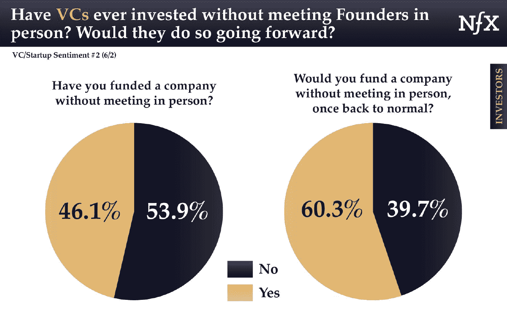

# 在疫情期间筹款？创业最有效的 4 种方法

> 原文：<https://medium.datadriveninvestor.com/fundraising-during-a-pandemic-4-ways-for-startups-to-be-most-effective-261b72ec3be3?source=collection_archive---------16----------------------->

在疫情时期推介一家初创公司的基本原则与在正常时期没有什么不同。事实上，有一个强有力的论据支持将危机视为开始某事的机会。不管怎样，有一些实质和风格的元素会有意义地加强你对投资的呼吁，以下是四个主要的元素。

**1) Runway 又名 Show You Can Go Longer** —在 Tau，我们专注于种子期，尤其是“成熟种子期”，即一家公司距离首轮融资(又名产品-市场契合度)还有 9-18 个月。对于疫情，我们的看法是，许多事情已经拖延，我们不太可能追回失去的时间。事实上，我们相信事情将继续被推迟，直到有疫苗或真正的群体免疫，我们认为这两者至少在一年内不会发生。因此，我们专注于那些有足够现金维持 24 个月的初创公司——这是我们从许多其他基金那里听到的。实用建议——如果今天推介，如果你能展示出比平时更长的跑道，你的地位将会更强，[,无论是通过降低消耗、创造更早的收入，还是简单地筹集更多的资本](https://www.linkedin.com/pulse/crisis-5-principles-startups-still-raise-seed-amit-garg/)。

**2)早期尽职调查也就是更快地产生信任和兴趣**——如果你和投资者已经非常了解对方，那么跳过这一部分。但是如果你不知道，那么为了你的利益，你可以更快地建立信任和兴趣，通常是通过提前分享更多的信息。在 Tau，我们的交易量实际上翻了一倍，因为有这么多初创公司伸出援手。我们不会在深度调查上妥协，但对于早期调查，也就是说，对于筛选初创公司，我们已经做出了设置略高标准的权衡。这是疫情时期风投们的普遍准则。实际建议——在第一次通话中确定双方有足够的共同利益并且没有利益冲突，然后继续分享你的数据室。

深度勤奋，也就是让它变得更强 —这在任何时候都是很好的做法，尤其是现在。投资者对市场规模有疑问？给他们发送一些数据。投资者对合同有疑虑？看看将他们直接与客户联系起来是否有意义。投资者需要团队的保证？至少打一次电话给你的联合创始人或其他关键成员。关于交易的势头，肯定有一些东西要说，这是一条 U 型曲线，太少的话，你的交易不会产生足够的说服力，太多的话，你的投资者可能会屈服于怀疑，而不是可能性。因此，比平时更有力地控制勤奋对你有利。

**4)沟通也就是明智地选择你的媒介**——电子邮件是分享信息的好工具，尤其是复杂的信息。电话非常适合实时辩论，你还可以分析语气。如果你还想考虑肢体语言，尤其是在涉及观点的时候，视频是最好的选择。短信是快速协调或快速提问的理想方式。虽然面对面的会议暂时受到限制，这意味着投资者和企业家更难合作，这意味着有效的沟通更加重要。世界正在适应，例如，正如 2020 年 6 月 2 日发布的一项调查 [NfX](https://www.nfx.com/) 显示的那样，就连风投们普遍认为他们必须亲自会见创业者的信念也发生了动摇:

*原载于* [*数据驱动投资人*](https://www.datadriveninvestor.com/2020/07/05/fundraising-during-a-pandemic-4-ways-for-startups-to-be-most-effective) *，《我很乐意在其他平台上辛迪加。我是*[*Tau Ventures*](https://www.linkedin.com/pulse/announcing-tau-ventures-amit-garg/)*的管理合伙人和联合创始人，在硅谷工作了 20 年，涉足企业、创业公司和风险投资基金。这些都是专注于实践见解的有目的的短文(我称之为 GL；dr —良好的长度；确实读过)。我的许多文章都在*[*https://www . LinkedIn . com/in/am garg/detail/recent-activity/posts*](https://www.linkedin.com/in/amgarg/detail/recent-activity/posts/)*上，如果它们能让人们对某个话题产生足够的兴趣，从而进行更深入的探讨，我会感到非常兴奋。如果这篇文章有对你有用的见解，请评论和/或给文章和* [*Tau Ventures 的 LinkedIn 页面*](https://www.linkedin.com/company/tauventures) *点赞，感谢你对我们工作的支持。这里表达的所有观点都是我自己的。*