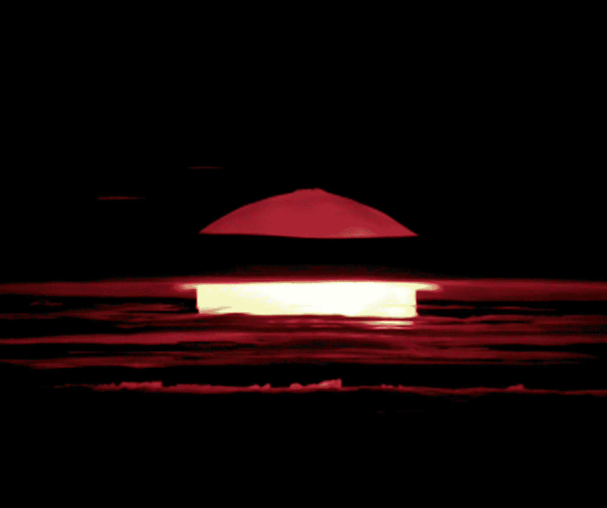

# 最有趣的时代人类几乎面临核毁灭

> 原文：<https://medium.datadriveninvestor.com/funniest-times-humanity-almost-faced-nuclear-annihilation-7f59467ce704?source=collection_archive---------12----------------------->

Photo by [Science in HD](https://unsplash.com/@scienceinhd?utm_source=medium&utm_medium=referral) on [Unsplash](https://unsplash.com?utm_source=medium&utm_medium=referral)

一根简单的炸药棒，曾经被用于采矿和爆破，以及作为 Looney Tunes 卡通中的生日蜡烛，含有浸泡在硝化甘油中的吸收材料。当被点燃时，炸药内部的化学键被分开，释放出大约 1 兆焦耳的爆炸能量。原子弹不是分裂化学键，而是分裂原子键，释放出相当于 80，000，000 兆焦耳的爆炸能量。好多生日蜡烛啊。

一些有史以来最聪明的人参与了曼哈顿计划，设计了世界上第一颗原子弹。每个人对自己的余生都充满了深深的遗憾。在目睹了第一次核试验爆炸后，罗伯特·奥本海默引用了《博伽梵歌》，他说“现在我变成了死亡，世界的毁灭者。”我不确定我是被这句令人难忘的话吓到了，还是仅仅是它的语法吓到了我。

奥本海默看到的未来是人类永远处于彻底灭绝的边缘。结束第二次世界大战的事件揭示了核弹的威力；代号为“小男孩”的核武器被投放到日本广岛，紧接着“胖子”被投放到长崎。这些事件的影响至今仍在极大地影响着我们。白宫里有个胖子，朝鲜有个小男孩。

目前全球核武器库存约为 13，000 枚。近 90%的储备由美国和俄罗斯共同拥有。可以肯定地说，他们每个人都有一个瞄准对方国家每个主要城市的弹头，随时可以引爆。

核战争的关键是不可能有胜利者。只有同归于尽。这就像看一场两队打成平局的足球赛。然后每个人都被点着了。

在卡尔·萨根和他的合作伙伴詹姆斯·b·波洛克撰写的一篇题为*气候和烟雾:核冬天的评估*的论文中，从理论上讲，核战争的后果将影响地球的全球温度，从而创造一个冰河时代。核爆炸产生的风暴将煤烟、气溶胶和火山灰推进空气中，覆盖了地球表面，使其无法接受阳光直射。接下来是作物歉收、饥荒、洋流中断、臭氧层破坏、辐射沉降，以及最糟糕的另一场经济衰退。

面对如此明显的巨大威胁，人类显然必须尽最大努力避免使用目前正在使用的成千上万枚核武器中的任何一枚，否则我们就会面临灭亡。古巴导弹危机是世界历史上的一个转折点，因为它被视为我们几乎决定了人类命运的时刻。一个有趣的想法是，我们有过多次类似的侥幸脱险，令人担忧。有些我觉得很搞笑。

# 1960 年 10 月 5 日

美国指挥中心 NORAD(北美防空司令部)收到了来自位于格陵兰图勒的预警系统雷达的信号。这些信号以 99.9%的把握探测到一个巨大的苏联核威胁正向美国领土逼近。这一防御系统的功能是为美国提供足够的时间以核反应进行报复。有了提供的提前警告，美国有不到半小时的时间来仔细检查数据并假设警告是可信的。这将使总统只有 10 分钟的时间来决定是否有必要进行核反应，杀死无数的苏联公民。好消息是，这一警告被认为不可信，总统也从未得到报复性回应的通知。当时苏联领导人尼基塔·赫鲁晓夫正在美国享用正宗的纽约比萨饼，苏联向美国发射核弹头似乎不太可能。事实上，图勒的雷达确实接收到了从大西洋地平线升起的大型物体反射回来的电波。那是月亮。

# 一九七九年十一月九日

北美防空司令部又回来了。这次他们的电脑检测到了什么？当然是为什么苏联会发动大规模进攻！但这一次不仅仅是月亮。美国高层领导人正在商讨应对这一假想的威胁。操作洲际弹道导弹的机组人员处于高度戒备状态。总统专机起飞了，但是他们忘记了一件事:吉米·卡特总统。我想象着他独自一人呆在白宫里，像麦考利·卡尔金一样双手捂脸大喊大叫。但是洲际弹道导弹机组人员被取消了，总统的飞机降落在地面上，这个威胁被认为是不可信的。北美防空司令部的计算机确实检测到了苏联射向美国的导弹，但那是因为一名技术人员错误地将针对这种情况的训练磁带插入了北美防空司令部的计算机。我想那盘带子叫做“你可以在家里和理查德·西蒙斯一起做的核打击”

# 一九六二年十月二十五日

这张是我个人最喜欢的。位于明尼苏达州德卢斯区指挥中心的一名孤独的保安看到一个模糊的身影试图穿过围墙闯入该设施。他向那个人影开枪，立即触发了入侵者警报，警报在附近的每个空军基地响起，包括沃尔克机场。收到入侵警报后，一名在 Volk Field 工作的人员打开了安全警报系统。但是按错了开关。空军基地的飞行员没有发出安全警告，而是被告知列队站好。每个飞行员醒来时都相信第三次世界大战已经开始，因为他们坐在每一架装备有核导弹的飞机上。发动机都打开了，随时准备起飞，直到有人把一辆卡车开到跑道上，叫飞行员离开。那就是我们在明尼苏达州德卢斯离核毁灭有多近。引擎启动，每个人都准备投入战斗。都是因为有人在收到入侵警报后按错了开关。那天有一个闯入者试图翻越围栏。那是一只熊。第三次世界大战几乎开始，因为瑜伽熊在寻找 pic-a-nic 篮子。

还有很多例子可供选择，正如我所说，这是一个可怕的想法。还有一枚核弹在乔治亚州海岸丢失，另一枚被困在北卡罗莱纳州的一个田地里，但这并不相关。所有这些例子的共同点是，没有多少人对我们是否应该参与核战争有发言权。事实上，只有一个人拥有这种选择的绝对权力:总统。

在水门事件的最后几周，理查德·尼克松被认为患有临床抑郁症，并且酗酒。想象一下，宿醉未醒的理查德·尼克松一大早接到一个紧急电话。他让它响着，以为是闹钟响了，心想“再等五分钟就好了。”后来他接了电话，另一个声音说苏联对美国本土进行了大规模的核攻击。然后，尼克松只有不到 600 秒的时间来决定是否应该让数百万人在他手中蒸发。当时的美国国务卿指示参谋长联席会议在总统收到任何紧急命令之前，先向他传达。

我觉得一个人对发动核打击负有责任是很可怕的。特朗普随时都可能看着核武器说“你被解雇了。”让更多的人了解核打击对人类造成的威胁是很重要的。现在开始对话可以带来更好的外交，减少核储备，拆除我们的核导弹，以及核权力的权力平衡。大部分可能是一厢情愿的想法，但我不禁认为，人类的末日可能仅仅是因为一个错误。当蘑菇云笼罩我们的视线，大风暴让位给下一个冰河时代时，我最不想听到的就是“哎呀”