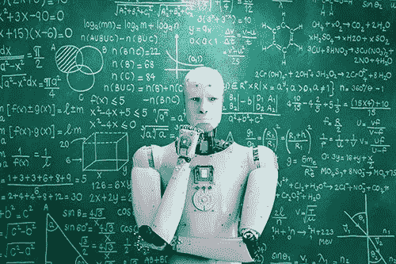

# 人工智能在教育中的未来

> 原文：<https://medium.datadriveninvestor.com/future-of-artificial-intelligence-in-education-d1682bd5409d?source=collection_archive---------13----------------------->

Future of AI in Education Image from Google Images

几十年来，科幻小说的作者、未来主义者和电影制作人一直期待着随着人工智能的广泛应用而出现的巨大进步。到目前为止，人工智能还没有掀起如此疯狂的浪潮，但在一些领域，人工智能表现得如此之好，以至于人类无法击败人工智能。通过帮助我们拍摄完美照片的智能传感器的发展，汽车的自动停车功能，除此之外，人工智能表现非常好。人工智能技术有着广泛的应用，虽然不像机器人那样令人兴奋，但仍然改变着我们的日常生活。AI 能带来重大改变的地方在教育。我们不能说像人形机器人这样的机器人将来会教我们，但是已经部署了许多基于计算机智能的项目，教师和学生都可以从教育体验中获得更多。这些工具及其后续工具将会塑造和定义未来的教育体验，这里只是其中的几种方式。

Future of AI in Education Sector

1.  在教育中使用人工智能来自动化评分任务。

Role of AI in Education

评分工作一直是一项单调乏味的工作。检查学生的每一项作业都需要时间和精力。即使在低年级，教师也经常发现评分会占用大量时间，这些时间可以用来与学生互动，为上课做准备或进行专业发展。另一方面，人工智能不能代替人类的智力来完成评分任务，但是它可以模仿人类来完成这项任务。现在，教师可以对所有类型的问题(如选择题和填空题)进行自动评分，学生写作的自动评分也不远了。现在，这些类型的软件已经投入使用，可以用于这种类型的工作，在短时间内准确地完成任务。

 [## 人工智能帮助你聪明理财|数据驱动的投资者

### 自动化和人工智能为创新平台提供动力，简化双方的财务流程…

www.datadriveninvestor.com](https://www.datadriveninvestor.com/2020/09/02/artificial-intelligence-helps-you-be-smart-with-money/) 

**2。人工智能驱动的个性化**

人工智能系统可以根据定制开发为每个学生的学习档案。定制应该基于每个学生的经验、能力和学习方法。这种类型的定制对每个学生来说都非常重要，所有的学生都没有相同类型的技能和学习头脑，所以通过使用人工智能，我们可以根据定制来帮助每个学生。

**3。将学生与全球课堂联系起来**

科技已经连接了世界。通过使用人工智能，我们可以利用开发工具的支持性技术进步的优势。通过使用这些工具，学生将能够成为全球环境课堂的一部分，并在全球环境课堂中发挥他们的作用。而全球课堂提供的教育将是每个学生都能理解的。

**4。人工智能导师**

人类的智能可以提供更多 AI tutor 无法提供的功能。在这个时代，人工智能导师很难教学生不同的科目。但是人工智能科学家正在对这些导师进行努力，以便这些人工智能导师可以完全取代人类导师。高级辅导系统正在为人工智能科学家准备中，它们将满足现实世界的要求，如创造性思维和逻辑构建。学生甚至可以利用来自课堂外的支持，这是人工智能导师的一部分。

**5。实时反馈来源**

包括个性化的培训材料，人工智能系统能够通过准确评估学生的结果来提供实时信息。结果公布后，学生和教师将收到反馈。在美国，学校已经采用了人工智能解决方案的反馈系统，他们开发了一个仪表板，教师可以在那里监视每个学生。这种方法不仅有助于老师，也有助于学生的仪容仪表。

**人工智能在教育系统中的风险**

每项技术都有其负面影响。人工智能让人们的生活变得更好的同时，也成为了社会的诅咒。大多数人把它用于不良目的。人工智能正在教育系统中引起轰动，我们不能忽视它们在教育系统中的副作用

失业。

向质量妥协。

没有个人参与和互动

让学生对技术上瘾。

扩大贫富差距。

产生高电力成本。

虚拟助手对学生学习能力的影响。

**结论**

由于其利弊，很难判断人工智能服务在教育领域的有效性。人工智能工具和应用消除了学生接受教育的某些限制。人工智能在社会中的影响将很快从低级到高级机构中显现出来。

## 访问专家视图— [订阅 DDI 英特尔](https://datadriveninvestor.com/ddi-intel)