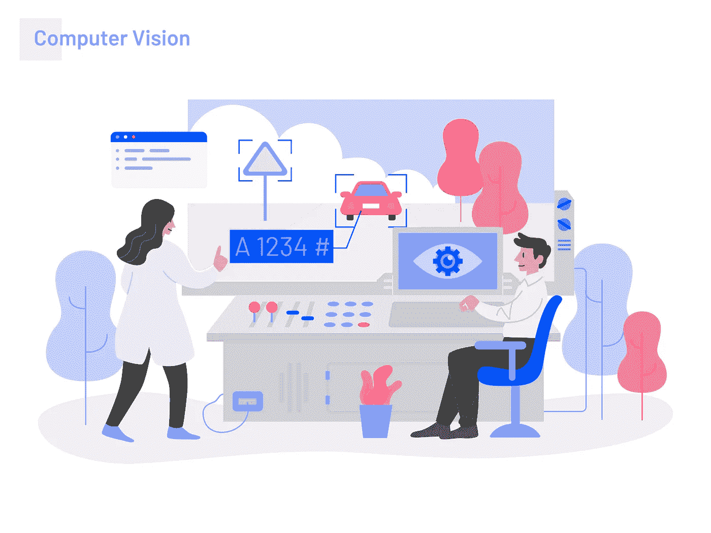
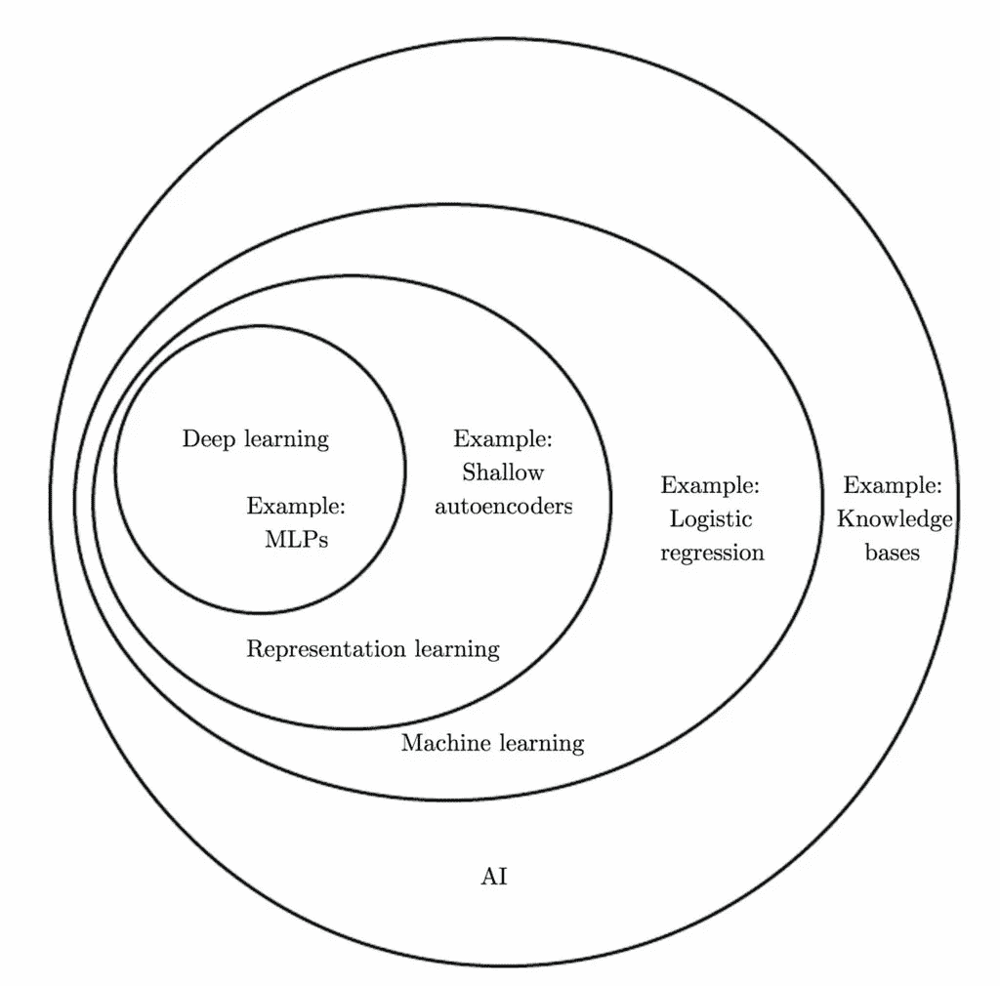

# 看到深度学习的未来

> 原文：<https://medium.datadriveninvestor.com/future-of-deep-learning-aaea73e11512?source=collection_archive---------5----------------------->

## 深度学习

## 给你更美好明天的新兴技术

Inspiration by iconscout

人工智能的革命有其不同的方面，其中之一就是深度学习。深度学习是人工智能的主要根源之一。

人工智能有两个部分，一个是机器学习，另一个是深度学习。今天，我们正在讨论深度学习 AI 及其在人工智能领域的革命，以及深度学习的主要因素未来。

# 什么是深度学习？

深度学习是机器学习方法大家族的一部分，它在人工神经网络上工作以进行表示，并且还包含像监督学习、非监督学习或半监督学习这样的学习类型。

 [## 深度学习用 7 个步骤解释-更新|数据驱动的投资者

### 在深度学习的帮助下，自动驾驶汽车、Alexa、医学成像-小工具正在我们周围变得超级智能…

www.datadriveninvestor.com](https://www.datadriveninvestor.com/2019/01/23/deep-learning-explained-in-7-steps/) 

深度学习有时也被称为深度结构化学习，它为我们提供了各种神经网络，如卷积神经网络(CNN)、递归神经网络、简单神经网络等。这对计算机视觉、生物信息学、自然语言处理(NLP)等领域非常有帮助。

> “深度学习是一种超能力！，你可以用你的新颖艺术改变这个行业，比如使用自然语言处理的语音识别，应用医疗诊断，让你的汽车自动驾驶”
> 
> ——吴恩达(Deeplearning.ai 创始人)

AI Terminology

# 人工神经网络

人工神经网络只不过是在生物系统中激发和处理的信息，可以在分布式环境中使用其节点进行解释，这与我们的生物大脑相比有所不同，因为我们的大脑是一个活的有机体，但 ANN 有时是静态的和象征性的。

大多数现代深度学习模型遵循人工神经网络架构，但一些基于图像处理的模型遵循卷积神经网络(CNN)，因为它基于波尔兹曼机器的原理工作。

有时，图像处理模型提供了生成模型层，然后是像素层，当我们处理它时，会给我们提供稍微不同的信息边缘。

# 解释

当第一次发明 sigmoid 激活函数以应用于每个模型中以使用前馈神经网络检查问题确定性时，深度学习模型的解释就开始了。每次创建神经网络时都会使用 Sigmoid 激活函数。

# 当前情景

目前，深度学习就在我们身边。它用于确定实时广告预测，识别和标记照片、帖子中的人，将你的声音翻译成文本，将文本翻译成网络上的各种语言，以及驾驶自动驾驶汽车。这是一项关键技术，它正在取得前所未有的成果。深度学习的最新进展已经提高到了这样一个程度，即深度学习在一些任务中胜过人类，如确定图像中的对象。

Revolution of Deep Learning

# 实时应用

1.  用于疾病诊断的医疗保健行业
2.  军事应用
3.  自然语言处理
4.  视觉艺术处理
5.  生物信息学
6.  图像识别
7.  欺诈检测
8.  AR/VR 等等很多……

# 超越未来…

我们可以告别神经网络的旧算法模型，这真的很难解码，另一方面，向新的几何智能(深度学习)问好。提供*推理和抽象*能力，以及提供*非正式直觉和模式匹配*能力的几何模块。整个系统将在很少或没有人类参与的情况下被学习。

当我们谈论新兴技术的未来时，传统的计算能力为我们最新的神经网络模型提供了基础属性，遗传算法的更大空间也将是深度学习和每个可能领域的自主事物的未来，如自动驾驶汽车，已经通过算法计算训练的自动化数据等。

此外，自动化机器学习是整个过程的一部分，包含 python 中可用的高级库，为您提供更好的功能，以处理与人工智能相关的每个包。

增强现实和虚拟现实是这个深度学习过程的一部分，因为可靠的算法和图像处理和分割过程只有通过深度学习才能更好地理解。

# 结论

正如我们得出的结论，全球每一项新兴技术都将是人工智能的未来，我们可以轻松地采用这项技术。

> **我的其他故事**

 [## 所有你应该知道的创业知识

### 让自己成为商业巨头

medium.com](https://medium.com/@darshan.chauhan21198/all-about-entrepreneurship-9b329f4632e4)  [## 这项技能必须写在你的简历中

### 自信地走向你的目标

medium.com](https://medium.com/@darshan.chauhan21198/this-skills-must-be-in-your-resume-8f8339c56b92)  [## 看看大头脑遵循的策略

### 制定你自己的成功策略

medium.com](https://medium.com/@darshan.chauhan21198/strategies-of-powerful-minds-56b4bd82eba6) 

> 与我连接***-***[***LinkedIn***](https://www.linkedin.com/in/darshan-chauhan-b29a88111/)***，*** [***脸书***](https://facebook.com/darshan.chauhan.9638) ***，*** [***推特***](https://twitter.com/Darshan0211)