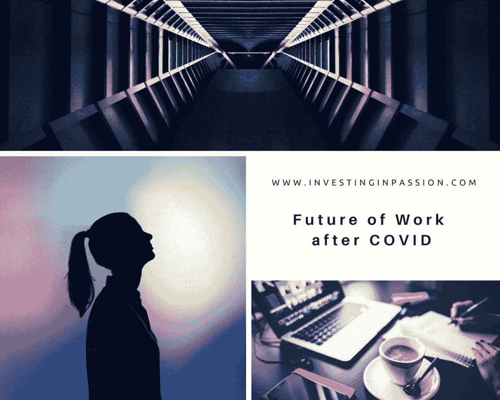
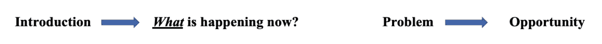
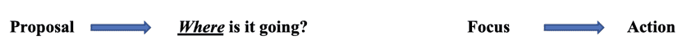
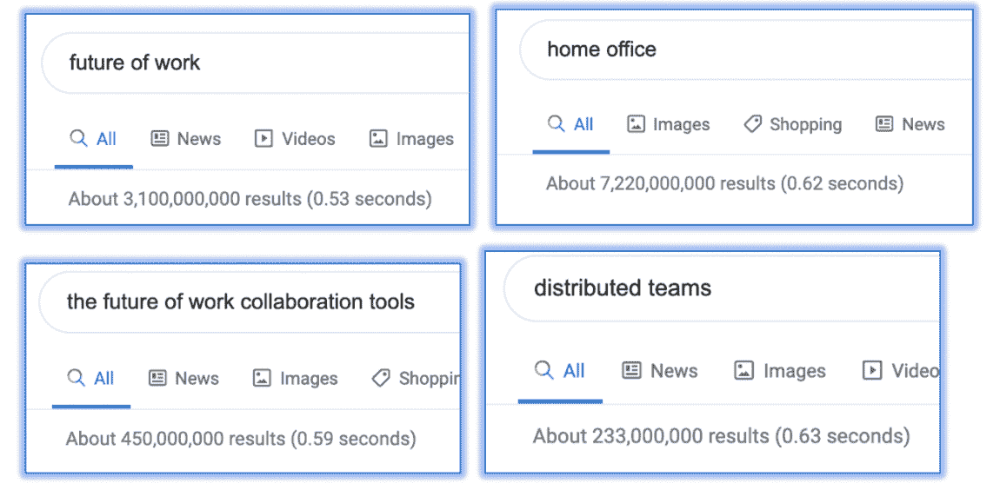
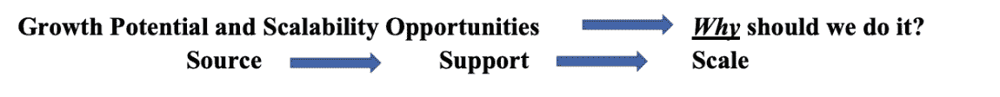
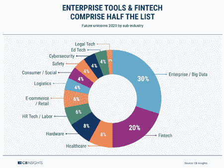

# COVID 之后的工作前景

> 原文：<https://medium.datadriveninvestor.com/future-of-work-after-covid-79c85896267b?source=collection_archive---------15----------------------->

[灵感](https://investinginpassion.com/category/inspirations/)[风险投资](https://investinginpassion.com/category/venture-capital/)

# COVID 之后的工作前景

也许在我们的有生之年，科技进步和人们远离地域的必要性第一次超过了正常的发展速度。旧习惯正在改变，新的工作和生活方式需要探索、重新定义和适应。

***一切都是强行上线***

有些事情行得通，有些则行不通，因为在采用科技来满足人类当前需求方面存在延迟。企业 SaaS/云已经出现了一段时间，但只促进了 20%的大型企业工作流程(*数字化*)。

***消费者希望远程完成所有事情***

即使自 2014 年脸书推出以来，全球计算机用户的数量也翻了两番。硬件变得更加重要，更好的设备需要配备更好的工具、系统和智能(*可访问性+连接性* **)。**

***需要完成的工作***

我们不得不使用新工具，但首先，它们必须高效、易于使用、完美无缺，并且允许远距离完成工作。采用先进的视频通话和深度远程协作成为一种新常态，新习惯也随之形成。在线社交似乎不再怪异。没有花在汽车上的通勤时间，交通给工作(55%的人远程工作的时间比在办公室多)、家庭(53%的人说他们觉得没有必要回到办公室)、当地社区(潜在的爱好回归、与邻居更密切的关系)提供了更多的时间。

***变化正在发生***

工作的未来已经到来，这场运动正在塑造新的工作、生活和学习方式，让所有这些领域相互重叠，并将它们整合到日常日程中。81%的公司将采用更灵活的工作安排，他们最喜欢混合:远程+办公室(偶尔)。美国已经有 37%的工作可以在家完成，而且这个数字还在增长。

 [## 如何真正衡量一个风险投资家的业绩？数据驱动的投资者

### 安德森·霍洛维茨的回报落后于风险投资精英安杰利斯特希望提高风险投资基金的业绩与…

www.datadriveninvestor.com](https://www.datadriveninvestor.com/2020/05/17/how-to-truly-measure-a-venture-capitalists-performance/) 

我们在两个月内经历了长达两年的数字化转型尝试。每个人都尝试一切。这是一个真正的时代，旧的、低效的东西被摧毁，围绕生活创造新的工作，技术需要尽快赶上(*效率+思维转变)。*

我相信**未来的工作**将会发生根本性的转变，需要帮助来为工作、生活和教育带来创新。我将特别关注*新工作环境*子类别，它是关于切换到分布式团队，并最终使远程工作成为全球标准。深入分析该领域，我们可以考虑以下几点:

*   利用能够赋予人类力量的人工智能，为他们配备提高效率的技术(工具、软件、平台)。
*   引入 ***机器人*** 技术，取代标准化、重复性的体力任务，实现流程自动化，释放人的潜能和创造力，实现更具战略性、概念性的工作。随着智能机器成为固定设备(硬件)，几乎每个人的日常工作性质都会发生变化。
*   **终身学习、再培训、自由职业、零工经济需要创新的方式，通过个性化服务(硬件+软件)来满足客户的需求。**
*   *全球人才市场、社会距离、个人福祉、招聘、员工福利、留任、满意度、激励因素将被重新定义、重新聚焦、个性化，并得到关注，无论工作地点和类型如何。*
*   ****多样性与包容性*** 。现在是最多样化和包容性的团队迅速涌现的时候了。那些设法接受它的人将拥有先发优势，能够吸引和留住全球的优秀人才，并提供具有竞争力、现代化、颠覆性但经过测试的灵活条件，以及将促进工作流程的顶级技术。*

**

*在家里工作和花费更多时间的人将需要兼容、足够的手机、更好的屏幕、计算机、可穿戴设备、跟踪和组织设备、VR、AR 设备、家庭工作设备、工作室、相机、照明、电路板、协作功能、强大的连接、网络接入、安全到位。由强大的、创新的、颠覆性的技术/软件驱动的硬件将会很受欢迎。创业公司需要与投资者和商业伙伴携手合作，实现这一转变，这将释放出多种新的商业机会。*

**

*远程工作的自然结果是分散化，人们从工业中心搬到小城市。我们需要致力于基础设施建设，将技术带入这个工作和生活界限越来越模糊的领域。我们生活和感知工作的方式一直在改变，技术也在跟上需求的步伐，这些需求似乎与几年前大不相同。在这个空间中，人工智能、自动化、机器人、虚拟现实/增强现实将蓬勃发展，释放人类潜力，使互动更有意义，随着智能资本在这个空间中的部署，我们可以引领创新快速发展。*

*人们将需要兼容的、足够的手机、更好的屏幕、虚拟现实、增强现实设备、家庭办公设备、无缝软件、强大的连接性和完美的安全性。由强大的、创新的、颠覆性的技术/软件驱动的硬件将不得不携手工作，并促进从过去在办公室长时间工作到不受州或国家边界限制的灵活的全球商业机会的过渡。美国正在推动变革，因此最近的重点将是国家层面的，但趋势是全球性的，因此欧洲(成熟的发达市场，具有成熟和前瞻性的创新方法)、中东、亚洲(特别是作为技术和创新的先驱以及发达的创业生态系统)和非洲(发展中国家的潜力)的办事处将在未来几年逐步跟进。*

*2020 年的 50 只未来独角兽中有 30%属于未来工作类别。特别是，**企业/大数据工具**的子类别明显领先于其他市场**。** DevOps 和开发人员工具几乎占这一类别的一半，公司涵盖企业搜索、分布式数据库、持续交付、聊天功能和客户数据保护。其中 70%已经在美国。*

**

*CBInsight report*

*空间是巨大的(SaaS 本身预计到 2023 年将超过 6000 亿美元)，转型是根本性的(工作+生活+教育+社会生活)，对新解决方案的需求是巨大的。许多公司已经承担了促进人类进步和用新技术装备人们的使命。这是为了使工作更有效率，有在世界各地工作的自由，允许公司从最优秀的人才中受益，无论他们生活在什么时候。感觉应该是无缝连接，虚拟但真实。竞争非常激烈，市场显然很有吸引力，越来越多的 T4 公司已经深入太空。*

*技术需要跟上正在发生的变化，如果我们能够促进提供资源的过程并积极参与该过程，这可能是最令人兴奋的任务，也是所有相关方(初创公司(推动者)、用户(人)、投资者(作为支持者、资本和资源提供者)的有利可图的商业机会。*

**'* ***有几十年什么都没发生，也有几周几十年* *发生'*** *(列宁)*这可能是加入这个空间的最佳时机，并对未来的工作产生影响，将品牌塑造成有远见、无畏和热情的创始人的首选合作伙伴，使转型发生并提升当前的全球生活状态。*

*最初发表在我的网站上[www.InvestingInPassion.com](http://www.InvestingInPassion.com)*

***访问专家视图—** [**订阅 DDI 英特尔**](https://datadriveninvestor.com/ddi-intel)*