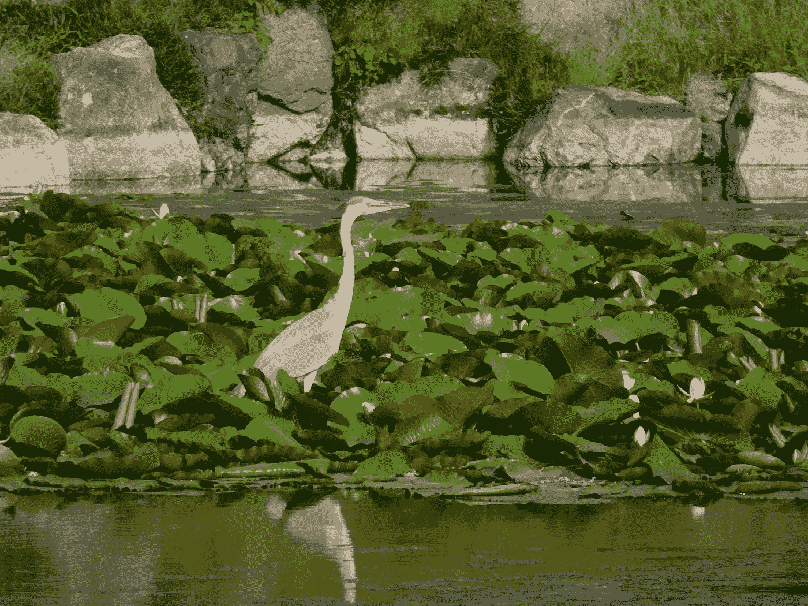

# 生态旅游的未来机遇

> 原文：<https://medium.datadriveninvestor.com/future-opportunities-in-ecotourism-8b13e2bf3ca3?source=collection_archive---------17----------------------->

生态旅游、职业和创造力促进可持续发展世界

Crane photo by Christyl Rivers

## 将人与自然重新联系起来

随着一个全新的世界——谨慎而缓慢地——在后新冠肺炎时代展开，通过远程办公、社交媒体和数据管理可以开辟哪些新的领域？

屏幕之外的机会呢？

一组有前途的职业包括通过可持续职业重建当地社区，包括经济和资源。

生态旅游是这样一种可能性，它为任何地方经济提供了一种将可持续性与繁荣商业联系起来的方式。

这些职位需要大量的创造力和创新。技术部分将需要不断的投入，但大多数也需要掌握在线状态。一些可能性包括创建在线基础设施、通信主管、评估和位置经理、项目和预算主管、平台创建和营销，以及实地参与旅游、历史和可行位置的维护。

 [## 2020 年最佳短期投资选择精选资源|数据驱动型投资者

### 投资是增加你净财富的一个好方法。如果你通过遵循一个严格的…

www.datadriveninvestor.com](https://www.datadriveninvestor.com/2020/03/28/handpicked-resources-for-the-best-short-term-investment-options-of-2020/) 

底线是，如果人们在室内花了太多时间，沉迷于像《虎王》这样的真人秀，或者更好的是 BBC 的连续剧《T2 地球》或《蓝色星球》这样的真人秀，他们就会渴望与自然世界重新连接。

他们知道野生动物和风景的惊人吸引力，以及独一无二的家庭度假机会。但是，沉浸在这些世界中需要全球网络可用性和任何将受益于人类对大自然的渴望的当地经济的支持之间的结合。

这些工作不仅将人类的心灵与自然重新连接起来，还旨在保护和恢复一个濒危的世界。当然，气候危机的现实并没有在全球疫情中消失，我们需要工作来保护人类和栖息地。而且，世界现在知道我们如何对待栖息地——如穿山甲和蝙蝠的栖息地，以及为牲畜砍伐的森林——和世界流行病之间的联系。

经历了如此可怕的交易后，人们希望看到新的希望，谢天谢地，希望正在产生。

机会几乎和我们的想象力和资源一样无穷无尽。以下是一些例子:

基础设施是将人们连接到户外，或者至少连接到他们自己的生意匮乏的社区所必需的。例如，也许在你所在的地区有一个历史公园或博物馆，或者在地球的另一端有一个。

无论是大象保护区，还是刘易斯和克拉克步道上的先锋堡垒，都有需要人类帮助和人类游客的地方。管理存储、服务器、设备和所需的软件不是一件容易的事，需要数百万人的智慧。

需要公关总监来协调营销、广告、活动安排，并保持公众兴趣的活跃和参与。光有可爱的企鹅照片是不够的，它还不足以吸引人们对它的热情，尽管他们可能还不知道自己拥有这种热情。通信人员将找到创造性的方法来激发希望和灵感。例如，邀请人们参与公民科学项目，如在饮水处发现野生动物，是吸引好奇和热情的一种方式。

此类职位与管理职位相关，如社交媒体协调员、网络管理大师和其他相关职位。因为每个点和地点都有不同的需求和评估，所以有许多可以涉足或专攻的领域。

作家总是需要的。当人们需要信息和知识时，清晰、干净的在线散文、小册子、备忘录等等都是永久的工作。如果候选人有写作技能，这里列出的任何机会都会大大增加。提高你的写作技巧是一个持续的、终生的过程。

评估和位置经理将是寻找机会的人。应该考虑偏远和贫困地区，因为正是在那里，当地经济可以雇用当地人，并提供急需的就业机会。

毕竟，生态旅游的基本理念是，人们宁愿用相机拍摄动物，而不是高能步枪。它将吸引许多许多年龄和身份，而不仅仅是精英，或战利品狩猎，老家伙。就像石油和煤炭是过去殖民时代的产物一样，能给当地带来繁荣的新工作是 21 世纪的工作。

需要项目和预算主管来弄清楚所有的资产负债表。对于一些企业来说，良好的投资回报(ROI)可以立即开始，对于其他企业来说，需要更多的时间来提出可持续的资金、参与和兴趣选项。

地面上的登山鞋，或在一些地方，沙滩上的凉鞋，将随着世界的发展而激增，因为我们需要与新的地方建立联系，跨越国界的人类社区，当地社区的复兴，以及我们需要保护和捍卫地点和自然资源。例如，如果你梦想停止偷猎犀牛角，你可以在你的客厅里这样做，也可以在非洲的间隔年这样做。除了当一名游猎向导，还有很多工作可以做，但这份工作也需要人。

如果我们明智地听从大自然的召唤，改善我们与蝙蝠或穿山甲等动物的关系，自然、自然历史、博物馆、国家和私人公园等隐藏的瑰宝将会激增。

但是我们并不局限于保护异国情调的地方和物种。想象一下看到迁徙的蝴蝶，或者保护未来几代人的大片美国草原或森林的回报。

没有强烈的人类意图，这是不会发生的，而没有这种意义、灵感、资源和回报的世界是一个我们不愿想象的贫困世界。