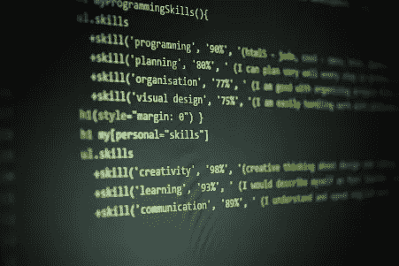
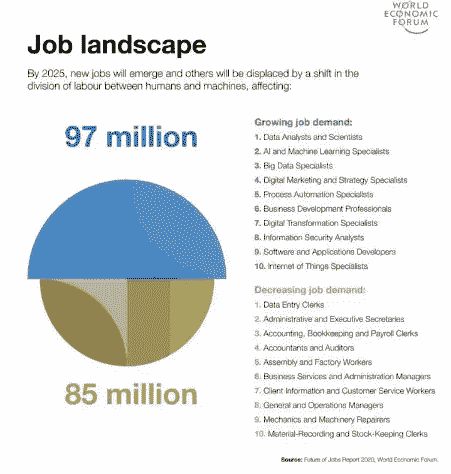
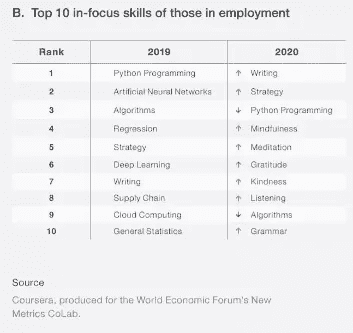

# 未来工作的未来技能

> 原文：<https://medium.datadriveninvestor.com/future-skills-for-future-jobs-c4c2a72bceac?source=collection_archive---------15----------------------->

## 下一步是什么？

Photo Credits: Branko Stancevic on Unsplash

虽然今年是历史教科书的一年，但它也是一个新十年的开始，一个新事物的开始。正如世界经济论坛的专家所说，“第四次工业革命不再等待，它已经到来。”就在我们说话的时候，它正以微小的方式改变着我们的生活。

在整个 21 世纪初，世界见证了数据科学和工程课程的兴起。印度是最大的工程师生产国，提供了世界上最**无与伦比的基于 STEM 的工人。根据一项流行的估计，**今天 65%** 进入小学的儿童最终将从事尚不存在的新的**工作。在这样一个不断增长和发展的就业状态下，预测和准备未来技能要求、工作内容以及对就业的综合影响的能力对企业来说至关重要。我们必须努力抓住这些趋势带来的机遇。****

按行业划分的就业趋势是什么？

从一个**行业**的角度，将技能按家庭分组，我们可以看到未来五年的波动。预计**计算机**和**数学**职业种类将会增加。随着全球疫情的到来，新冠肺炎见证了医学科学的崛起，学习病毒学并成为医生的渴望在全世界无数学生中点燃。甚至软件应用程序也有望增长。不仅通信技术行业和健康行业将会增长，其他几个行业如金融服务和投资者、媒体和娱乐业也会增长。

每一个就业前景黯淡的行业，比如艺术、设计和体育，都将随着进一步的数字化而增长。具体来说，在**计算机**和**数学**字段**中。**

十年后，也就是 2030 年，很有可能我们将**做不存在的工作，**不驾驶飞行汽车或制作时光倒流的传送门，而是做一些现实而**未知的事情**。各种职业和就业的世界是一个快节奏的世界，所以技能也在不断发展。让我们看看其中的一些，并试着做好准备。

看看 WEF 关于工作观点的表格就知道了。

## **未来需要的各种技能有:**

1.  ***技术柔性:***

记得以前我们常说我们擅长多任务处理，然而第二代多任务处理稍微复杂一些。我们必须能够处理**多项技术任务**，并且有能力适应**变化**和**概念化**和**错综复杂**众多**想法**。我累了，只是打字，我现在只做一件事！

**职业机会:**

*   这将是所有员工都需要的一项基本技能。有了这项技能，你就可以从事任何职业，并为成功做好准备！

**②*。数字素养或数据技能。***

WEF 预测，**数据**和**人工智能**将成为未来增长的关键驱动力之一。
数据正以前所未有的指数速度被收集和发展。在新冠肺炎，随着数字广告变得更加流行，工业流程得到了改善。

问题是，根据埃森哲和 Qlik 的调查，74%的员工对处理数据感到不舒服。
另一个事实是，到明年，2021 **69%** 的雇主将**要求**员工具备数据技能。

**职业机会:**

*   数据分析师
*   商业分析员
*   数据科学家
*   市场营销人员

***3。人工智能***

人工智能和机器学习在改善家庭助理方面取得了快速进步，甚至谷歌的人工智能预测我们的搜索。
因此，随着病毒的出现，该领域的新就业机会需要**重新评估**。尽管如此，它仍在不断增长，并被证明是一个经济助推器。

**职业机会**

*   人工智能与设计->平面设计师，
*   插图画家
*   机器学习工程师
*   用户界面设计器
*   数据科学家
*   商业智能开发人员

Photo Credits: Alexander Sinn on Unsplash

**4*。区块链***

截至 2020 年，是最抢手的**硬技能**。然而，区块链通常被称为**比特币和加密货币**。这项技术的潜力已经变得**更加广泛，重要性也与日俱增。WEF 估计，到 2027 年，全球 GDP 的 10%将储存在区块链。
区块链不仅与商业和金融相关，而且**还帮助**进行招聘、物流和供应链管理，甚至在麻省理工学院的版权管理领域。这些只是几个例子。想象一下还会有成千上万的人出现。**

 [## 人工智能如何在全球创造数百万个远程工作岗位|数据驱动的投资者

### 当人们谈论人工智能和就业市场时，他们经常谈论人工智能将如何从…

www.datadriveninvestor.com](https://www.datadriveninvestor.com/2020/02/26/how-ai-is-creating-millions-of-remote-jobs-around-the-world/) 

**职业机会:**

*   区块链工程师
*   企业家
*   合法的
*   UX 设计师
*   区块链管理

***5。*销售与营销**

销售和市场营销听起来可能不像是未来的工作。但是，哦，是的，这可能是唯一一点仍然需要**人情味**甚至在未来。Linkedin 将销售列为 2020 年十大工作技能之一。至少在接下来的两年里，情况将会如此。几年前，**彻底改变了**，**将**自身映射到众多营销分支，如社交媒体或数字。

**职业机会:**

*   营销分析师
*   售货员
*   营销经理

***6。*情商**

情商是一种技能，不仅对工作生活有帮助，对个人生活也有帮助。移情是情商的核心。
这项技能**影响**决策，并在给予和接受反馈时表现出谦逊。在每个人都属于不同文化的办公室里，这是一项至关重要的技能。

**职业机会:**

*   它帮助所有人，无论是编码或数据分析方面的医生，还是营销人员。

**7*。创意***

埃森哲表示，近年来，创造力的质量在所有类型的职业中都变得越来越重要。事实上，对于更多的职业来说，创造力比通常关注的 STEM 技能更重要，这是有争议的。
是领导、管理，乃至理工科的一项**必备技能**。

**职业机会:**

*   适用于所有工作领域

***8。*医药保健**

Photo Credits: [freestocks](https://unsplash.com/@freestocks?utm_source=unsplash&utm_medium=referral&utm_content=creditCopyText) on [Unsplash](https://unsplash.com/s/photos/medicine?utm_source=unsplash&utm_medium=referral&utm_content=creditCopyText)

医药和保健是一个非常相关的领域，而且只会越来越多。**由于 COIVD-19，价值数百万美元的投资进入了医疗和保健机构的各个分支。制药行业也在扩张。**

**职业机会:**

*   从医生到研究员甚至分析师。机会和选择是无穷无尽的。

下面是 2019 年和 2020 年的十大技能。

我们可以有把握地说，随着如此多的新事物的出现，不仅在工作、技能和创新方面，而且在更新、更年轻和更渴望变革的先驱方面。有一点是肯定的，到 2025-2030 年，我们的职业生涯将会融合终生学习。作为员工，我们不仅需要创造一种“渴望”来学习更多知识。我们还必须**使**适应数据和技术，并且**不断发展**我们的知识。技术将继续发展，并扩大对它的理解。

然而，这些技能只是来自世界各地的分析家和经济学家们的预期。必须认真对待，进一步**抢占**。从长远来看，大多数工作和技能将会数字化。所以，未来未知。没有什么是确定的。因此，我们现在必须适应变化，而不是在以后追赶。

## 获得专家观点— [订阅 DDI 英特尔](https://datadriveninvestor.com/ddi-intel)