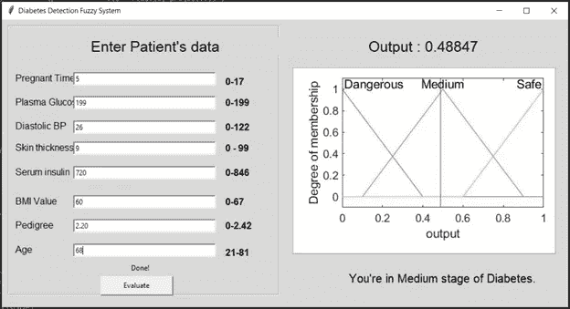

# 糖尿病诊断的模糊专家系统

> 原文：<https://medium.datadriveninvestor.com/fuzzy-expert-system-for-the-diagnosis-of-diabetes-mellitus-f1eeede27b0b?source=collection_archive---------1----------------------->

**模糊逻辑在现实世界中的应用**

T2 糖尿病是一个世界性的问题。它是世界上增长迅速的疾病之一。糖尿病是指糖尿病，它是一种器质性过程，其中人的血糖升高，或者是因为胰岛素来源不足，我们身体的细胞对产生的胰岛素表现不正常。糖尿病的早期调查是一个重要的目标。近年来，糖尿病患者的数量有所增加，主要是因为人口增多、不经常吃西餐或缺乏锻炼。主要有两种类型的糖尿病，其中被称为 1 型糖尿病和二型糖尿病。1 型糖尿病的发生是由于历史遗传。

**1 型糖尿病**:胰岛素依赖型，人体不产生胰岛素。

**二型糖尿病**:非胰岛素依赖型，人体不能产生足够的胰岛素来维持体内的正常活动

研究人员已经采取了几个步骤，应用神经网络、朴素贝叶斯和支持向量机来检测糖尿病。但是现有系统的性能是闲置的。在这里，我提出了一个更快和更有价值的技术来诊断糖尿病使用模糊推理系统。用户(可能是医生或护士)只需要给出一些物理参数。在提供信息的基础上，在早期模糊推理系统中诊断该人是否患有糖尿病。该系统给出与该人患有糖尿病的百分比相关的成员资格值，并说明他是否处于糖尿病的高风险、中等风险或低阶段。

 [## DDI 编辑推荐:5 本让你从新手变成专家的机器学习书籍|数据驱动…

### 机器学习行业的蓬勃发展重新引起了人们对人工智能的兴趣

www.datadriveninvestor.com](https://www.datadriveninvestor.com/2019/03/03/editors-pick-5-machine-learning-books/) 

看我在这块地里找到了什么。！！！

**模糊逻辑求解方法**

模糊逻辑是一种精确的问题解决方法。它是一种在不知道复杂系统的数学描述的情况下，使复杂系统的控制变得容易的技术。在模糊逻辑中，一个语句可以假定 0 到 1 之间的任何实数值，代表一个元素属于给定集合的程度。

Figure 1: Fuzzy Logic Controller System

模糊逻辑是一种计算范式，它提供了一种数学工具来处理人类推理中典型的不确定性和不精确性。模糊逻辑的一个主要特征是它能够以语言的方式表达知识，允许用简单的、人类友好的规则来描述系统。模糊集框架已被用于几种不同的方法来模拟诊断过程。

**1。初始化**

*   定义了语言变量和术语。
*   隶属函数的构造。
*   模糊决策树的构造和模糊规则库的提取。

**2。模糊化**

该步骤使用隶属函数将清晰的输入数据转换为模糊值。

**3。模糊推理**

*   评估模糊规则库中的规则。
*   组合每个规则的结果。

重要的推理系统有 Mamdani、Sugeno 等。

**4。去模糊化**

该步骤将输出数据转换为非模糊值或真实值。

流行的反模糊化方法有 COA(区域中心)、COG(重心)、AI(自适应积分)、BOA(区域平分线)、CDD(约束决策反模糊化)等。

**提议的方法**

**输入和输出参数**

***输入参数:***

怀孕次数

葡萄糖水平

舒张压

表皮厚度(Tric)

血清胰岛素

身体质量指数(马萨诸塞州)

谱系(Pedi)

年龄(年龄)

***输出参数:***

糖尿病

**提出的算法**

***输入:***

输入 A1、A2、A3、A4、A5、A6、A7 和 A8 的模糊集

***输出:***

为数据挖掘输出模糊集

***方法:***

**开始**
*第一步*:输入 A1、A2、A3、A4、A5、A6、A7、A8 的清晰值。
*第二步*:用等式为模糊数设置三角隶属函数。
*步骤 3* :为输入集合建立 A1、A2、A3、A4、A5、A6、A7、A8 的模糊数
*步骤 3.1* :为输出集合建立 DM 的模糊数。
*第四步*:模糊推理是通过 Mamdani 的方法执行的。
*步骤 4.1* :输入规则为{Rule 1，2…k}
*步骤 4.2* :对模糊输入集合(A11、A12、A13、A21、A22、A23、A31、A32、A33、A41、A42、A43、A51、A52、A53、A61、A62、A63、A71、A72、A73、A81、A81)计算与或模糊析取规则的匹配度
*第五步*:用质心法去模糊化成清晰的数值
*第六步*:以人类自然语言的形式呈现知识。
**结束。**

Figure 2: Parameters of Triangular membership functions

**提出模糊规则**

1.如果(A1 低)或(A2 低)或(A3 低)或(A4 好)或(A5 低)或(A6 低)或(A7 低)或(A8 低)，则(DM 低)(1)

2.如果(A1 是中等)或(A2 是中等)或(A3 是中等)或(A4 是平均)或(A5 是中等)或(A6 是中等)或(A7 是中等)或(A8 是中等)那么(DM 是中等)(1)

3.如果(A1 高)或(A2 高)或(A3 高)或(A4 低于平均值)或(A5 高)或(A6 高)或(A7 高)或(A8 高)，则(DM 高)(1)

4.如果(A1 高)或(A2 高)或(A3 中)或(A4 低于平均值)或(A5 高)或(A6 高)或(A7 高)或(A8 高)，则(DM 中)(1)

5.如果(A1 为高)或(A2 为中)或(A3 为高)或(A4 低于平均值)或(A5 为高)或(A6 为高)或(A7 为高)或(A8 为高)，则(DM 为中)(1)

6.如果(A1 低)或(A2 高)或(A3 高)或(A4 好)或(A5 低)或(A6 低)或(A7 低)或(A8 低)，则(DM 低)(1)

7.如果(A1 低)或(A2 高)或(A3 中)或(A4 好)或(A5 低)或(A6 低)或(A7 低)或(A8 低)，则(DM 低)(1)

8.如果(A1 低)或(A2 中)或(A3 高)或(A4 好)或(A5 低)或(A6 低)或(A7 低)或(A8 低)，则(DM 低)(1)

9.如果(A1 是中等)或(A2 是高)或(A3 是中等)或(A4 是平均)或(A5 是中等)或(A6 是中等)或(A7 是中等)或(A8 是中等)那么(DM 是中等)(1)

10.如果(A1 是中等)或(A2 是中等)或(A3 是高)或(A4 是平均)或(A5 是中等)或(A6 是中等)或(A7 是中等)或(A8 是中等)那么(DM 是中等)(1)

11.如果(A1 是高的)或(A2 是中等的)或(A3 是中等的)或(A4 是平均的)或(A5 是中等的)或(A6 是中等的)或(A7 是中等的)或(A8 是中等的)那么(DM 是中等的)(1)

12.如果(A1 是中等)或(A2 是高)或(A3 是中等)或(A4 是平均)或(A5 是中等)或(A6 是中等)或(A7 是中等)或(A8 是中等)那么(DM 是中等)(1)

13.如果(A1 是中等)或(A2 是中等)或(A3 是高)或(A4 是平均)或(A5 是中等)或(A6 是中等)或(A7 是中等)或(A8 是中等)那么(DM 是中等)(1)

14.如果(A1 是中等)或(A2 是中等)或(A3 是中等)或(A4 是中等以下)或(A5 是中等)或(A6 是中等)或(A7 是中等)或(A8 是中等)那么(DM 是中等)(1)

15.如果(A1 是中等)或(A2 是中等)或(A3 是中等)或(A4 是平均)或(A5 是高)或(A6 是中等)或(A7 是中等)或(A8 是中等)那么(DM 是中等)(1)

16.如果(A1 是中等)或(A2 是中等)或(A3 是中等)或(A4 是平均)或(A5 是中等)或(A6 是高)或(A7 是中等)或(A8 是中等)那么(DM 是中等)(1)

17.如果(A1 是中等)或(A2 是中等)或(A3 是中等)或(A4 是平均)或(A5 是中等)或(A6 是中等)或(A7 是高)或(A8 是中等)那么(DM 是中等)(1)

18.如果(A1 是中等)或(A2 是中等)或(A3 是中等)或(A4 是平均)或(A5 是中等)或(A6 是中等)或(A7 是中等)或(A8 是旧的)那么(DM 是中等)(1)

**实施**

**使用的技术:-**

1.  矩阵实验室
2.  带有 TKinter 接口的 Python 3
3.  蟒蛇 PIL (pip 安装枕头)

**系统设计:-**

主程序是用 python 编写的。用 python 实现了基本的 UI 和代码结构。利用 Matlab 中的模糊规则对象建立模糊 if-then 规则，将输入隶属函数条件与相应的输出隶属函数联系起来。因此，使用 Matlab 编写了与模糊推理机相关的逻辑。还使用 Matlab 创建了输出隶属函数的图形。我使用模糊逻辑工具箱功能。

Figure 3: Basic System Design

**UI 设计**

Figure 4: UI to enter the patient’s data

Figure 5: UI giving the results

**精度检查**

检测的准确性是其正确区分患者和健康病例的能力。我使用混淆矩阵来推导模糊预测系统的精确度。

因此，精确度可以表述为:

Figure 6: Accuracy checking

我把这些术语表述如下。

*   真阳性(TP):患者被正确识别为患病
*   假阳性(FP):健康人被错误地识别为病人
*   真阴性(TN):健康人被正确识别为健康
*   假阴性:病人被错误地认为是健康的

取得的成果如下。

Figure 7: Results of accuracy checking

在这里，我使用皮马印第安人糖尿病数据库来评估模糊预测系统的结果。

这就是使用 Pima 印度数据库进行结果评估的方式。

Figure 8: Evaluation of the results

关于源代码和实现细节，请访问我的 Github 频道。【https://github.com/ChamaniS/Fuzzy_Diabetes_Detection】T4。

让我们更深入地挖掘这个神奇的模糊逻辑领域。！！！

**参考文献:**

[1] H. Prajapati，A. Jain 和 S. K. Pal，“使用 PIMA 数据集上模糊规则诊断糖尿病的增强专家系统”，*《国际高级工程和研究发展杂志*，第 4 卷，第 9 号，第 6 页。

[2] A. A. Abdullah，N. S. Fadil，W. Khairunizam，“用于糖尿病诊断的模糊专家系统的开发”，载于 *2018 智能系统设计与应用计算方法国际会议(ICASSDA)* ，古晋，2018，第 1–8 页，doi:10.1109/icass da . 2018 . 20203105

[3] M. Benamina，B. Atmani，S. Benbelkacem，“通过基于案例的推理和模糊逻辑进行糖尿病诊断”， *IJIMAI* ，第 5 卷，第 3 期，第 72 页，2018 年，doi: 10.9781/ijimai.2018.02.001。

[4] N. Chandgude 和 S. Pawar，“使用模糊推理系统诊断糖尿病”，载于 *2016 年计算通信控制与自动化国际会议(ICCUBEA)* ，印度浦那，2016 年，第 1–6 页，doi:10.1109/ICC ubea . 2016 . 5786086006

[5] Z. Niswati、F. A. Mustika 和 A. Paramita，“在东雅加达 Puskesmas 对*糖尿病*疾病进行诊断的模糊逻辑实现”， *J. Phys.: Conf .爵士。*，第 1114 卷，第 012107 页，2018 年 11 月，doi:10.1088/1742–6596/1114/1/012107。

[6]ITM 大学 CSE & IT 系，Gurgaon-122017，India，V. Jain 和 S. Raheja，“使用模糊专家系统提高糖尿病的预测率”， *IJITCS* ，第 7 卷，第 10 期，第 84–91 页，2015 年 9 月，doi: 10.5815/ijitcs.2015.10.10