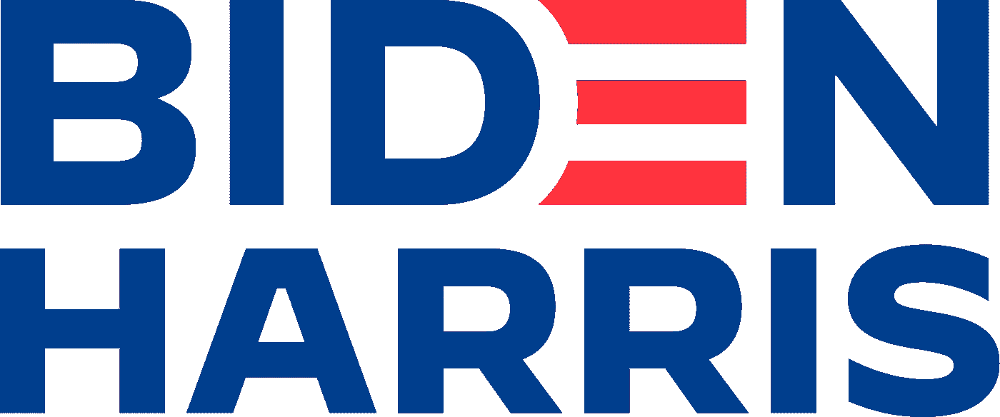
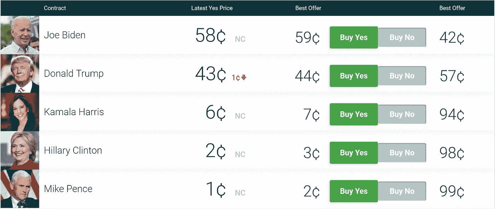
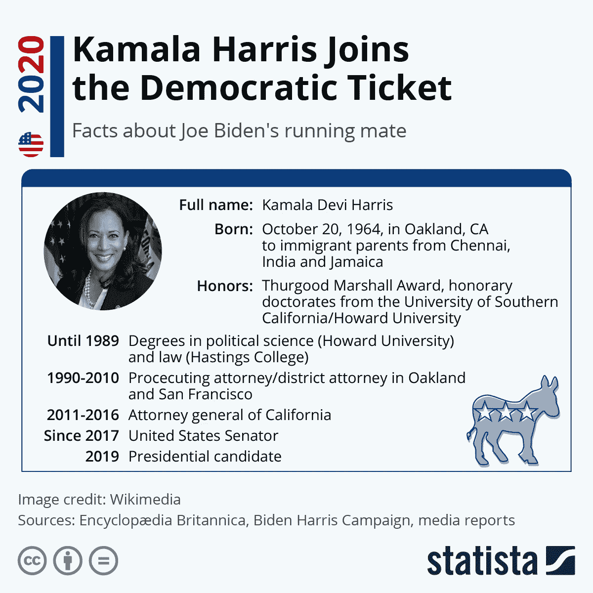
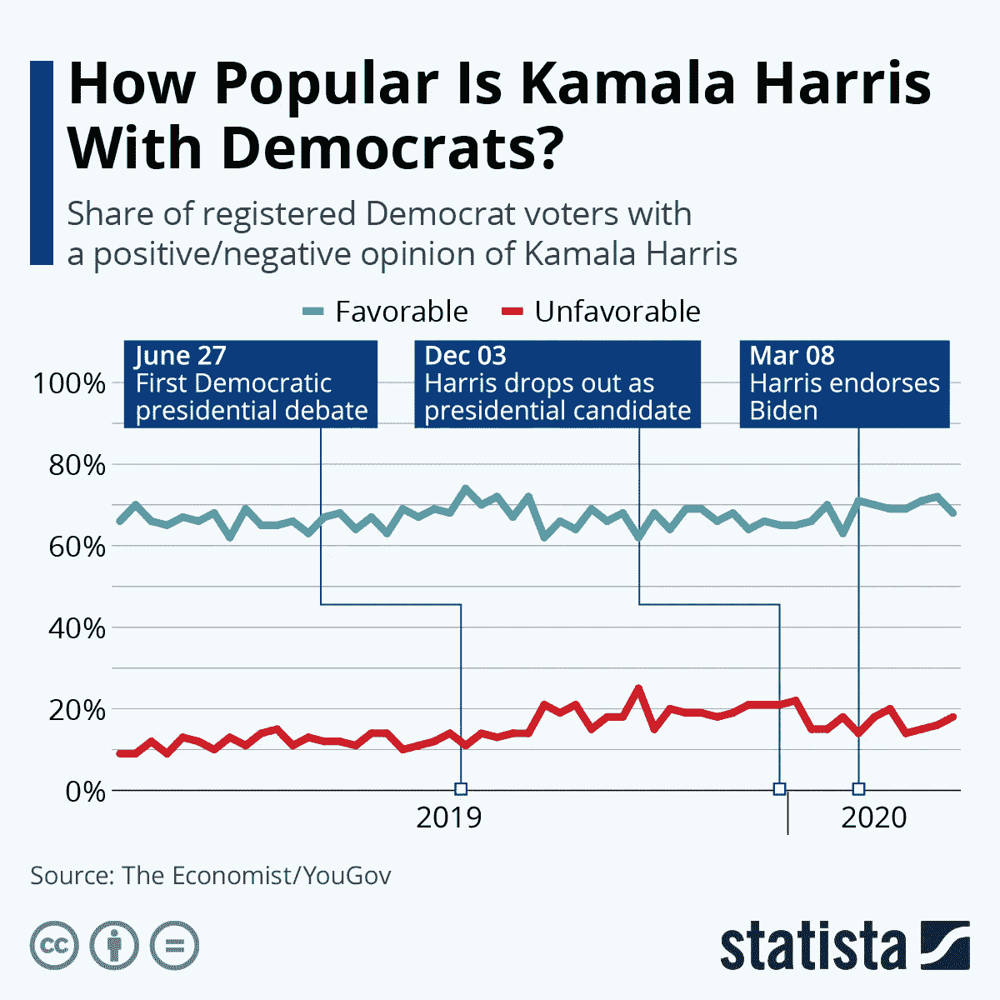
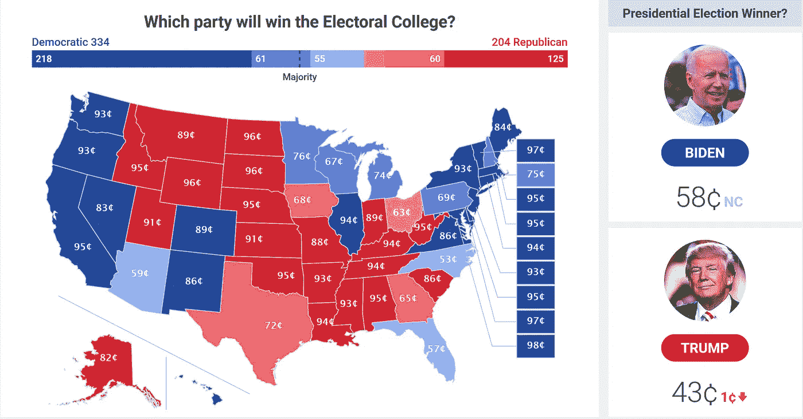

# 赌徒们正在下大赌注:唐纳德·特朗普对乔·拜登

> 原文：<https://medium.datadriveninvestor.com/gamblers-are-betting-on-biden-91b859d77212?source=collection_archive---------1----------------------->

## 期待赌博网站对唐纳德·特朗普和乔·拜登的投票。

Source: JoeBiden.com | Donald Trump vs. Joe Biden | Gamblers are Betting Big

现在你可以在任何事情上打赌。可以赌体育。可以赌优先股。见鬼，你甚至可以打赌金正恩会在一场高尔夫球赛中击败唐纳德·川普。！

这个概念并不新鲜。对政治事件的赌博已经存在多年了。多个网站正在接受政治赌注:法案、选举、唐纳德·特朗普对乔·拜登，等等。

*参加美国总统选举。*

对于选民来说，2020 年的选举越来越令人担忧。“不投票，就去死”这句话从来没有比现在更有意义了。

在过去，当风险很高时，选民会转向民意调查寻求方向。投票的一致意见被认为是了解选民想法的可靠信息来源。

*不幸的是，民意调查越来越不被信任。*

从 2016 年开始，老练的选民开始认为他们偏好的新闻渠道和民调来源有偏见。相反，他们转向非传统的投票来源，如 PredictIt.org。

PredictIt.org 是一个赌博网站。它允许游客在政治问题上下注(最高 850 美元)。它也是一个非传统的投票来源。选民可以发现:

*   哪位候选人领先？
*   他们的领先优势有多大？
*   哪个政党更有希望赢得参议院、众议院和总统职位？
*   赌注的赔率是多少？

*免责声明:我没有购买 PredictIt.org 的任何股份。不鼓励也不推荐赌博。*

# 口袋里的零钱:唐纳德·特朗普对乔·拜登

Who will win the 2020 U.S. presidential election? | PredictIt.org | Gamblers are Betting Big

以总统选举为例:

为了赢得一美元，你必须在乔·拜登身上赌 58 美分，或者在唐纳德·特朗普身上赌 43 美分。换句话说，特朗普是风险更大的赌注。**世纪轻描淡写。*

除了美元和美分之外，这张图表还是一项民意测验。乔·拜登领先唐纳德·特朗普 15 个百分点，并且他的领先优势正在扩大。

就在今天上午，唐纳德·特朗普(Donald Trump)还失去了一个百分点。这一下降可能与拜登副总统人选的残余影响相吻合。

据《PredictIt.org》报道，现在乔·拜登的竞选搭档卡玛拉·哈里斯赢得总统选举的可能性已经是现任副总统迈克·彭斯的 6 倍。

*哇！只是哇。*

# 多棒的选择

Image: Wikimedia | Data Source: Encyclopaedia Britannica, Biden Harris Campaign, Media Reports | Chart: Statista | Gamblers are Betting Big

还记得大多数政客都是律师的日子吗？

2016 年，选举职业生涯一直在解释法律的人的概念变得过时了。选民想要不同的东西。

他们投票给一位名人，希望他能改变现状。不幸的是，他的名人地位和创新思维不足以让华盛顿再次伟大。

相反，他的决策一直是…

> “绝对的混乱灾难。”— [巴拉克·奥巴马](https://medium.com/u/9e422a605dc5?source=post_page-----91b859d77212--------------------------------)
> 
> *【奥巴马指的是对新冠肺炎的处理】*

唐纳德·特朗普的缺点是乔·拜登副总统人选如此令人兴奋的原因。

*   卡玛拉·哈里斯拥有政治学和法学学位。
*   她是前检察官和副地方检察官。
*   她是前加州司法部长。
*   她目前是来自加州的美国参议员。

*人们喜欢她——一旦他们了解她。*

Data: The Economist/YouGov | Chart: Statista | Gamblers are Betting Big

根据经济学人/YouGov 的数据，尽管哈里斯在 2019 年竞选总统失败，但她在民主党人中保持了 60-70%的支持率。

拥有持续高于 60%的好评令人印象深刻。这就是唐纳德·特朗普没有浪费任何时间攻击拜登副总统人选的原因。他的时机违背了传统智慧。

大多数现任者不会花太多时间关注对手的竞选伙伴。特朗普不像大多数在任者。

特朗普意识到哈里斯对拜登有多重要，他已经开始采取攻势。

*不信我？观看以下视频。*

YouTube: Trump repeats attack on Kamala Harris, calling Biden’s running mate ‘a big failure’ | The Guardian

> 我想不起有哪一次现任总统对副总统人选感到如此威胁。可以吗？

# 选举团地图:唐纳德·特朗普对乔·拜登

Which party will win the Electoral College | PredictIt.org | Gamblers are Betting Big

*看看佛罗里达州、北卡罗来纳州和亚利桑那州。他们不漂亮吗？*

如果 PredictIt.org 地图保持不变，乔·拜登将成为下一任美国总统。

他在佛罗里达、亚利桑那和北卡罗来纳等关键州领先。这一领先优势对于跨过选举团的获胜门槛至关重要。

*特朗普知道拜登领先，他已经在找借口了。*

唐纳德·特朗普在 2020 年赢得连任的唯一机会是赢得选举人团。如果你还记得，他在 2016 年输掉了普选:

> 62，984，828 到 65，853，514(希拉里·克林顿)

特朗普在 2016 年大选中以 2.1%的得票率败北。

# 用你的美元投票

不管你支持哪个候选人，用你的美元投票在 2020 年的选举中起着重要的作用。

此外，请记住，这次选举不仅仅是唐纳德·特朗普对乔·拜登。这次选举事关你们的健康、安全、稳定和财富。

把你的钱——放在你说话的地方:

*   不要把赌注压在 PredictIt.org 的候选人身上，试着向他们捐款。
*   如果你正利用 PredictIt.org 作为美国政治的非常规民调来源，请谨慎行事。

采取行动，不要沉溺于更鲁莽的行为。作为一个国家，我们已经受够了鲁莽。

# 请投票。

**阅读更多来自 KR 的文章**

 [## 如果民主党获胜(1964-1992)，股市会崩盘吗？

### 寻找股票市场崩溃和美国总统政治(1964-1992)之间的相关性的历史。

medium.com](https://medium.com/@kr456/stock-market-reactions-to-presidential-elections-1964-1992-af1fa8fce975)  [## 在 33 分钟内了解经济如何运转

### 你将做的最好的半小时投资！

medium.com](https://medium.com/datadriveninvestor/learn-the-economy-in-33-minutes-67510b3abecf)