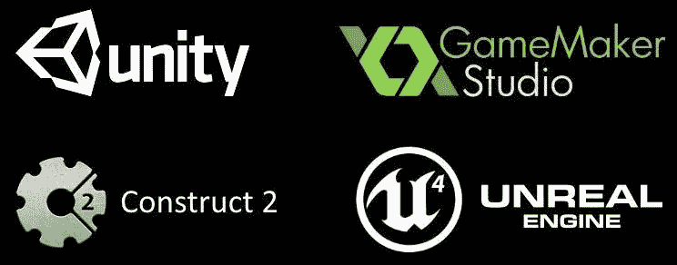
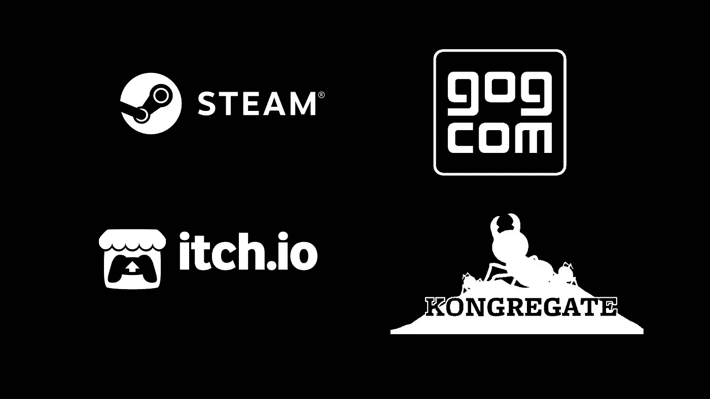

# 游戏开发:5 个新年决心帮助你明年更上一层楼

> 原文：<https://medium.datadriveninvestor.com/game-dev-5-new-years-resolutions-to-help-you-level-up-in-2021-ae04ae5c12c3?source=collection_archive---------29----------------------->

## 明年开始你的游戏制作之旅吧！新的一年为游戏设计者和开发者带来了许多令人兴奋的新机会来娱乐游戏玩家。

过去的一年有起有落。迎接新年的最大好处是，你可以认真地重新设定你的年度计划，并投资于你的梦想和目标！新的一年会给你的生活带来改变，给你的梦想和抱负一个新的开始。随着 **Udemy** 、 **Masterclass** 以及 **YouTube** 上的免费信息的兴起，投资你的游戏开发技能变得前所未有的简单。最大化你的时间取决于你，对于独立游戏开发者来说，这意味着将你的技能提升到一个新的水平。

在新的一年里，你能做些什么让自己成为更好的游戏开发者？这里有一些解决方案，可以帮助你走出低谷，避免新手游戏创作者遇到的常见错误。

Let’s plan for the new year together! Photo by [Isaac Smith](https://unsplash.com/@isaacmsmith?utm_source=medium&utm_medium=referral) on [Unsplash](https://unsplash.com?utm_source=medium&utm_medium=referral)

# 1。我会定期为我的游戏做贡献

我们都会陷入的一个陷阱是动机和习惯的对比。当你有动力并且每天都看到进步的时候，就很容易开始做一个游戏。当你的游戏开始变得困难时，当游戏的想法不符合你的喜好时，或者当你与艺术和音乐的承包商合作时，保持游戏的一致性就变得更加困难了。

你**不会**一夜之间从一个伟大的游戏创意变成一个拥有数百万玩家的成品游戏。简直**不可能**。

下决心养成游戏开发的习惯是你明年能做的最有帮助的事情。在任何技能水平上，你都可以从每天留出 *30 分钟*或者每个周末留出*一个下午*来开始你的项目中受益。即使是毫无收获的一天，设定打开你的游戏开发平台的节奏也会有所帮助。

为了增加动力，让我们来看看埃里克·巴隆。更广为人知的名字是 ConcernedApe，Eric 被认为是一手发行了《T2》的《星光谷》。虽然他的故事完全是不规则的，但这位西雅图游戏开发者、设计师和艺术家花了 **4 年**在星谷工作，并看到了**巨大的成功**。虽然他在这里或那里休息，并有许多非生产性的日子，但他对游戏的工作成了他无法摆脱的困扰。

我不是建议你单干。作为一个团队的一部分，与承包商和发行商一起发布一款游戏是一个不小的壮举。在新的一年里，定期把它添加到你的游戏项目中。

# 2.我将最终完成一个游戏(不管多短)

如果我有两个 1 号决议，这一个也会在上面。

完成一个游戏是很有价值的一课，尤其是对于刚起步的游戏开发者来说。这是**重要的第一步**学习如何完成一个游戏循环，包括“游戏结束”和“你赢了”状态，以及主菜单、积分和保存/加载功能。

不要误会，完成一个游戏**并不容易**。你需要对你的第一个游戏设定一个小的期望值，尤其是如果你打算完成它的话。如果有帮助的话，就把它当作一个完整完成游戏的仪式。

你的第一个游戏很可能不会让你赚钱。它也很可能只由少数人扮演。为此做好准备！创造一些简单的东西，也能表达你从游戏中喜欢的东西。制作你的第一个游戏是困难的，所以不要因为你自己的期望而停滞不前，或者创造下一个英雄联盟！

给你的努力设定一个时间框架并设定一个小范围的好方法是参加一个游戏堵塞。每天都有大量的游戏堵塞在[https://itch.io/jams](https://itch.io/jams)举行，有**伟大的社区**和人们**兴奋地尝试你的游戏**。我强烈建议那些没有参加过 jam 游戏的人明年去尝试一下！

# 3.我将学习新的游戏引擎/技术

我个人用 Unity 做所有和游戏相关的事情。我用 Unity 为网页、PC、Mac、Android 和 iOS 制作过游戏。我甚至为 Unity 中的股票报价机、健康和旅游应用程序制作了原型。

不过虽然我喜欢 Unity，你可能也喜欢*虚幻*、 *Godot 引擎*、 *GameMaker Studio 2* 、*构造*，甚至 *Roblox* ，明年我们都应该期待**拓展视野**。

A few of the most popular game engines out there. Source, [https://logicsimplified.com/newgames/best-game-development-platform-for-cross-game-development/](https://logicsimplified.com/newgames/best-game-development-platform-for-cross-game-development/)

学习新的编程语言、技术和框架对开发人员来说很重要，因为它**防止过时**并帮助**加深你对开发场景的理解**。你不希望一觉醒来，突然发现自己完全置身于游戏开发环境之外，对吗？

以下是开发人员目前使用的一些顶级游戏引擎:

*   [统一](https://unity.com/)
*   [戈多](https://godotengine.org/)
*   [虚幻引擎](https://www.unrealengine.com/)
*   [构造](https://www.construct.net/en)
*   [GameMaker 工作室](https://www.yoyogames.com/gamemaker)
*   [相位器](https://phaser.io/)
*   [LibGDX](https://libgdx.badlogicgames.com/)

虽然在可预见的未来我没有任何离开 Unity 的计划，但我已经在 Unreal、LibGDX 和 Phaser 3 上投入了一些时间。给自己留点时间磨练技巧，明年再学一个新的游戏引擎！

 [## 取代你的风投？企业家的 5 条原则|数据驱动的投资者

### 在 Tau Ventures，我们建议所有企业家将融资过程中的勤奋过程视为双向的…

www.datadriveninvestor.com](https://www.datadriveninvestor.com/2020/11/29/replacing-your-vc-5-principles-for-entrepreneurs/) 

# 4.我将建立自己的社交媒体形象

How will you connect with your players next year? Photo by [NordWood Themes](https://unsplash.com/@nordwood?utm_source=medium&utm_medium=referral) on [Unsplash](https://unsplash.com?utm_source=medium&utm_medium=referral)

在一个盒子里构建你的游戏，不让任何人玩，甚至不让任何人看到它，直到它“完美”为止，这是我看到初学者犯的最大错误。他们通常害怕自己的杰作会被以未完成的程度来评判。有些人甚至担心其他游戏创作者会窃取他们的想法，并在他们之前完成它！

让大家知道，这些担忧**完全不可能**。游戏市场充斥着独立游戏开发商和独立游戏。Itch.io 的库中有超过 300，000 个游戏——如果你的游戏被注意到了，你应该认为自己**幸运**！当你不编程的时候，你最关心的是获得对你的游戏感兴趣的观众。

如果你还没有游戏的 Twitter 账号，今天就注册一个吧。别等了，现在就做！你需要从底层开始建立你的存在，因为在发布之前没有对你的游戏**感兴趣的玩家，当你最终完成你的游戏时，你将不会有任何流量。**

如果你想和你的粉丝建立更直接的联系，创建一个 YouTube 频道，并定期向他们展示“**开发日志**”！如果你有魅力的个性和一些视频剪辑技巧，你可以给你的粉丝留下深刻的印象，并吸引更多的粉丝！

确保与社区互动，在**# screen shots 星期六，**期间分享你正在制作的游戏截图，并每天**与你的粉丝和游戏开发伙伴**交流。除了第一点，当涉及到社交媒体时，一定要遵循一致性规则！

# 5.我将经历把游戏发布到店面的过程

这最后一个是你的延伸目标。如果你遵循决议 1 到 4，你最终会发现你已经做了一个如此完美的游戏，玩起来感觉如此之好，以至于你会考虑卖掉它。

Some excellent storefronts to publish and monetize your game.

我强烈建议第一次在 Itch.io 上发布你的游戏，因为它是完全免费的。还有，Itch.io 无私地不从你的销售中要求利润分成。在赚钱和曝光之间取得平衡的最好方法是用一个 ***推荐*** 价格列出你的游戏，但也允许人们免费下载*。这意味着现金短缺的玩家现在可以玩你的游戏，如果他们玩得开心，以后还可以回来捐款！*

*发布游戏是一种大开眼界的体验。你需要创建一个标志，横幅，应用程序图标，你的游戏描述，和一个引人注目的预告片。把这个**看作是营销你自己和你的产品**的奥运会——你从#4 中学到的一切都将得到检验！*

*一旦玩家开始购买和玩你的游戏，你的角色就变成了 c **客户支持**和 **QA 工程师**。经历了错误和兼容性问题的玩家将会期待它们被解决。你的游戏的力学和难度曲线的平衡将被仔细检查和评论。准备好积极的和消极的评价——它们只是过程的一部分。但是整个经历会让第二次变得更容易！*

# *结论*

*我希望我列出的游戏开发者新年决心对你有所帮助！如果你至少能采纳其中的一条，你的一年肯定会富有成效。*

*你是未来的游戏设计师或开发者吗？在即将到来的一年里，你有动力开始自己的独立游戏工作室吗？？看看我的一些关于如何让你的游戏开发愿望成为现实的文章！*

*   *[如何创办自己的独立游戏工作室](https://cjames1.medium.com/starting-an-indie-game-studio-heres-your-checklist-of-basic-needs-cbe50008f83b)*
*   *[为什么游戏开发是一个可行的副业](https://medium.com/datadriveninvestor/why-you-can-rely-on-game-development-as-a-side-hustle-in-2021-cdd0f3ad67ac)*
*   *[为什么缩小社交距离的游戏比以往任何时候都重要](https://cjames1.medium.com/why-games-that-close-the-social-distance-gap-are-more-important-than-ever-4291cf4c903)*
*   *[当你没有好点子时如何制作游戏](https://cjames1.medium.com/how-to-make-a-game-when-you-are-out-of-good-ideas-14fd82d02905)*

***访问专家视图—** [**订阅 DDI 英特尔**](https://datadriveninvestor.com/ddi-intel)*