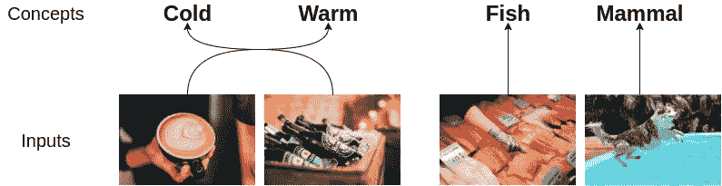
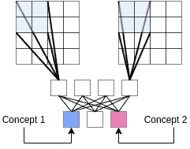
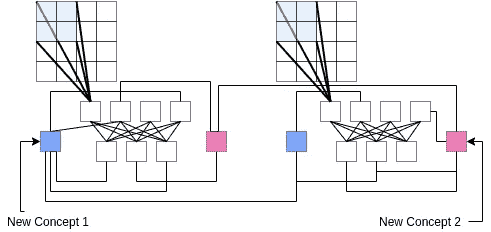
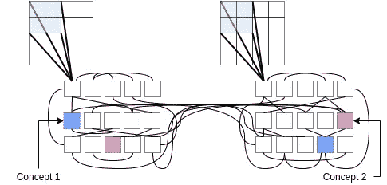

# 概念游戏——一个无法通过深度学习解决的简单任务

> 原文：<https://medium.datadriveninvestor.com/game-of-concepts-a-simple-task-that-cant-be-solved-with-deep-learning-8ec0119924b2?source=collection_archive---------19----------------------->

我将介绍“概念游戏”，这是一个非常简单的二进制分类任务，仅靠更多的计算能力或更多的数据是无法解决的。我还在讨论一个新的架构家族，它可以用来解决这个任务。

# 概述——概念的游戏

> 给定两个概念和两个输入，系统必须能够正确地将每个输入分配给其对应的概念。

Two examples of the game of concepts

游戏的简单版本使用图像作为输入。更复杂的版本可以使用任何类型的输入(文本、视频、声音等。).乍一看，这可能看起来很像图像分类，但这实际上要困难得多。

这项任务实际测试的是神经网络中两个概念之间是否存在联系。例如，第一个示例测试了“咖啡”与“温暖”的联系，以及“啤酒”与“寒冷”的联系啤酒图像实际上是模糊的，也可以被认为是温暖的(假设背景似乎表示“夏天”)。执行该任务的系统需要正确地解决歧义，并在给定两个输入的情况下选择最佳关联。

此外，系统必须能够避免过快地分配概念，即使存在一些密切相关的概念。例如，在第二个例子中可能发生的一个错误是，因为人手而将“哺乳动物”赋值，因为水而将“鱼”赋值。该系统需要查看两幅图像中的所有元素，并在做出决定之前仔细考虑它们的相对影响。

 [## 幸福的算法？数据驱动的投资者

### 从一开始，我们就认为技术正在使我们的生活变得更好、更快、更容易和更实用。社交媒体…

www.datadriveninvestor.com](https://www.datadriveninvestor.com/2019/03/08/an-algorithm-for-happiness/) 

最后，为了在这项任务上取得实质性进展，系统必须能够执行 3 个关键要素，即**连续学习**、**无监督学习**和**可解释的 AI** 。

# 深度学习无法解决这个任务

重要的是要认识到，传统的深度学习方法将大量数据扔在固定的架构上，然后测量训练好的模型的准确性，这种方法无法解决这个任务。深度学习有三个限制，使得解决这项任务变得不可能。

**1)深度学习需要固定的架构。**

不可能预先建立所有可能概念的列表，因为概念可以是任何语言的，或者可以是任意特定的(例如，人或地点)。为了解决这个任务，系统必须能够学习新的概念，并将它们与它已经知道的概念联系起来。这通常被称为**持续学习**。

如果神经网络中的连接不是固定的，我们真的没有架构，只有**连接体**。不能将线性代数与 Tensorflow 或 Pytorch 等工具一起使用，因为张量和矩阵强制使用一组固定的连接。该系统将不能学习识别新概念，并且将不得不不断地被重新训练。

在我看来，创造新的联系以获取知识的能力是弱智能和强智能的主要区别。弱智能(如深度学习)只会更新一组固定连接的权重，并在必须获取新知识的任务中挣扎。

**2)深度学习需要数据集。**

由于事先不知道概念列表，因此不可能为这些概念编译数据集。即使任务被限制在 10，000 个概念，一个可以提供足够的例子来对比每个概念和其他每个概念的数据集也会很快变得难以处理。显而易见，仅使用监督学习无法训练系统完成这项任务，因此需要**非监督学习**。

当一个新的概念被引入时，系统需要监督把这个概念和它已经知道的其他概念联系起来。必须保持这种初始监督，直到系统能够自信地将新引入的概念与它知道的其他概念进行对比。

在一个系统已经学习了一个初始的概念网络之后，它必须能够在没有监督的情况下更新它在输入中检测到的概念的信念。例如，在上面的“哺乳动物”图像中，人类很快就很难列出所有必须更新的可能概念(例如，狗、游泳池、后院、夏天、跳跃、潜水等)。).

过了某一点，人类就不可能知道系统知道的所有概念以及它们是如何联系在一起的。人类可以歪曲系统看到的概念和输入，但不能对系统的信念应该如何更新提供真正的监督。

**3)深度学习用准确性衡量其成功。**

对于开放式任务，精确度的概念是不相关的，因为系统可以根据所选的输入具有任意高或低的精确度。我们真的希望系统能够解释它们的答案，而不是有正确的答案。

对于这项任务，系统应该能够列出用于做出决策的概念。在上面的第一个例子中，我们真正想要的是“咖啡”和“热”之间的联系，以及“啤酒”和“冷”之间的联系一个通过证明“短袖”意味着“冷”和“夏天”意味着“暖”而给出错误答案的系统，要比一个给出正确答案但没有有效证明的系统好得多。

# 查看可能的体系结构系列

我想简单讨论一下，为了解决这个任务，必须对固定的深度学习架构进行修改。即使没有单一的最佳连接体或架构，一个能够很好地完成这项任务的系统也很可能使用某一系列的架构。

**1)从固定架构开始**

A possible deep learning architecture

通常，深度学习图像分类架构将用于此任务。将使用卷积或残差块提取图像的特征，在几个密集层之后，将使用 softmax 函数对图像进行分类。对于这项任务，两幅图像必须同时处理，因为它们都会影响最终决策。这种体系结构可能会对给定两幅图像的第一幅图像中出现的概念的概率进行建模。

有几个因素值得指出。首先，概念只出现在最终的输出层，其他层中的元素不可能被直接解释。第二，密集层可能包含第一幅图像中存在而第二幅图像中不存在的特征(即差异)。第三，在推理过程中，信息在该系统中仅向下流动，从图像中的像素开始到输出层中的高层概念。

**2)添加新概念**

Adding new concepts to the current architecture

要添加新概念，我们必须首先将神经网络分解为其底层神经元和连接。一个新概念本质上是一个新的神经元，它与其他概念相联系，并且可能与密集层中的中间节点相联系。因为我们将概念链接在一起，所以我们需要使用两个并行的网络分别对每个输入中概念的存在进行建模。

一个概念在一个输入中的出现降低了相同概念在另一个网络中出现的概率。这将需要两个网络中相同概念之间的抑制性联系。在这种情况下，概念出现在底层，信息主要向下和横向流动。

**3)汇聚成“H”型网络**

An “H” network with two hemispheres

最后，随着更多概念的加入，每个网络的循环次数将会增加。两个网络将开始看起来像字母“H”，其中每一边计算其输入是否有概念，中间的条用于计算两个网络之间的差异。在这种情况下，信息向四面八方流动，人们通过多条同时存在且相互竞争的路径来探测概念。

# 摘要

总之，我介绍了概念的游戏，这是一个非常简单的二进制分类任务，无法用深度学习解决。我认为，在这项任务上取得进展将需要持续的学习、无人监督的学习和可解释的人工智能。

如果我们真的想达到下一个人工智能范式，我们需要愿意挑战正在工作的东西，并尝试打破常规的想法。我们需要解决没有完美解决方案的开放式问题，并认识到智能不仅仅是一个拥有大量数据的固定架构。

**注意**:这个想法最初是在我的[通往强大智能的路线图](https://arxiv.org/pdf/2002.09044.pdf)上与其他高层想法一起引入的。

Photo by [Tim Gouw](https://unsplash.com/@punttim?utm_source=medium&utm_medium=referral) on [Unsplash](https://unsplash.com?utm_source=medium&utm_medium=referral)