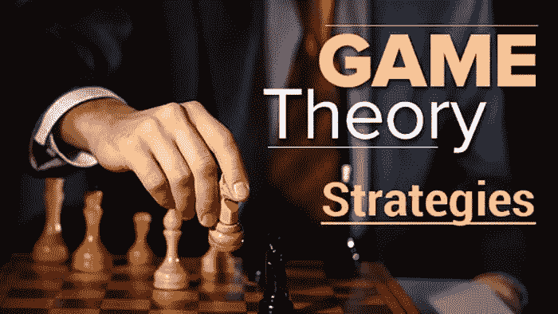
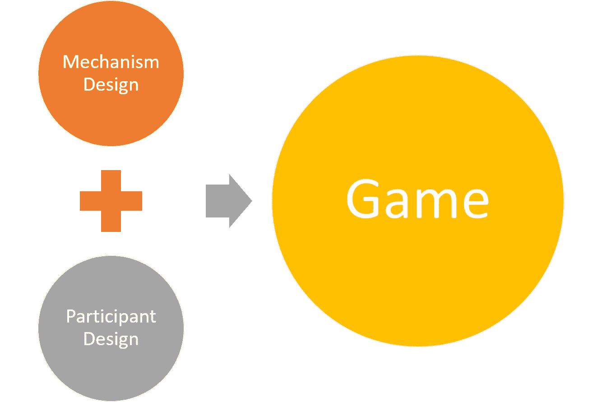

# 数据科学家的博弈论

> 原文：<https://medium.datadriveninvestor.com/game-theory-for-data-scientists-e44048a7e935?source=collection_archive---------1----------------------->

## 理解多智能体人工智能系统的理论基础

Source: [https://www.assignmentdesk.co.uk/blog/game-theory-strategies](https://www.assignmentdesk.co.uk/blog/game-theory-strategies)

游戏在人工智能(AI)的发展中发挥着关键作用。首先，游戏环境正在成为强化学习或模仿学习等领域的流行培训机制。理论上，任何多智能体人工智能系统都可以在其参与者之间进行游戏化的交互。阐明游戏原理的数学分支被称为博弈论。在人工智能(AI)和深度学习系统的背景下，博弈论对于实现多智能体环境中所需的一些关键能力至关重要，在多智能体环境中，不同的 AI 程序需要交互或竞争以完成一个目标。

博弈论的历史附属于计算机科学的历史。当前博弈论的许多研究可以追溯到计算机科学先驱的工作，如艾伦·图灵或约翰·冯·诺伊曼。著名的纳什均衡因电影《美丽心灵》而流行，是现代系统中许多人工智能交互的基石。然而，多次使用博弈论的原理来建模人工智能宇宙超出了纳什均衡。理解使用博弈论原理构建人工智能系统的含义的一个好地方是理解我们在社会或经济互动中通常遇到的不同类型的游戏。

每天，我们都会参与数百次基于游戏动态的互动。然而，这些游戏化环境的架构完全不同，参与者的动机和目标也完全不同。如何将一些原则应用到人工智能代理的建模中？这是一个推动整个人工智能研究领域的挑战，如多智能体强化学习。

虽然游戏显然是博弈论最明显的具体化，但它远不是应用这些概念的唯一空间。从这个角度来看，博弈论和人工智能的结合可以影响许多其他领域。事实告诉我们，大多数涉及多个“参与者”合作或竞争完成一项任务的场景都可以用人工智能技术来游戏化和改进。尽管前面的陈述是一种概括，但我希望它传达了一个观点，即博弈论和人工智能是一种思考和建模软件系统的方法，而不是一种特定的技术。

对于一个人工智能场景来说，它是使用博弈论的一个很好的候选，它应该涉及不止一个参与者。例如，销售预测优化人工智能系统，如 Salesforce Einstein，并不是应用博弈论原理的理想选择。然而，在一个多参与者的环境中，博弈论可以非常有效。在人工智能系统中构建游戏动态可以概括为两个基本步骤:

**参与者设计:**博弈论可以用来优化一个参与者的决策，以获得最大的效用。

**机制设计:**逆博弈理论专注于为一群聪明的参与者设计一个博弈。拍卖是机制设计的经典例子。

# 科学家应该了解的 5 种游戏数据

假设我们正在为一个人工智能系统建模，该系统涉及多个智能体，它们将合作并竞争来完成一个特定的目标。这是博弈论的经典例子。自 20 世纪 40 年代诞生以来，博弈论一直专注于对多智能体人工智能系统中最常见的交互模式进行建模。理解环境中不同类型的游戏动态是设计高效游戏化人工智能系统的关键要素。我喜欢用一个高层次的五要素标准来理解人工智能环境中的游戏动态:

## 对称与非对称。

游戏的一个最简单的分类是基于它们的对称性。对称博弈描述了一种环境，在这种环境中，每个参与者都有相同的目标，而结果将只取决于所涉及的策略。国际象棋是对称游戏的经典例子。我们在现实世界中遇到的许多情况缺乏对称的数学优雅，因为参与者经常有不同甚至冲突的目标。商务谈判是不对称博弈的一个例子，其中每一方都有不同的目标，并从不同的角度评估结果(例如:赢得合同与最小化投资)。

## 完美信息与不完美信息

游戏的另一个重要分类是基于可用信息的类型。一个完美的信息博弈指的是一个环境，在这个环境中每个参与者都能看到另一个参与者的行动。国际象棋是完美信息游戏的一个例子。许多现代互动都是基于这样的环境，在这种环境中，每个参与者的行动对其他参与者是隐藏的，博弈论将这些场景归类为不完美信息游戏。从扑克之类的纸牌游戏到自动驾驶汽车场景，不完美信息游戏就在我们身边。

## 合作与不合作

合作博弈环境是指不同的参与者可以建立联盟以最大化最终结果。合同谈判通常被建模为合作博弈。非合作场景描述了玩家被禁止结盟的环境。战争是非合作博弈的终极例子。

## 同步与顺序

序贯博弈发生在这样一个环境中，其中每个玩家都知道另一个玩家先前的行动。棋盘游戏本质上大多是连续的。同时游戏代表两个玩家可以同时行动的场景。证券交易是同时博弈的一个例子。

## 零和与非零和

零和游戏是指一个玩家的收益总是转化为其他玩家的损失。棋盘游戏就是零和游戏的例子。非零和游戏经常出现在多个玩家可以从一个玩家的行动中获益的情况下。多个参与者合作扩大市场规模的经济互动是非零和游戏的一个例子。

# 纳什均衡

对称游戏统治着人工智能世界，其中大多数都是基于上个世纪最著名的数学理论之一:纳什均衡。

纳什均衡以约翰·福布斯·纳什的名字命名，这位美国数学家因电影《美丽心灵》中的罗素·克劳而名垂千古。本质上，纳什均衡描述了这样一种情况:每个参与者都选择了一个策略，没有一个参与者可以通过改变策略而受益，而其他参与者保持他们的策略不变。

纳什均衡是一个美丽的和难以置信的强大的数学模型来解决许多博弈论问题，但它在许多不对称的游戏环境中也有不足。首先，纳什方法假设玩家拥有无限的计算能力，这在现实世界环境中很少出现。此外，许多纳什均衡模型未能解释风险的概念，这是无所不在的，在大多数非对称游戏的经济市场。因此，有许多不对称的博弈场景很难用纳什均衡来实现。这在多智能体人工智能系统中尤其重要，这些系统需要在解决方案的数学优雅性和实现的实用性之间找到正确的平衡。

# 逆博弈理论

在许多情况下，问题不是优化参与者在游戏中的策略，而是围绕理性参与者的行为来设计游戏。这就是逆博弈论的作用。拍卖被认为是逆博弈理论的主要例子之一。

多智能体人工智能系统是人工智能生态系统中最令人着迷的研究领域之一。由计算机科学传奇人物艾伦·图灵或约翰·冯·诺依曼制定的博弈论原理现在是这个星球上一些最智能系统的核心，人工智能的最新进展也有助于推动博弈论的研究。