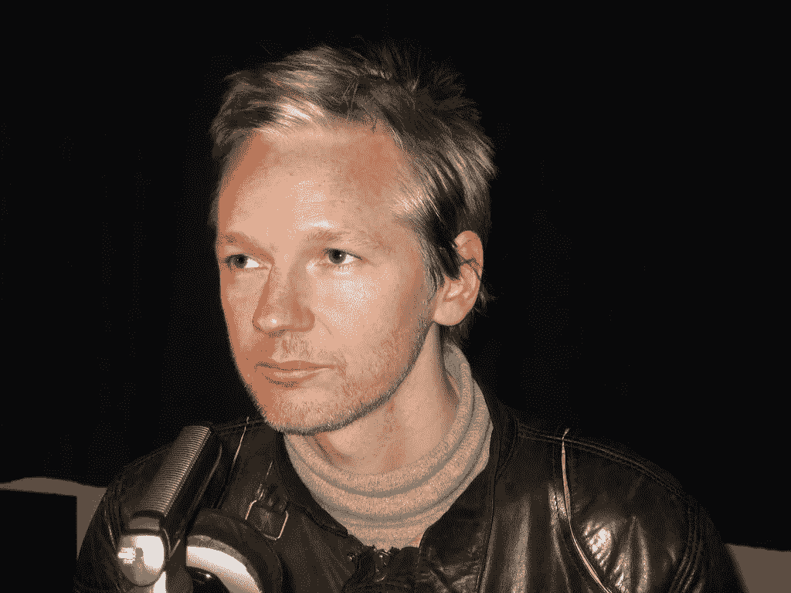

# 游戏媒体需要承认朱利安·阿桑奇

> 原文：<https://medium.datadriveninvestor.com/games-media-needs-to-acknowledge-julian-assange-eccc5ea11eaa?source=collection_archive---------10----------------------->

每一个不谈论朱利安·阿桑奇的记者都是整个行业的污点。

[“Julian Assange (1)”](https://www.flickr.com/photos/13990974@N04/5147778133) by [bbwbryant](https://www.flickr.com/photos/13990974@N04) is licensed under [CC BY-NC 2.0](https://creativecommons.org/licenses/by-nc/2.0/?ref=ccsearch&atype=rich)

维基解密创始人兼编辑朱利安·阿桑奇目前正在伦敦受审。听证会试图将阿桑奇引渡到美国——在美国，他将面临十多项指控，以及高达 175 年的监禁。

该案件发生在阿桑奇和他的媒体渠道维基解密开始曝光美国军方机密文件大约十年之后。上述文件是由[告密者切尔西·曼宁](https://www.history.com/this-day-in-history/wikileaks-publishes-first-documents-leaked-by-chelsea-manning)提供的。作为美国陆军的前情报分析员，曼宁获得了近 75 万份机密文件。这些揭露了各种隐藏的美国真相，包括美国对外国领导人的描述，政治欺凌，以及美国犯下的战争罪行。曼宁泄密事件让人们对 21 世纪初美国与伊拉克和阿富汗的战争有了特别的了解。

可能最令人震惊的泄露信息包括数以千计被美国掩盖的平民伤亡。在更令人不安的爆料中，一个 40 分钟的生动视频，名为*间接谋杀，*可以在维基解密找到[。](https://collateralmurder.wikileaks.org/)

# 简而言之，朱利安·阿桑奇的审判

阿桑奇现在因揭露世界上最大的全球强国之一犯下的令人发指的战争罪行而受审。到目前为止，他的审判已经进行了几个星期，然而关于此案的报道却很少。你认为这是为什么？

嗯，这次审判是对新闻业和新闻诚信的直接攻击。这对全世界的记者、记者和新闻媒体来说是一个警告。如果你和美国过不去，或者揭露美国政府的阴暗和残忍，你将会被引渡，折磨和监禁。对朱利安·阿桑奇的审判是为新闻界树立一个绝对的刑事先例。

事实是阿桑奇没有做错任何事。在一个我们都应该努力有一天成为其中一员的理想世界里，对真理的追求应该受到赞美。没有被迫害。用凯特琳·约翰斯通的话说，“阿桑奇案是这一代人的纳尔逊·曼德拉时刻”。

Coverage regarding Julian Assange via The Grayzone YouTube channel and Anya Parampil’s Red Lines program

# 所有媒体成员都有责任表明立场

公平地说，我理解为什么游戏媒体不愿意和朱利安·阿桑奇上床。主流媒体将这场争议扭曲成了政治争议，而不是新闻争议。但是，这正是为什么游戏媒体需要支持阿桑奇。他的案子完全是关于新闻业的。

任何媒体成员，或者任何有平台的人，如果现在不放大阿桑奇，就没有成为一名真正的记者的愿望。他们跪在制度面前，向它投降。忽视朱利安·阿桑奇就是忽视作者身份的神圣性。这是拿走你的第一修正案权利，并以此换取一个口套。

坦白说，很卑鄙。

你可能会说“这种事情最好留给《纽约时报》或《T2 华盛顿邮报》。当然，如果他们的坦克还能保持完整性的话。当涉及到阿桑奇和维基解密时，主流媒体是顺从的，多年来一直如此。即使现在，随着他的审判正在进行，你很可能不知道朱利安·阿桑奇是谁，也不知道他为什么受审。这不是巧合。

你也可以说“我们应该呆在自己的车道上”或者“这不是我们的战斗”。这是我们的战斗。这是每一个利用过第一修正案的人的战斗。新闻诚信应该存在于整个媒体中，而不仅仅是政治中。

以[杰森·施莱尔](https://twitter.com/jasonschreier)——前 [Kotaku](https://thenerdstash.com/kotaku-uk-to-shut-down-this-week/) 和现任彭博新闻作家为例。通过他的调查性新闻报道，他在博彩业声名鹊起。Schreier 没有坚持写发行日期和预告片，而是揭露了主要游戏公司工作条件的残酷事实。他在顽皮狗顶级 PlayStation 运营的工作室报道过 crunch culture。四月，Schreier 报道了针对开发商的不正当工资策略。今年夏天早些时候，他写了一篇关于育碧公司不正当性行为的文章。

Journalist Max Blumenthal speaks on Julian Assange. Via The Grayzone YouTube channel.

现在想象一下，顶级游戏公司的首席执行官和高层领导聚在一起，决定将施莱尔从游戏行业除名？如果他们合法追捕他多年呢？如果他们把他从厄瓜多尔大使馆带走扔进监狱呢？

也许他们折磨他，在福克斯新闻频道和 CNN 上诋毁他的名字？想象一下，如果我们都静静地站在一旁看着？

这就是朱利安·阿桑奇(Julian Assange)的遭遇(从更宏大的层面来看)。阿桑奇帮助揭露邪恶。结果，他见证了新闻界成员的大规模流失。

为我们感到羞耻。我们所有人。

# 回避朱利安·阿桑奇就是忽视我们的角色

Schreier 有超过 20 万的推特粉丝。[格雷格米勒](https://thenerdstash.com/greg-miller-of-kinda-funny-co-writes-joker-comic/)120 万。IGN 拥有超过 1400 万用户。GameSpot 有将近 450 万。他们都有许多员工每天报道视频游戏。不要被题材迷惑，他们是记者。

这就是为什么游戏媒体需要挺身而出，捍卫自己的行业。试图引渡和谴责朱利安·阿桑奇将对记者造成海啸级的影响。IGN、GameSpot 和 Kinda Funny 可能没有解决国际腐败问题，但它们是负责任报道的兄弟姐妹的一部分。

2020 年，视频游戏媒体的许多成员通过他们的工作和社交媒体账户变得越来越政治化。主要话题包括冠状病毒疫情、黑人的命也是命运动和即将到来的 2020 年总统大选。如果他们愿意附和这种表面的话题，他们也必须愿意挑战其他情况。

对朱利安·阿桑奇的审判将是更相关的切入点之一。视频游戏和书呆子文化媒体成员已经理解了被压抑的表达可能造成的影响。隐瞒全部真相会迅速败坏一个人的工作，并对他们在该领域的职业生涯和声誉造成损害。更重要的是，它使事实不可能暴露。

如果最近围绕*边境 3* 和[育碧](https://thenerdstash.com/ubisoft-creative-director-fired-for-inappropriate-relationships/)的故事没有被报道会怎样？如果邪恶和恶意没有被打击？如果记者被禁止报道他们？这就是朱利安·阿桑奇审判的目的。这就是为什么游戏媒体需要变得更好，并站起来反对其直接行业之外的不公正。

奥运会媒体记者需要不仅仅是宣传和一技之长——他们需要成为真正的记者。