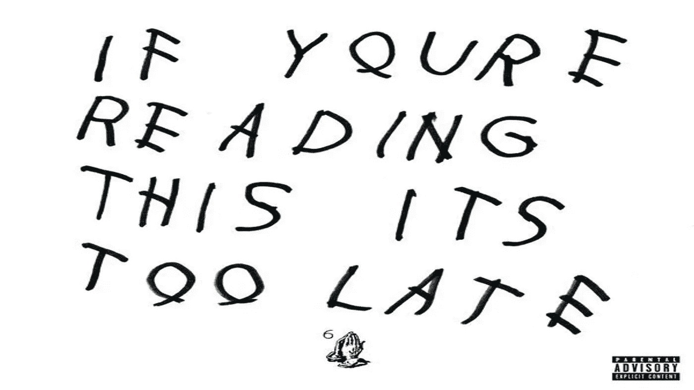

# 游戏停止和随大流的危险

> 原文：<https://medium.datadriveninvestor.com/gamestop-and-the-danger-of-following-the-crowd-3e574ac41a29?source=collection_archive---------23----------------------->

盲目从众可能是危险的。在*自然*文章 [*以下人群*](https://doi.org/10.1038/35035192) 中，作者声明:

> 在人群中，由于周围人群对一个人施加的巨大力量，有受伤甚至丧失生命的危险。

正如在现实人群中一样，在隐喻的业余投资者蜂拥而至快速获利的人群中也是如此:买者自负，存在亏损的严重风险。随着散户投资者蜂拥而至，GameStop 的股价在 1 月份飙升了 1600%以上，达到每股 300 美元以上的峰值，带头的是试图惩罚过度做空该公司股票的对冲基金的[Wall Street bets](https://www.reddit.com/r/wallstreetbets/)*Reddit*论坛，一些人将这描述为华尔街和业余投资者之间的大卫与歌利亚之战。股票的狂飙和有趣的背景故事得到了主流媒体的大量报道，显然，电影[已经在开发中。](https://www.msn.com/en-us/movies/news/gamestop-film-in-development-at-hbo/ar-BB1dr0pO)

然而，尽管大部分注意力都集中在做空 GameStop 的目标对冲基金和那些从失控的做空中获得可观利润的对冲基金身上，但散户投资者和其他利用这轮反弹的对冲基金都在关注。人们对那些吃亏的人的关注要少得多，尤其是散户投资者。

《金融时报》上的一篇好文章分享了两个这样的投资者的故事，他们在股价接近最高点时买入了股票，随后损失惨重。虽然他们损失的绝对数额看起来很小，但对他们来说意义重大，正如其中一位所说:

> 我们不是大玩家。我们没有损失几百万，但对我们来说，这是一个月的租金，是账单。我不知道我们将如何恢复

有趣的是，这位投资者还提到了埃隆·马斯克对购买的影响。Elon Musk 在 1 月 26 日晚上发了他的推文，这使得 GameStop 在当天上涨了 60%。

但事实上，GameStop 的投资游戏自 2020 年秋天就已经开始了，一些主要演员去年在股价还不到 10 美元的时候就已经建仓了。当它在 1 月最后几周受到媒体关注时，该股已经接近峰值，是一场风险极高的赌博，因此在那个时候买入是一场非常疯狂的赌博，一些投资者做空也就不足为奇了。相比之下，一家赚了[7 亿美元](https://www.wsj.com/articles/this-hedge-fund-made-700-million-on-gamestop-11612390687)的对冲基金在 2020 年 9 月进入 GameStop 头寸，在反弹期间一直持有，并在埃隆·马斯克发布推文后认定股票已经见顶并完全卖出。

我们很可能会继续看到像这样的集会，这可以被描述为 ***社交人群投资*** ，散户投资者聚集在社交论坛或社交媒体上建立投资头寸，引发类似的投资狂热(如果 SEC 不认为这是市场操纵的话*)。然而，重要的是要避免因为害怕错过机会而做出轻率的投资决定。如果你想把房租赌在社交投资狂潮上，或者根据埃隆·马斯克的一条推文进行高风险投资，想象一下上面德雷克专辑的封面艺术，认真考虑一下是否已经为时过晚？这就像试图跳上一辆已经加快速度的行驶中的公共汽车，你可能会幸运地成功赶上，但也有令人不安的高概率你会错过并迎面摔倒。*