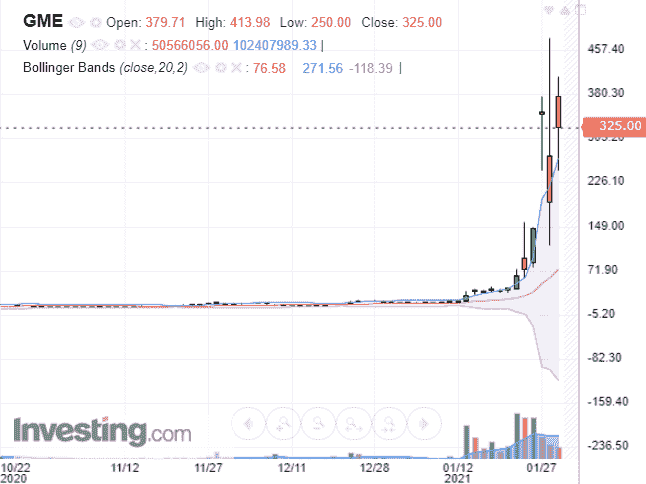
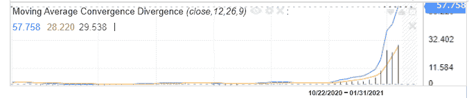
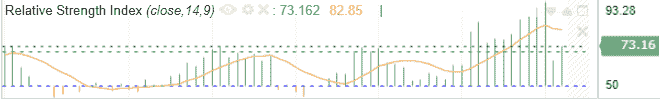

# 2021 年 GameStop 已经激增超过 1500%。你应该继续追逐这只股票吗？

> 原文：<https://medium.datadriveninvestor.com/gamestop-has-surged-over-1500-in-2021-should-you-chase-the-stock-going-forward-28046151ec67?source=collection_archive---------27----------------------->

r/WallStreetBets

现在，你可能已经听说过 GameStop $GME，这是目前市场上最热门的股票。

我们知道，许多人都在做空$GME 股票。不要相信我们——彭博报告称，虽然 Gamestop 的流通股为 6970 万股，但空头利息为 7120 万股。

作为初步基本面分析的一部分，让我们来看看 GameStop 的商业模式。

根据 2020 年第三季度的更新，Gamestop 的净销售额为 10.047 亿美元，比 2019 财年第三季度下降了 30.2%，这反映了:

*   在长达七年的当前一代控制台周期的最后几个月中操作的影响以及随后硬件和附件的有限可用性；
*   计划外的软件名称转移到第四财季，在某些情况下，转移到 2021 财年；
*   作为公司去密集化战略的一部分，商店基础减少了 11%,通过转移到邻近地点和在线重新获得的销售额部分抵消了这一减少

然而，你知道这家视频游戏零售商已经两年没有盈利了吗？考虑到 Gamestop 的上一份年度报告，Gamestop 在截至 2020 年 2 月 1 日的财年中运营亏损 3.996 亿美元，在截至 2019 年 2 月 1 日的财年中运营亏损 7.02 亿美元。与截至 2018 年 2 月 1 日的财年相比，这是一个明显的转变，当时他们公布的净利润为 4.392 亿美元。作为一个游戏玩家在线下载游戏的实体零售商，这项业务的前景并不乐观。Gamestop 的首席执行官乔治·雪曼在他们的年度股东信中谈到了这一点，称该公司的战略是一个全渠道战略，采用“在线购买，店内提货”的方式。然而，考虑到过去两年的财务表现，他们从线下到线上的转变是否会带来回报并扭转公司的财务状况仍有待观察。

尽管前景黯淡，但仅在 2021 年 1 月，该股就飙升了 1500%以上，这是由 Reddit 的华尔街赌注论坛的一群菜鸟日间交易员推动的。它首先从现在著名的 Reddit 用户“咆哮的小猫”(34 岁的基思·吉尔)开始，他首先发布了一张他在 Gamestop 投资 53，000 美元的照片，据报道，这笔投资是在 2019 年 Gamestop 每股 5 美元时进行的。虽然除了对 Gamestop 股价上涨缺乏信心的评论外，该帖子本身并没有引起社区的太多关注，但这些评论促使 Keith Gill 继续在 Gamestop 上的 Youtube 和 Tikok 等流行的社交媒体渠道上制作更多视频。这见证了散户资金涌入 GameStop 的开始，Keith Gill 和 Reddit 用户 DeepF***ingValue 是刺激社区集体购买 Gamestop 等严重做空股票的第一批驱动者。正如我们所知，这最终推高了股价，挤出了 Melvin Capital 和 Citron 等对冲基金，迫使它们以巨额亏损平仓 GameStop 的空头头寸。

现在最大的问题是，投资者是应该继续追逐这只股票，还是袖手旁观。为了回答这个问题，我们看了 3 个技术指标(布林线，MACD 和 RSI)来决定是否参与 GameStop 的大规模反弹。

# #1 布林线

布林线是下图中的蓝色带，覆盖了价格简单移动平均线上下的标准差水平。由于波段的宽度反映了股票价格的标准差，当股票波动较大时，波段会变宽。

investing.com

GameStop 目前的股价为 325 美元，比其上限高出约 18%，这意味着该股在短期内严重超买。因此，短期内回调的风险非常高，对于投资者和交易者来说，这是一个糟糕的切入点。

中间带(黄线)是股票的简单移动平均线，通常用作支撑位。当股票跌破支撑位时，它表明股票不再处于上升趋势，这是卖出股票的信号。如果我们假设在 80 美元的支撑位止损，交易者将退出他们的头寸，GameStop 交易的风险是 80 美元/$ 325–1 =-75%，这是非常高的。考虑到这种交易的高风险，投资者最好还是去寻找其他有更好的交易系统和风险回报率的股票。

# 第二名 MACD

MACD 或移动平均线收敛背离是一种趋势跟踪动量指标，反映了股票价格的速度。如果是正数，股票趋势向上，如果是负数，股票趋势向下。MACD 值越大，速度越快。对于那些对 MACD 背后的数学感兴趣的人，该指标是通过从 12 天均线减去 26 天指数移动平均线(EMA)计算出来的。

GameStop 的 MACD(蓝线)自去年 12 月以来一直像火箭一样起飞。从技术角度来看，这意味着随着时间的推移，股票在加速。

对于新手投资者来说，这似乎是一个很好的机会。“是的！让我们登上火箭，因为它要飞向月球了！”。但是等一下，让我们仔细看看去年 12 月股票起飞前的 MACD。纵观该股自 2015 年以来的整个历史，GameStop 的 MACD 从未接近 5。在一个多月的时间里，它飙升到 57，这意味着速度在短时间内提高了 10 倍以上。

这意味着股票在短期内极度过热，不太可能保持同样的速度向前发展，特别是当华尔街投资者厌倦了 GameStop，并找到另一只股票来推动时。

investing.com

# #3 相对强度指数(RSI)

相对强弱指数(RSI)衡量最近价格变化的幅度，以评估股票是超买还是超卖。RSI 显示为振荡器，读数范围为 0 到 100。当 RSI 高于 70%时，股票被认为超买，当 RSI 低于 30%时，股票被认为超卖。

GameStop 的 RSI 目前为 83%，表明该股短期内严重超买。由于基于 RSI 指标，该股价格昂贵，投资者最好等待 RSI 回调，以便获得更好的进场点。

investing.com

# 结论

我们的 3 个技术指标显示，GameStop 在短期内严重超买，现在买入该股风险很大，潜在下跌空间为-75%。

谨慎的做法是远离 GameStop，而不是仅仅因为华尔街上所有的 Redditors 都在谈论它，就在这些疯狂的价格水平上追逐该股。

如果你喜欢这篇文章，并想在云上创建自己的投资策略，我邀请你看看 PyInvesting 的新[初学者回溯测试](https://pyinvesting.com/backtest/new-user/)，我们将通过一个例子来指导你，并帮助你了解网站是如何工作的。我希望 PyInvesting 能帮助你走向财务自由。

投资愉快，希望机会对你有利。