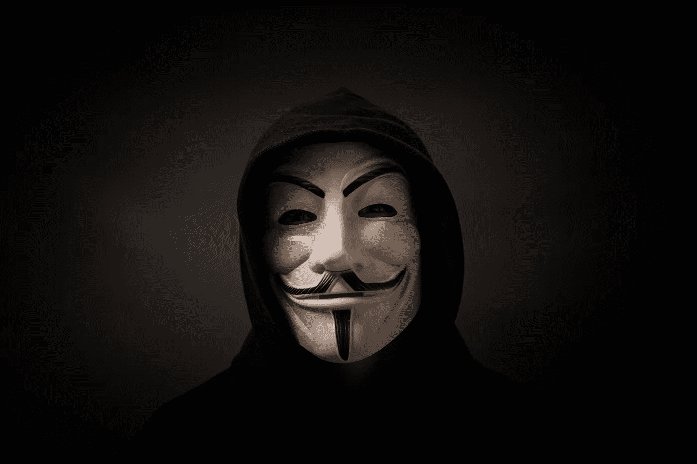

# GameStop 是对银行家的经济抗议

> 原文：<https://medium.datadriveninvestor.com/gamestop-is-an-economic-protest-against-the-bankers-9e478f61d616?source=collection_archive---------30----------------------->

## 一小批散户投资者可以对抗对冲基金、政府和央行。

我从来没有想到，几个小交易员能揭示出被操纵的全球金融体系。

GameStop 的故事是关于大卫和歌利亚的故事。它点燃了我内心无法解释的东西。

但是*让我们从乞讨开始，有一些背景。*

我们，独立投资者，厌倦了对冲基金。面对现实吧，谁喜欢对冲基金？**对冲基金没有给社会增加任何价值。他们的存在只是为了以牺牲普通人的利益为代价来丰富他们的投资者。**

大型对冲基金通常押注特定股票会贬值。这叫卖空。这种策略对实体经济没有明显的价值，它的存在只有一个目的。让从事这项工作的人富裕起来。这是大投资者操纵市场的方式。除此之外，通过被称为****的非法做法，对冲基金可以卖出比其流通股更多的公司股票。****

****这是一种有意的市场操纵策略，它伤害了公司、员工和整个经济。尽管美国证券交易委员会在 2008 年禁止了这种做法，但没有人对此采取任何措施。我看着股票被这些策略砸到零，没人说什么。****

****监管者睁一只眼闭一只眼，主流媒体在看到对冲基金从摧毁公司中获利时像海豹一样拍手叫好。****

# ****独立投资者反击了****

****问题是，谁来对抗他们？****

****事实证明，互联网上的一群千禧一代投资者会。他们是唯一反对破坏财富的对冲基金的人。****

****Reddit 上一群名为 [WallStreetBets](https://www.reddit.com/r/wallstreetbets/) 的年轻独立交易员了解到，对冲基金计划做空名为 **GameStop** 的视频游戏零售公司。一般来说，当很多人联合起来投资一只股票时，价格就会上涨。所以这些人开始购买 GameStop 的股票。股价一路飙升。一度飙升超过 1000%。对冲基金根本没有料到这一点，他们因此损失了数十亿美元。一家对冲基金甚至不得不从华尔街的朋友那里获得 27.5 亿英镑的紧急援助。****

****另一方面，Reddit 上的一群业余投资者以肥猫为代价赚了一大笔钱。结果，小散户投资者在自己的游戏中击败了大型对冲基金。****

# ****审查，久经考验的策略****

****一般来说，如果你要做空 140%的股票来操纵价格下跌，小投资者会阻止你这么做。你必须接受你输了那场比赛。****

****但是对冲基金是肮脏的。相反，他们使用权力。他们打电话给他们的政客，他们立即改变了游戏规则。现在连美国总统都卷进来了。****

****结果，华尔街赌注因“仇恨言论”被禁。这是政客们久经考验的策略。如果他们不喜欢某样东西，并且他们的捐赠者受到了外来者的伤害，他们就会进行调查、攻击和审查。****

# ****罗宾汉成为诺丁汉的谢里夫。****

****此外，全球最大的在线券商之一 Robinhood 决定阻止人们购买 GameStop 的股票。具有讽刺意味的是，他们禁止散户投资者购买股票，但他们没有阻止对冲基金出售股票。他们是在对冲基金的压力下这么做的，对冲基金才是真正的控制者。这相当于足球比赛的裁判在球还在半空中的时候就把它拿了出来，因为他不喜欢它的方向。这是**操纵市场的最极端的例子，**罗宾汉的生意应该为这种行为付之一炬。****

# ****惊恐的精英们****

****精英们为什么害怕？****

****事实证明，精英们讨厌的是有人通过与他们作对来赚钱。**这些小散户可以对抗对冲基金、政府和央行。政府担心，如果他们能够解除对冲基金的操纵，他们可能会让整个金融体系崩溃。******

****然而，Reddit 的人在做着和对冲基金一样的事情，只不过是在另一边。唯一的区别是他们赢了，而对冲基金输了。****

****太震撼了！在 25 年的市场生涯中，我见过这样的事情。****

# ****那么，我们该何去何从呢？****

****这个故事是关于传递一个信息。这是关于普通人团结起来与腐败的银行家斗争的故事。****

****托马斯·杰斐逊曾经说过，“我认为银行机构对我们的自由来说比常备军更危险。”****

****我们需要夺走他们的力量。没有什么比攻击他们的钱更好的了。****

****有一场运动让全世界的政治家和寡头们都闭上了嘴。****

****叫做**去中心化**。****

****首先，互联网已经在世界各地形成了分散的社区。****

****后来出现了比特币和加密货币，这有助于创造新的包容性金融体系。****

****多亏了这些，散户投资者现在和机构投资者一样了解世界。当他们聚集在一起，他们成为常备军。****

****GameStop 只是向被操纵的全球金融体系打响的第一枪。这是一种形式的经济抗议。****