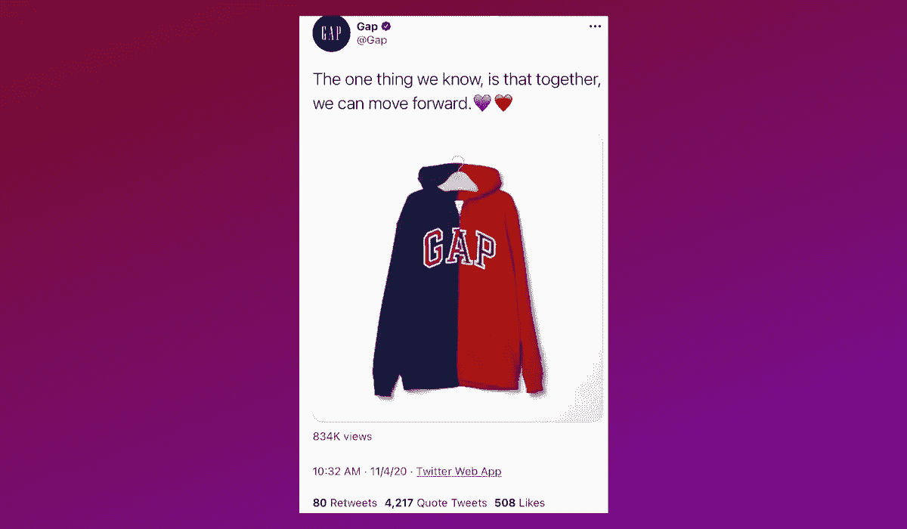
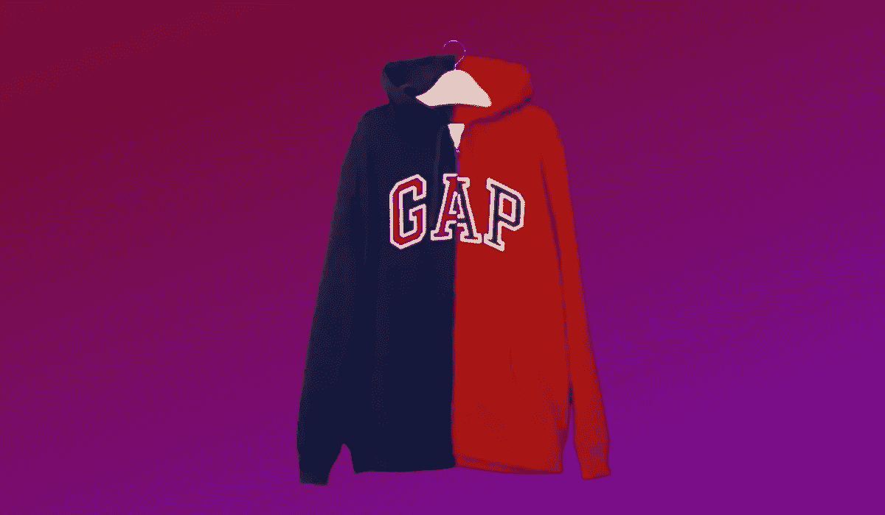
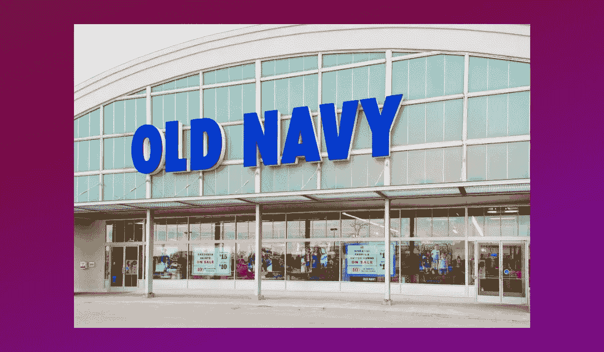

# Gap 的政治推特证明了该品牌无话可说

> 原文：<https://medium.datadriveninvestor.com/gaps-political-tweet-proved-the-brand-has-nothing-left-to-say-3a512f80f6c3?source=collection_archive---------6----------------------->

1969 年，所有酷小孩都穿着牛仔布。找到一条好的牛仔裤是一个挑战，一家商店想改变这种情况。这家商店后来被称为“ [The Gap](https://www.businessinsider.com/gap-company-history-rise-and-fall-pictures-2019-11#gap-was-started-by-doris-and-don-fisher-in-san-francisco-in-1969-1) ”

商店的名字[来源于术语](https://www.mentalfloss.com/article/596712/the-gap-facts)“代沟”这是一种在同一屋檐下购买有大量选择的牛仔裤的简化方法。新一代将改变顾客购买服装的方式，不可否认，Gap 变得非常酷。几十年后，这一代人站在了代沟的错误一边。一个曾经定义潮流的品牌似乎与下一代消费者脱节了。

上周，随着 2020 年总统选举结果的公布，Gap 展示了它们已经变得多么过时。他们借此机会在推特上发布了一件象征性的红蓝 Gap 运动衫，呼吁团结向前。几个小时后，这条推特就被删除了。

在这个时间点上，差距正在挣扎。它不再被视为一个很酷的品牌，[店内收入](https://www.sfchronicle.com/business/article/E-commerce-is-booming-Someone-tell-Gap-6878130.php)多年来一直在下降，而[股价](https://www.fool.com/investing/2019/06/11/why-the-gap-stock-plummeted-284-in-may.aspx)也在下跌。也许最糟糕的是，它与今天的年轻人毫无关系。

# Gap 的推文出错了

2020 年 11 月 4 日上午，美国人急切地关注着总统选举的结果。在 Gap 官方推特账户上，发布了团结一致的信息。

> 我们知道的一件事是，我们可以一起前进。💙❤️

也许这个信息是善意的，呼吁人们抛开分歧，站在一起。然而，这个信息不仅仅是关于团结，也是关于运动衫。Gap 利用政治气候为一款红蓝相间的运动衫做广告。

如果说我们对美国年轻人，尤其是 Z 世代有什么了解的话，那就是他们热衷于社交。百事可乐公司在播放肯达尔·詹娜加入抗议活动并将一罐百事可乐交给警察的广告时，第一时间发现了这一点。该广告淡化了社会运动，尤其是黑人的命也是命，并使抗议看起来很时髦。

对于 Gap 来说，一条推文的破坏性远远小于围绕抗议的整个活动。很少有人会在公众面前看到这条信息，投入到这个过程中的资金也少得多。然而，Gap 觉得有必要将他们的品牌插入到敏感的对话中。顾客们想知道为什么，以及除了促销之外是否还有其他信息。

更糟糕的是，这件运动衫甚至不是真的。纽约时报记者 Sapna Maheshwari 在推特上证实了这一点。如果你真的看看这件有问题的运动衫，它只是两件连帽衫裁剪在一起。标志不匹配，字母甚至没有对齐。

盖普只是想赶时髦。这种形象意味着政治冷漠，给品牌一些曝光，甚至没有促进一个真正的产品。

# Gap 的客户是谁？

在一条推文中，Gap 提醒我们，他们不是一个理解美国年轻人的品牌。并不总是这样，他们曾经是最受欢迎的品牌之一。在整个 [90 年代和 00 年代初](https://www.grailed.com/drycleanonly/gap-in-the-90s)，Gap 是购物中心购物和电视广告的主要内容。年轻的购物者，当时的 x 世代，从 Gap 购买他们的必需品。

An image from Gap’s [Khakis Swing](https://www.youtube.com/watch?v=jzFkZb4OlDM&feature=emb_title) commercial

随着时间的推移，人们有更多的机会接触快时尚品牌。 [Gap 公司](http://trustedinsight.trendsource.com/trusted-insight-trends/retail-market-research-the-gap-brand-is-hurting-gap-inc)。知道这一点，这反映在他们的老海军品牌。对于那些寻找适合办公室穿着的服装的人来说，他们有香蕉共和国，这让 Gap 成为一个没有多少个性的品牌。年轻顾客将被价格较低的服装所吸引，而 Gap 则保持着对商务人士来说过于休闲的风格。

现在，Gap 抓住了曾经认为这个品牌很酷的顾客。随着 Gap 商店(以及更贵的同类产品香蕉共和国)继续面临关闭，他们的零售业务正在减少。一个曾经定义了一代人的品牌现在代表了过去的趋势。顾客知道他们可以在不同的商店找到价格更低的基本产品，并保持相同的质量标准。

# Gap 能活下来吗？

Gap 的商业模式中有太多元素不起作用，很难想象 Gap 如何能坚持到 2020 年底。不仅销售额下降，整个商场都在关闭。五年内，美国可能会失去四分之一的购物中心。在这个过程中，许多 Gap 商店将永远关闭。

作为一家公司，Gap Inc .确实有一线希望。这是老海军的形式，比 Gap 便宜。那里的销售一直保持强劲，甚至在 2020 年疫情老海军也能够表现出色。该品牌在 2020 年第二季度见证了[在线销售额的增长](https://www.cfo.com/financial-performance/2020/08/gap-blunts-covid-impact-with-e-commerce-surge/)，证明了该品牌的需求及其适应不断变化的零售格局的能力。

via Old Navy

老海军以低价著称。这使得这家店与其他快时尚品牌以及像塔吉特百货这样的百货公司竞争。这就是老海军不同于 Gap Inc .其他品牌的地方:它仍然具有相关性。尽管在当前的零售环境中存在挑战，但顾客能够负担得起老海军的价格点，并继续购买。

至于 Gap Inc .的同名商店，它的前景并不光明。客户很难证明成本的合理性，他们的物理位置正在关闭。除非有所改变，否则他们不值得花这么大的代价来开门。

# 掉进了缺口

作为一个以代沟命名的品牌，gap 似乎太老了一代。曾经很酷的东西现在太无聊、太普通，无法独立生存。更糟糕的是，这个品牌似乎不知道他们的潜在客户长什么样，也无法吸引新客户。

当盖普在推特上发布一件音盲政治运动衫时，这表明他们缺乏方向。任何深究该品牌历史的人都可能知道他们在政治天平上的位置，但这并不重要。他们没有传达任何政治归属，也没有有效地宣传他们的服装。他们只是在政治对话中插入了一个通用的信息，因为它似乎是相关的。通过这样做，他们强调了 Gap 已经变得多么无关紧要。

也许 Gap 公司比 Gap 商店让你相信的做得更好。当他们用老海军、香蕉共和国和 Athleta 这样的品牌扩张时，他们可能会发现一些有用的东西。看起来老海军是这里真正的赢家，虽然 Athleta 也有潜力。其他商店似乎有麻烦了。

Gap Inc .可能会保留 Gap 的名称，但该名称将出现在更少的零售店中。下次他们谈到“缩小差距”时，就不会是巧妙的双关语了。这将是一个字面上的声明，反映了一个曾经统治商场的品牌的黯淡未来。