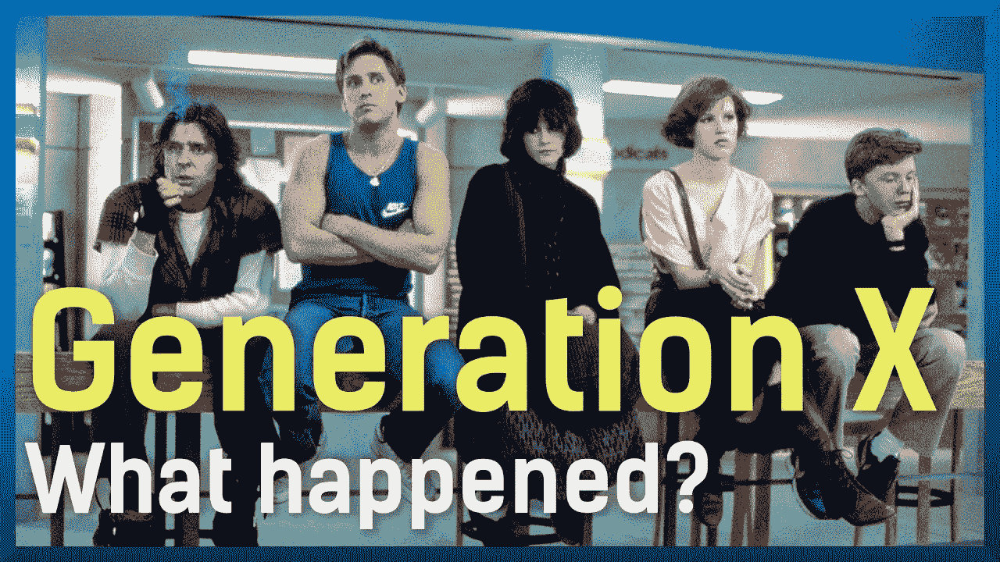
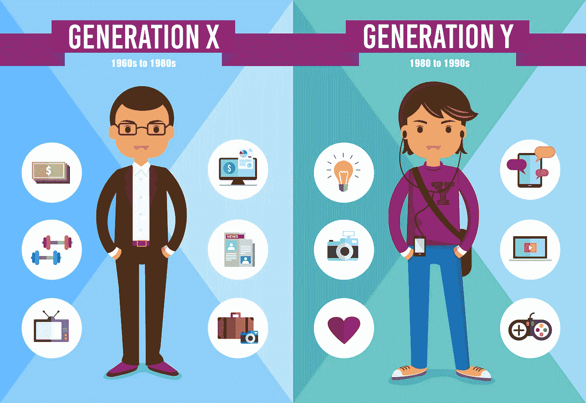
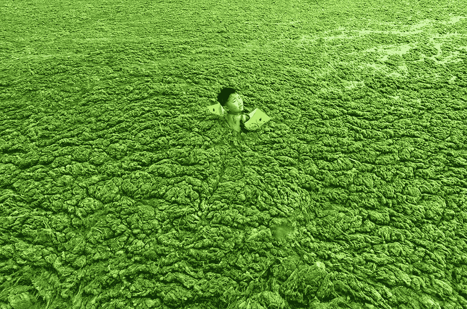
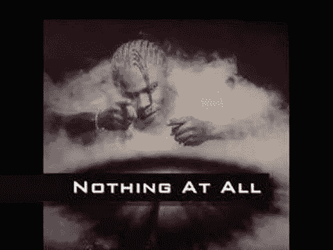

# X 一代 vs Y 一代 vs 千禧一代

> 原文：<https://medium.datadriveninvestor.com/gen-x-vs-y-vs-millennials-a089f5fa832a?source=collection_archive---------8----------------------->

“look at this [TikTok](https://medium.com/u/d4db316fdaa6?source=post_page-----a089f5fa832a--------------------------------) thing!”, “Nope, I’d rather kill myself. Live on [Instagram](https://medium.com/u/ea1e0eae982a?source=post_page-----a089f5fa832a--------------------------------), follow me!”

## 所以，“在走向拳击台的路上”……X 一代、Y 一代和千禧一代。谁更好？我不知道，我有点矛盾

# 意识形态

对于山景城或帕洛阿尔托或其他地方的人们来说，没有任何东西，没有这些团体，或所谓的“类别”。有一件事将他们团结在一起:超级资格、准备以及理论上的专业和创造力。

我没见过 20 世纪 20 年代的人被称为**原始人或第三代人**(或任何其他关于此事的伪 antropo-social-BS 术语)**以及成功或失败的大人物**。他们大概**不需要那个**。然而……有布可夫斯基，教皇二世，查理·帕克。

我不知道。**至少有些人能够说出自己的想法。实在看不出**如今跨代**。**

他们都被宠坏了。懒惰。

最重要的是…他们在过去的二三十年里一无所获…

# 世卫组织他们呢？

我不知道。千禧一代应该是像我这样的人。被宠坏了。懒惰。而在我们 20-30 岁的时候达到 0。但是其他的千禧一代成功地穿过了迷宫:**扎克和克里斯蒂亚诺罗纳尔多**是千禧一代。这个时代谁是对的？！#不要担心

只要我能写(而你能读，我是在和一个人说话，而不是一群人！)大家都是赢家。**对不起，你赢了**。

我的意识形态很简单:**思考并说出你该死的想法。不是随便什么** [**格雷格库珀**](https://medium.com/u/f8a58686d307?source=post_page-----a089f5fa832a--------------------------------) **喂你**。我不知道。领英专家什么的…

# 为什么选择 X & Y？！

我总是把这个 X 世代和 MTV 联系在一起，我不知道为什么。 **Limp Bizkit 和林肯公园反叛者，他们基本上讨厌一切，包括 O2** 。

问题是，这些人——包括我自己在内，我是一个跛脚和林肯迷……看了他们两个的现场演出很多次，我仍然可以保证这是一场精彩的演出， *moche* parade， **whole " *他说，她说"*shebang**——基本上不关心任何人，只关心他们自己。**我们自己**。

我们生活在一个 COVID-world **中，充满了猜疑，充满了马基雅维利式的思想，充满了照顾社会重要国家的犯罪心理**。

“Antônio Gutérrisss”…

**那些都不是创的东西。我的意思是，它们可能对它们有毒。**

再问一次，在我们周围有没有某种**意识形态？**

有什么信念吗？这些人有把握吗？！**他们的意识形态是我们……缺乏的吗？！？！**

# 错误！

显然，我错了，因为**我没有谷歌**。**这是与 y 一代紧密相关的一件事。X 一代是更老的学校，更老的媒体。**

他们看报纸。他们没有流媒体、播客和 youtube。

“they just chill”

我没意见。**雄心勃勃，朝九晚五的工作，照顾你的家庭和未来的家庭——Y 世代？！——是我可以尊重的**。

然而人们讨论这些人做错了什么。

许多人比预期的要早死亡。我不知道这是什么造成的。**社会背景决定了它们不会引人注目，也没有影响力，只是一群‘补位者’**:冷战、太空竞赛、独裁者统治欧洲和南美……‘你知道。

> 看新闻，生一堆孩子，然后英年早逝。

#下一个请

# Y 世代

Y 世代也没打算那么令人惊奇。它们是技术的升级——更多的小玩意，更“社会距离”,因此出现了严重的心理崩溃和过度药物治疗社会的兴起——但不是人类进化本身。

他们身上的某种东西——不知道是什么，但可以肯定的是，他们缺乏那种触发因素— **使他们天生懒惰。手指灵巧性太快，解决问题的能力太慢**。

**美国宣传的时代。80 年代。柏林墙、苏联的解体、冷战都已成为过去，成为过去，成为古老的历史，就像他们父母眼中的光明一样**，他们应该教过他们……嗯。

Y 一代至少有更多的事情要考虑。即使他们只是一台对政治冲动作出反应的机器——独裁节——**他们闪耀着新的思想，新的反思和重塑他们生活的世界的形式**。

还记得迪伦上电的时候吗？甲壳虫乐队。石头。齐柏林飞艇。门。不是 60 年代出生的人——你怎么称呼他们？！但是，就像汉密尔顿、沃霍尔一样，他们点燃了无数的创造力之烛。

他们#鼓舞人心。

Y 世代并没有见证这种艺术的爆发。

杰夫·巴克利？柯特·科本？！嗯……不是一回事。

## 不是一回事！！！

# MILLE 去参加年会

千禧一代是品牌机器人，**营销以竖起大拇指和其他虚荣指标思考的类人机器人**。

我还没有见过一个“职业 youtube”(也在我的黑名单上:遇见一个进入科技行业的**哈米什和一个 ISIS 公关经理**)但我可以有把握地说，我是他们的*——作为一个千禧一代，**我也有我的 YouTube 出轨行为，远在佐拉一家、诺克一家和很多人**之前——但与此同时，我厌恶他们能在下一代培养什么。*

*It is urgent that you know… this female individual takes care of her hair. #thisisaconversation these days…*

*also Fundamental… these dudes are selling their apartment. Please grab your pens. I will test your knowledge on this subject…*

# *千禧一代之后的一天*

***创？**是我想给我的侄子、侄女、未来的孩子和孙子们的礼物。*

*当我们谈论的都是*那个优步*、*那个以太坊*、*那个不会给我们的餐桌带来食物和快乐的革命性技术*的时候，这个世界还会剩下什么？*

*这个世界需要领导者，而不是演说家或导师。*

*教练阶段应该早就过去了。我们比 2020 年多了很多岁。*

*我们难道没有从情感上、生理上了解到很多关于……我们自己的东西吗？*

*大概不会。*

*我们触碰到的每一个电灯开关都会扼杀这个世界的生命标尺。*

**

*我们公开折磨和残酷对待每一个种族，扼杀了世界的希望。*

*当人们在 _ _ _ _ _ _ _ _ _ _ _ 的街道上死去的时候，我们对全球范围内的平等、**获取和交流的便利毫不关心***

> *[插入任何地球村，北半球，南半球，你真的选择]*

*更糟糕的是…那些有钱有势的家伙拥有所有的计算机代码，却没有人性。*

* [## 就连谷歌的工程师也对谷歌的隐私设置感到困惑

### 一份针对谷歌的诉讼文件称，很难在谷歌上关闭位置追踪。甚至谷歌…

www.theverge.com](https://www.theverge.com/2020/8/26/21403202/google-engineers-privacy-settings-lawsuit-arizona-doubleclick) 

他们在收集我们的信息。他们没有授权和促进关于我们的新的讨论，关于 20 年后我们应该怎样和成为谁的讨论，而是聚集、聚集、聚集、聚集。

我们正在慢慢变成动物。

曾经的狩猎采集者，我们现在颠倒了公式。在#gathering、#datacollecting 上有一个坚实的 **negrito** 。

## 都是为了我。没有给我邻居的。

千禧一代对此能做些什么？…

显然…

现在你可以争辩说…

> 千禧一代至少会说话。警惕。他们畅所欲言。嗯…一些

我不会用谷歌搜索我所有的短信。

因此，我认为千禧一代的百万富翁不会在很大程度上分享他们的财富，为社区的进步做出贡献。

上次我听说一个美国人很友好，他想消除世界饥饿(高贵的姿态)。**上次我听说优酷们很好…**

等等，对不起，我是说…

these kids are brandbots but at least they have a soul…

# 最后

千禧一代制造噪音。他们只是太吵了。他们不会坚持到底。

他们害怕承诺，他们不知道什么是艰难，他们上面的一代人在经历第二次大战、披头士狂热、越南、太空竞赛、美国 x 苏联以及 80 年代的“微风”或“喉咙痛”之前，看到和听到了一场战争。

我们出生了(没错，我要走伯明翰风格)……**被宠坏了。**

美国改变了力量平衡——或者至少卖给了我们…——到了他们那边，我们变得有点美国化，无法**代表一个不同的世界，一个不同的信仰体系。**

我确实在很多方面代表美国。他们是一群难对付的人。他们喜欢讨论，讲道理，谈论事情，但是，当你加上葡萄牙人的“*白兰度服装*”，**小题大做，坐在沙发上对世界大喊大叫** …你会得到一整袋什么都没有的东西。

所以…千禧一代和我一样:这年头基本没用。

我也不在乎他们的每个视频是否有 2000 万观众。

remember this guy? A youtuber before their time!!

**我看到了品牌机器人……我再也看不到人了。**

如果你碰巧在千禧一代中看到**聪明的人——富人、穷人、普通人……——请在下面评论。**

谢谢拿铁！*