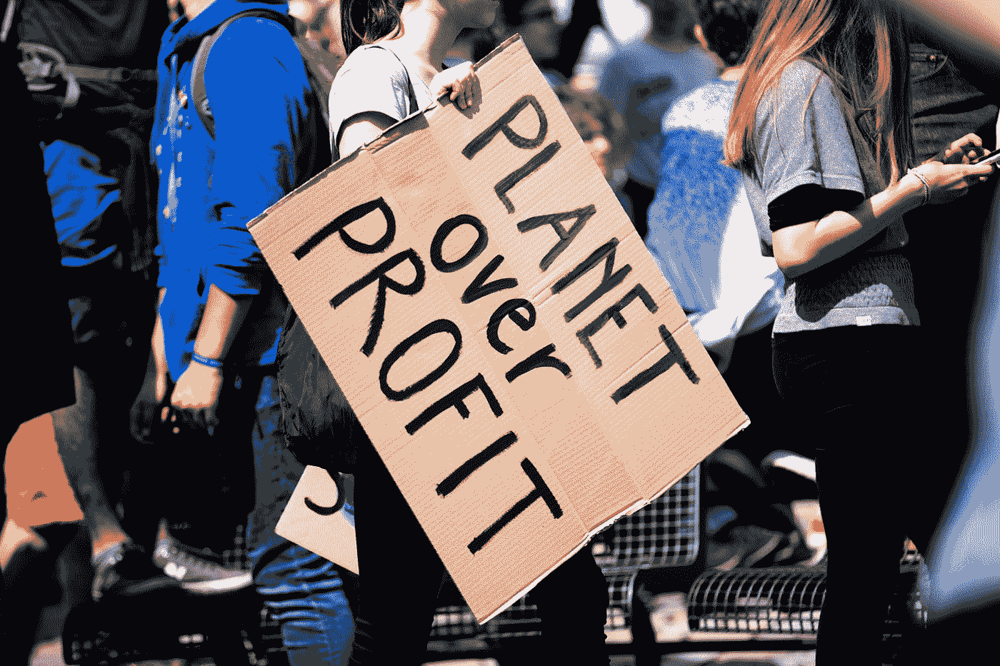
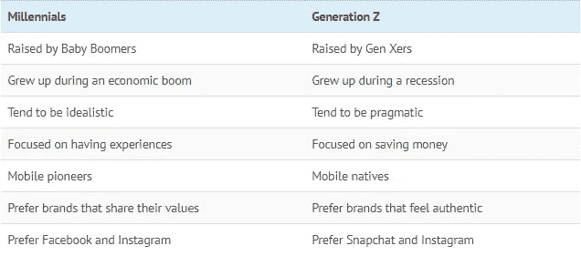

# Z 世代:百年来最不具破坏性的一代？

> 原文：<https://medium.datadriveninvestor.com/generation-z-the-least-disruptive-generation-of-a-century-83d708652e22?source=collection_archive---------4----------------------->

## 理性进化而不是颠覆

Photo by [Callum Shaw](https://unsplash.com/@callumshaw?utm_source=medium&utm_medium=referral) on [Unsplash](https://unsplash.com/?utm_source=medium&utm_medium=referral)

几周前，我在 linked-in 上滚动浏览一份陌生来电邀请名单，其中一个脱颖而出。

我收到了杰克·比约塞斯(Jake Bjorseth)的邀请，参加 CMO 系列的[播客](https://anchor.fm/trndsttrs)，该播客旨在让人们更好地了解 z 世代

在思考这个主题时，我决定把它翻译成一篇文章，但要突出:他的[结论](https://trndsttrs.media/marketing-to-gen-z/)与我自己的发现有关。尽管这一群人非常特殊，但和他们之前的所有人一样，我确实认为他们比普通的思维方式破坏性小得多。

我出生于 1981 年，根据作者的不同，我可能是 X、Y 一代，也可能是某种形式的失落的 X 世代。鉴于我还不在乎自己的品牌，我也是直到成年才拥有手机，这让我觉得自己是一个完美的中间人。

 [## 面向 Noobs |数据驱动型投资者的数字身份

### 聪明人如何在增强现实中创造身份价值？我最近刚满 40 岁。作为一个生物…

www.datadriveninvestor.com](https://www.datadriveninvestor.com/2019/02/28/digital-identity-for-noobs/) 

我的父母出生于 1960 年，相对来说，他们属于婴儿潮一代，而我的(继子)正在步入成年，目前已经 14 岁，每天都在提醒我，关于“他的”Z 世代，并不是所有的描述都是真实的。

对我来说这是件好事。

这意味着我们能够开始理性地发展，并利用技术和我们的超级连通性来创造真正的价值，将它作为达到目的的手段，而不是其本身的目标。

## 标记世代

看到我们开始在心理上用年龄而不是出生年份来给几代人贴标签，我总是很惊讶。当把他们看作一群人时，重要的是从一开始就考虑他们，并在整个生命阶段跟随他们，而不是不断重复最新一代，就像不断变化的 20 岁的被宠坏的孩子一样。

每当一个新的“标签”击中员工时，“不努力工作”、“错误的权利感”、“没有动力”、“不尊重”的感觉就会出现。

对我来说，这主要标志着劳动力中占主导地位的几代人的一种先入为主的观念，他们很难调整自己的世界观，以适应那些从一开始就经历了不同世界的人。

让它变得超级简单:

千禧一代不是那些刚从学校毕业并在你的团队中寻找工作的人。到 2020 年，他们的平均年龄为 30 岁，并开始成为我们劳动力的中坚力量。

当 Z 的进入时，调整的破坏性会更小，尽管我理解为什么许多人认为它是相反的，因为像 Greta Thunberg 这样的个人正在引发明显的破坏。但正如我们将看到的，这场运动已经从 Y 世代开始，它只是在这位新的年轻女英雄身上获得了一个完美的声音。

截至 2020 年，标签细分如下(来源 [kasasa](https://www.kasasa.com/articles/generations/gen-x-gen-y-gen-z) ):

*   婴儿潮一代:出生于 1944 年至 1964 年之间。他们目前年龄在 56-76 岁之间(美国有 7600 万人)
*   X 世代:出生于 1965-1979 年之间，目前年龄在 41-55 岁之间(美国有 8200 万人)
*   Y 世代/千禧一代:出生于 1980 年至 1994 年之间。他们目前年龄在 26-40 岁之间。他们目前是一个似乎在 30 岁或大约在 1990 年接受“营销”分裂的群体。(美国近 7300 万)
*   Z 世代:Z 世代是被命名的最新一代，出生于 1995 年至 2015 年之间。他们目前年龄在 5-25 岁之间(美国有近 7400 万人)

当然，一代人开始和结束的年份是一个无休止的争论，应该用+/-几年来解释。如果没有，我们让整个营销 Y.2 代专注于 Y 代的最后 4 年，他们更像 Z 代，但同样的事情也发生在每一代人身上。

> **“不记得过去的人注定要重蹈覆辙**”——**乔治·桑塔亚纳**《理性的生活》，1905 年。

这篇文章将从市场需要适应的颠覆/变化的角度，强调我对不同代人的看法，我将解释为什么我目前认为 Z 世代是更进化的一代，而不是颠覆性的一代。

## 从**婴儿潮**和他们的颠覆性特征开始。

Photo by [Omar Lopez](https://unsplash.com/@omarlopez1?utm_source=medium&utm_medium=referral) on [Unsplash](https://unsplash.com?utm_source=medium&utm_medium=referral)

婴儿潮一代，我的父母也是其中的一员，以二战后的婴儿潮命名，他们经历了一段他们的父母不知道的繁荣时期(被称为“沉默的一代”)。

鉴于我的祖父母在战争期间经历的事件以及我父母成长过程中挥之不去的冷战威胁，他们也是关注终身就业、收入保障和房地产的一代人，他们希望把孩子的舒适置于自己的舒适之上。

> 在享受了自由恋爱、免费校餐、免费大学……主要是充分就业和长达 40 年的房地产繁荣之后，他们留给子女的是天价房价、债务和缩水的养老金。
> 一个 60 岁的人……是一个非常幸运的人；由[赫顿](https://www.theguardian.com/society/2010/aug/22/baby-boomers-legacy-60-hutton)撰写的《一个既令人钦佩又令人怨恨的对象》概括了当前对婴儿潮一代的普遍看法。

我父母那一代人见证了创业的巨大机遇，尽管不是所有行业，但随着大多数行业的经济增长，他们更愿意依靠工作保障，努力实现自己的终极目标，即拥有住房、公司的激烈竞争以及获得下一代人支付的养老金。也是这一代人促进了产妇就业，使双收入家庭成为一种新的规范。

## 无名一代

Photo by [Panos Sakalakis](https://unsplash.com/@meymigrou?utm_source=medium&utm_medium=referral) on [Unsplash](https://unsplash.com?utm_source=medium&utm_medium=referral)

这个词是由查尔斯·哈姆莱特和简·德弗森创造的(最初指的是十几岁的婴儿潮一代，现在我们看到 Y.2 代又出现了)，并因道格拉斯·柯普兰 1991 年的同名小说而流行起来。

X 世代被称为 MTV 世代，经常被贴上懒鬼、愤世嫉俗、心怀不满的标签。

当我读到这个描述时，我不禁笑了，因为它看起来是如此遥远和错误，但却和大约 20 年前的普遍看法有关联。

消极的先入之见似乎是所有新的一代或后几代人的共同主题，是他们之前几代人的共同抱怨。

X 一代被视为“[挂钥匙的一代”，因为他们的父母关注的是公司的期望，以及随之而来的工作安全感。](https://en.wikipedia.org/wiki/Latchkey_kid)

X 一家已经习惯了父母从早到晚的工作，并且已经花了相当多的时间和祖父母或者托儿所在一起。因此，他们从小就学会了照顾自己，但也亲眼目睹了与父母关系紧张的增加。

X-ers 的一个显著的颠覆性特征是，他们开始重视工作与生活的平衡。他们开始建立积极的生活方式，以幸福为目标，而不是单纯的就业和安全。

这群人被认为是*开始*将创业作为一种有价值的生活方式。

从技术上来说，他们是创造了它或者见证了它的一代人。对于这一代人来说，技术本身既是一种工具，也是一种目标，这是后来几代人所改变的。

X 一代经历了 80 年代早期的计算机进化，从软驱到硬驱(高达 1.44MB 可以在 x386 上运行一系列游戏)，从 CD 到 DVD-rom，以及微软的成长。

这些人在图书馆里花几个小时在“联网”电脑上工作，在雅虎上搜索书评来完成家庭作业，而不是实际阅读。

这一代人开始通过墙壁拉着零调制解调器电缆与兄弟姐妹一起玩，演变成游戏中心的闭环网络，在那里你可以以每小时一小笔费用与一群朋友一起玩游戏。是的，这些商店闻起来就像现在 D&D 的桌游商店。

当他们想通过 ISDN 或 ADSL 连接到广阔而未知的世界时，调制解调器开始发出明显的噪音，这是最后一代人的使用率不断上升。

他们“发明”了纯粹形式的互联网，并开始通过留言板和 IIRC 看到潜力，但还没有完全能够创造它。

此外，自从手机和“永远可以联系到”以来，最后一批可能连续几天从父母身边消失的孩子是在他们度过狂野的岁月后出现的。人们很容易忘记，在 1999 年之前，不知道一个人在哪里是正常的。这是强制性的安排，以满足人们在外面，即使是愚蠢的事情，如一起骑自行车去游泳池。

这一代人中的大多数人在错误的公园或不同的入口等了几个小时，在错误的公交车站或学校外面被困了几个小时，却无法联系到任何人。

## 千禧一代

Photo by [Patricia Prudente](https://unsplash.com/@apsprudente?utm_source=medium&utm_medium=referral) on [Unsplash](https://unsplash.com?utm_source=medium&utm_medium=referral)

美国作家[威廉·史特劳斯和尼尔·豪](https://en.wikipedia.org/wiki/Millennials)将 2000 年毕业的人称为千禧一代，即最初的 Y 世代。随着当时大众对千禧年的关注，这个名字流传了下来。

2001 年，马克·普伦斯基(Marc Prensky)创造了“[数字原生代](https://en.wikipedia.org/wiki/Digital_native)”一词来形容“从 K 到大学”的学生，解释说他们“代表着伴随着这项新技术成长起来的第一代人”。

千禧一代的主要特征是追求意义、自我实现、分享以及社会和环境意识。

社会地位和对‘东西’的占有并不是他们优先考虑的。分享是他们的目标，而不是拥有。他们也在寻找无害环境的替代品，并希望在消费的同时感觉做了正确的事情。这是第一代明确宣称拥有住房不是最终目标的人。这对他们父母仍在发送的信号来说是一个很大的干扰。

他们仍然重视具有强大和优质形象的品牌，但最近在其使命宣言中嵌入非常鲜明的 CSR(企业社会责任)主题的 DTC 品牌的崛起再次强调了这样一个事实，即这一代人在散发他们的价值观时是认真的。制片人要么提供他们想要的，要么就去别处。

然而，千禧一代在权利领域受到了强烈的负面看法。

这部分是因为与他们之前的大多数人相比，人们认为成年的某些“T4”仪式会推迟更长时间。

最明显的是与父母一起生活的时间比前几代人更长。叙述最多但研究最少的是软性教育方式的影响。典型的问题是父母缺乏时间和自我补偿。

今天，所有的孩子在学校运作时都是“赢家”,教育系统已经去除了赢家/输家的概念，转而重视每个人。这种方法本身没有错，然而，当父母用一些与他们的小奇迹的内在天赋无关的外部事件来抵消每个错误或失败时，我们正在创造一群在进入当前劳动力及其预期时很容易变得不快乐的人。

当个人自身强大时，他们将不再支持公司的层级增长作为必要的发展轨迹。这让许多他们的上一代经理感到不安，因为这与他们的观点相反，但本质上，他们正在引发未来将成为明确的技能/零工就业市场。

成为总经理/高管的目标不再与成功的社交联系在一起。成为一名数字流浪者，或者实际上按照蒂姆·菲利斯和他每周 4 小时的工作时间行事，成为一种新的理想。

他们的父母已经读过这本书，可能在上面发了一堆帖子，但是他们会执行这本书…

他们通常是由婴儿潮一代或“早期 X”人士抚养长大的，并从他们的缺点中吸取了一些关键的教训。

他们不像他们的父母那样看到企业文化职业的好处，因为即使是最稳定和最大的企业也在削减终身雇佣。

他们正目睹社会安全网的成本不断上升，却没有任何真正的行动计划来维持。他们预计，他们将需要能够完全依靠自己的技能和收入来维持自己的生活方式。

他们缺乏耐心，渴望必要的改变和选择。你对互联网一代有什么期望？通过有针对性的谷歌、quora 或 youtube 搜索，你可以了解所有的信息。

能够通过社交帖子向成千上万的人提出一个话题，并有精力将其投入到一项创造性的事业中，或引发一场运动的开端。

他们是共识的建设者。毕竟，他们是在 T2 共享经济中长大的。甚至他们的视频游戏都是联合冒险，社交分享是保持他们注意力和参与任务意愿的关键因素。

他们是一代社会企业家，愿意改变世界，并致力于留下积极的影响。

## Z 世代更加进化

Photo by [Markus Spiske](https://unsplash.com/@markusspiske?utm_source=medium&utm_medium=referral) on [Unsplash](https://unsplash.com?utm_source=medium&utm_medium=referral)

“Z 世代”是 20 世纪 90 年代中期出生的一代人的当前名称，尽管 iGen，centennials，post-millennials 也可能是在一个超级互联、永远在线的世界中长大的一代人的标签。

对于出生于 21 世纪初的人来说，“新的沉默一代”正在出现，因为像他们在沉默一代的祖父母一样，他们的童年也被认为是以战争(后 9/11)和经济衰退为标志的。

今天，我想看看 Z 世代实际上可能是一种进化而不是一场革命，而不是像前几代人那样具有破坏性，并总结这一代人对某些话题的看法。

有人甚至可以说，我们确实回到了最初的世代循环。我们有热情的婴儿潮一代、怀疑的 X 一代和务实的千禧一代。现在我们看到了一个务实的 Z 世代，一个舒适的回归到婴儿潮一代之后沉默的一代。

当我们把世界经济论坛作为一个来源时，他们看到了千禧一代和 Z 一代之间的明显差异。

Image from [Weforum](https://www.weforum.org/agenda/2019/02/meet-generation-z-the-newest-member-to-the-workforce/)

当看着我的继子时，我确实看到了我在今天的职场中目睹的千禧一代模式的打破。他不太倾向于花时间在手机上进行纯粹的社交媒体娱乐。事实上，如果有什么不同的话，他这一代人似乎比总是保持联系的千禧一代更重视“休息”时间和面对面的互动。

一个著名的喜剧演员或电视明星宣传的购买运动鞋或衣服的想法在他看来是彻头彻尾的白痴。

他把大部分屏幕时间花在观看拆箱视频和钻研 DIY 工艺上，显然今天制作泥人怪物和建造高达人偶是新的“酷”。

当偶尔出现对一个小工具或工具的需求时，它会得到一群 20 多个“家伙”的无数视频的支持，这些“家伙”创建了一家完全由测试和审查材料组成的公司。

比起千禧一代所宣传的社会影响力，他更看重自己亲自挑选的 youtube 专家。

对他来说，世界也是一个巨大的地方，他的包裹在海关部门待了两周，因为它来自海外，现在又遇到了额外的费用，使他的 PS4 控制器的微小塑料扩展的初始价格增加了两倍，这仍然是一个经常抱怨的话题…

**核心的真实性:**

 [## Z 世代是关于真实性的

### 我出生于 1996 年，我要么是最后一批千禧一代，要么是 Z 世代的第一批——没有官方说法…

medium.com](https://medium.com/clyde-group/gen-z-is-all-about-authenticity-59d863b0bdcf) 

上面这篇文章是由处于时代边缘的人写的，强调了我们在 y 世代已经看到的很多话题。

赋予环境、连通性、慈善事业的价值，对世界产生积极的影响，这些都是两者之间的共同话题。一个真正与众不同的特征确实是[的真实性](https://www.cnbc.com/2018/04/09/generation-z-what-they-want-from-brands-and-businesses.html)。

在我看来，这更反映了他们重视自己的批判性思维。

光是广播信息是不够的，我的孩子会深入研究，以确保他的消费或行动也有助于产生预期的积极影响。

他会看穿我“久经考验”的营销策略，不会相信任何有太大好莱坞或明星号召力的东西。

在的结论中，基于迄今为止我所看到的，我会总结说，他这一代人将推动一场理性化的进化，而不是为了进化而破坏世界。

他不会考虑像他之前的千禧一代那样，在没有观众或一些财务稳定的情况下跳完全的数字游牧。

他会“挤上几代人的牛奶”,并在需要赚钱的时候说他们的语言，但他不会效仿，相反，他会专注于建立一个更好的替代方案。

最后，Z 世代可能是最实际的一代，重视减少或避免债务。

他在寻求反思和理性化的过程中，的确让我想起了我的祖父母。

要是他能记住时间就好了。出于某种原因，他和他的朋友似乎在记住最明显的协议方面有很多问题(对于当前的 covid 预教，我们打印了他的时间表并放在他面前)。然而，不知何故，大多数 Z 世代似乎能够相当频繁地错过谷歌会议，即使只提前一个小时提醒…

我不知道这是否只是一个统计上的差异，是由于分娩压力造成的故障，还是这将成为我们在未来几年都会经历和抱怨的独特的 Z 世代待遇。