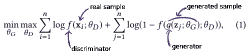
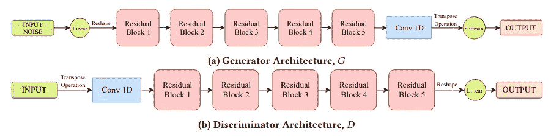
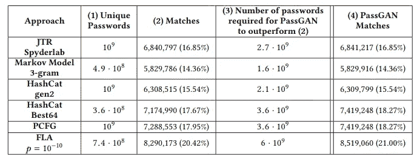
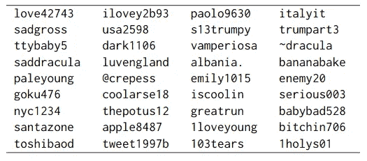

# 生成敌对网络可以破解你的密码！

> 原文：<https://medium.datadriveninvestor.com/generative-adversarial-networks-can-crack-your-password-e4865fd9643a?source=collection_archive---------3----------------------->

Photo by [**Boris Sopko**](https://www.pexels.com/@boris-sopko-1218572?utm_content=attributionCopyText&utm_medium=referral&utm_source=pexels) from [**Pexels**](https://www.pexels.com/photo/wooden-door-with-doorlock-2351800/?utm_content=attributionCopyText&utm_medium=referral&utm_source=pexels)

PassGAN 可以生成真正的密码，也许还能猜出你的密码！它展示了生成对抗网络(GAN)的一个原始应用。

# 什么是生成性对抗网络？

在过去几年的人工智能研究中，生成对抗网络是被频繁使用的三个词。它指的是在*对抗框架中训练出来的神经网络。*神经网络是一个具有许多参数的函数，这些参数可以通过评估网络从预期输出或基本事实中产生的误差来优化。然而，自动生成并没有“基础事实”输出来与网络输出相比较，而是样本的基础事实分布被认为是真实的。

 [## 编码器解码器序列:多长是太长？数据驱动的投资者

### 在机器学习中，很多时候我们处理的输入是序列，输出也是序列。我们称这样的一个…

www.datadriveninvestor.com](https://www.datadriveninvestor.com/2020/03/24/encoder-decoder-sequences-how-long-is-too-long/) 

在训练网络时，两个网络在一场*的 minmax 游戏*中相互竞争。发生器网络产生被鉴别器网络评定为假或真的样本。鉴别器被给予来自数据集的真实样本以及由生成器生成的虚假样本。它被训练来辨别真假样品。然而，生成器在生成令人信服的真实样本方面变得越来越好，因此鉴别器的任务变得越来越难，以至于它无法区分生成的样本和真实样本。

Loss function used in GAN training. Generator and discriminator are duelling each other in minimizing/maximizing the same function

生成模型在图像编辑、文本到图像的生成、音乐生成、数据扩充、…

PassGAN 使用 GAN 的改进版本，克服了将 GAN 应用于文本生成的主要困难:改进的 Wasserstein GAN(或 IWGAN)。IWGAN 特别使用 Wasserstein 距离(也称为地球移动距离)来计算网络的误差，这更适合于评估两个文本之间的距离。

PassGAN 的架构遵循通常的卷积网络架构，具有级联的残差块，确保梯度传播到网络的深层。我们还可以注意到 1D 卷积在处理文本数据中的广泛应用。

Architecture of PassGAN

# 训练生成类似人类的密码

PassGAN 是一个密码生成器，用于生成真实的密码。我说的现实是指当我们在任何网站上创建账户时，你和我实际上可以想到的密码。它可以是一个社交网络账户，也可以是一个网上银行账户。

密码破解是一项非常复杂的任务，需要测试许多不同的密码组合。然而，有些组合比其他组合更有可能。例如，你可以使用一个对你有意义的密码，比如 bluesky1991，1991 是你的生日，而不是像 9y2[V1>e_yfYE，r5q:e'w！简历。这是试图破解密码的密码分析技术的假设。他们首先尝试最可能的密码。

已经有很多密码恢复工具，如 HashCat(【https://hashcat.net/hashcat/】)、air crack-ng([【https://www.aircrack-ng.org/】](https://www.aircrack-ng.org/))，它们实现了最先进的密码破解策略，如 *mask attack* 。但是这些策略依赖于强假设，比如固定的密码长度。相反，PassGAN 方法几乎可以生成任意长度的密码。

# PassGAN 猜你的密码有多准？

研究人员使用 RockYou 数据集来训练 PassGAN，将数据集分为训练集和测试集。他们还对泄露的 LinkedIn 密码数据集进行了评估。使用 PassGAN，他们生成了许多密码，并从测试集中查看有多少与真实密码相匹配。 **34.2%的真实 LinkedIn 密码与生成的密码相匹配**。当然，PassGAN 需要生成数十亿个密码才能达到这个分数，但是所需生成的密码数量相对较少，与测试所有可能性的攻击相比，大大减少了所需的尝试次数。

Comparison table of results for PassGAN and other techniques.

由于 PassGAN 使用的 Wasserstein GAN ( [查看这篇漂亮的博客文章](https://lilianweng.github.io/lil-log/2017/08/20/from-GAN-to-WGAN.html))的表达能力，有趣的是，即使生成的密码与数据集中的任何密码都不匹配，但看起来仍然像是有效的候选密码。

PassGAN generation samples that did not match any password in the test set.

研究人员指出，PassGAN 的一个缺点是，与其他方法相比，它需要很多代才能获得类似数量的匹配，这是其他策略的两倍，而其他策略需要大约 10 亿代。

PassGAN 还可以与其他策略结合使用。它可以很好地猜出其他策略猜不到的密码，整体匹配率跃升至 73%。

帕斯根的主要力量在于它的表现力。事实上，它可以生成任何密码，无论其大小。因此，如果事先知道要破解的密码，这种方法可能会非常强大。顺便提一下，这是研究人员未来工作的一个命题，即使用条件反射，一种流行的技术来提升数据生成模型。

# 您的密码有危险

随着密码破解的进步，可以说我们选择密码的方式也应该进步。

记住一个复杂的密码比记住许多密码更容易，拥有许多简单或相似的密码会使您容易受到密码破解攻击。因此，解决方案是为加密的密码数据库设置一个全局密码。加密可以使你的密码数据库几乎不可能被破解，或者对电子计算机来说，这至少需要好几辈子才能破解。这类工具的一个例子是 pass([https://www.passwordstore.org/](https://www.passwordstore.org/))，这是一个简单的命令行工具，使用 GPG 加密来安全地存储您的密码。

网站本身也实现了新的认证方式，比如双因素认证，或者使用指纹等。

# 参考

链接到帕斯根论文:【https://arxiv.org/abs/1709.00440】T2
我网站上的文章