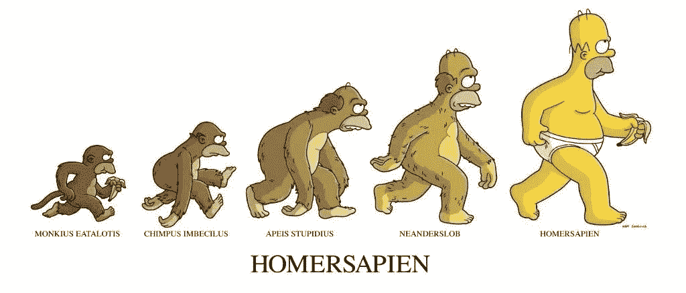
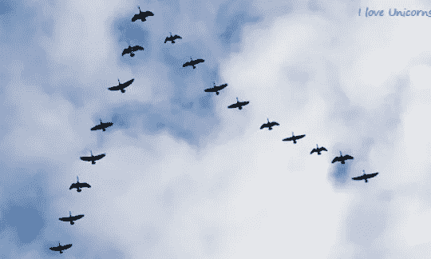
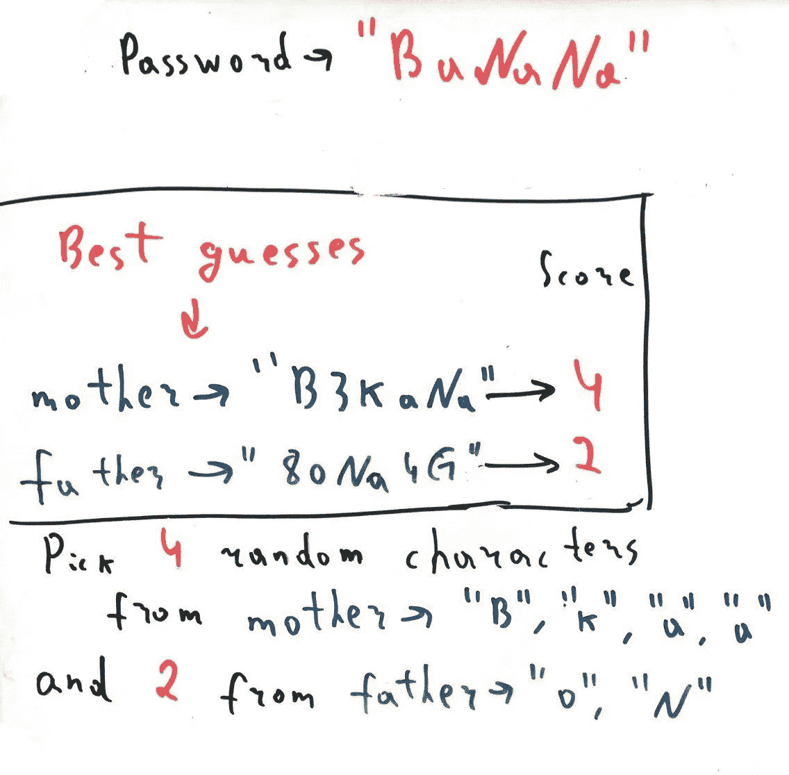
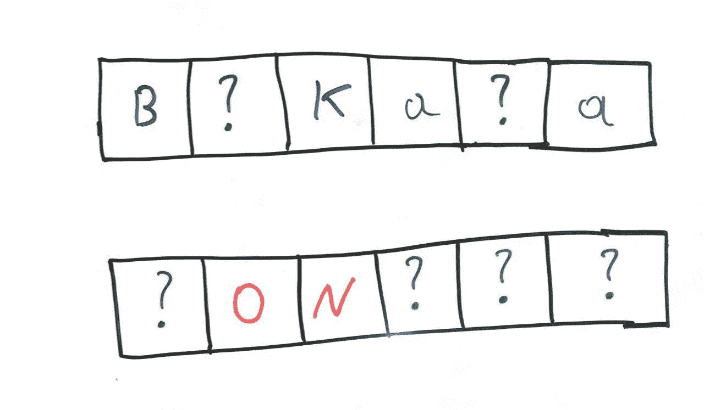

# 自然选择和 python 使遗传算法变得直观

> 原文：<https://medium.datadriveninvestor.com/genetic-algorithm-made-intuitive-with-natural-selection-and-python-project-from-scratch-3462f7793a3f?source=collection_archive---------3----------------------->

Image source — [https://www.pinterest.com/pin/295126581801065984/?lp=true](https://www.pinterest.com/pin/295126581801065984/?lp=true)

# 期待什么

我的目标是帮助你在进化的*背景下*对遗传算法有一个**直观的**理解。我们将看一看以 **V** 形状飞行的鸟，然后用我们对进化的理解写一段代码来寻找某人的密码。

# 快速介绍

遗传算法来自于**强化学习**家族，是人工智能的一个子集。

遗传算法是 ***英雄*** ，他从树上的傻猴子变成了聪明的猴子，能够理解进化。

**【免责声明】**

[我根本不是生物学家，也不是机器学习工程师，所以请查看了解更多部分，了解比我更有经验的人。我会尽量简化，有时可能会撒点小谎，但那只是为了让它留在你的脑子里。😉]

# 鸟类示例🦆

那么我们和其他所有离开的生物是怎么进化得这么厉害的呢？没有特别的功能可以制作既不好看的独角兽也不好看的河马。因此，让我们一步一步地分析它是如何做到的。

image source — [http://butterflyeffectscounseling.com/?p=858](http://butterflyeffectscounseling.com/?p=858)

我不会解释这种结构如此华丽背后的科学原因。

## 1.开始随机

让我们想象一下，有许多鸟为了生存，每年冬天都要飞到遥远而温暖的地方。

那些鸟没有任何特别之处，它们的基因(决定它们行为的东西)几乎是随机的。

第一个冬天来了，一些鸟无法到达温暖的地方，因为它们非常具有攻击性，被其他鸟赶了出来。一些成功完成旅程的鸟是善良和合作的。(*只是一个例子特征*)

好了，现在确保你理解了上面的一切，让那些鸟儿享受一些性感的时光。

## 2.检查他们的孩子

那么下一代呢。

好斗的鸟死了，所以它们没有生育。但是在合作的地方。所以这些新的鸟将再次拥有非常随机的基因，但这次它们的父母是合作的，所以很可能孩子们也会合作。此外，他们是没有攻击性的父母= >希望孩子们不会有攻击性的倾向。

他们中的一些人不会有“合作基因”，一些人会有侵略性，不管怎样，让我们不要关注他们。

## 该死的。又是冬天

这次甚至更冷。这些可怜的鸟再次飞往温暖的地方，但这一次合作是不够的，所以让我们希望它们中的一些不只是直线飞行，而是形成某种形状，并与它们的旅伴一起制定策略。

可悲的是，好斗的鸟，向后飞的鸟(不知道为什么)，那些忍受不了寒冷的鸟都去世了。我们对最强壮的人感兴趣，那些完成旅程的人。他们仍然有一些“坏基因”，但底线是他们比他们的祖先飞得更好。

## 3.重复那些东西

那些幸存者将他们的基因传给了孩子们，孩子们也获得了一些随机基因，当艰难时期再次到来时，那些有幸获得一组良好基因的人将会有一些更好的孩子。

重复这个过程 1000 次，你就有希望得到最符合空气动力学的鸟。

如果你想生存而不是成为最强的一个，大自然大致就是这样运作的。我们都必须从大自然的书中吸取一页。

一些“人”的例子。

如果你独处了很长一段时间，你可能会开始感到痛苦，也许独处对你来说是最好的选择，但对你的老祖先来说肯定不是这样，他们不能独自对抗猛犸象。此外，你的祖先并不孤独，因为他们最终找到了伴侣，生了孩子。

爱狗？我也是。那是因为人类“创造”了它们。我们驯养了那些友好而忠诚的狼。对人友好成为生存的关键，那些不能灵活改变的人没有被选中。

## 要点

1.  我们需要很多鸟(如果我们的鸟很少，它们可能会在弄清楚任何事情之前死去)
2.  鸟类应该有一些生存的目标(在我们的例子中，能够飞得很远)
3.  坏鸟必须受到惩罚(如攻击性鸟类死亡)
4.  好鸟必须得到奖励(活下来并和它们强壮的伙伴一起繁殖)
5.  鸟类一定有办法将它们的基因传递给下一代。

# 空谈不值钱。给我看看代码[4]

这是任务。我们想得到一些秘密密码。我们知道密码只能包含小写和大写的英文字母、数字以及空格。

只要我们愿意，我们可以尝试猜测它，而不是得到密码错误的答案，我们还会得到多少字符在我们的猜测和正确的密码中匹配。

对于每个字符，有 26 + 26 + 10 + 1 = 63 种可能性。假设密码有 32 个字母长。这意味着有 63 种可能性，大约是 64 = 2 **⁵⁶**

这是一个非常巨大的数字，如果你能破解如此安全的密码，你还不如能摧毁整个互联网安全[3]

所以，如果我们尝试每一种可能的猜测，那都是行不通的，当我们检查完这些猜测的极小一部分时，我们的太阳已经爆炸了。

大自然不会尝试每一种可能的基因组合，它要聪明很多，所以让我们发挥一些自然。

**让我们像对待鸟一样对待那些密码猜测。**

所以我们需要什么来开始我们的进化过程。

1.  我们需要有一个鸟类种群(猜测)
2.  我们需要理解哪些猜测是正确的(比如能够飞到温暖地方的鸟是正确的)
3.  我们需要从这些好的猜测中产生新的一代。
4.  我们需要重复这个过程。

**免责声明**

[代码将会非常慢，而且不是最佳的，我的目标是让一切都容易理解，我正在用编译速度和写更多的行来妥协]

# 啾啾，我们开始吧

首先导入一些库并声明全局变量

**1。那么我们如何创造(产生)一些人口呢？**

我们可以从 python 字符串模块中获取密码的可能字符，并使用 random 模块选择一些随机字符。

我们的函数必须知道要生成多长时间的猜测。让我们用一个函数来做，如果你不清楚，考虑提高你的 python 技能或者给我发一封电子邮件。

**2。评估猜测**

所以现在当我们有了我们的种群，我们如何找出哪个猜测是最好的鸟。最简单的方法是计算密码中匹配的字符数，然后单独猜测

好吧，够好了。我们有一个生成种群的函数，还有一个评价个体“种群成员”有多好的函数。下一步是评估我们的全部人口。

**3。重现新的猜测**

现在，当我们知道每个猜测有多好的时候，让我们挑选两个最好的。( ***为了简单起见，我们选择 2，就像选择母亲和父亲一样，尝试这个数字可以很好地改进模型*** )

我们有两个列表，一个包含所有的猜测，一个包含相应的分数。因此，群体中第 N 个成员的分数存储在分数列表的第 N 个位置。

因此，让我们只挑选分数列表中最高值的索引，并提取存储在这些位置的那些群体成员。

I use NumPy just because I was too lazy to search for another way. Apologise me for that.

**用鸟类比喻总结**。

我们有了第一批鸟，我们评估了每只鸟的强壮程度，选出了最好的两只。现在那些最好的鸟应该有一些乐趣把基因传递给下一个种群，所以我们怎么做。

这部分很适合做实验。这次我的方法不是最简单的，所以你可能需要多一点时间来理解这一部分，但这是值得的。

**我们如何从两个最佳猜测中创建一个完整的群体**？父母是上一代最强的鸟，所以我们应该混合他们的基因，以便改善下一代种群。

为了简单起见，我们不会同时混合父亲和母亲的基因，这本来是一件好事。相反，我们将从母亲的基因创造一半的人口，从父亲创造一半的人口(同样，非常有争议，你可以尝试其他方法**)。**)。

explanation of what is going on in image below

对于每一个父母，我们将提取他们的一些基因，并用一些随机字符填充剩余的字母。我们可以从每个父母那里挑选等量的基因，但是正如你在例子中看到的，母亲的分数是 4，父亲的分数是 2，这意味着母亲有两倍多的“正确基因”，所以从她那里挑选更多的基因是更明智的，而不是以同样的方式对待两种猜测。

最终，我们决定选择尽可能多的字符。如你所见，我们从母亲那里随机挑选了 4 个角色，从父亲那里挑选了 2 个角色(*随机挑选只是我的方法，你可以只挑选第一个和最后一个，只挑选前半部分，等等，有很多选择*)。

我们的问题来补这个**？**标志，带有随机字符。让我们编码这些东西。

现在我们要做的就是调用这个函数，一半的人口以母亲为自变量，另一半人口以父亲为自变量。我们可以通过循环遍历前半部分，然后是后半部分来划分人群，但我会按指数来划分。一组是偶数指数，一组是奇数指数。那不重要。

这里我只是指全局变量。如果您想使用这个代码片段，不要忘记添加 population_size 和 target 作为参数。

所有的轮子都准备好了，你可以使用这些片段来构建你更好的算法

这里是**的完整代码**，请看下面的输出。

我打印生成编号、最佳 2 次猜测和最佳猜测的分数。

1.  hVcNpn ndpVorB 得分:2
2.  WdtcorD nBcIyn 得分:3
3.  lntcorA UHgcora 评分:4 分
4.  UGicorW Uuvcorn 评分:5 分
5.  UWicorn Unhcorn 评分:6
6.  独角兽企业

**花了 6 代才完成**

酷！有 4，902，227，890 个 625(65⁷)的可能性，我们仅通过查看 6000 个(6 代* 1000 个人口成员)就破解了该密码。

我们可以为自己感到骄傲，我们都应该得到一些饼干。🍪🍪🍪🍪🍪

# 下一步做什么

1.  试验人口规模。
2.  试着从每一代中选择 2 个以上的父母(或者更少，由你决定)
3.  让代码更好，也许用 NumPy 库
4.  最重要的是——改变基因传递的机制
5.  也许添加突变——有时随机改变一些基因(实际上我们在填充时已经使用了突变？带有随机字符的)
6.  改变选择父母的方式(不要总是选择最高分，大多数时候选择化学，比如如果分数是 2，10，选择分数为 10 的成员的可能性是分数为 2 的成员的 5 倍。)
7.  给你的想象力自由，这里有太多需要改进和即兴创作的地方。

# 结尾部分

谢谢大家！这是我第一次尝试解释一些东西，所以请分享你的反馈，这对我很重要。告诉我我做错了什么，我应该简化更多的，我不应该。如果你有任何问题，我很乐意帮忙。当然，请查看参考资料和更多学习内容。

祝你旅途好运。

愿原力与你同在

**联系信息**

电子邮件—hayk_tarkhanyan@outlook.com

领英—【https://www.linkedin.com/in/hayktarkhanyan/ 

# 了解更多。

**进化相关**

*   进化是如何工作的—[https://www.youtube.com/watch?v=hOfRN0KihOU](https://www.youtube.com/watch?v=hOfRN0KihOU)
*   模拟自然选择—[https://www.youtube.com/watch?v=0ZGbIKd0XrM](https://www.youtube.com/watch?v=0ZGbIKd0XrM)
*   人类进化的例子—[https://www . business insider . com/recent-human-evolution-traits-2016-8 # 5-missing-wisdom-tooth-5](https://www.businessinsider.com/recent-human-evolution-traits-2016-8#5-missing-wisdom-teeth-5)
*   基因工程及更多—[https://www.youtube.com/watch?v=n__42UNIhvU&t = 8s](https://www.youtube.com/watch?v=n__42UNIhvU&t=8s)

**编程相关**

*   P5 . js—[https://www.youtube.com/playlist?遗传算法播放列表 list = PLRqwX-V7 uu 6 bjm 3 vgzjnv 5 yxv xuwzalhv](https://www.youtube.com/playlist?list=PLRqwX-V7Uu6bJM3VgzjNV5YxVxUwzALHV)
*   遗传算法简介—[https://towards data science . com/introduction-to-Genetic-algorithms-including-example-code-e 396 e 98d 8 BF 3](https://towardsdatascience.com/introduction-to-genetic-algorithms-including-example-code-e396e98d8bf3)
*   遗传算法之后，你可以继续进行神经进化(NEAT)-[https://www.youtube.com/playlist?list = PLRqwX-V7 uu 6 yd 3975 ywxrr 0x 40 xgj _ KGO](https://www.youtube.com/playlist?list=PLRqwX-V7Uu6Yd3975YwxrR0x40XGJ_KGO)
*   用蟒蛇进化出 flappy bird—[https://www.youtube.com/watch?v=MMxFDaIOHsE](https://www.youtube.com/watch?v=MMxFDaIOHsE)

# 参考

1.  为什么鸟要以 V 字队形飞行，视频讲解—[https://www.youtube.com/watch?v=EcX56-E842Q](https://www.youtube.com/watch?v=EcX56-E842Q)
2.  为什么鸟会以 V 字队形飞行文章—[https://www . national geographic . com/science/phenomenon/2014/01/15/birds-that-fly-in-a-V-formation-use-an-amazing-trick/](https://www.nationalgeographic.com/science/phenomena/2014/01/15/birds-that-fly-in-a-v-formation-use-an-amazing-trick/)
3.  https://www.youtube.com/watch?v=S9JGmA5_unY 的⁵⁶有多大
4.  引用莱纳斯·托沃兹的话——【https://en.wikipedia.org/wiki/Linus_Torvalds 