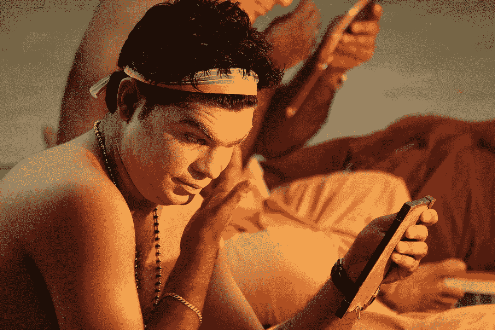

# 天才企业家有他们超能力的智力来源？

> 原文：<https://medium.datadriveninvestor.com/genius-entrepreneurs-had-their-super-power-sources-of-intelligence-7e2be1a43e8d?source=collection_archive---------17----------------------->

## 看起来确实如此，所以让这些资源为你服务吧…

Image by [Oberholster Venita](https://pixabay.com/users/ArtsyBee-462611/?utm_source=link-attribution&utm_medium=referral&utm_campaign=image&utm_content=1666662) from [Pixabay](https://pixabay.com/?utm_source=link-attribution&utm_medium=referral&utm_campaign=image&utm_content=1666662)

所有成功的企业家——想想这个世界的谢尔盖·布林和杰克·马斯，他们来自失落的大陆亚特兰蒂斯？或者，我在这个愉快、平静、几乎寂静的早晨，完全疯了——失去了理智？

我想说的是，我们这个时代的成功企业家有理由利用宇宙的某种神秘力量。最重要的是，这里有一个前提:利用那种普遍的神秘力量，你也会成为一名成功的企业家。

***全是华而不实——胡扯？***

> “谢尔盖·布林是谷歌的联合创始人，也是一名瑜伽爱好者，他非常喜欢杂技瑜伽。他把生活中精神和身体的稳定归功于瑜伽。——[https://yogamoha.com](https://yogamoha.com/yoga-asana-butterfly-pose-badhakonasana/)

[*如果你想列出一份瑜伽爱好者首席执行官的名单*](https://yogamoha.com/successful-people-who-do-yoga-every-day/) *，你可以加上 LinkedIn 的杰夫·韦纳、塔塔的拉腾·塔塔，以及《赫芬顿邮报》创始人兼《奋斗全球》首席执行官阿里安·赫芬顿。*

据说练习瑜伽有助于人们挖掘隐藏的智慧，但与其进一步阐述瑜伽的神秘力量，不如让我们推断一下我开头的想法——成功的企业家是不是从某个其他地方，一个隐藏的水库，一个未知的地方，也就是我们可以特意称为“失落的亚特兰蒂斯大陆”的地方，获得了他们的核心智慧

Image by [Ambady Sasi](https://pixabay.com/users/ambadysasi-7055506/?utm_source=link-attribution&utm_medium=referral&utm_campaign=image&utm_content=3327510) from [Pixabay](https://pixabay.com/?utm_source=link-attribution&utm_medium=referral&utm_campaign=image&utm_content=3327510)

# 无论商业奇才们在挖掘哪个隐藏的水库，你也应该去挖掘它…

我是在阅读了吉娜·切米娜拉的《许多大厦》一书后，产生了科技奇才从一个长期失落和被遗忘的大陆的废墟中出现的想法，作者在书中写道，今天的许多科技奇才在他们生活和死亡于失落的亚特兰蒂斯大陆数千年后，选择了重生。你不必相信这些。这可能仅仅是你对天才企业家这个概念的一个有用的比喻，这个概念在这个时代突然出现在我们中间。话虽如此，这里有一些东西需要考虑:

> 你我不相信前世，不相信外星人，不相信失落的亚特兰蒂斯大陆，甚至不相信涅槃，不代表它们不存在。

Rizwan Virk 的另一本伟大的书讨论了这些话题。

但是，让你相信重生、亚特兰蒂斯、外星人甚至涅槃都不是我的主意。这个想法是要考虑这样一个事实，即大多数成功的企业家，尤其是颠覆性模式的企业家，比如谢尔盖布林(Sergei Brins)，甚至理查德布兰森(Richard Bransons)和史蒂夫乔布斯(Steve Jobses)，他们的经营水平并不像我们通常认为的那样是他们天才的源泉。如果你愿意，他们进入一个精神共鸣的水库，这可以被称为*“普遍隐藏的智慧”*就像瑜伽传统一样。

 [## 数据驱动始于数据素养|数据驱动的投资者

### 光是听到“数据”这个词就令人生畏。老实说，只有 21%的全球员工对自己的工作充满信心

www.datadriveninvestor.com](https://www.datadriveninvestor.com/2020/03/22/data-driven-starts-with-data-literacy/) 

***我想说如果他们进军超级大国，你也应该*** 。这就是这个想法的全部内容。你可以拿走你想要的瑜伽，重生和亚特兰蒂斯。我的想法的核心是，他们的愿景来自一个完全独立的地方，不幸的是，大多数螺母和螺栓企业家似乎已经锁定在封闭的头脑中。

# 如果最有远见的企业家来自世界各地，那么他们的工作不就是思想的交汇吗？

根据阿德里安·埃尔南德斯的说法:

> *“40%的美国大公司(如谷歌、英特尔、辉瑞、宝洁、易趣……)都是由移民或他们的子女创建的。”*
> 
> *“目前美国 51%的‘独角兽’(10 亿美元以上的初创公司)是由移民创立的。其中，移民占据了超过 70%的关键管理或产品开发职位。”*

如果顶级的有远见的企业家来自世界各地，那么在创业游戏中，地点真的不重要。大脑和视觉来自这个星球上每个人类天赋繁盛的偏远地区。我认为这是一个指针，表明了这样一个事实，即来自不同地方的远见正在汇集，指向一个非凡的时间通道，在这个通道中，具有非凡远见和技能的人们相遇了。如果你相信重生，你可能会说他们以前住在亚特兰蒂斯时都见过，但你不必去那里。这是创造性创业历史连续体中令人兴奋的时刻，远见者来自世界各地，这可能是因为智能不是基于位置的，商业智能不是来自研究生院。它来自这些化身挖掘的超级智慧宝库。

Image by [pasja1000](https://pixabay.com/users/pasja1000-6355831/?utm_source=link-attribution&utm_medium=referral&utm_campaign=image&utm_content=3314440) from [Pixabay](https://pixabay.com/?utm_source=link-attribution&utm_medium=referral&utm_campaign=image&utm_content=3314440)

# 传统的学习资源对天才企业家来说几乎是一种诅咒

一些世界上最富有和最有影响力的企业家从大学辍学。

史蒂夫·乔布斯、比尔·盖茨和马克·扎克伯格都在拿到文凭之前离开了大学。彼得·泰尔甚至通过资助奖学金来鼓励有才华的学生退学，如果他们退学，奖学金获得者将获得 10 万美元的奖励。

如果企业家急于从大学辍学，致力于他们的变革愿景，显然他们并不热衷于利用现有的知识来源。这又一次表明了这些人隐藏着智慧。我会说，如果这些储备“不属于这个世界”(即:大学，或任何重视学习的地方……)，它们一定来自其他地方，即:一个未知的智力储备。

> 美国计算机科学家艾伦·库尔蒂斯·凯很好地总结了企业家的有效推理，他说:“预测未来的最好方法就是创造未来。”

天才企业家通常没有耐心，他们似乎避开了世俗的方式。当然，将这些特质浪漫化是很容易的，但我在本文的前面部分所做的，至少是提出一个想法，即他们在使用推理和想象力的方式上可能不是传统的。这是一个需要更深入研究的课题，但现在，至少我希望你能去掉这个想法，并在此基础上继续发展。

【https://www.datadriveninvestor.com】原载于 2020 年 4 月 8 日**。**