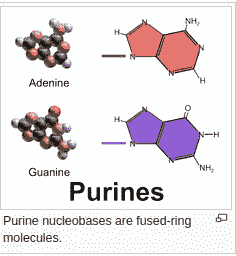
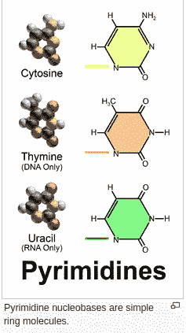
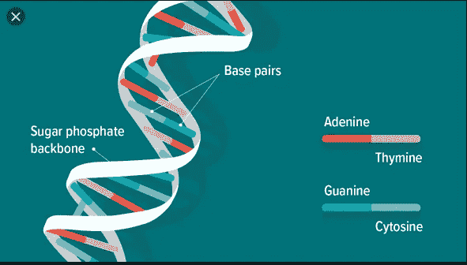
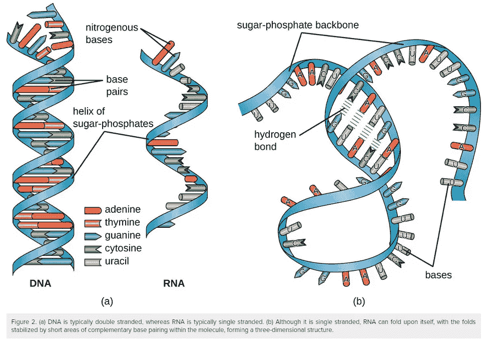
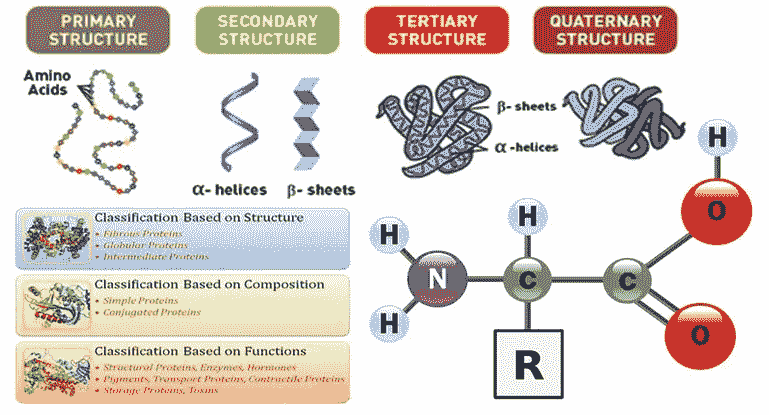
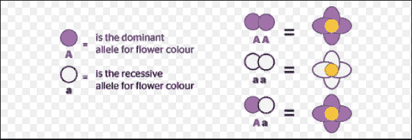
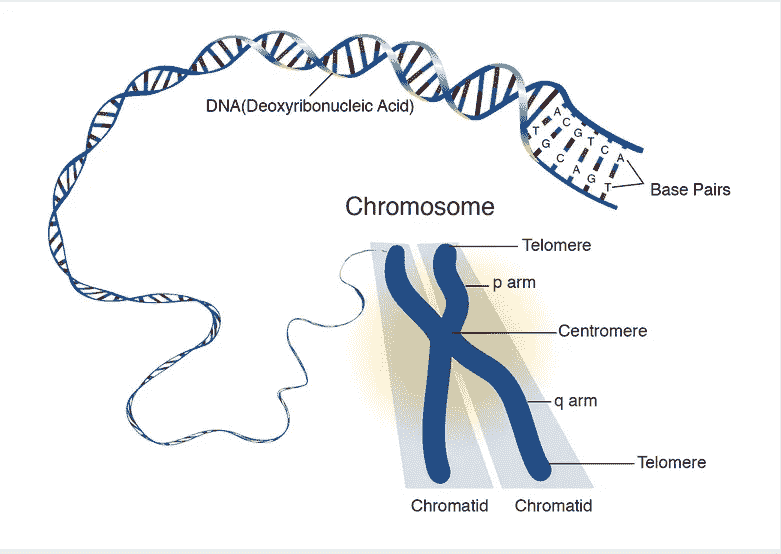
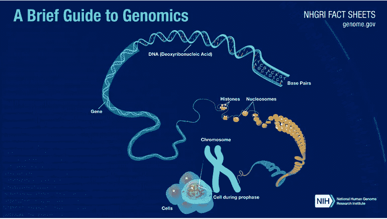

# 基因组数据分析的基因组术语

> 原文：<https://medium.datadriveninvestor.com/genomic-terms-for-genome-data-analysis-75577ad5c1fe?source=collection_archive---------12----------------------->

## 生物信息学

## 进入基因组数据分析很难，因为它需要关于基因组的领域知识和数据技能。在本帖中，我们将回顾一些与基因组学相关的常用术语。

Photo by [Halacious](https://unsplash.com/@halacious?utm_source=unsplash&utm_medium=referral&utm_content=creditCopyText) on [Unsplash](https://unsplash.com/s/photos/dna?utm_source=unsplash&utm_medium=referral&utm_content=creditCopyText)

# 核苷酸

[是由](https://en.wikipedia.org/wiki/Organic_molecules)[核苷](https://en.wikipedia.org/wiki/Nucleoside)和[磷酸](https://en.wikipedia.org/wiki/Phosphate)组成的有机分子。它们充当[核酸](https://en.wikipedia.org/wiki/Nucleic_acid) [聚合物](https://en.wikipedia.org/wiki/Polymers) [脱氧核糖核酸](https://en.wikipedia.org/wiki/Deoxyribonucleic_acid) (DNA)和[核糖核酸](https://en.wikipedia.org/wiki/Ribonucleic_acid) (RNA)的[单体](https://en.wikipedia.org/wiki/Monomer)，这两者都是地球上所有[生命形式](https://en.wikipedia.org/wiki/RNA_world#Prebiotic_RNA_synthesis)中必不可少的[生物分子](https://en.wikipedia.org/wiki/Biomolecules)。

有 5 种类型的核碱基:腺嘌呤、胸腺嘧啶、胞嘧啶、鸟嘌呤、尿嘧啶。DNA 和 RNA 由四种组成，唯一不同的是胸腺嘧啶存在于 DNA 中，而尿嘧啶存在于 RNA 中。

[Wiki](https://en.wikipedia.org/wiki/Nucleobase)

遗传密码是我们用来描述 DNA 的四个碱基(A、C、G 和 Ts)以某种方式串连在一起的术语，这种方式使得细胞机器核糖体可以读取它们并将其转化为蛋白质。在遗传密码中，一行中的每三个核苷酸算作一个三联体，编码一个氨基酸。**所以每三个序列编码一个氨基酸(密码子)**。蛋白质有时由数百个氨基酸组成，因此构成一个蛋白质的代码可能包含数百个，有时甚至数千个三联体。

# 脱氧核糖核酸

是所有生物中携带遗传指令的分子的化学名称。DNA 分子由两条相互缠绕的链组成，形成双螺旋结构。每条链都有一个由糖(脱氧核糖)和磷酸基团交替组成的主链。附着在每个糖上的是四种碱基中的一种——腺嘌呤(A)、胞嘧啶、鸟嘌呤(G)和胸腺嘧啶(T)。两条链通过碱基间的键结合在一起；腺嘌呤与胸腺嘧啶结合，胞嘧啶与鸟嘌呤结合。沿着主链的碱基序列是装配蛋白质和 RNA 分子的指令。

DNA 碱基相互配对，A 与 T 配对，C 与 G 配对，形成称为碱基对的单位。

DNA

# 核糖核酸

核糖核酸是一种聚合分子，在基因的编码、解码、调节和表达的各种生物学作用中是必需的。RNA 和 DNA 都是核酸。与脂类、蛋白质和碳水化合物一起，核酸构成了所有已知生命形式所必需的四大大分子之一。

RNA

# 基恩

是遗传的基本物理和功能单位。基因由 DNA 组成。一些基因充当 T2 指令 T3 来制造称为蛋白质的分子。然而，许多基因[并不编码蛋白质](https://ghr.nlm.nih.gov/primer/basics/noncodingdna)。在人类中，基因的大小从几百个 DNA 碱基到超过 200 万个碱基不等。人类基因组计划估计人类有 20，000 到 25，000 个基因。

 [## 替代数据分析-遥感度量金属信号|数据驱动的投资者

### 替代数据现在被誉为新的石油。这些数据集提供了独特而及时的市场和…

www.datadriveninvestor.com](https://www.datadriveninvestor.com/2019/09/19/rs-metrics-metalsignals-data-analysis/) 

每个人都有两个基因副本，分别从父母那里继承。大多数基因在所有人中是相同的，但是少数基因(不到总数的 1%)在人与人之间略有不同。等位基因是相同基因的形式，它们的 DNA 碱基序列有微小的差异。这些微小的差异造就了每个人独特的身体特征。

Gene

# 蛋白质

是存在于所有活细胞中的一类重要分子。蛋白质由一个或多个氨基酸长链组成，其序列对应于编码它的基因的 DNA 序列。蛋白质在细胞中扮演各种角色，包括结构(细胞骨架)、机械(肌肉)、生物化学(酶)和细胞信号(激素)。蛋白质也是饮食中必不可少的一部分。

Protein

# 等位基因

是给定基因的变体形式，意味着它是染色体上同一位置的两个或多个已知突变版本中的一个。它也可以指编码蛋白质的数百个碱基对或更多基因组区域的不同序列变异

Allele

# 染色体

是一种 DNA 分子，具有生物体的部分或全部遗传物质。大多数真核细胞染色体包括包装蛋白，在伴侣蛋白的帮助下，包装蛋白结合并浓缩 DNA 分子，以防止其变成无法控制的缠结。

染色体是细胞中容纳 DNA 的结构。染色体在结构上非常复杂，包含复制和分离等过程所必需的元素。每个物种在数量和组织方面都有一套特有的染色体。例如，人类有 23 对染色体——22 对编号的染色体，称为常染色体，从 1 到 22，以及一对性染色体，X 和 y。每个父母都将每对染色体中的一条染色体贡献给后代。

Chromosome

# 核糖体

是大分子机器，存在于所有活细胞中，执行生物蛋白质合成。核糖体按照信使 RNA 分子密码子指定的顺序将氨基酸连接在一起，形成多肽链。

Ribosome

# 基因组

在分子生物学和遗传学领域，基因组是生物体的遗传物质。它由 DNA 组成。基因组包括基因和非编码 DNA，以及线粒体 DNA 和叶绿体 DNA。对基因组的研究被称为基因组学。

Genome

# 参考

 [## 核苷酸

### 核苷酸是由核苷和磷酸组成的有机分子。它们作为…的单体单位

en.wikipedia.org](https://en.wikipedia.org/wiki/Nucleotide)  [## 核碱基

### 核碱基，也称为含氮碱基或通常简称为碱基，是含氮的生物化合物，它们…

en.wikipedia.org](https://en.wikipedia.org/wiki/Nucleobase) 

**进入专家视角—** [**订阅 DDI 英特尔**](https://datadriveninvestor.com/ddi-intel)