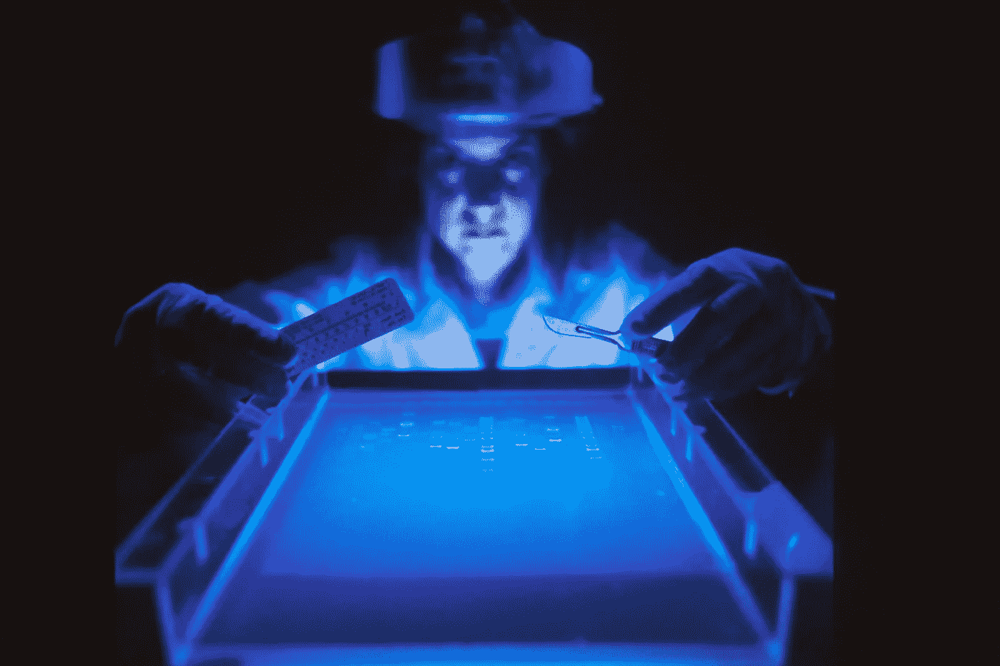
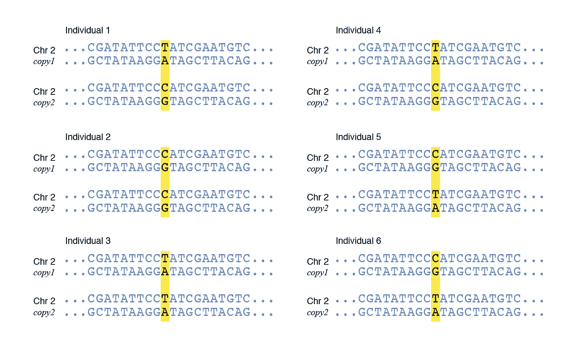
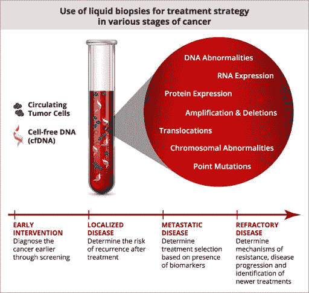
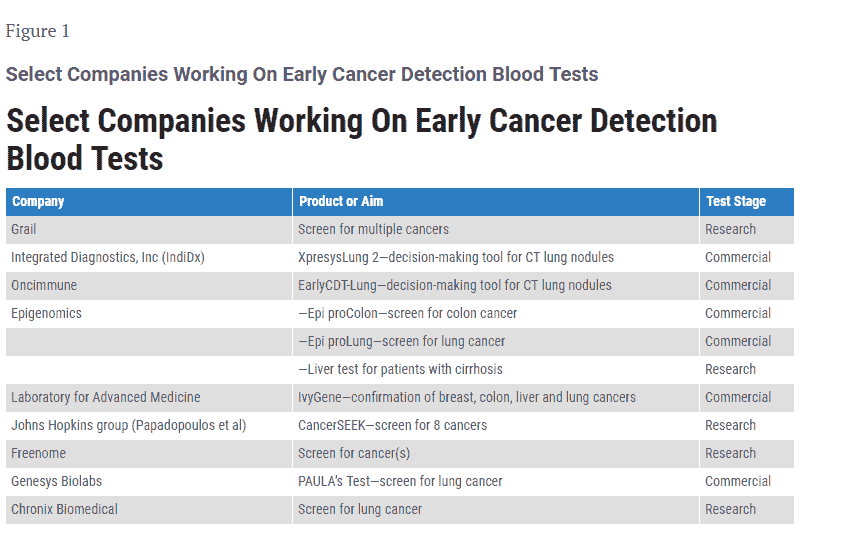

# 基因组测试——了解为什么 Ark Investments 在 Invitae 有职位

> 原文：<https://medium.datadriveninvestor.com/genomic-testing-learn-why-ark-investments-has-positions-in-invitae-69acf81cc92f?source=collection_archive---------2----------------------->

我看了一段彭博的视频，主角是方舟公司的首席执行官凯西·伍德，他告诉观众基因组学将胜过特斯拉。方舟投资是一只创新型 ETF。它是由前 Alliance Bernstein 投资主管凯西伍德(Cathie Wood's)在 2014 年创立的。他们一直在推动“基因组学是下一个 FAANG ”,并特别看好一家名为 Invitae 的公司，该公司从事基因测试。

基因检测只是基因医学生态系统的一部分。当人们想到基因检测时，他们会想到 23andMe 和 Ancestry.com。然而，基因测试有比确定一个人的血统或一只狗的品种更广泛的能力。

Photo by [National Cancer Institute](https://unsplash.com/@nci?utm_source=unsplash&utm_medium=referral&utm_content=creditCopyText) on [Unsplash](https://unsplash.com/s/photos/genetics?utm_source=unsplash&utm_medium=referral&utm_content=creditCopyText)

# **什么是基因组测试？**

基因组测试是提取患者的 DNA，测序(或读取)DNA 代码，并分析/解释这些结果。基因组测试公司使用一种称为下一代测序和 DNA 芯片(DNA 微阵列的昵称)的技术，该技术处理人类 DNA 样本并返回包含 DNA 序列的数据。下一代测序可以对患者的整个 DNA 图谱进行测序(称为全基因组测序)。另一方面，DNA 芯片被用来寻找可能导致疾病和其他属性的生物标记(或 DNA 核苷酸)的子集。

Example of SNP [https://www.genome.gov/genetics-glossary/Single-Nucleotide-Polymorphisms](https://www.genome.gov/genetics-glossary/Single-Nucleotide-Polymorphisms)

# 测序的 DNA 数据有许多使用案例:

1.  **遗传特征-** 最大的用例是识别遗传特征。具体来说，我们正在寻找 SNP 或单核苷酸多态性。这些是某人从出生时继承的 DNA 序列中一个核苷酸的差异，这可能导致一个人的身体特征或疾病易感性的差异。例子包括确定血统，寻找卷发的隐性特征，确定你是否能品尝香菜，以及你的孩子是否有色盲。遗传性单核苷酸多态性也会导致衰弱性疾病，如唐氏综合征和囊性纤维化。
2.  **癌症筛查。癌症源于你遗传密码的突变。这些突变导致细胞行为不同，生长非常迅速，并最终导致死亡。这些突变可能发生在患者的一生中，基因筛查可用于筛查特定类型的癌症。**
3.  **个性化医疗**——未来的医疗是个性化医疗，某些药物被用于治疗不同个体的同一种疾病。例如:人 A 服用了与人 B 不同的糖尿病药物，因为这种药物对人 A 更有效。基因检测，或称为基因图谱，[将是根据 DNA 生物标记或序列差异确定](https://www.genome.gov/genetics-glossary/Personalized-Medicine)一个人对哪种药物反应更好的关键组成部分。
4.  **临床试验筛选**——由于 DNA 有助于预测一个人对特定药物的反应，它也有助于识别新药临床试验成功几率较高的患者。基因测试可以用于筛选这些患者，从而增加临床试验成功的可能性。一个例子包括[筛选硫嘌呤甲基转移酶(TPMT)](https://www.mayoclinic.org/healthy-lifestyle/consumer-health/in-depth/personalized-medicine/art-20044300) 缺陷的患者，硫嘌呤甲基转移酶可导致自身免疫性疾病，如慢性疾病。

# **Invitae 是谁？**

Invitae 是一家专注于健康相关诊断的基因检测公司。与 23andMe 和 ancestry 不同，Invitae 不做 Ancestry 面板，有专门用于医疗用途的产品。这包括儿科小组、妊娠和生育测试以及癌症筛查。这些基因面板根据患者的遗传标记，告诉他们患某种疾病的可能性，如肺癌或阿尔茨海默氏症。这有助于医生决定筛查/关注哪种类型的疾病，通过更早地发现致命或危及生命的疾病，有可能挽救生命。他们目前的许多测试由 Cigna 和 Anthem 等主要保险公司[在网络中覆盖。](https://www.invitae.com/en/in-network/)

2020 年，Invitae 通过收购一家名为 Archer DX 的公司，扩展到癌症的深度基因筛查。ArcherDX 使用液体活检来检测一组新的癌症生物标志物，如 NRTK 融合。他们目前正在[接受一项名为](https://www.prnewswire.com/news-releases/archerdx-receives-breakthrough-device-designation-to-detect-ntrk-gene-fusions-301061603.html)突破性设备命名的加速 FDA 批准程序。

# **什么是液体活检**

液体活组织检查基因测试筛查由于人一生中发生的突变和出生时遗传的突变而导致的疾病。液体活检是被提取和分析的液体样本，通常是血液。传统的基因组学测试使用唾液样本提取 DNA。然而，在液体活检中，DNA 是从血液样本中提取的。

目前，癌症是通过 CT 扫描、组织活检、pet 扫描等来诊断的...使用今天的方法，癌症通常在发展到晚期时才被发现[，并且无法治疗。基因组检测](https://www.ncbi.nlm.nih.gov/pmc/articles/PMC4996960/)[能够](https://www.healio.com/hematology-oncology/learn-genomics/introduction-to-liquid-biopsies/what-is-a-liquid-biopsy)更早地检测出癌症，比活检或 CT 扫描侵入性更小，并且有可能检测出传统方法检测不到的癌症。

[https://www.genengnews.com/news/liquid-biopsies-can-point-to-best-ovarian-cancer-treatment/](https://www.genengnews.com/news/liquid-biopsies-can-point-to-best-ovarian-cancer-treatment/)

# **与传统基因检测相比，癌症液体活检是一种不同的收入模式**

像 23andMe 或 ancestry 所做的那样，对祖先或遗传特征的基因测试通常只进行一次。然而，癌症液体活检通常要进行多次。癌症突变在人的一生中随机发生。因此，基因测试有助于在癌症发生前对其进行筛查。癌症发生后，可以通过基因测试来跟踪疾病的进展，并确定[癌症是否已经消退。](https://jamanetwork.com/journals/jamaoncology/fullarticle/2763313)

Provided By: [https://www.healio.com/hematology-oncology/learn-genomics/introduction-to-liquid-biopsies/what-is-a-liquid-biopsy](https://www.healio.com/hematology-oncology/learn-genomics/introduction-to-liquid-biopsies/what-is-a-liquid-biopsy)

从根本上说，癌症液体活检是一种经常性的收入模式，与祖先或遗传特征的基因测试相比，其价格可能更高。然而，这背后是一个很好的原因！这些测试作为一种有效的预防和筛查工具，挽救了生命，并极大地降低了癌症的治疗成本。

# 竞争对手-

ARK Investments 持有 Invitae 旗下两只 ETF——ARKG 和 ARKK。然而，这一领域也有其他公司专注于液体活检和癌症基因检测。Foundation Medicine 是一家私人公司，拥有一款标志性产品——CDX 基础医学，一种可以检测黑色素瘤和乳腺癌的 PDL1 测试。另一家公司 GRAIL(归 Illumina 所有，是 NGS 设备的最大生产商)发布了一项[多癌症基因测试](https://grail.com/press-releases/grail-announces-validation-of-its-multi-cancer-early-detection-test-published-in-annals-of-oncology/)，类似于 Invitae 的基因面板测试的更高级版本，嵌入了来自纵向癌症研究的分析。EXACT Sciences Corporation 是 ARKG 投资组合中的一家上市公司，目前正在进行结肠直肠癌的基因测试。

[https://pharmaintelligence.informa.com/resources/product-content/market-intel-liquid-biopsies-for-cancer-screening-far-from-reach-or-close-at-hand](https://pharmaintelligence.informa.com/resources/product-content/market-intel-liquid-biopsies-for-cancer-screening-far-from-reach-or-close-at-hand)

# 下一步是什么？

基因测试仍处于初级阶段。这个领域的参与者屈指可数，有些是私人的，有些是公开的。许多公司仍在寻求 T2 食品和药物管理局的批准，或者最近已经获得批准。FDA 的批准对于医生用于诊断的测试和保险赔偿是至关重要的。

我很高兴看到这些基因和癌症检测产品在未来 2-3 年内获得批准并应用于临床的结果。在未来十年，我们将会看到更多的癌症和其他疾病可以通过基因检测和液体活检检测出来。我们还将看到医生更多地采用和使用基因筛查和诊断技术。