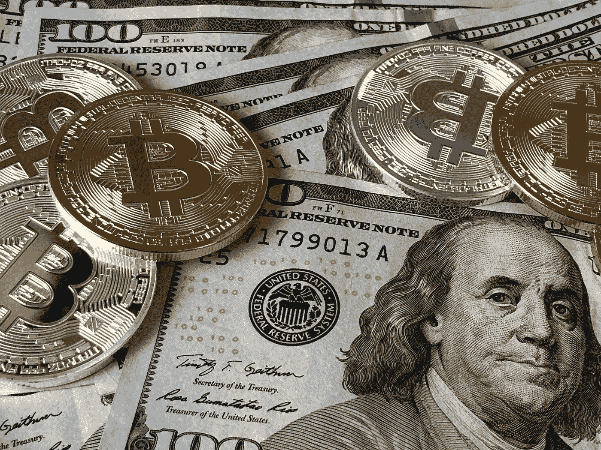

# 乔治·巴塔耶论自由市场乌托邦主义

> 原文：<https://medium.datadriveninvestor.com/georges-bataille-on-free-market-utopianism-d16357706541?source=collection_archive---------4----------------------->

## 萨伊定律，谨慎的经济，和被诅咒的份额

Image by [David McBee](https://www.pexels.com/@davidmcbee), from Pexels

新古典主义和自由市场经济学的一个谬误可以追溯到十八世纪自由经济学家让-巴蒂斯特·萨伊写的一个*非推论*，他是后来被称为[萨伊定律](https://en.wikipedia.org/wiki/Say%27s_law)或市场法则的作者。

# 萨伊定律背后的谬误

萨伊认为，市场不必担心商品供过于求而陷入停滞，因为供给本身就构成了需求；正如他在他的*政治经济学论文*中所写的那样，“供给中固有的是其自身消费所需的资金。”

可以肯定的是，过剩可能会发生，比如说承认，但它们可能只是暂时发生，因为对特定商品的需求存在一些误解；用萨伊的话说，“只有当一种产品的生产资料过多而另一种产品的生产资料不足时，才会出现过剩。”

但是萨伊也提出了更深层次的主张，“一种商品的过剩产生于另一种商品的不足。”萨伊想到的是供给经济学，即供给比需求更重要，两者在总量上相等，因为需求源于供给。

也就是说，你没有资格要求任何东西，除非你已经生产了某种东西，或者你有某种东西要卖，比如商品或服务。生产产出需要向该产出的供应商付款(假设产品不是由奴隶劳动或其他胁迫或欺诈生产的)。这种收入反过来又有可能产生购买这种产品的需求。因此，需求隐含在生产资料中，这有助于经济的自我延续。

例如，如果铅笔生产过剩，这种被误导的繁荣表明对铅笔之外的某种东西的隐性需求。致力于生产某种东西的能源具有促进需求的潜力；如果需求不是对铅笔的需求，那一定是对其他东西的需求。

萨伊定律预测，永远不会有长期失业或生产过剩，因为创造这些产品的市场拥有自我修正、调整努力方向的内在能力。然而约翰·梅纳德·凯恩斯用大萧条证明萨伊是错误的，不存在这样的定律。

事实上，在萨伊的以下陈述中可以找到萨伊思想的缺陷——看看你是否能抓住谬误:“由于我们每个人只能用自己的产品购买他人的产品——由于我们能购买的价值等于我们能生产的价值，*人们能生产的越多，他们就越会购买*(我的斜体)。

你明白这个可疑的假设了吗？萨伊从谈论一种可能性到谈论一种现实。他说，我们不能购买超过我们生产能力的东西，但他补充说，我们生产的越多，我们 T2 就会购买的越多。这并不符合逻辑，因为囤积或浪费金钱是可能的。

 [## 对有商业头脑的投资者有用的行为经济学概念|数据驱动的投资者

### 在美国企业界，高斯统计，对我们周围世界的确定性解释，以及理性…

www.datadriveninvestor.com](https://www.datadriveninvestor.com/2020/07/09/helpful-behavioral-economics-concepts-for-the-business-minded/) 

# 犹太人的谨慎和囤积财富的愚蠢

不过，以下是萨伊做出这一飞跃的原因:

> 值得注意的是，一种产品一被创造出来，就立即充分发挥其自身价值，为其他产品提供市场。当生产者对他的产品进行最后加工时，他最渴望的是立即卖掉它，以免它的价值在他手中减少。他也不急于处理他可能得到的钱；因为金钱的价值也是易腐的。但是摆脱金钱的唯一方法是购买某种产品。因此，仅仅是创造一种产品的环境就立即为其他产品打开了一个出口。

当然，仅仅因为一个制片人渴望销售他制作的东西，并不意味着他会成功。即使总的来说，人类认知或沟通中可能存在系统性缺陷，阻止市场达到预想的平衡，即充分就业，没有商品供过于求。

此外，萨伊假设生产者同样渴望摆脱他们的货币，因为货币的价值是易腐的，而货币是通过购买一些产品来摆脱的。

萨伊的这一假设似乎植根于《传道书》的实用主义:“热爱金钱的人不会满足于金钱；爱财利的，也是如此。这也是虚空。商品增加，吃的人也增加；它们的主人除了用眼睛看它们还有什么好处呢？劳动者的睡眠是甜蜜的，不管他吃得多还是少；但富人的过度消费不会让他睡觉”(5:10-12)。

这段话更有力地说明了这一点:“我见日光之下有一件大祸患:财主积蓄财宝，反遭祸患；他是一个儿子的父亲，但他手里什么也没有。他怎样从母胎出来，也必照样赤身而来，也必照样赤身而去，他所劳碌得来的，手里所拿的，也必一无所得”(13-15)。

圣经的观点是，囤积财富是不明智的，但这并不意味着囤积是不可能的，甚至是不可能的。基于萨伊定律的自由放任经济假设，作为其有效市场机制的一部分，买方和卖方展示了传道书的智慧，他们基本上是理性的。传道书的作者哀叹，相反，智慧是供不应求的；因此传道书首先需要被写出来。

# 统治、颓废和神圣的浪费

为了进一步理解这一点，我们应该转向乔治·巴塔耶的案例，他称之为“[被诅咒的份额](https://en.wikipedia.org/wiki/The_Accursed_Share)”巴塔耶对人性和我们在经济中的角色有着非常不同的看法。

尽管自由主义者坚持认为市场有自我调节的能力，不需要太多的政府干预，但巴塔耶注意到人类的非理性是一种特征，而不是缺陷。根据巴塔耶的说法，这种非理性在我们的社会交往中产生了超额价值，例如，可以以奢侈品或景观的形式非生产性地浪费掉。或者，如果我们欺骗自己认为它不存在，这种被诅咒的份额会恶化，在这种情况下，废物会变成灾难性的，就像战争、极端的自我牺牲或环境灾难一样。

对巴塔耶来说，我们的非理性浪费来自大自然创造的神圣威严。太阳消耗的能量与生物体的需求极不相称。那么，本能地，我们不仅仅是遵循理性的要求或遵守法律的条文，而是引导自然的崇高的、泛滥的力量。

如果你愿意，我们在这里有一个冲突，在犹太人的谨慎和法国人的奢侈之间。理性主义者认为可以安全地让市场自行其是，这实际上是基于犹太人文主义和一神论，只是表面上基于新古典经济学的[伪科学](https://medium.com/the-apeiron-blog/the-cults-of-scientism-in-philosophy-and-economics-afd8eeac759f?source=friends_link&sk=c558a768eda6b8e612e5ae0a9a56f8c7)。

过剩、衰退和囤积表明了一个更令人不安、更尼采式的现实。事实上，对于巴塔耶关于我们引导自然狂喜过度的观点，我们可以加上我所称的“[愤世嫉俗的社会学基础](https://medium.com/@benjamincain8/some-basics-of-cynical-sociology-fc714ea98b6?source=friends_link&sk=c07effa72090d168b57fb90de9dc70d2)”:我们不仅为“该死的份额”留出空间，为注定要被浪费的超额价值留出空间，而且我们采纳了大多数社会动物物种的权力动态，这种动态将社会大致分为主人和奴隶；即使在社会主义或平等主义的社会里，也是如此，这些社会被设计来抑制这种结构性的动物性。

考虑到这一点，我们可以推断，财富囤积显然是一种表明阿尔法支配者地位的手段，有别于等级制度中下层阶级的从属地位。

同样，用财富赌博，在股票市场投机，利用资本不是为生产性企业融资，而是促进从创造债务和租金中获取更多财富的计划，通过将财富存放在避税天堂来避税——所有这些超级富豪熟悉的策略在“犹太人”看来都是不理性和傲慢的，但在“法国人”看来却是自然的，甚至可能是神圣的。

同样，唐纳德·川普当选美国总统这一具有分水岭意义的事件代表了一种更广泛的社会内爆:不仅仅是富人用他们不计后果的铺张浪费来表明他们“大到不能倒”的地位，被剥夺了权利的大多数人通过证明[他们明白](https://medium.com/bigger-picture/grim-theater-the-greater-rationality-of-reelecting-trump-321584d2a938?source=friends_link&sk=90e28d239164bad3b16ac63b157e2fd1)他们的经济是一个骗局来加剧社会衰退。因此，这些群众要么不投票(把投票留给互相争斗的极端分子和头脑发热的人)，要么最终投票给破坏或“功能失调”的当权派，把公牛引入中国商店。

然而，巴塔耶的观点是，仅从道德的角度来看，共和党的渎职是不正常的或腐败的；从进化的角度来看，共和党支持财阀统治(少数富人统治多数穷人)是完全正常的(兽性的)。暴政是正常的，而社会平等几乎是不可思议的(反自然)。

*与谨慎、科学的经济学相反，政治和经济学的目标可能不是效率的最优化，而是对更高层次人类的神秘宗教庆祝*——当然不是道德上的“更高”，而是在奢侈方面的提升，体现了神圣的浪费。

在遥远的过去，我们第一次想到超级英雄“神”，当时皇室统治着下层种姓。同样，资本主义支持中产阶级只是偶然的，当环境允许时，比如在世界大战结束时，或者当平等和人权的进步启蒙价值观设法超越资本主义的固有趋势，使古老的、进化的统治等级永久化时。现在，不信教的财阀和窃国者凭借不劳而获、应受诅咒的财富份额而繁荣，损害了被愚弄的大多数人在同样浪费、误导的“民粹主义”起义中的利益。

像比尔·盖茨和沃伦·巴菲特这样充满负罪感的亿万富翁宣布他们打算捐出他们所有的财富。他们的慷慨是基于犹太人的直觉，即囤积财富没有意义，因为当我们死时，我们不会带走任何财产。但是他们的慈善会让可笑的古代早期法老感到震惊，例如，他们埋葬了他们的财富，甚至他们的妓女和仆人。

但从长远来看，试图驯服我们囤积财富的倾向，并把自己定位成可以支配某些奴才的人，可能就像试图用手挡住太阳的视线来扼杀太阳一样徒劳。

正如心理学家[保罗·皮夫](https://www.bbc.com/news/magazine-31761576)在他的社会实验中所展示的那样，有权势的人囤积财富并非偶然。在其中一个实验中，Piff 让数百名受试者玩一个[操纵的垄断游戏](https://www.youtube.com/watch?v=bJ8Kq1wucsk)。抛硬币决定了谁是拥有额外优势的有钱玩家，谁是穷人。隐藏的摄像机显示，幸运的玩家倾向于以主导方式行动，贬低可怜的玩家，更大声地在棋盘上移动他们的垄断棋子，吃更多的公共椒盐卷饼，等等。后来，没有一个幸运的玩家把他们在游戏中的成功归功于抛硬币，这与明显的事实相反。

简而言之，皮夫发现金钱让你变得吝啬，穷人比富人更慷慨，富人通过认同扭曲的现实观点和忽视运气在成功中的作用来证明自己的统治地位。最重要的是，Piff 的实验要求任何人都会成为这种权力动态的牺牲品。有些人可能比其他人更倾向于自私或粗鲁，但相对优势的地位本身是腐败的，因此任何占据这种社会角色的人，即使是从赤贫到富有的人，也容易忽视自己的良知和同情心。

# “理性”经济引导自然的野性

如果市场是一个在谨慎行为者身上运行的有效机制，如果供给和需求是合理相关的，那么从长期来看就不会有令人讨厌的过度供给。但是这留下了这个有效机制的目的的问题。我们高效前进的终点是什么？

巴塔耶指出，事实证明，自由市场在繁荣和萧条的循环中创造了垄断，以及一批囤积或浪费财富而不是投资于生产性企业的亿万富翁。他们这样做是因为他们的权力腐蚀了他们，因为他们在社会中的角色是充当超级英雄阿尔法人物，曾经作为神的化身受到崇拜。社会创造了精神变态的国王或其他支配者，作为太阳荒谬低效的象征，也就是说过度的权力。

犹太人或道德家的观点是，鉴于上帝的伟大，我们应该谨慎。我们应该敬畏上帝，遵守他的戒律，不要假装我们可以挑战他的至高无上。

新古典经济学用理想理性取代了宗教信仰或对上帝的恐惧，但当然，在大自然令人震惊的创造力面前，人类的逻辑无能为力。这就是为什么即使在我们的世俗经济中，我们最优秀、最聪明的商人也会屈服于基因压力，登上王位，像无情的君主一样支配他们的公司。我们积累财富，然后浪费掉，唾弃穷人，就像宇宙浪费整个星系，不顾道德或效率，将它们扔进黑洞。

## 获得专家视图— [订阅 DDI 英特尔](https://datadriveninvestor.com/ddi-intel)