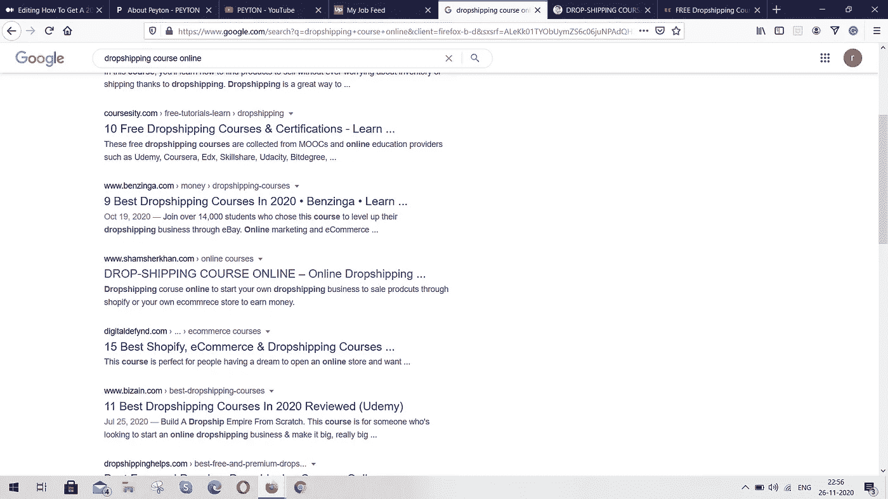

# 获得 1500 元支付写作客户在媒体上

> 原文：<https://medium.datadriveninvestor.com/get-1500-paying-writing-clients-on-medium-dc519f5a3360?source=collection_archive---------5----------------------->

## 寻找能为你在媒体上发布内容付费的客户

Photo by [Dan Counsell](https://unsplash.com/@dancounsell?utm_source=unsplash&utm_medium=referral&utm_content=creditCopyText) on [Unsplash](https://unsplash.com/s/photos/writing?utm_source=unsplash&utm_medium=referral&utm_content=creditCopyText)

嗯，这听起来好得难以置信，对吧？

但是如果我告诉你，一个媒体作家已经在这么做了，而且已经在很多场合这么做了。

是的，他不是为了那些按字付费的 10 美元和 100 美元的客户。相反，他找到了一些客户，这些客户付给他 1000 多美元，让他在 Medium 上撰写和发表文章。

> 那么这个作家是谁呢？

是[【艾莉】佩顿](https://medium.com/u/a4ac7cb83321?source=post_page-----dc519f5a3360--------------------------------)——品牌记者|商业顾问|写蔻驰

佩顿有一个 [YouTube 频道](https://www.youtube.com/c/ArliePeyton503/videos)，他在那里分享他的写作教程，其中大部分都与媒体有关。他为主要出版物[撰写文章](https://www.arliepeyton.com/portfolio/)，如福布斯公司、赫芬顿邮报、茁壮成长全球等。

他的主要专长是品牌新闻，他将媒体品牌新闻的概念应用于支付他数千美元的土地客户。

# 利用媒体写作、出版，并从客户那里获得报酬

根据他的网站，佩顿通过他的品牌新闻和商业顾问帮助了多个在线企业。他从 2007 年就开始这么做了。

他在 2015 年开始在 Medium 上写作，从那以后，他写了不到 50 篇文章。

> 但是这里有什么问题呢？

他的文章并非都是为自己写的。这些文章很少是为一些品牌和他的客户写的。

佩顿有自己的[网站](https://www.arliepeyton.com/about-peyton/)，在那里他提供专业写作等服务，包括在媒体上写文章。

> 佩顿获得高付费客户的秘诀是在媒体上为客户写文章，并让它在谷歌上排名。

在谷歌上的排名导致流量的增加，从而增加客户的收入。

## 那为什么是写作的媒介呢？

如果你不知道搜索引擎优化(或)背后的字符串在谷歌上排名的文章。那么你应该知道谷歌根据这些重要因素对文章进行排名，比如:-

*   领域权威
*   优质内容
*   反向链接

由于域权限较高，Medium 位列全球网站百强。

在严峻的世界里，领域权威是一个站点的 SEO 分数，代表它与特定主题领域或行业的相关性。高域名权威等于更高的机会在谷歌上排名的文章。

这就是媒介发挥作用的地方。根据 Moz，Medium 的域名权限(DA)是 100 分中的 96 分。

> 一篇写得好的文章在 Medium 上比发表在一个低 DA 站点上的文章更有可能在 Google 上排名靠前。

## 对客户有什么好处？

这是一个真正的问题，甚至我都不明白为什么人们要付钱给他，让他在媒体上写作。

在谷歌上排名意味着流量，但不是任何流量。激光特定和激光定向交通。

这意味着人们通过谷歌搜索阅读文章对一个企业来说更有价值，而不是在一些社交媒体上找到确切的企业。

对于任何企业来说，将这样的流量转化为客户都是比较容易的。因为如果人们对利基市场不感兴趣，他们一开始就不会去寻找它。

佩顿写的文章有链接，大多重定向到一个商业页面。阅读这些文章的人被重定向到他的客户网站(或)产品。

当人们读到这些文章的时候。他们更有可能点击这些链接，并期待成为该业务的客户。

这就是客户如何通过写在媒体上的文章为他们的业务赢得客户，他们向佩顿支付一些报酬，因为他们在媒体上发表了这篇文章。

> 佩顿本人在他的 YouTube [视频](https://www.youtube.com/watch?v=eEwpo82b3NE)上，以及在接受[祖列·雷恩](https://medium.com/u/14d5c41e0264?source=post_page-----dc519f5a3360--------------------------------)和[西内姆·古内尔](https://medium.com/u/b6da3e8d166d?source=post_page-----dc519f5a3360--------------------------------)采访时，分享了这一策略的全部细节。
> 
> 他确实证实，他为每个客户写文章并在谷歌上排名，赚了 1500 美元。

 [## 自由职业者拯救陷入困境的公司|数据驱动的投资者

### 在家工作对失业的上班族来说可能是新鲜事，但这通常是自由职业者的首选场所…

www.datadriveninvestor.com](https://www.datadriveninvestor.com/2020/08/10/freelancers-ride-to-the-rescue-of-struggling-companies/) 

# 如何找到客户来写

在佩顿的案例中，据我所知，他的大多数客户都是营销机构的老板，他们要么在网上销售他们的[课程](https://medium.com/smma/how-one-smma-startup-is-reforming-education-c87438a192ad)(或者)他们的培训产品。

像你我这样的人必须明白，在获得如此高收入的客户之前，我们需要像佩顿一样建立一个投资组合。

对我们来说，媒体是建立投资组合的最佳来源，如果你拥有一个网站(或为其他客户写作)，那么你可以将它添加到你的投资组合中。

一旦我们有投资组合展示，我们可以通过谷歌和社交媒体寻找客户。

对我们来说，最好的客户是那些在你的领域中的中型企业。

> 为了让客户使用谷歌，我们需要做一些研究。

**使用谷歌寻找客户:**为了举例，我在谷歌上搜索了“网上直运课程”。我不会在第一页寻找客户，而是在第二页和第三页寻找一些潜在的直运专家，他们愿意为我的额外曝光付费，并通过我获得更多业务。

Screenshot by Author

> 社交媒体也是如此。

寻找潜在的潜在客户，他们了解自己的行业，有很好的产品要卖，但没有在网上曝光。

在 [Instagram](https://medium.com/illumination/why-these-0-10k-instagram-challenges-doesnt-work-for-you-2ff2a551bafb?source=search_popover-------------------------------------) 上，你可以寻找关注者少于 10k 的商业账号，通过你的媒介文章帮助他们推广产品。

# 如何写文章并在谷歌上获得排名

如果说争取客户是最具挑战性的部分。那么你应该知道你还没有完成完整的训练。从客户那里获得一笔交易只是一个开始；在这里写文章，让文章在真正的商业中排名。

即使我们要在 Medium 上写文章，Medium 有很高的域权限(DA)，但这并不意味着 Medium 上发表的每篇文章都会排在 Google 的第一页。

让你的文章在谷歌上排名中等。请遵循以下步骤:-

## 使用关键词研究工具

选择关键字(或)搜索短语在我们的利基，这是很容易排名，竞争较少。

(如果你不是 SEO 的人。观看这些[视频](https://www.youtube.com/watch?v=8cExLG1eIRI) [上](https://www.youtube.com/watch?v=b-cYvXpVQmw) [关键词](https://www.youtube.com/watch?v=6NCAYZLxZM0) [研究](https://www.youtube.com/watch?v=c9Tfhh3iN4E)并了解它是如何做到的)

对于初学者来说，最好的免费工具是谷歌关键词规划器。登录后:-

1.  在工具中插入您的目标关键字。它会出现多个相关的关键字。
2.  选择竞争少、搜索量大的关键词
3.  用多个关键字来做这件事。你会有一个写文章的关键词列表，有机会排名。

## 如何写出排名的文章

[在写一篇文章](https://writingcooperative.com/i-took-this-goal-of-writing-100-articles-in-a-month-d4fc38e46df4)并希望它在 Google 上排名之前，我们首先需要分析 Google 对我们关键词显示的前 10 名搜索结果。

如果排名在第一页的网站 DA 低，并且网站上发布的内容很少(少于 1000 字)。这告诉我们，中等质量的文章可以击败那些排名靠前的文章。

写作时遵循以下步骤:-

*   在标题和整篇文章中包含关键词
*   添加图像、视频和 gif。
*   与排名靠前的文章相比，使内容的字数增加两倍

## 如何利用媒体并确保你的文章排名

因为我们在媒体上发表文章。我们需要尊重媒体的条款和条件，我们需要对我们赞助的文章保持透明。

因为我们是为客户写的，我们需要通过分享我们的条款和条件页面的链接，将这些文章作为品牌内容公开。

*比如*，看看佩顿的[文章](https://medium.com/smma/how-one-smma-startup-is-reforming-education-c87438a192ad)，他明确公开了自己的内容为赞助内容。

除此之外，这里有一些技巧可以让你的文章在谷歌上排名更高

*   选择在大型出版物上发布内容。因为来自大型酒吧的文章在媒体中更受欢迎
*   在[社交](https://medium.com/passive-incomers/how-to-earn-money-on-facebook-500-every-day-e8b1406154e6) [媒体](https://medium.com/passive-incomers/how-to-go-viral-on-quora-with-one-simple-hack-58f350922985)平台上分享你的故事。
*   通过更著名的网站获得你的文章的反向链接。你也可以付费给其他网站链接到你的媒体文章。

这些步骤并不能保证你的文章会出现在谷歌搜索结果的顶部。但是它可以推动你的内容与其他已经在谷歌上的文章竞争。

# 结论

一开始，在 Medium 上为客户写作并在谷歌上获得排名可能不会让你获得 1500 美元的写作合同。

但是当你为越来越多的客户写作并让它为他们服务时。你向现有客户索要[推荐信](https://www.youtube.com/watch?v=bE3rTxF6cmY)，并把它们包含在你的写作推介中，以逐步提高你的服务率。

这份工作最大的好处是，你可以从你的客户和在媒体上发表文章的媒体合作伙伴项目中赚钱。

## 获得专家视图— [订阅 DDI 英特尔](https://datadriveninvestor.com/ddi-intel)