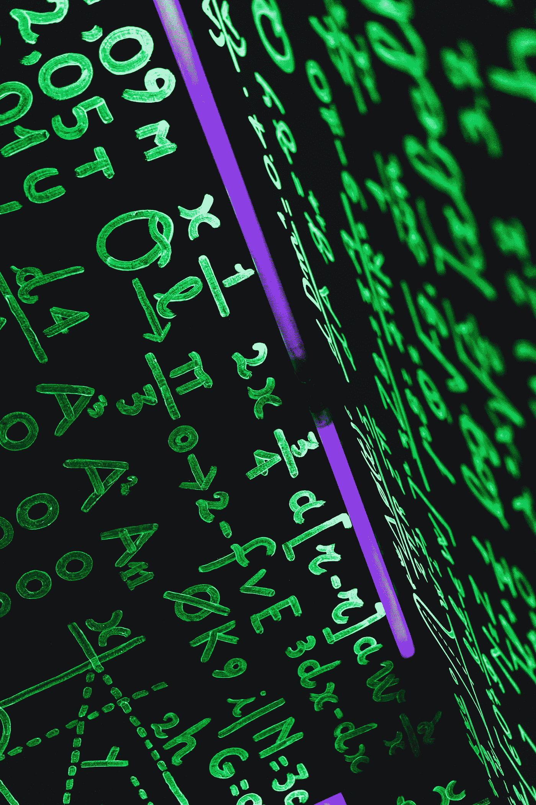
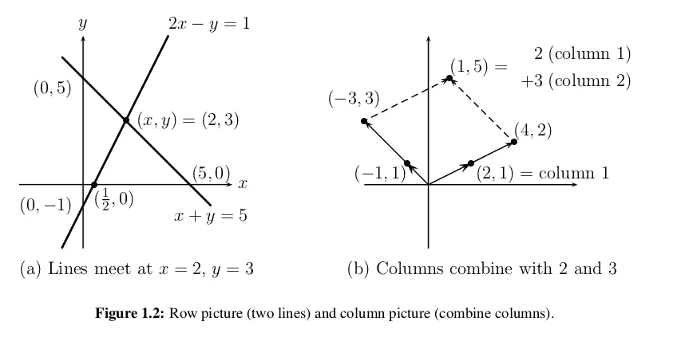
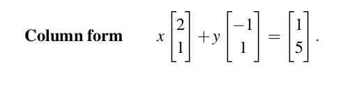

# 回到数据科学的线性代数

> 原文：<https://medium.datadriveninvestor.com/get-back-to-linear-algebra-for-data-science-fa072e19822?source=collection_archive---------19----------------------->

## 今天我学会了

## 我在大学时学过线性代数。当时，我没有注意，因为我认为这与我的专业(信息技术)无关。现在我不得不为我最近加入的数据科学项目重新学习它。



Photo by [John Moeses Bauan](https://unsplash.com/@johnmoeses?utm_source=unsplash&utm_medium=referral&utm_content=creditCopyText) on [Unsplash](https://unsplash.com/s/photos/linear-algebra?utm_source=unsplash&utm_medium=referral&utm_content=creditCopyText)

这篇文章的目的是介绍一些基本概念，帮助你开始学习线性代数，并将其应用到数据科学项目中。我们将浏览线性方程的几何图解，什么是向量和矩阵。

# 线性方程的几何

## 举个简单的例子:

2x y = 1
x+y = 5。

我们可以按行或按列来看这个系统。我们两个都想看。**第一种方法**专注于单独的方程(行)。这是最熟悉的，在二维空间我们可以很快做到。等式 2x y = 1 由 x-y 平面中的一条直线表示。该直线穿过点 x = 1，y = 1 和 x = 12，y = 0(还穿过(2，3)和所有中间点)。第二个方程 x + y = 5 产生第二条线(图 1.2a)。其斜率为 dy/dx = 1，并在解处与第一条线相交。交点位于两条直线上。这是两个方程的唯一解。那个点 x = 2，y = 3，很快就会用“消元法”找到



Row approach

**第二种**方法查看线性系统的列。这两个独立的方程实际上是一个向量方程。



Column form

问题是找到左边的列向量的组合，产生右边的向量。这些向量(2，1)和(1，1)由图 1.2b 中的粗线表示。未知数是乘以列向量的数字 x 和 y。在该图中可以看出整个想法，其中 2 乘以列 1 加到 3 乘以列 2。从几何学上讲，这产生了一个著名的平行四边形。代数上，它产生正确的向量(1，5)，在我们方程的右边。
柱形图确认 x = 2，y = 3。

# 向量

答抽象地说，向量是可以相加(形成新向量)的对象，也可以乘以标量(即数字)，形成新向量。具体地说(对我们来说)，向量是某个有限维空间中的点。虽然您可能不认为您的数据是向量，但它们是表示数字数据的好方法。例如，如果您有大量人的身高、体重和年龄，您可以将您的数据视为三维向量(身高、体重、年龄)。如果你在教一个有四次考试的班级，你可以把学生的成绩当作四维向量(例 1，例 2，例 3，例 4)。

下面是一些介绍如何在我们定义的向量上实现算术函数的方法。

*   向量相加:

```
def vector_add(v, w):
    *"""adds corresponding elements"""* return [v_i + w_i
            for v_i, w_i in zip(v, w)]
```

*   矢量减法:

```
def vector_subtract(v, w):
    *"""subtract corresponding elements"""* return [v_i - w_i
            for v_i, w_i in zip(v, w)]
```

*   向量和:

```
def vector_sum(vectors):
    *"""sums all corresponding elements"""* result = vectors[0]
    for vector in vectors[1:]:
        result = vector_add(result, vector)
    return result
```

*   标量乘法:

```
def scalar_multiply(c, v):
    *"""c is a number, v is a vector"""* return [c * v_i for v_i in v]
```

*   向量平均值

```
def vector_mean(vectors):
    *"""compute the vector whose ith element is the mean of the
    ith elements of the input vectors"""* n = len(vectors)
    return scalar_multiply(1/n, vector_sum(vectors))
```

*   点

```
def dot(v, w):
    *"""v_1 * w_1 + ... + v_n * w_n"""* return sum(v_i * w_i
    for v_i, w_i in zip(v, w))
```

# 矩阵

矩阵是数字的二维集合。我们将把矩阵表示为列表 s 的列表 s，每个内部列表具有相同的大小，并且表示矩阵的一行。如果 A 是一个矩阵，那么 A[i][j]是第 I 行第 j 列的元素。按照数学惯例，我们通常使用大写字母来表示矩阵。例如:

```
A = [[1, 2, 3], [4, 5, 6]]
B = [[1, 2], [3, 4], [5, 6]]# A has 2 rows and 3 columns
# B has 3 rows and 2 columns
```

给定这种列表列表表示，矩阵 A 具有 len(A)行和 len(A[0])列，我们认为其形状为:

我们还希望能够创建一个给定形状的矩阵和一个生成其元素的函数。我们可以使用嵌套列表理解来做到这一点:

[线性代数及其应用](https://readyforai.com/download/linear-algebra-and-its-applications-5th-edition-pdf/)