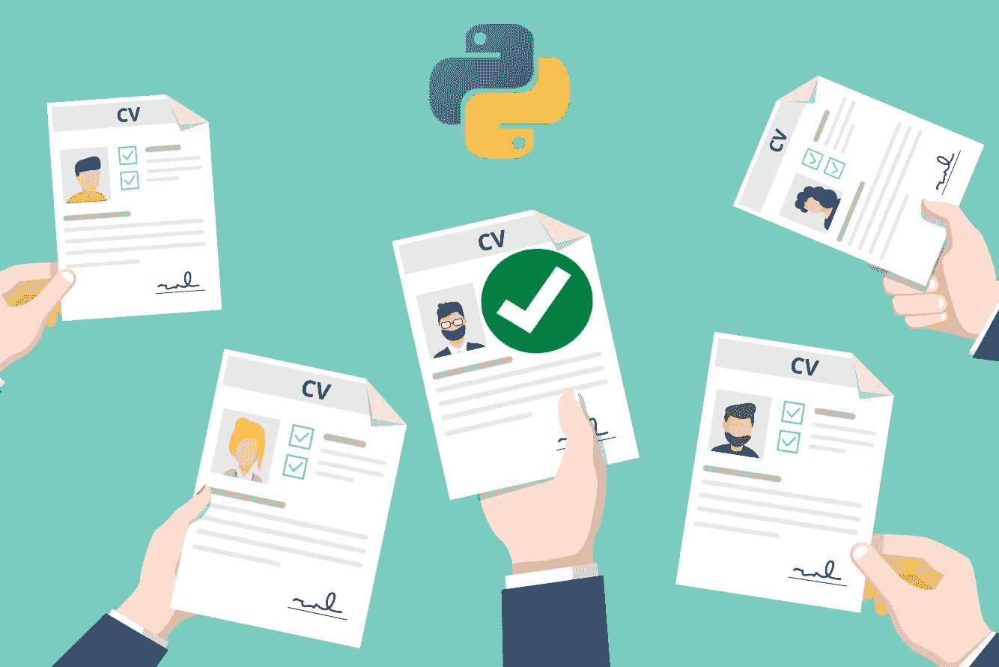
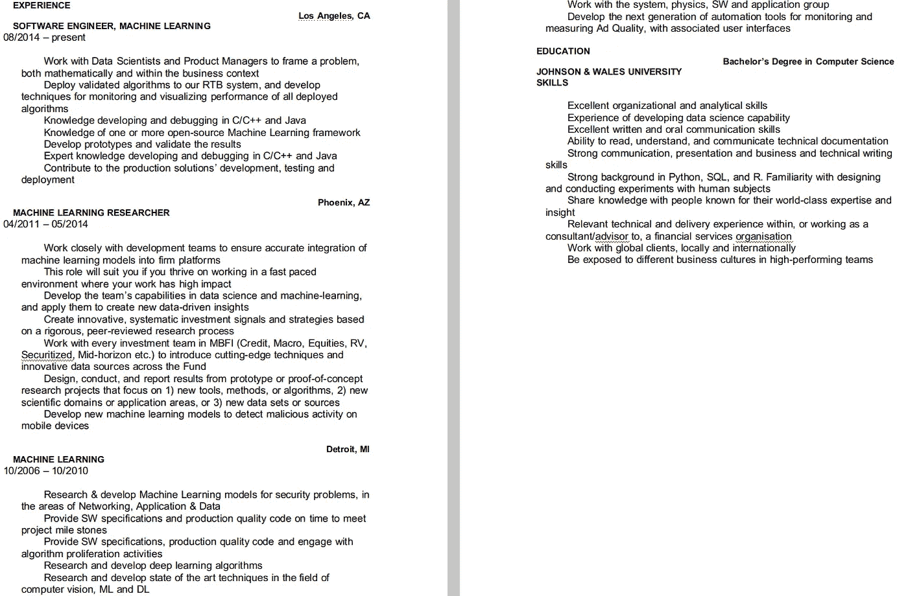
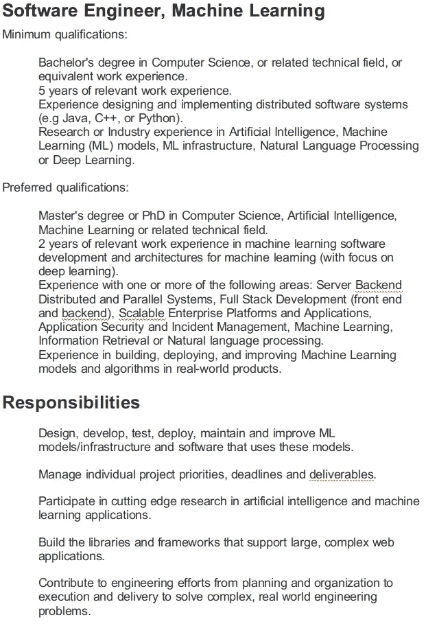
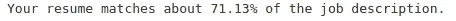
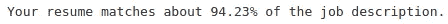

# 如何只用 11 行 Python 代码就获得理想工作

> 原文：<https://medium.datadriveninvestor.com/get-hired-at-your-dream-job-in-just-11-lines-of-python-code-7a8d41bbb335?source=collection_archive---------3----------------------->

## 一个完整的新手友好指南，告诉你如何使用机器学习来获得你梦想中的工作



> “在人类历史上，这篇短文从来没有像现在这样切题。”

在年，仅美国**估计就有 4700 万个工作岗位**预计将在**后 COVID19 世界**中**消失**。客观地看，32%的人口可能会失业。全球几乎所有国家都有类似的统计数据。这是什么意思？

这些人中的大多数在任何情况下都不会简单地接受这样的命运。世界各国政府已经承诺向他们的公民提供救济基金。尽管这种基金在许多国家相当慷慨，但从任何角度来看，它们都不足以养活数百万即将失去固定收入来源的人。

因此，显而易见的是，大多数受影响的人将试图寻找一个新的就业场所。

换句话说，如果你认为新冠肺炎之前的就业市场竞争极其激烈，那么在 2020 年找到一份工作将被证明是极其困难的，因为竞争将明显高于 COVID19 之前的世界。

*考虑到上述情况，本文的目的是带你完成创建一个初学者友好的机器学习模型的完整过程，这个模型将几乎保证你被你梦想的工作所接受。*

*如果你喜欢这篇文章，并且有兴趣免费接收每月独家内容，可以在本文末尾订阅我的独家邮件列表(也可以从* [*这里*](https://bit.ly/filipposmaillist) *直接进入)。*

# 蓝图

现在很明显，我们有着共同的目标:确保你被那家公司接受，并获得过去两个月你一直在寻找的有竞争力的薪水。

## 这将如何实现？

通过使用我们可用的技术(sklearn 和 python ),我们将构建一个易于制作的模型，它将:

*   要求你的简历在”。docx”格式。
*   在中输入你想申请的职位。docx”格式。
*   使用余弦相似度来表明你的简历与公司寻找的东西有多相似(是的，这是向量)。
*   使用相似性分数作为简历中必须改变的指标，以便有更好的机会被选中。

对项目的不同步骤有了一个精确和具体的概念，我们现在可以开始创建模型了。

# 创建模型

与我的大多数文章相反，所涉及的实际编程非常简单，并且不需要事先具备编程知识。

第一步也是最关键的一步是下载并导入所需的库。要下载它们，您只需通过执行以下命令来使用“pip ”:

```
pip3 install sklearn
pip3 install docx2txt
```

一旦成功安装了库，就可以用 3 行代码将它们导入 python:

我们现在有能力进口”。docx”文件转换成 python。

因此，我们将创建一个我称之为“简历”的变量，它将包含一个我在这里找到的数据科学简历样本(显然，您将附上自己的简历)。



Screenshot of the sample CV

既然已经导入了简历，那么是时候遵循相同的流程，导入我们想要申请的工作的描述了。出于测试目的，我将在谷歌“申请”一个软件工程、机器学习的职位(名单可以在[这里](https://careers.google.com/jobs/results/106621576809456326-software-engineer-machine-learning/?company=Google&company=Google%20Fiber&company=YouTube&employment_type=FULL_TIME&hl=en_US&jlo=en_US&q=software%20engineer&sort_by=relevance)找到)。

值得一提的是，没有使用复杂的网页抓取方法来获取描述。我只是将页面内容复制粘贴到一个空的 word 文档中。



Screenshot of the sample job description

一旦我们将两个文件都赋给了变量，我们将创建一个名为“text”的列表，它将包含这两个文件。

这次冒险的全部目的是找到两个文件之间的相似之处。因此，我将创建一个计数矢量器，以创建一个令牌计数矩阵，然后继续寻找两个向量的余弦相似性。



瞧啊。该模型发现，我们的简历和“理想工作”招聘广告之间有 71.13%的**相似度。**

**虽然这样的比例相当高，但谷歌提供这份工作的事实意味着会有更多的申请人更有可能胜任这份工作。因此，我们有必要修改我们的简历，以达到尽可能高的百分比。**

**经过 1.5 个小时的努力，我终于达到了这份工作的 94%兼容性。**

****

**因此，我们可以得出结论，这个模型非常有用，每个申请工作的人都必须使用类似的工具，以最大限度地提高他/她被聘用的机会。**

# **你想了解更多吗？**

**如果你想**提高你的知识**并且对**利用机器学习赚钱感兴趣**，我**强烈鼓励你**关注我并阅读下面**列出的文章**:**

**[](https://medium.com/datadriveninvestor/machine-learning-shows-you-are-responsible-for-george-floyds-murder-17ab2b1fa0bd) [## 机器学习显示你对乔治·弗洛伊德的谋杀负有责任！

### 实用的大开眼界需要带来彻底的改变

medium.com](https://medium.com/datadriveninvestor/machine-learning-shows-you-are-responsible-for-george-floyds-murder-17ab2b1fa0bd) [](https://medium.com/datadriveninvestor/elons-lethal-mistake-predicting-the-stock-price-of-tesla-with-twitter-and-machine-learning-5e89282ce75f) [## 埃隆的黄金礼物:用 Twitter 和机器学习预测特斯拉的股价

### 使用 NLP 和机器学习以超过 80%的准确度预测特斯拉价格的完整指南

medium.com](https://medium.com/datadriveninvestor/elons-lethal-mistake-predicting-the-stock-price-of-tesla-with-twitter-and-machine-learning-5e89282ce75f) [](https://medium.com/datadriveninvestor/millennials-this-is-the-unconventional-money-making-technique-you-were-looking-for-3b47c7384c60) [## 千禧一代！这是你一直在寻找的非常规赚钱技巧

### 如何使用 python 和 ML 以 0 美元启动资金制作成千上万的完整蓝图。

medium.com](https://medium.com/datadriveninvestor/millennials-this-is-the-unconventional-money-making-technique-you-were-looking-for-3b47c7384c60) [](https://medium.com/datadriveninvestor/could-machine-learning-and-nlp-have-predicted-oils-crash-2a5f6f8028cc) [## 机器学习和 NLP 能预测石油的崩溃吗？

### 关于如何结合机器学习和自然语言处理成功预测新冠肺炎铅油崩溃的指南。

medium.com](https://medium.com/datadriveninvestor/could-machine-learning-and-nlp-have-predicted-oils-crash-2a5f6f8028cc)**