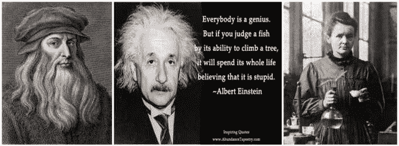
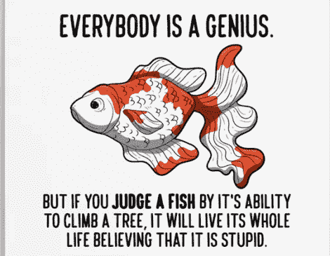

# 进入天才地带，释放你的最大潜能

> 原文：<https://medium.datadriveninvestor.com/get-into-the-genius-zone-and-unlock-your-maximum-potential-c3e12c694707?source=collection_archive---------7----------------------->

如果我让你说出 3 个在天才区工作过的人，很有可能包括:

**达芬奇**(1452–1519)，文艺复兴时期的意大利天才；发明家、画家、雕塑家、建筑师、科学家、音乐家、数学家、工程师、作家、解剖学家、地质学家、植物学家、作家、历史学家和制图员！

达芬奇被认为是有史以来最伟大的画家之一；“*蒙娜丽莎*”是世界上最著名、参观最多、被写得最多、被唱得最多、被模仿得最多的艺术作品，而“*最后的晚餐*”是西方世界最知名的绘画，也是有史以来被复制得最多的宗教绘画。达芬奇名言之一:“*最高贵的快乐是理解的快乐*”

阿尔伯特·爱因斯坦(1879-1955)，德裔物理学家，发展了相对论。他被认为是 20 世纪最有影响力的物理学家之一。他获得了 1921 年的诺贝尔物理学奖(他的诺贝尔奖是因为发现了光电效应定律，而不是相对论)。

他的名言之一:*“每个人都是天才。但如果你以一条鱼爬树的能力来评判它，它会一辈子都相信自己是愚蠢的。”*

玛丽·居里(1867-1934)是波兰籍的法国物理学家和化学家，对放射性进行了开创性的研究。她是第一位在两个不同的科学领域获得两次诺贝尔奖的女性。

她的名言之一:“*生活中没有什么可怕的。它只是被理解。现在是时候去了解更多，这样我们就可以少一些恐惧。*

# 每个人都是天才

以上三种受人尊敬的人格都配得上天才的称号；但是爱因斯坦说:“每个人都是天才。他在这一点上是对的，在其他许多事情上也是对的，但是如何进入你的天才地带呢？

心理学家、《大飞跃》和《天才的喜悦》的作者盖伊·亨德里克斯在《大飞跃》中解释说，人们在四个不同的区域内活动:

1.  无能区，在那里你做你天生不懂或不擅长的事情。我们大多数人都避免在那里花太多时间(尽管令人惊讶的是，有很多人并不知道他们不擅长什么——我敢肯定你认识某个人！)
2.  ***能力范围*** 你做自己擅长的事情，但其他人也能做得一样好，因此不会以任何显著的方式区分你的能力。
3.  卓越区 你的能力会得到很多回报，如果这是你的职业，你可能会过上合理的生活。
4.  ***天才区*** 是你利用天生能力而非后天习得的区域。这是你进入“心流”的状态，“以毫不费力的方式找到灵感，在这种状态下，你似乎可以做出杰出而独特的作品，而且以远远超越其他人的方式做到这一点。

亨德里克斯接着解释道:

*大多数成功人士都在他们的卓越领域工作，在这个领域里，他们做着他们非常擅长的事情。然而，这个区域最终并不令人满意，因为它没有发挥个人的天赋*。

如果你停留在卓越区，你可能会让你的朋友和家人开心，做你擅长的事情，但不要让自己停留在那里。天才区是你需要花更多时间的地方。

每个人都有梦想，但不是每个人都能实现。生活中的许多痛苦来自那些每天醒来都在做对自己没有挑战的事情的人。盖伊·亨德里克斯鼓励每个人花更多的时间在他们的*天才区*里，每天承诺花一些时间(从每天 10 分钟开始)在他们的*天才区*里工作。出于这种承诺，将会产生大量新的想法。

我们都有潜在的、可以被发掘出来的潜力。我们远远超出了我们的想象。

释放你的天才吧。

Joanne Reed — www.authorjoannereed.net
Author of “This Is Your Quest”. You can’t buy happiness but you can buy books. Your mission, should you wish to accept it is to experience happiness