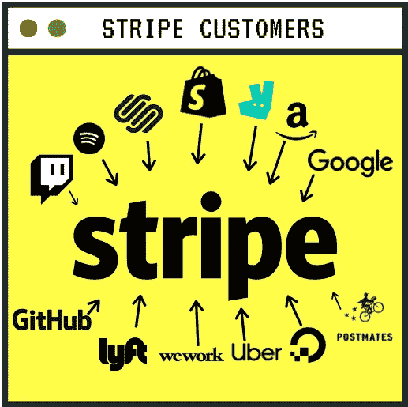

# 使用 Stripe 在 100 秒内完成支付。

> 原文：<https://medium.datadriveninvestor.com/get-payments-done-with-stripe-in-100-seconds-f970810103d6?source=collection_archive---------17----------------------->

Stripe Introduction

> 这是一个工具套件，他们几乎可以将任何在线商业模式货币化。它是 API，就像低级构建模块，可用于接受支付、管理客户、处理经常性订阅等。

few of the Stripe customers.

[**Lyft**](http://www.lyft.com) 用它从骑手和支付司机那里收取付款。
[**数字海洋**](http://www.digitalocean.com) 用它来销售计量软件即服务产品 [**Shopify**](http://www.shopify.in) 用它来实现一个大规模的在线市场。Twitch 用它来支付内容创建者，也用它来购买会议/派对门票。

> **We work、** [**优步**](http://www.uber.com) **、Postmates、** [**亚马逊**](http://www.amazon.com) **、Squarespace、Deleveroo、** [**Spotify**](http://www.spotify.com) 使用 stripe 作为他们的主要支付服务，因为这是一种简单而安全的业务开发模式。

它非常受初创公司的欢迎，因为它的开发人员第一的方法，而不是担心合规性安全和欺诈检测之类的事情，您可以专注于用户体验，只需几个 API 调用就可以实现您的支付系统。

# 那么，Stripe 的信用卡支付是如何运作的呢？

当用户准备付款时，您首先需要在您的服务器上创建付款意向，付款意向有点像管理付款流程的会话，当前它处于需要付款方法的状态。第二步是从客户那里获得信用卡详细信息或支付方式，您可以使用 Stripe J.S 在网上安全地处理这一过程

# Stripe.js 是什么？

> 条纹。js 是 stripe 自己的基础 JavaScript 库，用于构建支付流。Stripe.js 的主要集成路径是使用 Elements，这使您能够使用可定制的 UI 组件收集敏感的支付信息。Stripe.js 还为 [Apple Pay](https://stripe.com/docs/apple-pay) 、 [Google Pay](https://stripe.com/docs/google-pay) 和[支付请求 API](https://stripe.com/docs/payment-request-api) 提供了单一接口。

它能够直接在你的应用程序中安装一个可定制的信用卡表单。它会自动验证用户的输入，因此您不必担心实现自定义表单验证以及随之而来的所有边缘情况。当提交表单时，您的书面函数从您的服务器获取支付意图，并将其与用户在浏览器中输入的信用卡详细信息相结合，然后直接调用确认卡支付来发送此数据(通常是 stripe 服务器)。它将尝试完成支付。

但世界上许多地方现在都有规定，要求支付意图的额外授权。现在状态为“需要操作”,将完全在前端为您处理此过程，一旦完成，您的付款意向将变为“成功”状态“祝贺您刚刚获得付款”。但是你还没有完成，你还需要完成产品。

每当 Stripe API 中发生重要的事情时，例如当它成功到达时，您可以通过设置 webhooks 来监听这些事件。当事件发生时，Stripe 会将这些数据发送到您的服务器，以便您可以相应地处理这些数据，就像更新您的应用程序的数据库一样打印出运输标签。

## 这是关于 100 秒内的条纹支付。如果你真的想让你的产品赚钱，那就转向 Stripe，开始联系你的客户。

# 感谢您阅读这篇文章。随时欢迎反馈。如果你喜欢它，请点击拍手按钮，并分享这篇文章。

你可以在[Github](https://github.com/tejamaddimsetty)&[LinkedIn](http://www.linkedin.com/in/tejmaddimsetty)上联系我

[*Tej Maddimsetty*](https://medium.com/@tejmaddimsetty)