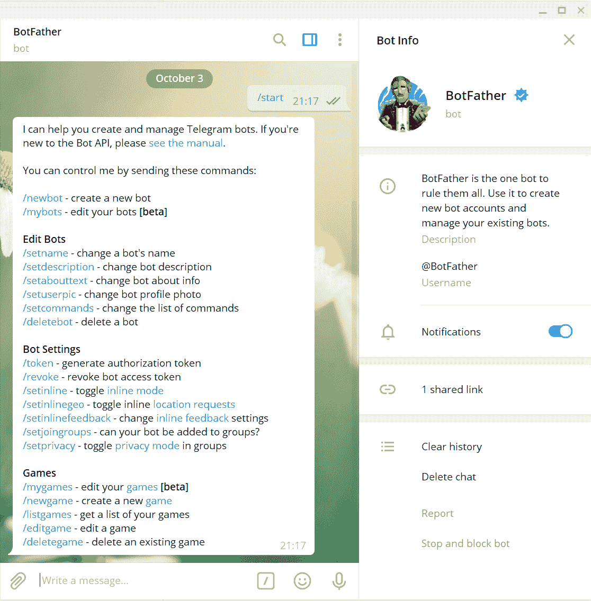

# 通过 Telegram 上的您自己的机器人获得金融市场的实时更新

> 原文：<https://medium.datadriveninvestor.com/get-real-time-updates-from-the-financial-market-with-your-own-bot-on-telegram-9f9c47449ce8?source=collection_archive---------1----------------------->

## 了解如何使用 Python 和 Metatrader 5 构建一个机器人来接收实时市场数据


Photo by [Austin Distel](https://unsplash.com/@austindistel?utm_source=medium&utm_medium=referral) on [Unsplash](https://unsplash.com?utm_source=medium&utm_medium=referral)

发展投资自动化策略的一个最重要的优势是，你不必一直站在电脑屏幕前寻找市场上的最佳机会。考虑到这一点，我为电报开发了一个机器人，通知我哪些资产在一天中遭受了最多的下跌或上涨，我将一步一步地向您展示，以便您可以开发您的资产！

在这篇博客中，我们将重点开发一个简单的应用程序，它在 Telegram 上向 Bot 发送请求，并返回股票资产当天的前五名和后五名百分比回报。最后的结果会像下面的视频:

Video by Author

为了开发您的机器人，我们将遵循以下步骤:

1.  在 Telegram 中创建您的机器人
2.  在 Python 中创建主要函数
3.  从交易所收集数据
4.  向机器人发送信息

[](https://www.datadriveninvestor.com/2020/09/17/five-financial-applications-of-natural-language-processing/) [## 自然语言处理的五种金融应用|数据驱动的投资者

### 过去的五年对于自然语言处理领域来说是革命性的。我们从荣耀的 ctrl-f…

www.datadriveninvestor.com](https://www.datadriveninvestor.com/2020/09/17/five-financial-applications-of-natural-language-processing/) 

# 在 Telegram 中创建您的机器人

要在 Telegram 中创建您的机器人，找到用户@BotFather，并发送命令“/start。”将出现以下屏幕:



BotFather — Image by Author

之后，我们向机器人父亲发送“/newbot”命令。机器人爸爸会要求我们为我们的机器人起一个名字。你可以随意给它取任何你喜欢的名字。在这种情况下，我们创建了一个所谓的 tutobot。之后，我们需要为机器人创建一个用户，并且必须在末尾插入 _bot。

创建用户后，BotFather 将授予一个令牌，以便我们可以发送请求。请复制并粘贴此令牌以备后用，并妥善保管。


Image by Author

# 用 Python 创建主要的 bot 函数

我不会详细介绍为机器人创建的每一行代码。毛罗·德·卡瓦略已经在他的岗位上完成了这项工作:

[](https://medium.com/@mdcg.dev/desenvolvendo-o-seu-primeiro-chatbot-no-telegram-com-python-a9ad787bdf6) [## 聊天机器人没有电报 com Python

### 这是一个聊天机器人的第一个声音。Se…

medium.com](https://medium.com/@mdcg.dev/desenvolvendo-o-seu-primeiro-chatbot-no-telegram-com-python-a9ad787bdf6) 

```
def main():
    updater = Updater(token=TELEGRAM_TOKEN)
    dp = updater.dispatcher
    dp.add_handler(CommandHandler('altas', altas))
    dp.add_handler(CommandHandler('baixas', bop))
    updater.start_polling()
    updater.idle()
```

在变量中插入机器人父亲给出的令牌。

这个主要函数执行以下操作:等待用户发送一个列出的命令(/altas，/baixas)并返回相应方法的结果。

# 收集库存数据

为了收集股票市场数据，我们将使用 MetaTrader5 库，正如我在以前的帖子中演示的那样。

[](https://medium.com/datadriveninvestor/build-your-trading-strategies-in-5-minutes-with-python-and-metatrader-3e9fd5c62956) [## 使用 Python 和 MetaTrader 在 5 分钟内开始构建您的交易策略

### 整合收集和分析金融市场数据的最快方法。

medium.com](https://medium.com/datadriveninvestor/build-your-trading-strategies-in-5-minutes-with-python-and-metatrader-3e9fd5c62956) 

## ●功能:

```
def bop(bot, update):
    chat_id = update.message.chat_id

    mt5.initialize()
    tickers = pd.read_csv('tickers_cheios.csv')
    tickers['x'] = tickers['x'].astype(str)
    symbols = tickers['x']
    d = pd.DataFrame()
    s = pd.DataFrame()

    for i in symbols:
        rates = mt5.copy_rates_from_pos(i, mt5.TIMEFRAME_D1, 1, 1)
        d[i] = [y['close'] for y in rates]

    for i in symbols:
        rates = mt5.copy_rates_from_pos(i, mt5.TIMEFRAME_M2, 0, 1)
        s[i] = [y['close'] for y in rates]

    f = d.append(s)

    returns = f.pct_change().dropna().transpose()
    returns['tickets'] = returns.index
    returns.columns = ['return_pct', 'tickets']
    returns['porcentagem'] = returns.return_pct * 100
    returns['porcentagem'] = returns['porcentagem'].round(2)

    returns = returns.sort_values(by=['return_pct'])

    temp_mais_baixas = returns.head(5)
    bot.send_message(chat_id=chat_id, text='As ações com maiores baixas de hoje foram:')

    for i in range(len(temp_mais_baixas)):
        ticket = temp_mais_baixas['tickets'][i]
        valor_por = temp_mais_baixas['porcentagem'][i]
        text = '\U0001F4C9' + " : " + str(ticket) + " : " + str(valor_por) + " %"
        print(text)
        bot.send_message(chat_id = chat_id, text = text)

    mt5.shutdown()
```

## 高级功能

```
def altas(bot, update):
    chat_id = update.message.chat_id

    mt5.initialize()
    tickers = pd.read_csv('tickers_cheios.csv')
    tickers['x'] = tickers['x'].astype(str)
    symbols = tickers['x']
    d = pd.DataFrame()
    s = pd.DataFrame()

    for i in symbols:
        rates = mt5.copy_rates_from_pos(i, mt5.TIMEFRAME_D1, 1, 1)
        d[i] = [y['close'] for y in rates]

    for i in symbols:
        rates = mt5.copy_rates_from_pos(i, mt5.TIMEFRAME_M2, 0, 1)
        s[i] = [y['close'] for y in rates]

    f = d.append(s)

    returns = f.pct_change().dropna().transpose()
    returns['tickets'] = returns.index
    returns.columns = ['return_pct', 'tickets']
    returns['porcentagem'] = returns.return_pct * 100
    returns['porcentagem'] = returns['porcentagem'].round(2)

    returns = returns.sort_values(by=['return_pct'])

    temp_mais_altas = returns.tail(5)
    bot.send_message(chat_id=chat_id, text='As ações com maiores altas de hoje foram:')

    for i in range(len(temp_mais_altas)):
        ticket = temp_mais_altas['tickets'][i]
        valor_por = temp_mais_altas['porcentagem'][i]
        text = '\U0001F4C8' + " : " + str(ticket) + " : " + str(valor_por) + " %"
        print(text)
        bot.send_message(chat_id = chat_id, text = text)
    mt5.shutdown()
```

# 向 Bot 发送数据

现在，您所要做的就是发送您已经配置好的命令，以获得股票报价的实时回报！一旦软件运行，你将获得当天最好和最差结果的实时信息！

感谢阅读！下一篇帖子再见！

## 访问专家视图— [订阅 DDI 英特尔](https://datadriveninvestor.com/ddi-intel)