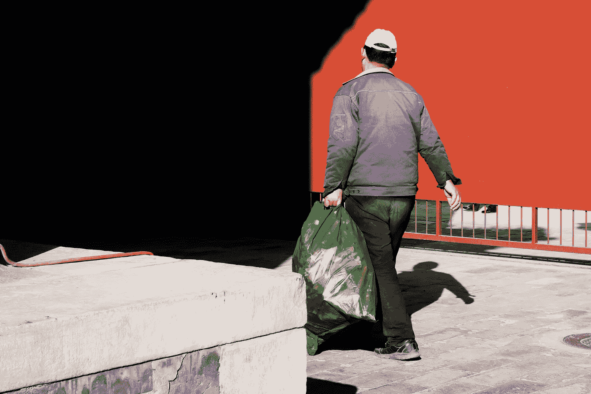

# 致富；成为一名清洁工！

> 原文：<https://medium.datadriveninvestor.com/get-rich-become-a-garbageman-12b64f4fcd4d?source=collection_archive---------8----------------------->

我们都得出了相同的结论:不，金钱不会让你快乐，但它可以让你买辆宝马，开着去 T2 四处寻找。

很多次，我和我的大学室友进行了永恒的大学讨论，就我而言，从未成功解决。如果你对任何特定的职业选择没有热情，就像大学生一样；做自己喜欢的事情好还是做让自己变得富有的事情好？

古老的*金钱让你幸福吗*两难！我们都得出了结论:不，金钱不会让你快乐，但它可以让你买辆宝马，开着去寻找快乐。

我们俩都蹒跚着读完了大学，毕业时都获得了文科学位。卡尔以优异成绩毕业。我只是有幸毕业了。

我成了股票经纪人，卡尔成了清洁工。

我继续做股票经纪人的工作，过上了相当不错的生活，并转向了房地产投资。

卡尔拼命工作，很快就变得富有了。

一开始，他在卡车上工作。没有员工。只有卡尔。

如果有一个新的开发项目破土动工，卡尔会与开发商达成协议，为购买新房的家庭提供几个月的“免费”垃圾服务。因为当时特拉华州北部没有城市垃圾处理服务，卡尔的价格会比其他运输公司低。他会处理掉顾客需要带走的所有东西，而他的竞争对手却限制他们带走的东西。

这是在人们对回收利用的生态敏感之前。

我记得有一天晚上在他家做客。他的压实卡车停在街上。他告诉我，他需要一个月做一次，因为他无法在前一天垃圾场关闭前到达那里。

 [## 人工智能如何在全球创造数百万个远程工作岗位|数据驱动的投资者

### 当人们谈论人工智能和就业市场时，他们经常谈论人工智能将如何从…

www.datadriveninvestor.com](https://www.datadriveninvestor.com/2020/02/26/how-ai-is-creating-millions-of-remote-jobs-around-the-world/) 

我敢打赌他的邻居一定很喜欢！

第二天早上 7 点我就离开了——很早。卡尔打算把他的卡车开到垃圾场。我会及时赶回费城，赶上股市开盘。我们俩同时离开家去上班，却发现 8 到 10 个学龄儿童围着压实机卡车。他们都在猛拉什么东西。小腿绷紧，支撑在卡车车身上，用于平衡和拉动悬挂在压实机外的 4 个附件。他们试图打开那 4 个东西的包装。卡尔后来告诉我，这些是他前一天最后一次停留时在当地兽医那里捡到的一只离去的英国獒犬的腿。他的压实机装满了，可怜的大家伙的腿没有完全压实。卡尔说，没有多少运输者会例行公事地从兽医那里带走安乐死的大型动物。总是额外收费。我们赶走了孩子们，他们继续每天步行去学校。

卡尔很快又买了一辆压实车，然后又是一辆，然后又是一辆，然后又是一辆。员工也一样。

他实际上变得非常富有和快乐。从来没有得到那辆宝马。

不管需要与否，他总是开着一辆旧的大众汽车。

他已经退休多年了。

我刚刚开始退休。

我有机会在佛蒙特州度过夏天。我会把它推荐给任何人。佛蒙特州人在过去几年中一直在努力解决的一个问题是，如何继续保持他们美丽的州接近原始状态，就像上帝创造它的时候一样。

大家都同意；在美丽的佛蒙特州应该有环保的垃圾处理方式。然而，有人把它搞得太复杂了。

结果，我弄不清*垃圾-垃圾-回收*的格式。在检查了每一关的*力量之后，我仍然不明白如何设置它。*

*我的大学室友是个清洁工，后来成了百万富翁。*

当他们告诉我，我必须为易拉罐购买特殊的透明袋，另一个单独的透明袋用于塑料回收，另一个用于纸张回收，另一个用于聚苯乙烯泡沫塑料，一个 3.5 美元的环保袋用于其他所有东西时——这没关系。但是当他们告诉我，我必须挖一个坑来装垃圾和堆肥之类的东西；蔬菜皮，水果废料和袋泡茶我皱起了眉头。我也被告知必须远离这个洞；肉、蛋壳、乳制品和油脂。像这样的物品必须单独运送到当地的垃圾场。

*我的问题；我甚至没有一个可以挖洞的院子。*

*每个人的问题:熊、驼鹿、鹿、浣熊、臭鼬和其他动物王国的居民，正是这些居民让绿山州吸引了如此多的人，当你把包拿出来取的时候，他们是不请自来的晚餐客人。没有罐头能阻挡这场盛宴。堆肥坑必须用泥土覆盖，然后挖出来，无论何时使用。*

清洁工星期一来收干净的袋子，另一个人星期四来我住的街道上收环保袋。

当我女儿告诉我她居住的华盛顿州也是如此时，我的神经细胞爆炸了！

就在返回宾夕法尼亚州之前，我看到了一则广告，幸运的是，在这里，我们躲过了几乎不可能遵守的大多数规则。它被刊登在佛蒙特州的《圣约翰斯伯里周报》上。显然，一些有事业心的人打广告说他们会去你家或公司拿走所有东西。这个新兴的创业公司会将垃圾分类，并以适当的方式为他们的客户进行处理。

嘿伙计们！你的公司有意义！

你什么时候上市？我来投资！

你想要什么颜色的宝马？

## 获得专家视图— [订阅 DDI 英特尔](https://datadriveninvestor.com/ddi-intel)