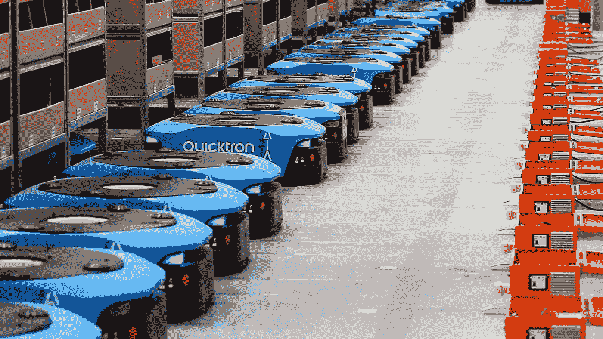
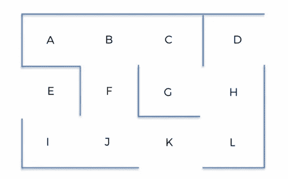
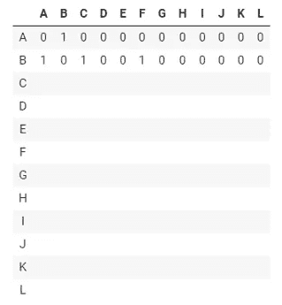
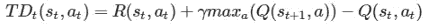
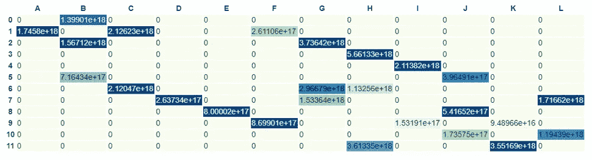
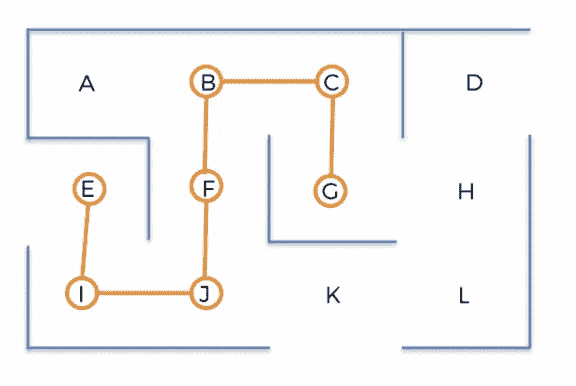
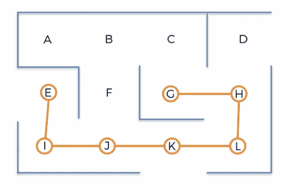

# Python Q-Learning 入门:如何自动化仓库机器人

> 原文：<https://medium.datadriveninvestor.com/get-started-with-q-learning-with-python-how-to-automatize-a-warehouse-robot-7bfae0180301?source=collection_archive---------5----------------------->

> 在本教程中，我将向您展示如何使用强化学习来自动化一个自主仓库机器人，以找到不同位置之间的最佳路径。



# 介绍

机器人技术的应用在每个商业领域都在不断扩大。自动化处理重复性任务，旨在消除人工输入，以优化流程和削减成本。

[](https://www.datadriveninvestor.com/2019/03/04/patterns-and-robotics-a-complex-reality/) [## 模式和机器人:复杂的现实|数据驱动的投资者

### 哈耶克的名著《复杂现象理论》(哈耶克，1964)深入探讨了复杂性的话题，并断言…

www.datadriveninvestor.com](https://www.datadriveninvestor.com/2019/03/04/patterns-and-robotics-a-complex-reality/) 

2012 年，亚马逊[收购了开发仓库机器人和相关技术的公司](https://pitchbook.com/news/articles/ma-flashback-amazon-announces-775m-kiva-systems-acquisition) Kiva Systems，Kiva 以 7.75 亿美元被收购。此外，许多其他公司，如阿里巴巴、大众汽车或 [Geek+](https://www.scmp.com/tech/start-ups/article/3031314/robotics-start-geekplus-push-expand-chinas-smart-logistics) 不断实现机器人和相关技术。

> 对于初学者来说，开始这样的话题可能是一场斗争，这就是为什么我认为把事情放到背景中，然后开始深入细节是重要的。

# 让我们开始:

在本指南中，我将模拟自主仓库机器人需要采取的行动，以便以最佳方式收集交付的产品，同时考虑机器人的位置、中间位置和最终位置。

此模拟中使用的仓库由不同的 12 个点组成，其形状如下:



该系统需要实时排列在这 12 个位置收集产品的优先级。例如，在特定时间`t`，系统将返回以下排名:


在这个例子中，位置 G 具有最高优先级，机器人必须以系统计算的最短路线移动到这个位置。

此外，位置`K`和`L`位于前 3 个优先级中，因此系统将通过在到达其最终最高优先级位置之前“步行”到一些中间位置来计算最短路线。

为了在 Python 中实现这一逻辑，有必要通过定义以下 3 个元素来将这一任务置于上下文环境中:

*   **美国**
*   **动作**
*   **奖励**

**状态**是机器人在每一时刻`t`可以处于的位置:

**动作**是机器人从一个位置移动到另一个位置时可能做的动作:

当然，当机器人在一个特定的位置时，有些动作它不能执行。这在模拟中通过一个**奖励矩阵**来指定，并通过对其不能执行的行为给予奖励 0 来指定。

奖励矩阵由状态和动作矩阵组成，0 代表机器人在该状态下不能执行的动作，1 代表机器人可以执行的动作。

从`A`位置开始，根据仓库地图，机器人只能去`A`位置，而在`B`位置则有可能移动到`A`、`C`或`F`位置。



该系统采用奖励矩阵，并向最高优先级位置分配高奖励，返回该位置的最佳路径，该系统基于**马尔可夫决策过程**，该过程可表示为以下元组:

`(S, A, T, R)`

其中:

*   `S`是状态的集合
*   `A`可以进行的一组动作
*   `T`定义在时间 t 处于状态 s 的动作 a 将导致在时间`t` +1 处于状态 s’的概率的转移规则
*   `R`由于动作`A`，从状态 s 转换到状态`s``后接收到的奖励函数

系统包含一个策略函数，它给定一个状态`S(t)`返回动作`A(t)`。

用π表示所有可能的策略动作的集合产生了最优化问题，其中最优策略π∫最大化累积奖励。

每一对动作`(s, a)`都关联有一个数值，记为`Q-value`；在`t=0` 处，当在时间`t`和状态`s(t)`处正在进行随机动作时，所有 Q 值都被初始化为 0，其带来状态`s(t) + 1`和奖励`R(s(t), a(t))`。

这个被称为 Q-Learning 的整个算法可以总结如下:

对于所有状态对`s`和动作对`a`，Q 值被初始化为 0。

初始状态为`s(0)`然后，执行随机可能动作，并到达第一状态`s(1)`。

对于每一个`t` ≥ `1`，直到某一个数字(在本案例研究中为 1000 次)，重复以下步骤:

**这可以应用到我们的例子中，让我们看看到底发生了什么:**

随机状态`s(t)`是从可能的 12 种状态中选出的

*   播放导致下一个可能状态的随机动作`a(t)`
*   到达下一个状态`s(t) + 1`，并且产生奖励`R(s(t), a(t))`
*   时间差`TD(t)(s(t); a(t))`:计算如下:



*   Q 值通过应用[贝尔曼](https://en.wikipedia.org/wiki/Bellman_equation)公式进行更新:


# 实施:

在这一部分中，正在实施 Q-learning 过程，以便为位置`G`创建奖励矩阵。

虽然之前已经定义了**动作**和**位置-状态**，但是现在有必要定义奖励矩阵和参数γ和α:

`gamma = 0.75`

`alpha = 0.9`

由于位置`G`具有最高优先级，可以如下定义奖励矩阵，给予位置`G`高奖励:

q 值由零矩阵初始化:

`Q = np.array(np.zeroes([12, 12]))`

然后实施 Q 学习过程，for 循环迭代 1000 次，重复 1000 次算法步骤:

位置 G 的 Q 值由算法计算，并且可以将它们可视化:



从图中可以看出，位置`G`的 Q 值最高，而远离`G`的位置 Q 值较低。

下一步是计算一个函数，该函数能够返回任意位置的最佳路线，而不仅仅是“硬编码”的`G`位置。

首先，有必要像之前在`location_to_state`中所做的那样，将每个状态映射到位置:

此时，为了计算返回任意位置最佳路径的函数，有必要重新定义`R`矩阵，删除硬编码的奖励:

现在，让我们将计算理想路线的逻辑封装到一个函数中:

以起始位置和结束位置作为参数调用此函数将返回所需的路径:

`route("E", "G")`



现在可以创建一个额外的函数`best_route()`,将起始、中间和结束位置作为输入，该函数将调用`route()`函数两次，第一次在起始和中间位置之间，第二次在中间到结束位置之间:

`best_route("E", "K", "G")`



# 参考

*   [Q-Learning 简介](https://www.freecodecamp.org/news/an-introduction-to-q-learning-reinforcement-learning-14ac0b4493cc/)
*   [强化学习](https://medium.com/machine-learning-for-humans/reinforcement-learning-6eacf258b265)
*   [Q-Learning 的数学](https://medium.com/datadriveninvestor/math-of-q-learning-python-code-5dcbdc49b6f6)

```
**I have a newsletter 📩.**Every week I’ll send you a brief findings of articles, links, tutorials, and cool things that caught my attention. If tis sounds cool to you subscribe.*That means* ***a lot*** *for me.*
```

 [## 米尔斯形式

### 编辑描述

无情-创造者-2481.ck.page](https://relentless-creator-2481.ck.page/68d9def351)