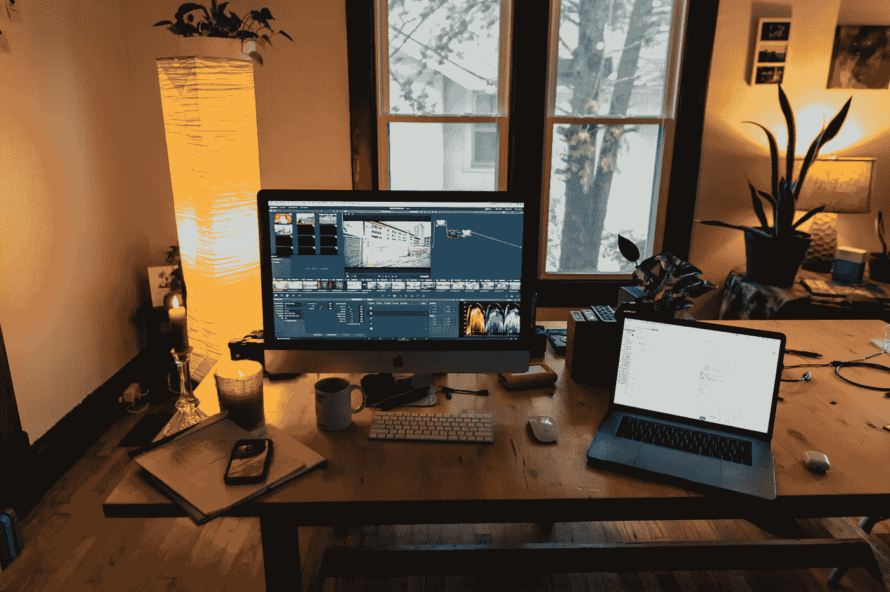
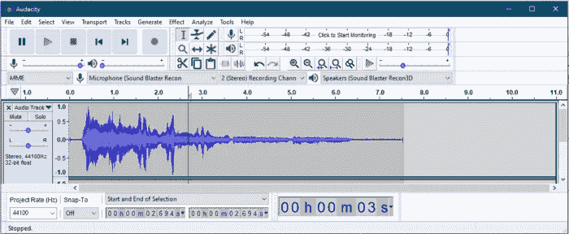
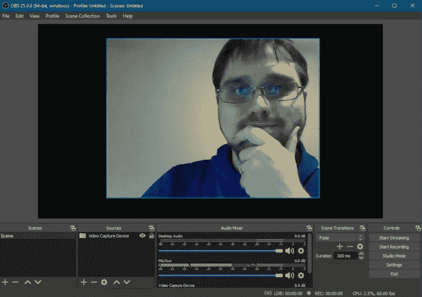
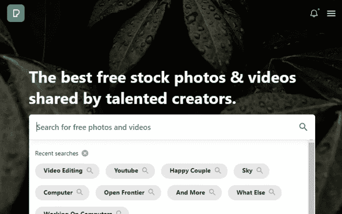

# 免费开始使用 YouTube

> 原文：<https://medium.datadriveninvestor.com/get-started-with-youtube-for-free-171e07744ca4?source=collection_archive---------25----------------------->

## 在 YouTube 上赚钱不一定要倾家荡产

成百上千的浏览。

接触到成千上万的追随者。

让别人听到你的声音。

滚滚而来的广告费。

我们大多数人都曾梦想成为一名成功的优步。然后现实来了。我需要买一架照相机。我需要购买音效、音频和视频编辑软件等等。我没有的东西太多了。然后你会让这个梦安定下来，它就消失了，而与此同时，世界各地的 YouTubers 用户继续生活在这个梦里。

# 免费开始使用 YouTube

你有智能手机吗？

它有照相机吗？

你有可以用来编辑视频的电脑吗？

如果是这样的话，我不想告诉你。你白白推迟了这个。你已经具备了开始 YouTubing 事业所需的一切。下面我将与你分享一些最好的工具，这样你就可以免费开始使用 YouTube 了！不再想会发生什么。停止拖延你的目标，开始行动吧！

 [## 您的企业今天需要虚拟现实营销的 3 个原因|数据驱动的投资者

### 新冠肺炎是并将继续是一个前所未有的全球性事件，将医疗保健系统和全球经济带到…

www.datadriveninvestor.com](https://www.datadriveninvestor.com/2020/04/09/3-reasons-why-your-business-needs-vr-marketing-today/) 

别担心，所有这些工具要么是开源的，不盈利的，要么是免费的。这些链接不是附属链接。

# 视频编辑——来自 OpenShot.org 的 OpenShot

OpenShot 是一个免费的视频编辑套件，可以在 Windows、Linux 或 Mac 上使用。所有的功能，你需要像专业人士一样工作，但你绝对不会花一分钱。它很容易使用，但你仍然需要一些时间来习惯一切是如何工作的。

您将能够添加水印，可视化音频文件，使用关键帧和动画编辑器，以及切碎您的剪辑，使一切都完美地流动。OpenShot 是您在视频编辑方面所需的一切。

你甚至可以使用我最喜欢的另一个免费程序 [Blender](https://www.blender.org/) 来创建专业外观的标题幻灯片。如果你已经掌握了在 Blender 中构建 3D 模型的诀窍，将它们的渲染融入到你的视频中可以将你带到一个全新的水平。然而，我只是在这个文档中介绍了您需要的内容。

立即在 OpenShot.org[下载](https://www.openshot.org/)。

你已经有了视频，那么声音呢？使用 Audacity，你将能够做专业人士能做的一切，而不会影响你的钱包。开源，跨平台，无论你运行的是什么类型的计算机，Audacity 都可以帮助你满足所有的音频制作需求！

您可以使用 Audacity 以各种音质进行录音。您可以导出为各种格式，插件支持让您定制您的安装，以便您可以按照您的需要工作。

立即在 AudacityTeam.org 下载。

# 屏幕录制—来自 OBSProject.com[的 OBS 工作室](https://obsproject.com/)

你是否在做教程，当你在电脑上做的时候，你可以向你的用户展示你在做什么？也许你正在传输你的游戏？没什么大不了的。重要的是 OBS Studio 可以帮你搞定这一切。

OBS Studio 由 Twitch 和 NVidia 等大牌公司赞助，可以让您立即投入使用。

立即在 OBSProject.com[下载](https://obsproject.com/)。

# 库存照片—Pexels.com

我知道你在想什么。我现在有了准备视频所需的一切。我准备好了！

但是等等！视频制作不仅仅是记录你自己并上传到网上。库存照片可以增加视频的专业性和外观。此外，他们也有一些股票视频。

Pexels 许可证非常清楚地说明了你可以从他们的网站上得到什么。然而，请记住 Pexels 确实有一些广告混合在他们的可下载股票中，显示来自其他付费网站的股票照片。

现在就浏览 Pexels.com。

# 你准备好免费使用 YouTube 了吗？

我希望你是，因为你有一切你需要的东西让它变大。带着你的想法去做吧。你可以通过努力工作和坚持不懈来实现它。

一旦你的视频准备好了，前往[Studio.YouTube.com](https://studio.youtube.com/)用你的谷歌账户登录，这里是你上传视频的地方，你的故事开始了。

*原载于 2020 年 9 月 2 日 https://patrickfluke.com***。**

***获取专家观点—** [**订阅 DDI 英特尔**](https://datadriveninvestor.com/ddi-intel)*