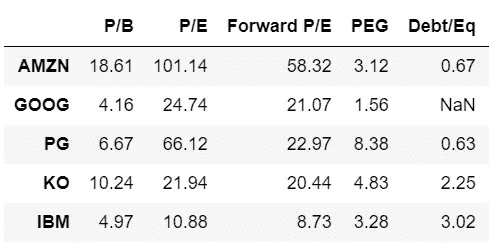
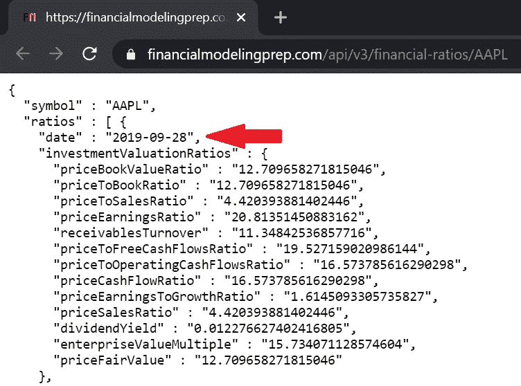
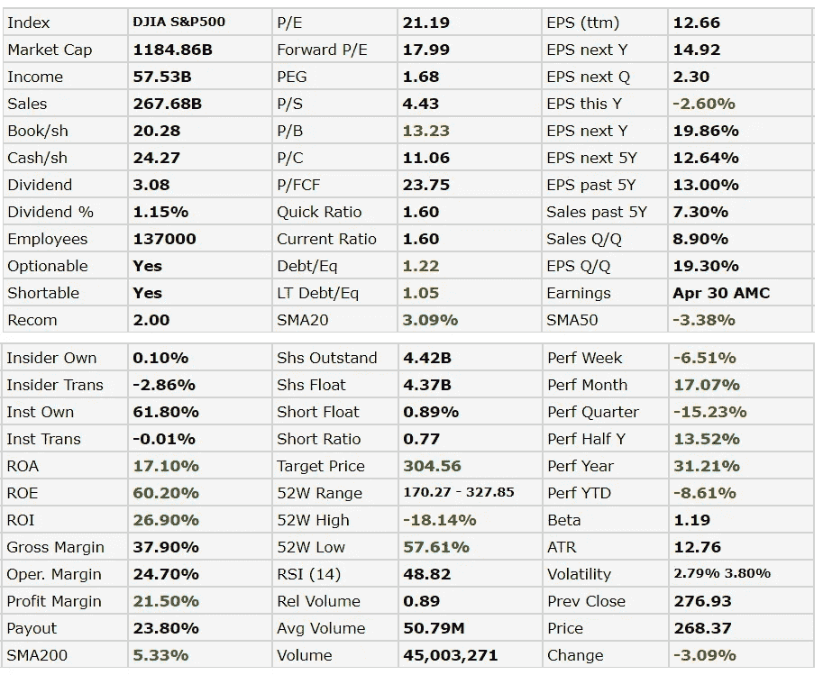
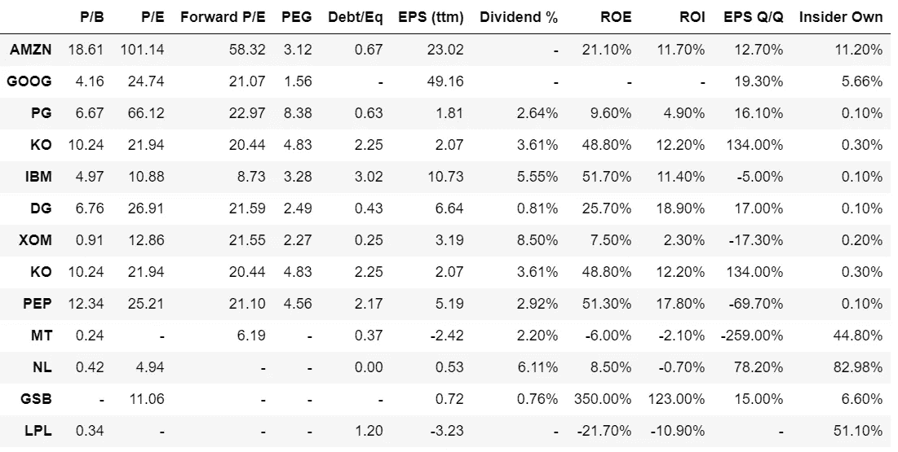
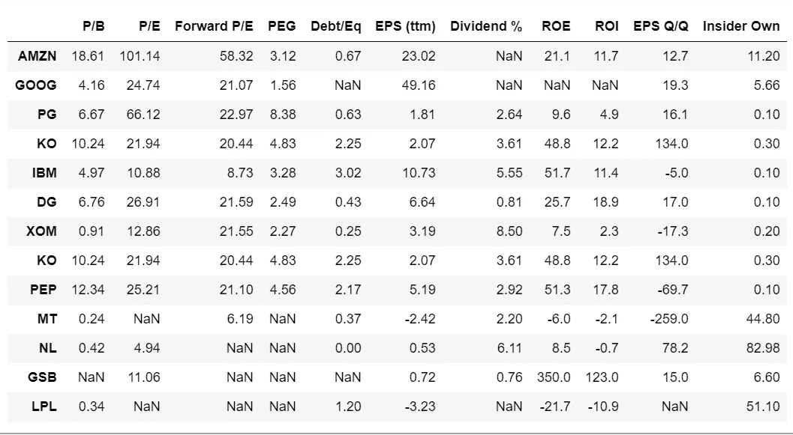
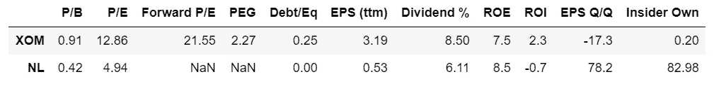
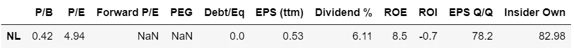
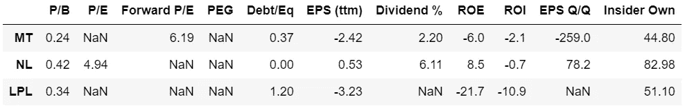

# 使用 Python 获得最新的股票财务比率

> 原文：<https://medium.datadriveninvestor.com/get-up-to-date-financial-ratios-p-e-p-b-and-more-of-stocks-using-python-4b53dd82908f?source=collection_archive---------0----------------------->

## 大多数其他 API 提供过时的年度/季度财务比率。这里我们从 FinViz 获取每日更新的数据。


Photo by [Adam Nowakowski](https://unsplash.com/@adamaszczos?utm_source=medium&utm_medium=referral) on [Unsplash](https://unsplash.com?utm_source=medium&utm_medium=referral)

# 基本面分析

如果你投资股票，你很可能听说过 [**基本面分析**](https://www.investopedia.com/terms/f/fundamentalanalysis.asp) 如何让你成为一个更明智的价值投资者。

> 基本面分析(FA)是一种[通过检查相关的经济和金融因素来衡量证券内在价值](https://www.investopedia.com/terms/v/valuation.asp)的方法。
> 
> 最终目标是得出一个数字，投资者可以与证券的当前价格进行比较，以了解该证券是被低估还是被高估。

以上是**基本面分析**的定义，引自 [Investopedia 的定义](https://www.investopedia.com/terms/f/fundamentalanalysis.asp)。

# 财务比率

如果你熟悉基本面分析，你可能还听说过**财务比率**在评估一家公司价值时的作用，比如**市盈率(P/E)** 比率、**市净率(P/B)** 比率、**市盈率/增长率(PEG)** 比率，以及**负债权益比率(D/E)** 比率。如需了解更多信息，请点击下面的链接。

[](https://www.investopedia.com/articles/fundamental-analysis/09/five-must-have-metrics-value-investors.asp) [## 价值投资者的 5 个必备指标

### 虽然没有“正确的方法”来分析一只股票，价值投资者求助于财务比率来帮助分析一只股票

www.investopedia.com](https://www.investopedia.com/articles/fundamental-analysis/09/five-must-have-metrics-value-investors.asp) 

能够在 Python 中**获得自己喜欢的股票**的这些比率**而不用浏览一个又一个网站不是很好吗？**



There are many more ratios and metrics you can obtain, as will be stated later.

> 然而，大多数 API 给出了过时的年度/季度财务比率。

获得财务报表的一个非常流行的 API 是来自财务建模准备(下面的链接)，但是，它给出了过时的年度/季度财务比率(见下面截图中的红色箭头)。

[](https://financialmodelingprep.com/developer/docs/#Company-Financial-Ratios) [## 免费股票 API 和财务报表 API - FMP API

### 该文档包括财务报表 API、免费股票 API 和历史报价 API。查找全部…

financialmodelingprep.com](https://financialmodelingprep.com/developer/docs/#Company-Financial-Ratios) 

Financial ratios from Financial Modeling Prep are outdated annual/quarterly data (most recent data is from September last year). This API request was made on 22nd April 2020.

尽管这些数据已经过时，但在分析每家公司过去几年的**历史**比率时仍然有用。此处给出了使用金融建模准备 API 的指南[。](https://medium.com/datadriveninvestor/how-to-get-financial-ratios-using-python-18131b63ef29)

# 使用 Python 从 FinViz 解析最新财务比率的分步指南

> 是的，在这里我们获得了最新的比率。

## 1.导入库

首先，我们导入存储数据所需的库。需要 `BeautifulSoup`来解析来自 [FinViz](https://finviz.com/) 的数据，而需要`urllib.request`来获取数据。如果你还没有库的话，你可能需要做`pip install urllib3`和`pip install bs4`。

```
# For data manipulation
import pandas as pd
from urllib.request import urlopen, Request# To extract fundamental data
from bs4 import BeautifulSoup
```

## 2.获取和解析数据的函数

接下来，我们编写从 FinViz 网站获取和解析数据的函数。这里给出了一个显示 AAPL 财务比率的网站示例。

[](https://finviz.com/quote.ashx?t=AAPL) [## AAPL 苹果公司股票报价

### 苹果公司设计、制造和销售智能手机、个人电脑、平板电脑、可穿戴设备和配件…

finviz.com](https://finviz.com/quote.ashx?t=AAPL) 

下面是从上面的页面解析 html 以从页面的表格中获取比率所需的函数。基本上，比率是在 html 表中，带有类属性*‘snapshot-td2’*。请参考 [BeautifulSoup 的文档](https://www.crummy.com/software/BeautifulSoup/bs4/doc/)了解更多。

```
def fundamental_metric(soup, metric):
    return soup.find(text = metric).find_next(class_='snapshot-td2').textdef get_fundamental_data(df):
    for symbol in df.index:
        try:
            url = ("[http://finviz.com/quote.ashx?t=](http://finviz.com/quote.ashx?t=)" + symbol.lower())
            soup = bs(requests.get(url).content) 
            for m in df.columns:                
                df.loc[symbol,m] = fundamental_metric(soup,m)                
        except Exception as e:
            print (symbol, 'not found')
    return df
```

## 3.列出你感兴趣的股票和其他比率/指标

访问步骤 2 中给出的 FinViz 网站，查看您可以获得的所有比率和指标。从网站上摘下的表格如下所示。



Table for AAPL stock from [FinViz Page](https://finviz.com/quote.ashx?t=AAPL), page visited on 22nd April 2020

> 其他有用的指标，如市值、收入、利润率，甚至员工人数和内部人士的持股比例也给出了。

```
stock_list = ['AMZN','GOOG','PG','KO','IBM','DG','XOM','KO','PEP','MT','NL','LPL']metric = ['P/B',
'P/E',
'Forward P/E',
'PEG',
'Debt/Eq',
'EPS (ttm)',
'Dividend %',
'ROE',
'ROI',
'EPS Q/Q',
'Insider Own'
]
```

## 4.初始化 Pandas DataFrame 并将 FinViz 中的数据存储在其中

```
df = pd.DataFrame(index=stock_list,columns=metric)
df = get_fundamental_data(df)
df
```

生成的数据帧如下所示。需要做进一步的工作，因为这些值被识别为**字符串**。这是因为缺少标记为“-”的值以及“%”符号。在进行任何形式的分析之前，我们需要将所有东西转换成数字数据。



## 5.数据清除:进一步将数据解析成数字类型

```
df['Dividend %'] = df['Dividend %'].str.replace('%', '')
df['ROE'] = df['ROE'].str.replace('%', '')
df['ROI'] = df['ROI'].str.replace('%', '')
df['EPS Q/Q'] = df['EPS Q/Q'].str.replace('%', '')
df['Insider Own'] = df['Insider Own'].str.replace('%', '')
df = df.apply(pd.to_numeric, errors='coerce')
df
```

我们删除了“%”，将所有内容都转换成数字数据，得到以下输出。



Table of Financial Ratios of Your Favourite Stocks Obtained using Python

我们完了！让我们筛选理想的公司。

# 筛选理想的公司

这些是你可以用这些数据做什么的例子。

## 筛选低估值公司，即市盈率< 15 and P/B < 1

```
df_filtered = df[(df['P/E'].astype(float)<15) & (df['P/B'].astype(float) < 1)]
df_filtered
```



## Further filter for companies which have demonstrated earning power EPS Q/Q > 10%

在这里，我们在上述标准的基础上进行筛选。

```
df_filtered = df_filtered[df_filtered['EPS Q/Q'].astype(float) > 10]
df_filtered
```



## 管理层在企业中拥有大量所有权，即内部人拥有超过 30%的股份

筛选出内部人士拥有大量股权的公司也是一件好事。这是为了确保管理层的利益与股东的利益一致。我在这里分别筛选出了这些公司。

```
df = df[df['Insider Own'].astype(float) > 30]
df
```



希望以上对你有用。所有代码都可以在我的 GitHub 库的这个 Python 笔记本中找到。当然，现在由您来决定如何处理这些数据！

如果你喜欢这篇文章，你可以看看我的其他文章！

[](https://medium.com/@bohmian/sentiment-analysis-of-stocks-from-financial-news-using-python-82ebdcefb638) [## 基于 Python 的金融新闻股票情感分析

### 使用 Python 从 FinViz 网站的财经新闻标题中提取股票情绪

medium.com](https://medium.com/@bohmian/sentiment-analysis-of-stocks-from-financial-news-using-python-82ebdcefb638) [](/train-and-deploy-an-nlp-news-classifier-web-app-to-the-cloud-for-free-82655b6b32f4) [## 免费培训和部署一个 NLP 新闻分类器 Web 应用程序到云

### 训练 NLP 模型、将其嵌入 Python Flask Web 应用程序并将其部署到云上的分步指南

medium.datadriveninvestor.com](/train-and-deploy-an-nlp-news-classifier-web-app-to-the-cloud-for-free-82655b6b32f4) [](/how-to-calculate-intrinsic-value-of-a-stock-aapl-case-study-935fb062004b) [## 如何计算股票的内在价值(AAPL 案例研究)

### 获取公司数据和计算股票内在价值的逐步指南，包括网络应用程序

medium.datadriveninvestor.com](/how-to-calculate-intrinsic-value-of-a-stock-aapl-case-study-935fb062004b) [](/use-python-to-value-a-stock-automatically-3b520422ab6) [## 使用 Python 对股票进行自动估值

### 苹果股票是否被高估？只需输入 Ticker，让 Python 自动决定！

medium.datadriveninvestor.com](/use-python-to-value-a-stock-automatically-3b520422ab6) [](https://medium.com/@bohmian/membership) [## 通过我的推荐链接加入 Medium-Bohmian

### 作为一个媒体会员，你的会员费的一部分会给你阅读的作家，你可以完全接触到每一个故事…

medium.com](https://medium.com/@bohmian/membership) 

在 [**数据科学/ AI / ML / DL**](https://app.ddichat.com/category/data-science-ai-ml-dl) **:** 中安排 DDIChat 会话

[](https://app.ddichat.com/category/data-science-ai-ml-dl) [## 专家-数据科学/ AI / ML / DL - DDIChat

### DDIChat 允许个人和企业直接与主题专家交流。它使咨询变得快速…

app.ddichat.com](https://app.ddichat.com/category/data-science-ai-ml-dl) 

在这里申请成为 DDIChat 专家。
与 DDI 合作:[https://datadriveninvestor.com/collaborate](https://datadriveninvestor.com/collaborate)
点击此处订阅 DDIntel [。](https://ddintel.datadriveninvestor.com/)