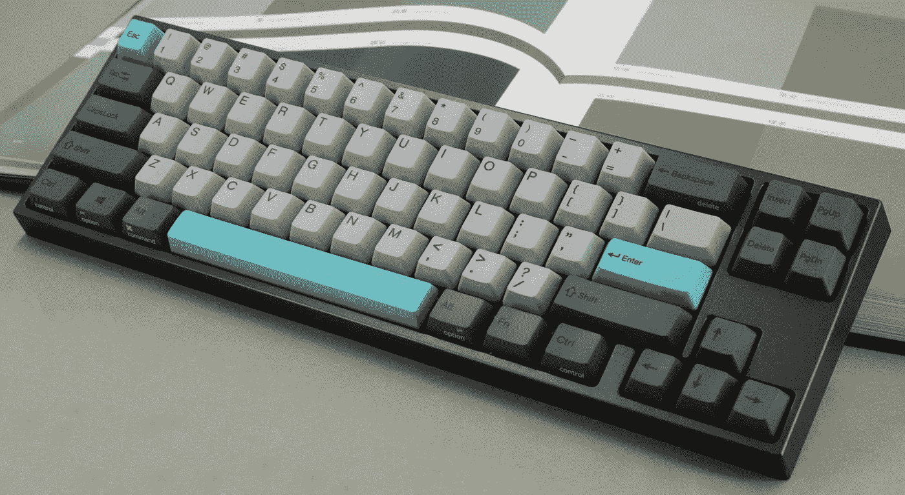
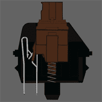
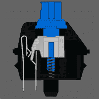
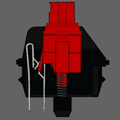
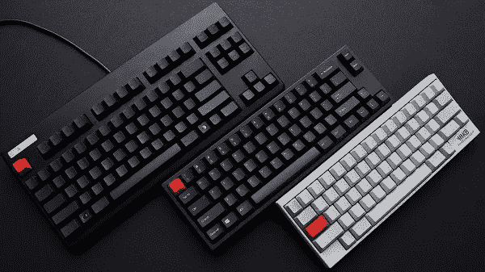
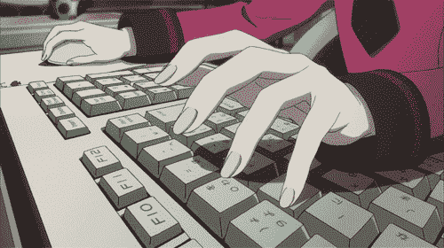

# 给自己买个机械键盘。

> 原文：<https://medium.datadriveninvestor.com/get-yourself-a-mechanical-keyboard-ff443433a036?source=collection_archive---------10----------------------->

对于我们这些 MacBook 用户来说，我们都知道总有一天我们的键盘会失灵。错别字，死键等等，我们知道这个故事。然后，你到了苹果商店，你知道什么…你已经过了保修期，你必须支付可怕的苹果税，这有时可能比你实际的笔记本电脑还贵！这种生活方式已经不复存在了。在这篇博客中，我们将谈论机械键盘，以及它们如何改善你的打字体验，让你少去几次天才吧。

# 什么是机械键盘？

那么，什么是机械键盘呢？发展于 80 年代的机械键盘是一种由按键开关组成的键盘。一般来说，按键开关通常是弹簧触发机制，根据用户偏好的按键开关类型而有所不同。这些开关使得机械键盘如此特别。这些键盘通常比典型的薄膜键盘和笔记本电脑键盘质量更高，使用时间更长。

机械键盘可以是高度可定制的。提供不同类型的开关，它们具有独特的特性、不同的键盘布局配置、尺寸和重新编程键盘按键的功能。

# 更好的打字体验

如前所述，各种按键开关允许不同类型的打字体验。一些开关需要较小的力来启动，而另一些开关在按键启动前具有触觉凸起。这有助于缓解打字疲劳，减少打字错误，提高打字速度，因为你感觉很舒服！对于那些职业要求我们长时间打字的人来说，舒适是生产力的关键。让我们来看看几种不同类型的钥匙开关。

*   **Cherry MX Blue** 开关在打字时提供了触感和卡嗒声。这些特点对于打字时想要声音反馈的人来说很方便。

*   与蓝色不同的是， **Cherry MX Red** 开关提供了一种平滑、线性和无声的点击，只需要很小的力就可以启动。这是我个人最喜欢的，游戏玩家和打字员最常用它。

*   **樱桃色 MX 棕色以独特的方式将蓝色和红色**融合在一起。虽然与蓝色开关相比，它们相当安静，但在打字时仍然会有触感。

# 尺寸很重要

机械键盘有许多不同的尺寸来满足您的需求。它们的范围从 100%(全尺寸)键盘到 TKL(少十个键-去掉数字小键盘)，一直到 40%的紧凑型键盘。这些选项让您可以自由地只拥有自己需要的按键，占用更少的桌面空间，让您摆脱只使用 MacBook/通用笔记本电脑键盘的习惯。

我希望这篇博文能帮助你进入机械的世界。它们使用起来非常有趣，可以定制，而且价格实惠。要了解更多，我会推荐一些网站给你看看。打字愉快！

## 网站列表

> [https://www.reddit.com/r/MechanicalKeyboards/](https://www.reddit.com/r/MechanicalKeyboards/)
> 
> https://www.cherrymx.de/en
> 
> 【https://keyboard.university/ 
> 
> [https://www . das keyboard . com/blog/what-is-a-mechanical-keyboard/](https://www.daskeyboard.com/blog/what-is-a-mechanical-keyboard/)