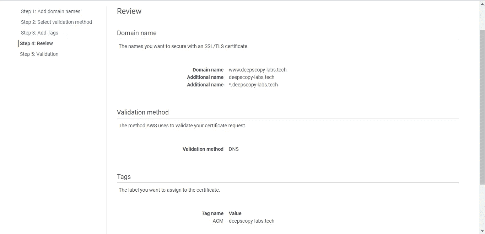

# 使用 AWS 证书管理器为您的域名获取 SSL/TLS 证书

> 原文：<https://medium.datadriveninvestor.com/getting-an-ssl-tls-certificate-for-your-domain-name-using-aws-certificate-manager-20604a89f03b?source=collection_archive---------7----------------------->

嘿大家好，

在这篇小文章中，我们将展示如何从 AWS ACM 免费获得 SSL/TLS 证书。

我想你已经登录到你的 AWS 管理控制台，并跳转到证书管理器，并点击申请证书。

1.  这里请求一个公共证书，对于一个私有证书，有单独的费用征收，并点击请求证书按钮。

2.在这里，我拥有一个域名 deepscopy-labs.tech，所以在这个域名中，我添加了我的域和子域，以便为它们获得一个证书。

注意，这里我使用了通配符*。deepscopy-labs.tech，这样我以后可以填写任何子域，进入下一步。

3.在这里，您可以选择任何方法来验证您的域名，电子邮件验证是一种直接的方法，所以我将涵盖 DNS 验证和下一个添加标签。

4.最后，我们确认并请求。

5.现在下载这个 excel 文件，它包含要插入到我们的 DNS 管理器中的 CNAME 记录，您可以看到它的状态是等待验证。

6.现在，我们将在 DNS 中添加两个这样的字段，您的域名提供商可以是 GoDaddy/Hostinger 等。

7.在域 DNS 管理器中添加 CNAMES，仅在 CNAME 记录中添加字母数字代码，放弃域名

8.现在我们**等待**，因为 **DNS 验证**可能需要 24 小时。

点击这里订阅英特尔[。](https://ddintel.datadriveninvestor.com/)

在这里加入我们的网络:[https://datadriveninvestor.com/collaborate](https://datadriveninvestor.com/collaborate)