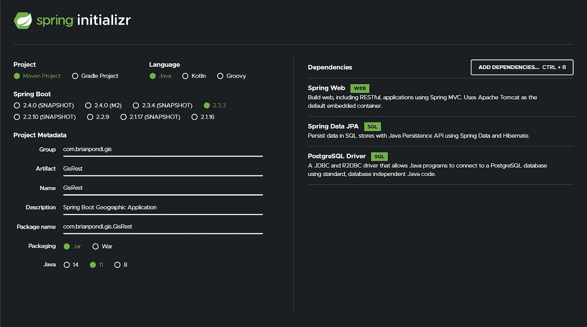
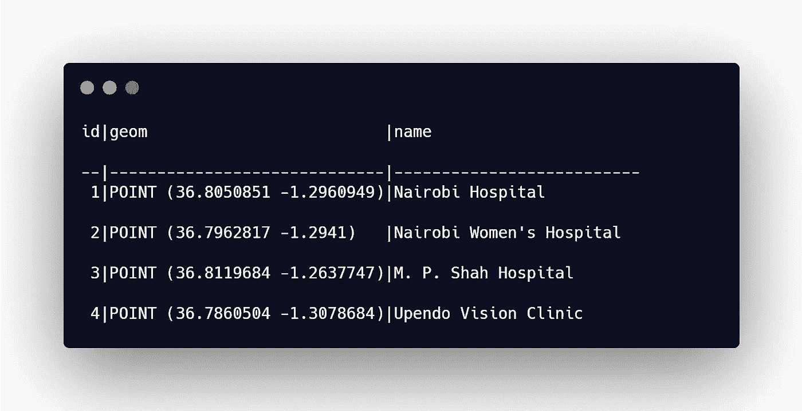
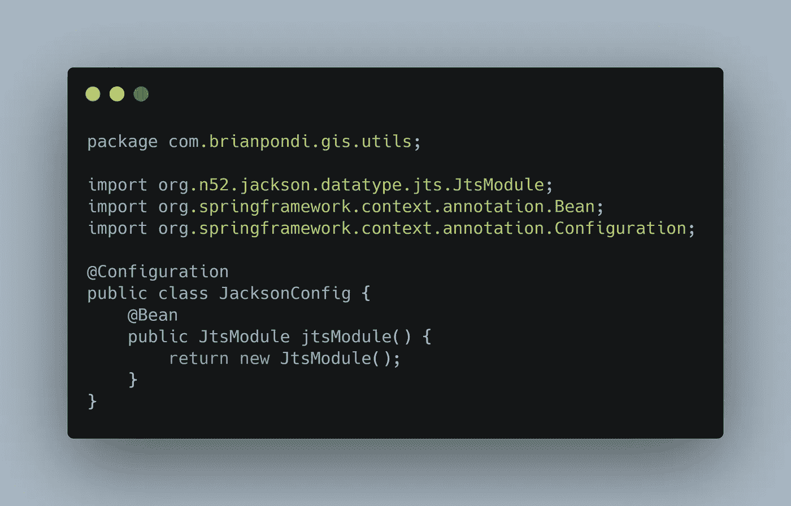
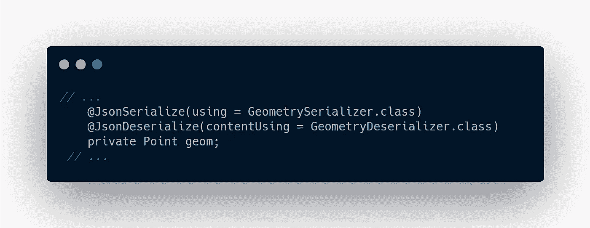
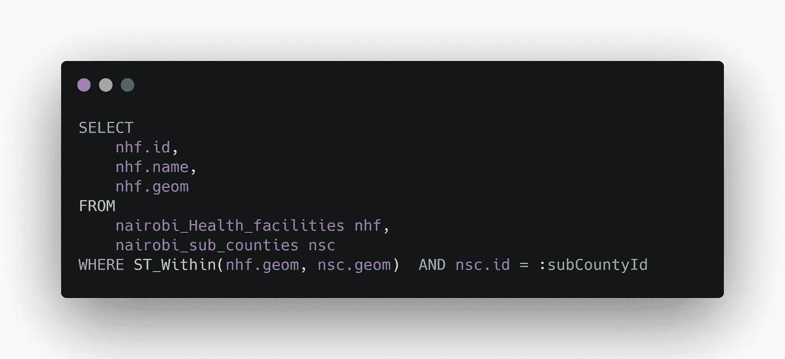
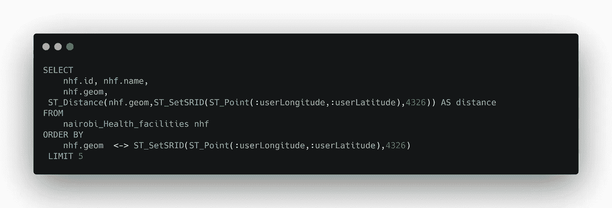
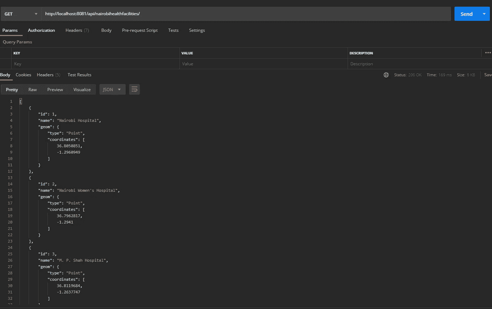
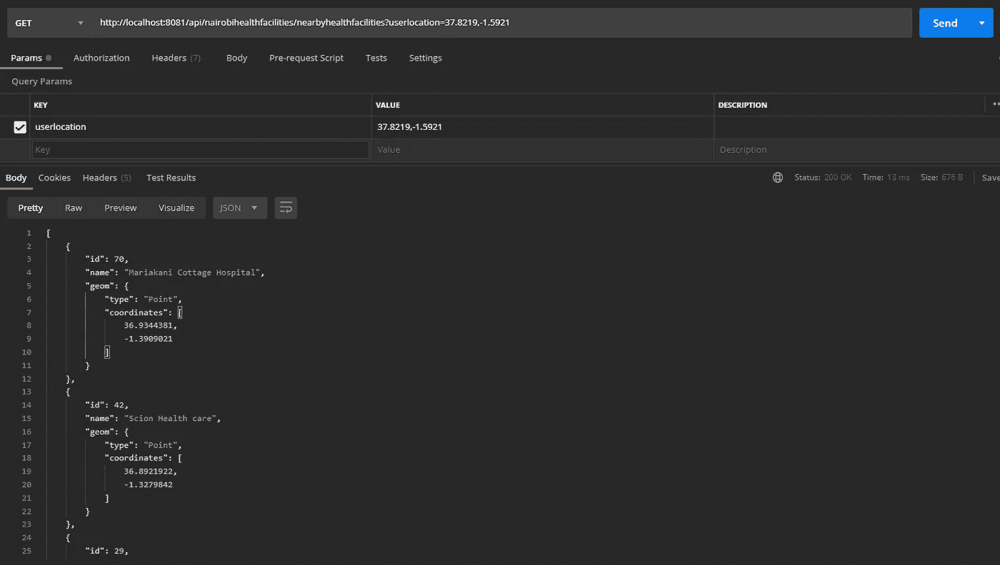
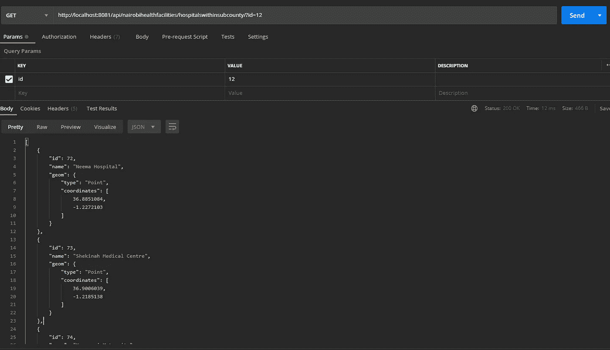

# 入门:用 Java 构建基于位置的(GIS)REST API

> 原文：<https://medium.datadriveninvestor.com/getting-started-building-location-based-gis-rest-apis-with-java-ca28a8869af3?source=collection_archive---------0----------------------->

## 向强大的爪哇致敬！一个独立的国王。☕


Photo by [Jessica Lewis](https://unsplash.com/@thepaintedsquare?utm_source=unsplash&utm_medium=referral&utm_content=creditCopyText) on [Unsplash](https://unsplash.com/s/photos/coffee?utm_source=unsplash&utm_medium=referral&utm_content=creditCopyText)

我们现在在爪哇，耶！😉🙌🏿。Java 是一门企业语言，如果你考虑为一家财富 500 强公司提供咨询或工作，那么掌握这门语言绝对不会出错。在 RedMonk 最近的一份报告中，Java 已经从按需编程语言的第二位跌落到第三位。我相信 Python 主要是随着它在数据科学社区的采用而发展的，此外，它还是一种多用途语言。Java 仍将是王者👑在企业中。

[](https://www.zdnet.com/article/programming-language-popularity-python-overtakes-java-as-rust-reaches-top-20/) [## 编程语言流行度:Python 超过 Java——Rust 进入前 20 名| ZDNet

### 编程语言 Python 现在稳稳地成为第二受欢迎的编程语言，这是第一次

www.zdnet.com](https://www.zdnet.com/article/programming-language-popularity-python-overtakes-java-as-rust-reaches-top-20/) 

下面是关于 Python/Django 的前一篇文章的链接，它也解释了 API 和为什么它很棒。

[](https://medium.com/datadriveninvestor/getting-started-building-location-based-gis-rest-apis-with-python-2fcbd520b2a3) [## 入门:使用 Python 构建基于位置的(GIS)REST API

### 我们正处于将 GIS 与 IT 运营完全整合的时代。帮助一个人实现这一目标的最大资源是…

medium.com](https://medium.com/datadriveninvestor/getting-started-building-location-based-gis-rest-apis-with-python-2fcbd520b2a3) 

我们将使用 [Spring Boot](https://spring.io/projects/spring-boot) 来构建我们的 API，因为它是最受欢迎的 Java 框架，但肯定还有像 [Micronaut](https://micronaut.io/) 和 [Quarkus](https://quarkus.io/) 这样的替代方案。所以让我们开始吧。🧐

# 1.项目定义

该项目与 Python 项目相同，我们将主要为两个数据集(即内罗毕医疗机构和内罗毕县)构建 GIS REST API。附加组件将是 GIS 的能力，查询最近的卫生设施时，给定一个用户的位置，也查询卫生设施的县边界。

这里是这个项目中使用的数据集的链接([点击这里](https://github.com/The-Code-Mastery/gis-rest-api-with-java/tree/master/src/main/resources/geodata))

# 2.项目设置

我假设您的计算机上安装了 Java (8、11 或 14)。有一些来自 Eclipse、NetBeans、IntelliJ IDEA 的 ide。我主要使用 IntelliJ IDEA，你可以使用任何你已经掌握得很好的，Spring 开发者也建立了一个开发 Spring 应用的免费工具，称为 [Spring Tools Suite](https://spring.io/blog/2020/03/20/spring-tools-4-6-0-released) ，你可以看看。

要开始，去[https://start.spring.io/](https://start.spring.io/)，你会得到一个如下图所示的界面，可能是一个灯光主题。



在该网站上，您可以定义您的项目需求，从使用 Java 或 Kotlin 作为您的主要编程语言，Spring Boot 版本(避免快照)和最新版本，打包到 Jar，项目选择 Maven 项目，您可以指定您本地安装的 Java 版本，项目元数据，最后，依赖项，其中必须有 Spring Web，Spring Data JPA，PostgreSQL。现在，您可以下载项目文件夹，并开始编写代码。其他关键依赖项将从 [Maven 库](https://mvnrepository.com/)安装。

pom.xml 文件是您项目中的一个重要文件，它使您能够从 [Maven 资源库](https://mvnrepository.com/)安装您的依赖项，如下所示。对于 Python 人员来说，这相当于 *pip install* 。确保有 Hibernate Spatial，Lombok，PostGIS，Spring Data JPA，PostgreSQL 依赖项。

```
<!-- [https://mvnrepository.com/artifact/org.projectlombok/lombok](https://mvnrepository.com/artifact/org.projectlombok/lombok) -->
<dependency>
    <groupId>org.projectlombok</groupId>
    <artifactId>lombok</artifactId>
    <version>1.18.12</version>
    <scope>provided</scope>
</dependency>*<!-- https://mvnrepository.com/artifact/org.hibernate/hibernate-spatial -->* <dependency>
    <groupId>org.hibernate</groupId>
    <artifactId>hibernate-spatial</artifactId>
    <version>5.4.20.Final</version>
</dependency>

*<!-- https://mvnrepository.com/artifact/net.postgis/postgis-jdbc -->* <dependency>
    <groupId>net.postgis</groupId>
    <artifactId>postgis-jdbc</artifactId>
    <version>2.5.0</version>
</dependency>
```

在应用程序的 resources 文件夹中，有一个 applications.propperties 文件。这是您在其他设置中对数据库进行设置的地方。

确保您使用的是*org . hibernate . spatial . dialect . postgis . PostGIS dialect*，因为我们正在利用 PostGIS 处理几何数据。

```
*spring.datasource.url*=jdbc:postgresql://localhost:5432/nairobigis*spring.datasource.username*=postgres*spring.datasource.password*=123456*spring.jpa.database-platform*=org.hibernate.spatial.dialect.postgis.PostgisDialect*spring.datasource.driver-class-name*=org.postgresql.Driver*spring.jpa.hibernate.ddl-auto*=update*server.port*= 8081
```

默认情况下，Spring Boot 安装自带的 tomcat 服务器运行在端口 8080 上，我刚刚将我的服务器设置为运行在 8081 上。

# **3。实体**

我假设您知道如何使用 PostgreSQL，并且它启用了 PostGIS 扩展。这使得能够以几何形式存储地理空间数据，如下图所示。对于内罗毕医疗机构空间数据，PostGIS 还提供了 1000 多种几何算法。我会一直推荐一本名为 [PostGIS in Action](https://www.manning.com/books/postgis-in-action-third-edition) 的书供你入门:



实体是数据库的普通旧 Java 对象(POJO)。它基本上定义了数据库中的表是什么样子，或者您有兴趣在特定的表中处理的数据列。

在我们的关键项目文件夹中，我们创建一个实体包，然后为我们的表创建实体。我只关注内罗毕医疗机构，我们创建了一个名为“内罗毕医疗机构实体”的实体类，它实现了一个可序列化的。

我们使用注释`@Entity` 来指定它处理我们的数据库表，使用`@Table`来指定表名，因为它在我们的数据库中。`@Getter`和`@Setter`来自 Lombok dependency，以避免我生成 Getters 和 Setters。

如堆栈溢出[这里](https://stackoverflow.com/questions/45713934/jackson-deserialize-geojson-point-in-spring-boot)和[这里](https://stackoverflow.com/questions/27624940/map-a-postgis-geometry-point-field-with-hibernate-on-spring-boot)中所讨论的，通常存在几何数据序列化的问题。这是因为 Jackson 是一个非常通用的序列化程序，你可能需要一个自定义的序列化程序，但令人惊叹的是社区已经为你做了。首先，确保您使用的是空间数据库方言。我找到了两个我喜欢的几何序列化器，一个是由 Bedata 驱动的([这里是](https://github.com/bedatadriven/jackson-datatype-jts))，另一个是由 52 North Initiative for Geospatial Open Source Software GmbH([这里是](https://github.com/52North/jackson-datatype-jts))

我选择了 52 North 的 one Initiative，因为它经常更新。将来自 [Maven 资源库](https://mvnrepository.com/artifact/org.n52.jackson/jackson-datatype-jts)的依赖项添加到 pom.xml 文件中。创建一个名为“utils”的包，并有一个 Jackson 配置类，如下所示:



现在，如果您使用的是*Hibernate Spatial*(*import org . location tech . jts . geom . point*)附带的几何图形导入，那么我不认为您会有任何问题，但是如果您有任何问题，那么您可以在您的几何图形列上添加以下注释。



# 4.仓库

存储库为我们提供了数据库访问以及所有为我们完成的创建、读取、更新、删除(CRUD)功能，我们还可以编写我们自己的定制空间查询，特别是针对地理信息系统。

在我们的主目录中，我们创建一个存储库包，然后在包中创建一个“内罗毕医疗机构”接口存储库，标注为`@Repository`。它扩展了 JpaRepository，附带了 CRUD 函数、分页和排序函数。它接受我们的实体名称和 Id 类型。

对于我们自己的附加 GIS 功能，我们实现了自己的空间查询来查找一个县内的医疗机构，我们还实现了根据用户的位置查找 5 个最近的医疗机构的功能。

查看下面的代码:

我展示了不在 Java 界面上时，普通 GIS 空间查找带有子计数的卫生设施的情况:



下面是一个普通的空间 SQL 查询，根据用户的位置查找 5 个最近的医疗机构，它还返回距离值:



让我们看看服务。

# 5.服务

服务基本上是具有业务逻辑的无状态服务，对于我们的例子，我们没有在这上面实现太多的业务逻辑。

我们创建了一个服务包，然后创建了一个“内罗毕卫生机构服务”java 接口，在这个接口中，我们定义了需要实现的契约，即查找所有卫生机构、查找单个卫生机构、查找一个县内的卫生机构、查找距离用户位置最近的 5 个卫生机构，以及在给定 id 时删除一个卫生机构。

然后，我们在服务包中创建一个名为“ *impl* 的文件夹，我们创建一个名为“内罗毕医疗机构服务 Imp”的新类，它实现了上面的接口。

该类使用`@Service`注释进行了注释，我们还使用`@Autowired`注释对内罗毕医疗机构存储库进行了依赖注入，因为我们需要存储库类在这里实现我们的逻辑:

合同中规定的所有方法都在上面实现。

最后，我们看看控制器，哇！😎

# **6。控制器**

控制器是指定您的公共 API 的类，在这一节中，我将重点介绍一个用于医疗机构的控制器，我还有一个用于内罗毕县边界的控制器。

我们创建一个控制器包，然后添加“内罗毕卫生设施控制器”类，它将生成我们的 API。

您可以在下面的代码中看到，我们的控制器类有两个注释，即`@RestController` 和`@RequestMapping`，它们基本上将我们的类定义为一个 REST 控制器，并且我们还为 Nairobi Health facilities API 定义了基本 URL。

根据一个人是否想要创建、读取、更新或删除数据，Spring Boot 提供注释来准确地做到这一点，即`@PostMapping, @GetMapping, @PutMapping,@DeleteMapping`

此外，用户可以为这些操作指定路径和变量。这里的关键注释是`@PathVariable`和`@RequestParam`，它们的用法很大程度上取决于你如何设计你的网站，所以请阅读后面的文档:

根据上面的代码，您可以看到我已经实现了 REST 端点功能来查找所有的医疗机构，根据 id 返回特定的医疗机构，返回指定的子县内的所有医疗机构，根据用户位置返回 5 个最近的医疗机构，最后使用医院 id 从数据库中删除一个医疗机构。

# 7.试用我们的 API

现在让我们试试我们的 API，这个项目的 GitHub 链接在这里:

[](https://github.com/The-Code-Mastery/gis-rest-api-with-java) [## 使用 java 的精通代码/gis-rest-api

### 一篇介绍地理信息系统的文章。GitHub 是超过 50 个…

github.com](https://github.com/The-Code-Mastery/gis-rest-api-with-java) 

所以你首先**运行**项目，我们开始测试我们的 API。我将使用[邮递员](https://www.postman.com/)来测试 API。

我们可以使用端点获取所有餐厅的信息:

```
[http://localhost:8081/api/nairobihealthfacilities/](http://localhost:8081/api/nairobihealthfacilities/)
```

这为我们创造了如下所示的所有卫生设施:



如果我们想要获得基于用户位置的最近的 5 个医疗机构，我们运行下面的 get 请求:

```
http://localhost:8081/api/nairobihealthfacilities/nearbyhealthfacilities?userlocation=36.8219,-1.2921
```

当您输入用户位置(经度和纬度)时，它会返回最近的 5 家医院，如下所示:



注意:我没有让我的 API 基于 Repository 部分的原生 SQL 查询生成距离数据。如果你需要用户位置数据的距离，你可以在一个新的包中创建一个模型响应 [POJO](https://en.wikipedia.org/wiki/Plain_old_Java_object) 并返回它。

最后，为了获得一个地区内的医疗机构，在我们的例子中是一个县，我们使用下面的 get 请求端点:

```
http://localhost:8081/api/nairobihealthfacilities/hospitalswithinsubcounty?id=12 
```

以下是 id 为 12 的内罗毕分县(Kasarani)的结果:



我还实现了内罗毕分县边界的关键查询，您可以在 GitHub 存储库中查看它们。

# 临别赠言…

我们已经在 Python 和现在的 Java 中实现了相同的概念，在使用 ReactJS 和 Openlayers 前端之前，我们将用 JavaScript 做最后一个。我们还将能够在资源消耗、性能等方面比较这三种实现。

当然，任何有学习意愿的人，是的，你可以。下面我分享了从基础到构建 REST APIs 的 Java 入门所需的资源。

请随意分享这篇文章以获得更广泛的读者，也请为你不认识的人看到这篇文章鼓掌，也就是说，如果你觉得它有用的话。😏

# 入门资源(免费)

Reddit learn Java 社区强烈推荐赫尔辛基大学的 *mooc.fi* 课程对初学者友好，所以这里有链接:

[](https://java-programming.mooc.fi/) [## 关于课程

### 欢迎来到赫尔辛基大学关于编程的免费大规模开放在线课程(MOOC )!这是一个更新的…

java 编程](https://java-programming.mooc.fi/) 

对于 YouTube 视频，您可以从以下内容开始:

下面是 Telusko Learning 的一个长系列:

对于帮助您入门的免费 Spring Boot 课程，我推荐 Java Brains:

Spring 文档是最好的文档之一:

[](https://spring.io/) [## Spring 让 Java 变得简单。

### 提高您的 Java 代码水平，探索 Spring 能为您做什么。

spring.io](https://spring.io/) 

# 入门资源(付费)

我会推荐 Udemy 的大部分课程，总会有折扣，让你只花 10 美元就能得到高质量的内容。

面向初学者的优秀 Java Udemy 课程:

[](https://www.udemy.com/course/master-practical-java-development/) [## 完整的 Java 开发认证课程

### 最新的更新包括具有 Java 9 特性的 Lambdas 和 Streams。欢迎掌握实用 Java 开发。这个…

www.udemy.com](https://www.udemy.com/course/master-practical-java-development/) 

面向精通其他语言的开发人员的优秀 Java Udemy 课程:

[](https://www.udemy.com/course/java-the-complete-java-developer-course/) [## 完整的 Java 软件开发人员大师班(针对 Java 10)

### 你刚刚在网上偶然发现了最完整、最深入的 Java 编程课程。拥有超过 480，000 名学生…

www.udemy.com](https://www.udemy.com/course/java-the-complete-java-developer-course/) 

Reddit Java 社区最推荐的 Spring Boot 课程，因为它教授基本概念和旧的做事方法:

[](https://www.udemy.com/course/spring-hibernate-tutorial/) [## 学习 Hibernate 和 Spring(作为初学者)教程

### Spring 5:学习 Spring 5 Core、AOP、Spring MVC、Spring Security、Spring REST、Spring Boot 2、百里香叶、JPA & Hibernate

www.udemy.com](https://www.udemy.com/course/spring-hibernate-tutorial/) 

我也使用并喜欢 Spring Boot 的课程，因为它涵盖了各种概念:

[](https://www.udemy.com/course/restful-web-service-with-spring-boot-jpa-and-mysql/) [## RESTful Web 服务、Java、Spring Boot、Spring MVC 和 JPA

### 这是一个非常实用的视频课程，旨在帮助初学 Java 的开发者构建他们的第一个 RESTful Web…

www.udemy.com](https://www.udemy.com/course/restful-web-service-with-spring-boot-jpa-and-mysql/) 

**进入专家视角—** [**订阅 DDI 英特尔**](https://datadriveninvestor.com/ddi-intel)