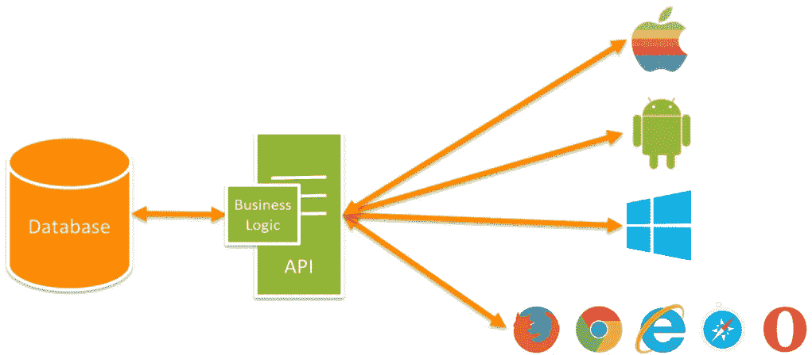
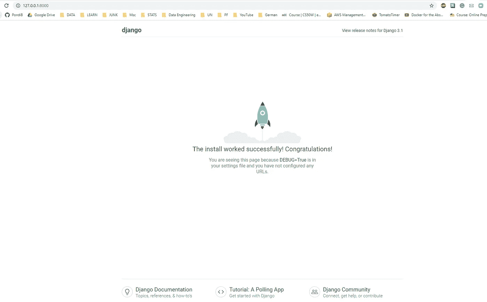
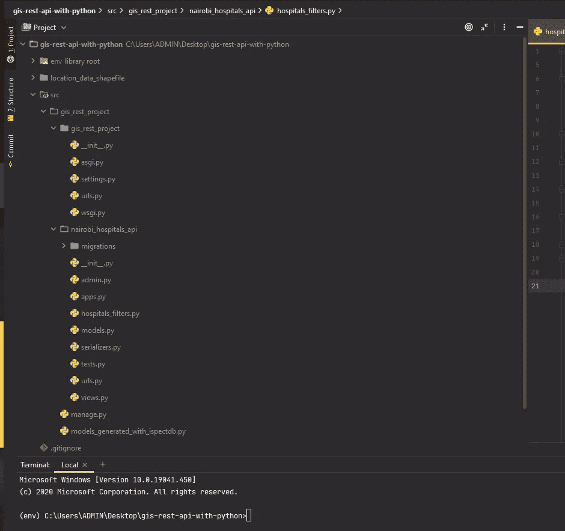
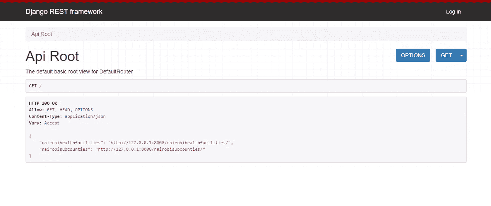
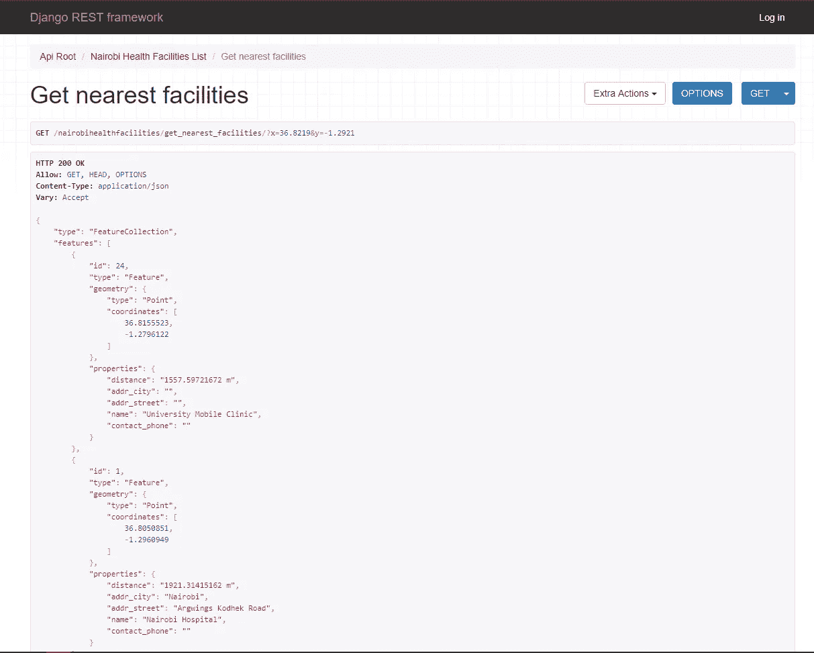

# 入门:使用 Python 构建基于位置的(GIS)REST API

> 原文：<https://medium.datadriveninvestor.com/getting-started-building-location-based-gis-rest-apis-with-python-2fcbd520b2a3?source=collection_archive---------0----------------------->


Photo by [Dayne Topkin](https://unsplash.com/@dtopkin1?utm_source=unsplash&utm_medium=referral&utm_content=creditCopyText) on [Unsplash](https://unsplash.com/s/photos/start?utm_source=unsplash&utm_medium=referral&utm_content=creditCopyText)

我们正处于一个将 GIS 与 IT 运营完全整合的时代，以便对更广泛的人群产生积极影响。帮助人们实现这一目标的最大资源是构建 REST APIs 的知识。犹他州 AGRC 是将 GIS 与 IT 运营相集成的最佳机构之一，他们的工作可在此处公开访问:

[](https://gis.utah.gov/#api) [## 犹他州地图门户

### 犹他州的州地理信息数据库(SGID)于 1991 年根据州法律建立，提供一站式下载和…

gis.utah.gov](https://gis.utah.gov/#api) 

REST 简单地代表**表述性状态转移**，它是一种在 HTTP 协议之上构建 API 的方法。这意味着您可以通过 web 执行 CRUD(创建、读取、更新、删除)数据库任务。此外，REST APIs 以 JSON 或 XML 格式返回数据。



Image Source : Techora

API 简单的代表[应用编程接口](https://www.infoworld.com/article/3269878/what-is-an-api-application-programming-interfaces-explained.html)。根据上图，您可以看到 API 已经获得了被多个平台上的用户使用的业务逻辑。GIS 业务逻辑的一个例子是，假设您有一个服装系列，但您希望根据客户的位置来确定不同的价格。您可以实现该业务逻辑，并让 API 将其共享给移动软件工程师和 Web 软件工程师来使用。

在本文中，我们将使用 Python 实现一个 REST API。我们将关注 [Django](https://www.djangoproject.com/) 框架，因为它有 [GeoDjango](https://docs.djangoproject.com/en/3.1/ref/contrib/gis/) ，但这并不意味着它是最好的，因为同样的框架可以使用 [Flask](https://flask.palletsprojects.com/en/1.1.x/) 、 [FastAPI](https://fastapi.tiangolo.com/) 和 [GeoAlchemy2](https://geoalchemy-2.readthedocs.io/en/latest/) 来实现。让我们开始吧:

# 1.项目定义

该项目将建立一个 GIS REST API，主要用于两个数据集，即内罗毕卫生设施和内罗毕县。一个附加组件将是地理信息系统的能力，查询最近的卫生设施时，给定一个用户的位置，也查询卫生设施的县边界。

以下是本项目中使用的数据集的链接([点击此处](https://github.com/The-Code-Mastery/gis-rest-api-with-python/tree/master/location_data_shapefile))

# **2。项目设置**

你需要在电脑上安装 [Python 3](https://www.python.org/downloads/) 。然后，我们可以设置一个工作目录和虚拟环境。我使用的是 windows 操作系统。

```
> pip install virtualenvironment> cd Desktop/> mkdir gis-rest-api-with-python
```

创建工作目录后，我们建立一个虚拟环境，并激活它

```
> cd gis-rest-api-with-python/> py -m venv env> .\env\Scripts\activate
```

我们现在可以安装所有的依赖项了

```
> cd gis-rest-api-with-python/> pip install django> pip install djangorestframework> pip install djangorestframework-gis> pip install psycopg2> pip install django-filter
```

[Pyscopg2](https://pypi.org/project/psycopg2/) 有助于 PostgreSQL 数据库连接，其余的就很清楚了🙂。

我们现在可以使用 Django 命令创建我们的项目和应用程序，然后我们可以看看这个设置是否有效。

```
> mkdir src> cd src/> django-admin startproject gis_rest_project> cd gis_rest_project/> python manage.py startapp nairobi_hospitals_api> python manage.py runserver
```

现在，您应该可以使用[*http://127 . 0 . 0 . 1:8000/*](http://127.0.0.1:8000/)在您的网络浏览器上看到下面的截图



耶！我们可以走了🤗。

不尽然，Lol，在你的项目文件夹里有一个 Django *setting.py* 文件，你需要添加一些你的依赖和应用

```
INSTALLED_APPS = [
.....
###'rest_framework','rest_framework_gis','nairobi_hospitals_api',]
```

**注意:** Django 得到了一个可以有多个 app 的项目。对于我们的例子，项目文件夹是 **gis_rest_project** ，而我们的 app 文件夹是 **nairobi_hospitals_api** 。要运行一个 *manage.py* 命令，您应该在项目文件夹中。

# 3.从现有数据库生成 Django 模型

PostgreSQL 和作为 GIS 扩展的 PostGIS 是目前开发和生产中最流行的存储地理空间数据的开源方式。如果你不熟悉波斯特吉斯，我可以推荐一本 [*波斯特吉斯在行动*](https://www.manning.com/books/postgis-in-action-third-edition) 。


基于上面的 PGAdmin 接口，我可以使用几何查看器查询和可视化我的空间数据。

您可以在 gis_rest_project 文件夹中的 settings.py 文件中设置数据库连接。

**注意:**窗口用户可能会遇到 GDAL 错误，因此使用 [OSGeo4W](https://trac.osgeo.org/osgeo4w/) 安装 GDAL。

要从现有数据库生成 Django 模型，请确保您在项目目录中，并运行以下命令:

```
python manage.py inspectdb > models_generated_with_inspectdb.py
```

这将为您生成空间数据库的模型，您可以将这些模型复制到 Django app 文件夹中的 model.py 文件中。您的 models.py 应该是这样的:

现在，您可以对模型进行迁移，以链接到您的数据库。

```
> python manage.py migrate
```

# 3.Django 序列化程序

我们只需要序列化程序将我们的数据转换成 JSON，这样就可以在互联网上使用了。我们在*Nairobi _ hospitals _ API*app 文件夹中创建一个*serializer . py*文件，然后使用*GeoFeatureModelSerializer*序列化我们的 2 个 Django 模型，因为这些是基于位置的模型。

上述序列化器将在我们的 Django 视图中使用。

# 4.Django 过滤器

Django filters 将帮助我们过滤数据顾名思义，让我们在我们的*Nairobi _ hospitals _ API*app 文件夹中创建一个名为 *hospitals_filters.py* 的文件。

我们创建一个名为*nairobihealthcfacilitiesfilter*的类，它继承了 *GeoFilterSet。*由于没有内置的 Django 函数来按照县以下的边界过滤数据，我们创建了自己的方法*get _ facilities _ by _ subcounty*来执行查询。

我们现在将在 Django 视图中使用这个类。

# 5.Django 观点

Django views 只是接受一个 web 请求并返回一个 web 响应。我们正在使用从*generic piview*继承而来的 *ModelViewSet* ，这带来了许多我们不需要自己实现的动作。对于非技术人员，这使我们能够对数据执行创建、读取、更新和删除(CRUD)操作。在 REST API 术语中，它们通常也称为 GET、PUT、POST 和 DELETE

为了获取用户的 GPS 位置并查询最近的 5 家医疗机构，我们在 nairobihealthcfacilitiesviewset 中编写了自己的名为 *get_nearest_facilities* 的 *GET action* *方法*并实现了查询。

我们就要完成了😜💪🏾。

# 6.Django URLs

URL 是 API 端点的入口点，因此是配置我们的 r outings 的关键。在 *gis_rest_project* 文件夹中，我们配置了 *urls.py* 来包含我们的 app *urls.py* 它还不存在。

我们移入我们的内罗毕医院应用程序文件夹，并创建我们指定的内罗毕医院 urls.py，在这里我们导入 Django 视图，并利用 Django REST 框架路由器作为我们的端点。

哦，是的，我们已经写完了一些代码😉🙂。

# 7.试用我们的 API

您最终的项目文件夹应该如下所示( [GitHub link](https://github.com/The-Code-Mastery/gis-rest-api-with-python) ):



现在，为了试验我们的 GIS rest API，我们需要启动服务器:

```
> python manage.py runserver
```

我们还可以访问本地主机上的两个 REST API 端点:

```
"nairobihealthfacilities": "[http://127.0.0.1:8000/nairobihealthfacilities/](http://127.0.0.1:8000/nairobihealthfacilities/)""nairobisubcounties": 
"[http://127.0.0.1:8000/nairobisubcounties/](http://127.0.0.1:8000/nairobisubcounties/)" 
```

在您的 web 浏览器上，它将类似于下图:



您还可以使用 id 或名称按国家边界过滤医疗机构。

```
**GET** /nairobihealthfacilities/?subcounty=12**GET** /nairobihealthfacilities/?subcounty=Kasarani
```

上述查询将返回 Kasarani(内罗毕)的医院数据，如下所示:


我们还可以通过查询用户位置的 GPS 坐标来获得 5 家最近的医院

```
[http://127.0.0.1:8000/nairobihealthfacilities/get_nearest_facilities/?x=36.8219&y=-1.2921](http://127.0.0.1:8000/nairobihealthfacilities/get_nearest_facilities/?x=36.8219&y=-1.2921)or**GET** /nairobihealthfacilities/get_nearest_facilities/?x=36.8219&y=-1.2921
```

获取 5 家最近医院的结果，包括到医院的距离(以米为单位):



# 8.API 文档

我没有为这个演示做过 API 文档，但是这是一个很好的实践，也是必要的。因为这将有助于那些使用你的 API 的人理解你构建了什么。您可以选择 Swagger 或 Redocly。

[](https://swagger.io/) [## 面向团队的 API 文档和设计工具| Swagger

### 使用我们的开源专业工具集，为用户、团队和企业简化 API 开发。了解如何…

swagger.io](https://swagger.io/) [](https://redoc.ly/) [## 最好的 API 文档工具

### 您可能听说过 ReDoc，它是由 OpenAPI(以前称为 Swagger)生成的 API 参考文档软件…

redoc.ly](https://redoc.ly/) 

# 临别赠言…

我试图让这个概念像我以前的文章一样容易理解，但它似乎更技术性，因为没有更简单的方法😅。我在下面分享了一些资源供你入门，如果你不熟悉编程，那么 Python 是一种很好的入门语言，尤其是对地理学家和 GIS 专业人士来说。

了解 Django 模型、视图、URL、过滤器是一个很好的起点，您可以利用本文中共享的资源在此基础上积累知识。

我将在本文中使用 Java(Spring Boot)和 JavaScript(NodeJS)实现相同的内容，然后，稍后，我们可以使用 LeaftJS 映射库或 OpenLayers3 和 ReactJS JavaScript 库在网站上使用 REST APIs 并可视化它们。

# 入门资源(文档)

文档通常有丰富的内容，所以下面是一些帮助您入门的链接:

Python 编程语言:

 [## 文件

### 欢迎光临！这是 Python 3.8.5 的文档。

docs.python.org](https://docs.python.org/3/) 

Django 网络框架:

 [## 姜戈概览|姜戈

### 使用 Django，您可以在几个小时内将 Web 应用程序从概念设计到发布。姜戈负责大部分…

www.djangoproject.com](https://www.djangoproject.com/start/overview/) 

Django Rest 框架:

 [## Home - Django REST 框架

### Django REST 框架是一个用于构建 Web APIs 的强大而灵活的工具包。您可能想使用 REST 的一些原因…

www.django-rest-framework.org](https://www.django-rest-framework.org/) 

Django 女孩社区:

[](https://djangogirls.org/) [## Django Girls 是一个为期一天的针对女性的关于 Python 和 Django 编程的研讨会

### Django Girls 是一个非营利组织，是一个授权和帮助妇女组织免费的一日…

djangogirls.org](https://djangogirls.org/) 

GeoDjango 文档:

 [## GeoDjango | Django 文档| Django

### GeoDjango 的目标是成为世界级的地理网络框架。它的目标是尽可能简单地构建 GIS…

docs.djangoproject.com](https://docs.djangoproject.com/en/3.1/ref/contrib/gis/) 

# 入门资源(免费视频)

不是每个人都擅长阅读文档，所以这些资源是为那些喜欢从视频内容开始的人准备的:

Python 编程(这方面最好的 YouTuber:科里·斯查费):

[](https://www.youtube.com/c/Coreyms/playlists) [## 科里·斯查费

### 欢迎来到我的频道。这个频道专注于为软件开发人员创建教程和演练…

www.youtube.com](https://www.youtube.com/c/Coreyms/playlists) 

Django 教程(CodingEntrepreneurs):

[](https://www.youtube.com/channel/UCWEHue8kksIaktO8KTTN_zg) [## 共同创业

### 《为企业家编程》是一个面向非技术创业者的编程系列。学习 Django，Python，API，接受…

www.youtube.com](https://www.youtube.com/channel/UCWEHue8kksIaktO8KTTN_zg) 

Django Rest 框架教程:

GeoDjango 教程(Wanjohi Kibui，一个很好的伙伴，他的系列 Geodjango 2 将很快推出)

[](https://www.youtube.com/c/WanjohiKibui/playlists) [## 万乔希·基布伊

### 这是一个获取 GIS 编程教程、软件评论、职业咨询和其他酷东西的渠道。我们是…

www.youtube.com](https://www.youtube.com/c/WanjohiKibui/playlists)