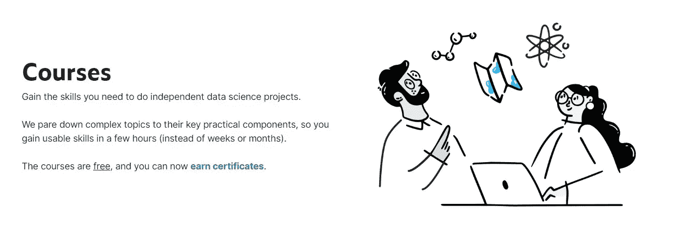
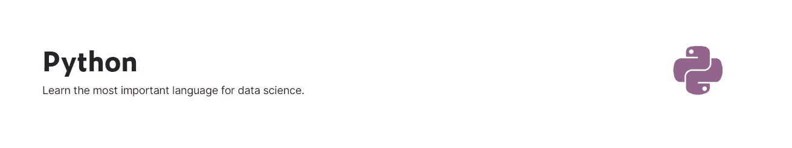
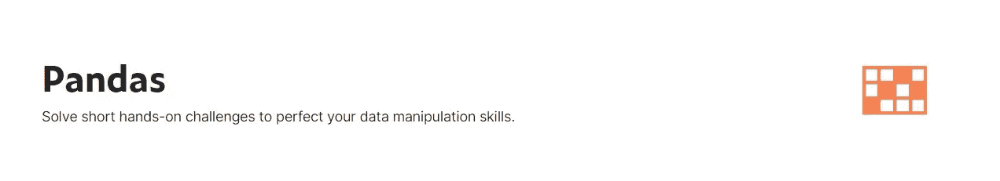
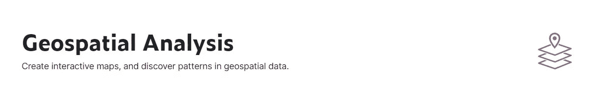
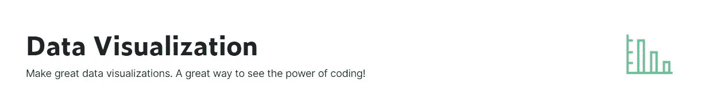
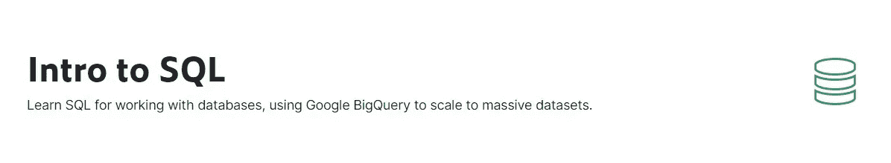
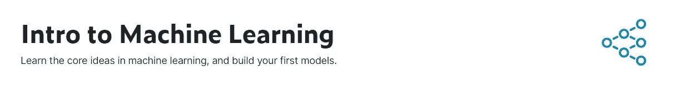
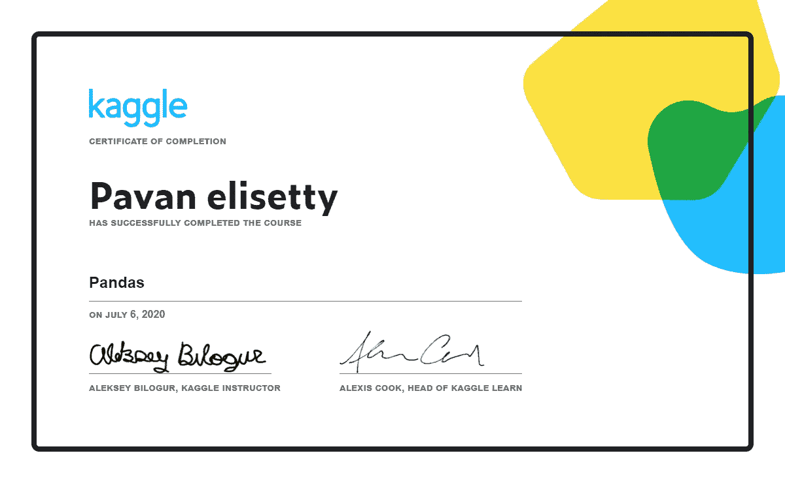

# Kaggle 微课程机器学习入门

> 原文：<https://medium.datadriveninvestor.com/getting-started-in-machine-learning-with-kaggle-micro-courses-2466cdb734d2?source=collection_archive---------4----------------------->

> 通过 Kaggle Learn 快速了解真实世界的机器学习

Image from Kaggle Courses Home page

几乎每个 ML 爱好者或来自数据科学社区的人都会知道 Kaggle。Kaggle 不仅是这些微型课程的所在地，也是数据科学竞赛、开源数据集、社区论坛和博客的所在地。Kaggle 竞赛不只是这么简单，但它会给你一个真实世界的视角来看待数据科学问题。

那么你能多快开始参加这些比赛呢？这只是注册 kaggle 的问题，它可以让你进入 kaggle 的微型课程。最棒的是，它们是完全免费的，你还可以从 kaggle 获得结业证书。顾名思义，这些都是微型的。每门课程大概需要几天或者一周的时间。这些课程是与行业相关的，它们简短而有趣。你不能指望从这些课程中获得所有的理论定义、基础和知识，因为它们侧重于实践方法。但是你会得到大部分。

Image from angle Micro-courses Homepage

# Kaggle 微课

Kaggle 微课范围从基础 python 到机器学习、NLP、数据可视化、熊猫、地理空间分析、强化学习等。，大约有。16 个这样的课程，每个课程都由几个模块组成，包括学习和练习部分，您需要完成练习部分才能解锁证书。您可以按照自己的节奏和灵活性来完成。这些练习是在 kaggle 内核上进行的。

# 参加这些课程的建议顺序

这个建议完全是我的，我已经参加了所有的课程，所以它完全是基于我的经验

我建议你按以下顺序学习课程:

1.  计算机编程语言
2.  熊猫
3.  地理空间分析
4.  数据可视化
5.  SQL 简介
6.  机器学习简介
7.  中级机器学习
8.  特征工程
9.  高级 SQL
10.  深度学习
11.  自然语言处理

正如我之前所说的，这纯粹是我的经验，你可以选择任何顺序的课程。

Image from kaggle Python Course HomePage

由于 Python 是机器学习和数据科学中使用最多的语言，这是因为它简单易用的 Python 语法和它在全球范围内蓬勃发展的庞大社区，如果你是数据科学领域的新手，kaggle 可以帮你搞定。在这个微型课程中，您将学习基本的 python 语法，并从 Hello World 开始！(程序员的传统)。然后，您将了解急需的函数、条件语句、循环等等。

Image from kaggle Pandas Course HomePage

**pandas** 是一款快速、强大、灵活且易于使用的开源数据分析和操作工具，构建于 **Python** 编程语言之上。你会在机器学习中大量使用熊猫。它用于数据操作和分析。它是最好的，因为它易于使用的内置函数和处理大量数据的能力。在熊猫微课中，你将学习创建、读取和写入数据。索引、选择、分组、排序以及处理缺失值。

Image from kaggle Geospatial Analysis Course HomePage

这个课程对于机器学习来说不是必须的，但是这个微型课程将帮助你创建和交互地图。有了这个，你就可以把机器学习应用到现实世界的应用中，比如地图。顺便说一下，这是一个很酷的微型课程，也是我最喜欢的课程。在这个微型课程中，他们使用了 fluous python 包，您还可以操作地理空间数据，并且可以生成聚类、热图和许多更令人兴奋的东西。

Image from kaggle Data Visualization Course HomePage

数据可视化是数据的图形表示。它包括生成图像，这些图像将所表示的数据之间的关系传达给图像的观看者。通常，您需要处理大量数据，并且很难从原始形式的数据中获得洞察力。然后数据可视化开始发挥作用，它帮助我们理解数据。在这个微型课程中，您将使用 seaborn 和 matplotlib python 包。也有一些其他的选择，但是这些更受欢迎和有效。

Image from kaggle Intro to SQL Course HomePage

**SQL** 代表结构化查询语言。 **SQL** 用于与数据库通信。在处理机器学习问题时，你经常会用到大型数据集。所以你需要处理它，操纵数据和检索数据。有不同种类的数据库系统，在这个特殊的微型课程中，您将使用 BigQuery。您将学习基本功能，如选择、位置、分组等。，以及您将在高级 SQL 中学习的其他复杂主题

Image from kaggle Intro to SQL Course HomePage

现在来看主要部分，即机器学习。简单来说，机器学习就是让计算机根据过去的例子进行预测。而维基的定义是“**机器学习**是人工**智能** (AI)的一种应用，它为系统提供了自动学习和从经验中改进的能力，而无需显式编程。**机器学习**专注于开发能够访问数据并利用数据进行自我学习的计算机程序。”

在这个特别的微型课程中，你将会了解到机器学习，欠适应，过适应，以及一些机器学习模型，比如随机森林，自动 ML 等等。，但是要提醒你，这是你 DataScience / ML 之旅非常基础但是非常好的开始！！

This is my certificate for pandas micro-course

> 这是 kaggle 微型课程的证书

其他的微课很少，每一门都绝对会让你受益，值得一上，而且是免费的！！

祝你事业顺利！！

*坚持学习！！*