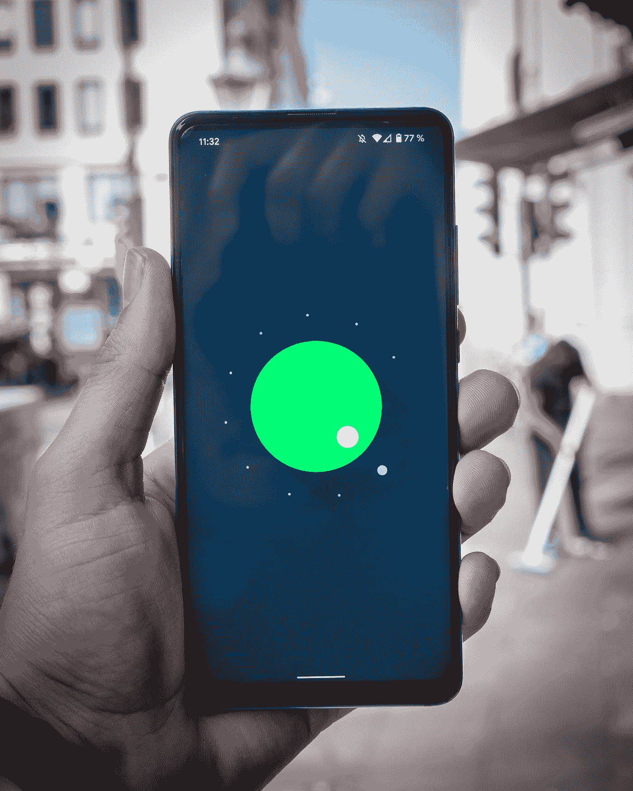

# Android 应用开发入门

> 原文：<https://medium.datadriveninvestor.com/getting-started-with-android-app-development-8f1814bd5266?source=collection_archive---------22----------------------->

*从你的第一个 Android 应用开始的提示*

Photo by [Mika Baumeister](https://unsplash.com/@mbaumi?utm_source=medium&utm_medium=referral) on [Unsplash](https://unsplash.com?utm_source=medium&utm_medium=referral)

从现在开始，我已经做了 5 年的 Android 开发者。我从开发伙伴那里得到的一些问题是关于*如何开始 Android 应用开发？我需要知道的基本知识是什么？*

根据我的应用程序开发经验，我将尝试分享 5 个基本技巧，以开始您的 Android 应用程序开发之旅。

# **1。安装 Android Studio**

这是开始开发*安卓应用*最重要也是最强制的一步。我见过一些开发人员开始阅读文档来开发应用。虽然阅读文档很好，但我个人建议先安装 Android Studio。这将有助于你将来阅读文件时练习一些任务。Android Studio 可以从链接— [*安装 Android Studio*](https://developer.android.com/studio) *安装。*Android Studio 设置完成后，创建一个*仿真器*设备，在 Android Studio 中运行您的第一个 Android 应用程序。关于在 Android Studio 中创建仿真器设备的更多信息，请使用此[链接](https://developer.android.com/studio/run/managing-avds)。

# 2.Android 架构

接下来试着了解一下 Android 的历史，以及 Android Stack 是由什么组成的。Android 的平台架构如下图所示

Platform Architecture of Android( [https://developer.android.com/guide/platform](https://developer.android.com/guide/platform))

这里，Linux 内核位于 Android 堆栈的底层。内核之上是 HAL 层，它帮助抽象音频、蓝牙等内核 API。HAL 层之上是本地 C++库，如用于音频和视频渲染的 OpenGL ES、用于浏览器功能的 Webkit 等。Android 运行时为运行 Android 应用程序提供了一个 JAVA 虚拟机。Java API 框架为音频、蓝牙和其他应用程序提供了 Java 库。所有的应用程序都利用这个框架来实现它们的功能。示例音频应用程序利用 Java 框架中的 Mediaplayer API 进行音频流传输。

# 3.了解应用组件

下一步是理解 Android 应用组件。Android 中有 5 个主要的应用组件——活动、片段、服务、广播接收器和内容提供商。任何 Android 应用程序都可以由这 5 个类别中的单个或多个组件组成。了解这 5 个组件有助于简化 Android 应用程序开发。这些组件的简要描述如下

***活动*** —安卓应用用户界面中的一屏。一个应用程序可以有一个或多个活动。

***片段*** —是活动的一部分，代表 App 用户界面的可重用部分。

***服务*** —用于执行长时间运行的后台任务。它不提供用户界面。

***广播接收器*** —用于接收来自其他应用或 Android 系统的广播消息。

***内容提供者*** —用于管理对自身存储、其他应用存储的数据的访问，并提供与其他应用共享数据的方式。

这些组件在 Android 应用的 *AndroidManifest.xml* 文件中定义。

# 4.了解 UI 设计元素

理解你的应用程序的设计元素在吸引用户到你的应用程序中起着重要的作用。应用程序的外观和感觉可以让用户下载应用程序。应用程序布局和 UI 元素在应用程序屏幕中的组织方式决定了用户将来是否会使用该应用程序。一个糟糕的用户界面设计，其中的设计图标让用户感到困惑，会导致糟糕的应用程序使用。因此，决定应用程序布局和用于应用程序开发的视图是一个重大决策。

***视图*** 代表用户界面组件的基本构建模块。例子包括

***TextView*** 用于创建文本元素。

***按钮*** 用于创建安卓按钮。

***ImageView*** 用于创建图像图标。

*布局*或*视图组*是*视图*类的子类，也称为 ***V*** *视图容器。*Android 应用程序中使用的一些布局如下

***线性布局*** —以线性方式组织视图:**垂直或水平。**

***相对布局*** —相对于其他视图放置的视图。

***框架布局*** —用于**堆叠**或**堆叠视图**。

***约束布局***-用于创建复杂视图。

这些布局元素和视图被定义为应用资源目录的一部分— *res* 。该目录包含作为 UI 设计一部分的 XML 资源文件。

# 5.把这些包装在一起

最后一步是了解所有应用程序组件、UI 设计元素、Android Studio 工具(如 Gradle 和 Emulator)以及 Android 架构框架元素是如何结合在一起创建您的第一个 Android 应用程序的。

为了更好地理解这些组件，您可以在 Android Studio 中构建 Android 应用程序。当应用正在构建时，检查 Android Studio 中的 *Build* 控制台日志。它显示了应用程序组件和资源是如何联系在一起的。最后，在你的*模拟器*设备上运行你的第一个 Android 应用程序。检查 Android Studio 中的 *Logcat* 日志，进一步调试您的 Android 应用程序。

你现在可以开始开发你的第一个 Android 应用了！

**访问专家视图—** [**订阅 DDI 英特尔**](https://datadriveninvestor.com/ddi-intel)