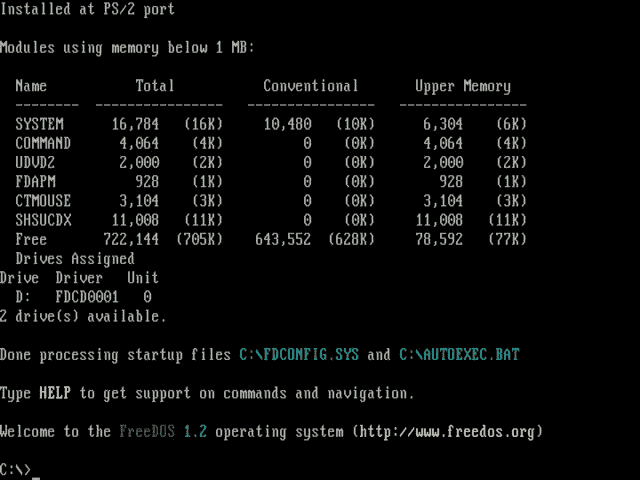
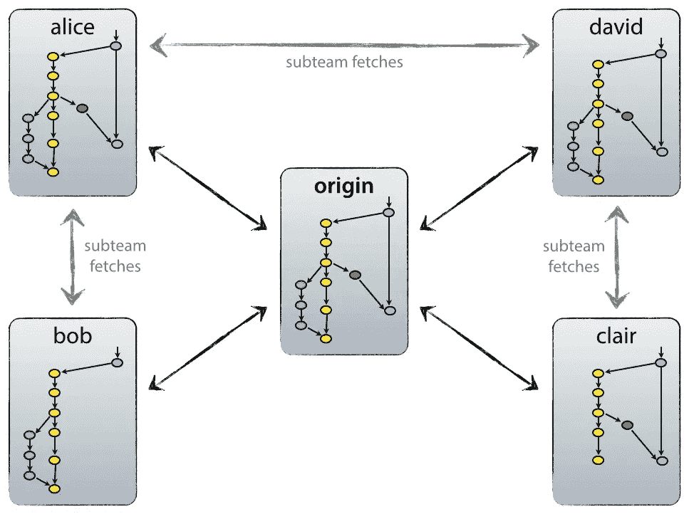

# Git、GitHub 和命令行界面(CLI)入门

> 原文：<https://medium.datadriveninvestor.com/getting-started-with-git-github-and-command-line-interfaces-cli-70169a88857d?source=collection_archive---------15----------------------->

命令行接口(CLI)是与机器通信的主要工具。你只需简单地写下你希望你的机器做什么，而不是指向、点击或触摸(图形用户界面的东西)。当然，你需要在某种语言上达成一致，这迫使你知道机器能够识别什么。


[Sudo make me a sandwitch! Photo by [Oscar Nord](https://unsplash.com/@furbee?utm_source=medium&utm_medium=referral) on [Unsplash](https://unsplash.com?utm_source=medium&utm_medium=referral)]

如果这听起来很可怕的老派或复古，你可能是对的。 **Neil Stephenson** 有一本非常好的书叫做*，书的开头是命令行*(你应该读一读，鉴于它在赛博朋克图书馆上是免费的**，你**有**可以读)。尽管如此，标题证明了这一点:这个 CLI 的东西是旧的。这就是(相当多的)开始的方式。**

**为什么要为那些旧东西烦恼呢？我们想做[ *插入一些很酷的东西或其他时髦词语* ]！”。我能感觉到你的尖叫，但是，好吧，命令行界面在你所有的宣传词中都有。从 **GitHub** ，在那里你将与世界分享你的精彩应用，到 *Python* 编程、 *R* 编程或 *SQL* 查询。**

**[](https://www.datadriveninvestor.com/2019/02/21/best-coding-languages-to-learn-in-2019/) [## 2019 年最值得学习的编码语言|数据驱动的投资者

### 在我读大学的那几年，我跳过了很多次夜游去学习 Java，希望有一天它能帮助我在…

www.datadriveninvestor.com](https://www.datadriveninvestor.com/2019/02/21/best-coding-languages-to-learn-in-2019/) 

**TL；文件操作需要一些命令行导航的信心。用编程语言更新和安装包或模块是基于命令行的(在 *Python* 、 *R* 包中的‘pip install’)。此外，特别是在非 Windows 系统中，许多文件和系统操作发生在终端，shell 或 bash…它们是命令行界面。**

好吧，我想这足以激励我们为什么要为斯蒂芬森的事情费心了。首先，我们将刷新一些命令行要点；然后我们将深入一些 GitHub 操作。

# 命令行要点

还记得以前的 **MS-DOS** 或者 **Windows 3.1** 吗？如果你没有，这是对过去日子的一个简短总结。



[If you feel DOS nostalgic get it back from freedos.org and replay that Duke Nukem — image from [https://www.freedos.org/images/screenshots/640x480/freedos12.png](https://www.freedos.org/images/screenshots/640x480/freedos12.png)]

想象一个类似矩阵的场景。在屏幕的左上角有一个闪烁的提示。但它是黑白的。上面写着 **C:\ >，下划线在闪烁**。

妈妈和爸爸告诉你必须输入' **win** 才能启动 Windows 3.1。然后一个神奇的图形界面出现了。有一个看起来像宜家抽屉的“文件管理器”图标，可以做你现在在“这台电脑”下做的事情，还有配件、游戏和应用程序。妈妈和爸爸也告诉你不要运行“*格式 C:* ”，因为它取消了硬盘上的所有东西。

(教育插入语:

1.  计算非英语儿童准确输入系统崩溃命令的可能性；
2.  为没有一个孩子清理父母硬盘的事实找一个解释。)

# 使用命令行导航文件系统

命令行系统中的一般工作流程如下:

1.  到达硬盘上正确的文件夹/目录；
2.  运行您需要的命令。

第一部分是关于管理路径的，是您将要执行的大部分命令行工作。第二种情况通常是命令行与编程或其他东西结合在一起。事实上，您将使用程序特定的命令。

首先，通过启动“windows Power Shell”(在 windows 10 上)来调用 Windows 命令行，然后尝试以下一些操作。

最常见的操作如下:

*   *换一个目录*:这个是用 **cd【何去何从】**完成的。回到过去，也许你有类似“cd 窗口”的东西。你得到了 C:\Windows\ '。在那里，如果你输入“模拟城市”,你就有一个游戏可以玩。
*   列出一个目录中的文件:你刚刚进入一个新的文件夹，对它的内容一无所知。键入' **dir** '找出答案。
*   *回到路径层次中的步骤*:假设你进入一个很长的路径，比如“你的驱动器\一个文件夹\另一个文件夹\一个程序\一个程序子文件夹\其他东西\它应该在这里\但是它不在这个文件夹中\”。假设你想回到“它应该在这里”文件夹中更高的位置。您可以键入相同的 cd 路径并剪切最后一部分。但是你可以用' **cd..**’。这两个点会让你在等级中上升**。**
*   ***创建一个新目录*:你现在是一个命令行向导。你导航到你想要的路径，知道如何运行不同的相关命令，但意识到在打开 Jupyter 笔记本之前你需要一个新文件夹？(顺便说一下[在这里](https://medium.com/@guglielmofeis/getting-started-with-python-anaconda-google-colab-and-virtual-environments-1ce8fc3286f9)看到如何打开和创建 Jupyter 笔记本。)**

# **您需要知道的事情(抢先调试)**

**如果您正在使用命令行，有一些事情值得了解:**

*   **你操作的机器类型很重要。Windows 有带\的路径。Unix、Mac 和 Linux 都配有/。如果您安装的 Git 客户机像 Unix 一样工作，这将很重要。**

**随意添加类似下面的 Python 代码，将 Win 路径转换为 Unix 路径:**

```
winpath = 'C:\\User\\Pippo'
unixpath = winpath.replace('\\', '/')
print(unixpath)
```

*   **不同的命令行工具可能使用不同的快捷方式来执行有用的操作，如复制和粘贴。如果你想将 git 命令复制到 https://git-scm.com/download/win 中，你可能需要使用 SHIFT + INS 而不是 CTRL+C；**
*   **命令行中的**星号*** 将匹配所有内容。当你打算只提交你的 Python 和 Markdown 文件，也就是那些以。Rmd 和. py**

# **Git 简介**

**Git 是一个*版本控制系统*。可以把它想象成某种形式的类固醇 dropbox 或者某种增强的 Google Drive。这是您与他人合作的地方，使您的文件可供他人访问。如果你和你的同事在做某件事，然后发现你的部门网页在 7.41 版本时很糟糕，需要回到 1.23 版本，你可以回到那里恢复它。**

**这就像回滚你的假期相册，有完美的注释。我们去喝了一品脱啤酒后，能给我照一张穿着黑外套在海上的照片吗？是的，那一级细节。**

****

**[Ok, this hurts. Photo by [Denys Nevozhai](https://unsplash.com/@dnevozhai?utm_source=medium&utm_medium=referral) on [Unsplash](https://unsplash.com?utm_source=medium&utm_medium=referral)]**

**在开发事物的合作努力中，git 是不可避免的。如果是的话，要么是有类似的东西在使用，要么就是会有噩梦。**

# **GitHub 操作和机制**

**如果你浏览 github，你会发现知识库。存储库是 github 上的主要容器。你把你的文件放在那里并组织它们。它们是你的文件夹，允许你也有版本控制。**

**除了创建自己的文件夹，你还可以浏览其他人的文件夹，查看他们的内容，并处理他们的文件。您可以复制这些文件(用 Git 行话来说是*克隆*，并且您可以贡献项目(这需要您*派生*存储库)。**

**在继续之前，您需要在 github 上注册一个帐户。要在命令行上运行 git 操作，您需要安装一个合适的 git 客户机。第一部分很简单，第二部分你可以在 https://git-scm.com/download/win 使用 git 客户端，或者尝试 github 桌面，https://desktop.github.com/有图形界面。**

**我将坚持使用 git 和它的 git bash 命令行界面(哦，Git 还附带了一个图形用户界面)。**

**通过安装 git 客户端，你将得到一个命令行终端，你可以在你的电脑上打开任何你想打开的地方。右键单击，您将看到两个进一步的选项:**

1.  **Git GUI 在这里；**
2.  **我是饭桶巴什。**

**您知道 bash 是命令行的另一个名称，所以您知道这是您想要的，也是我们将要使用的。**

# **Git:创建新的存储库并添加内容**

**是时候开始使用 Git(Hub)了。我将给出一个精简的摘要，如果你需要进一步的帮助[github 上的文档很棒，请查看它们](https://help.github.com/en/github)。在这里，我们将重点关注:**

1.  **[创建一个库](https://help.github.com/en/github/creating-cloning-and-archiving-repositories/creating-a-new-repository)和相关的[命令行版本](https://help.github.com/en/github/importing-your-projects-to-github/adding-an-existing-project-to-github-using-the-command-line)；**
2.  **[克隆一个库](https://help.github.com/en/github/creating-cloning-and-archiving-repositories/cloning-a-repository)；**
3.  **[向存储库发送内容](https://help.github.com/en/desktop/contributing-to-projects/committing-and-reviewing-changes-to-your-project#3-write-a-commit-message-and-push-your-changes)；**
4.  **[派生一个存储库并提供拉请求](https://help.github.com/en/github/collaborating-with-issues-and-pull-requests/creating-a-pull-request-from-a-fork)。**

**(请注意，本教程在没有命令行界面的情况下也可以使用。)**

**创建存储库的最简单的过程如下所示:**

*   **进入你的 github 页面，右边是你的个人资料菜单。点击**储存库**。**
*   **创建一个新的存储库:有一个绿色的“ **New** ”按钮希望您点击它；**
*   **打开它:那是自我解释；**
*   **克隆它:这需要进一步的步骤，稍后见；**
*   **将文件添加到存储库中(请参见稍后的内容)。**

**克隆是 git 的行话，意思是“在你的硬盘上做一个拷贝”。它也是用于克隆存储库的命令行 git 命令的一部分:' **git clone'** 。现在，您可以在您的本地副本上工作，并开发您的作品。一旦你完成了这些，你就可以*提交*你的工作到仓库。**

**一旦这样做了，你可以比较和对比正在发生的事情:如果你添加了文件，删除了一些或修改了一些东西。您的所有历史记录将被保存，您可以返回到您最喜欢的图片。**

**要克隆存储库，您需要:**

1.  **复制您刚刚创建的存储库的 *https* (您会发现点击克隆绿色按钮)；**
2.  **进入一个您希望存储库出现的目录(如果您在命令行中这样做，会有额外的好处)；**
3.  **git 猛击它:这就是命令行的用武之地。现在我们在 Git BASH shell 中；**
4.  **键入"**git clone[您在步骤 1 中拥有的 yoursepositorynamehttps]**。您现在正在调用一个特定的命令——git clone——shell 知道如何处理它。现在巴什可以给你做三明治了。**

***祝贺你，你已经克隆了你的库！***

# **克隆其他存储库**

**好，来个实际例子。假设你从零开始买了乔尔·格鲁什的*数据科学*(你应该读一读)。您在桌面上创建一个文件夹来处理这本书的内容。如果您使用“mkdir ”,将获得额外积分。在那里你计划复制一些例子，开发一些项目，等等。**

**然后你意识到 Joel 在 GitHub 库中有这本书的所有代码，并决定得到它。你要做的是:**

*   **进入您为该书创建的文件夹，例如“C:\ ds scratch”；**
*   **右击并选择‘git bash there’；**
*   **克隆资源库，即键入“git clone”[https://github.com/joelgrus/data-science-from-scratch.git](https://github.com/joelgrus/data-science-from-scratch.git)(这是你在乔尔的书资源库中得到的链接)。**

# **Git:将新的内容推送到项目中**

**为了将*内容推送到您的存储库中，我们需要学习一些额外的 git 命令。我们需要检查我们的本地克隆库和 GitHub 上的源库之间是否有差异。我们就能知道事情的进展情况。***

**如果你是唯一一个在仓库中工作的人，这很容易:我们做了所有的修改。如果我们和其他人一起工作，我们需要检查我们不工作时发生了什么。处理旧文件或重做别人的工作从来都不是好事。我们需要用 **git 状态**检查*状态*。您将看到修改、添加和删除的文件列表。您将看到本地克隆存储库中的新文件。**

**下一步是*添加*文件。Git 是用户友好的。键入 **git add** 和文件名。记住**整件事都是区分大小写的**。**

**添加是不够的。回到我们的图片类比，您有您想要存储在存储库中的图片。但也许那不是正确的，你可能想再拍一张，再拍一张。要真正放置*T21 的照片，你需要再做两个选择。***

**1)首先，你需要添加数据。这幅画是关于什么的？您希望能够找到您正在添加的内容。这样做，你就会犯错误。这是另一个 git 术语。并且，当你提交时，你会添加一条消息说明你正在做什么。您可以通过以下方式实现这一点:**

****git commit -m“变更描述”**(将'-m '标志视为插入消息的余数)。**

**2)一旦您指定了您想要的图片，并添加了所有相关描述，您就可以选择该图片。要将所有工作发送到存储库，您需要*推送*变更。顾名思义，使用 **git push** ，您可以将提交的任何内容上传到存储库。如果文件被删除，它们会被移除；如果你添加文件，它们会被添加；如果你修改了某个东西，git 会发现变化，跟踪它并修改文件。您的文件夹中的内容现在在 git 存储库中。**

**总而言之，*这就是你如何把内容放到你的存储库*(git talk 中的“回购”):**

*   **git 状态:检查差异；**
*   **git add:添加所有文件；**
*   **git 状态:检查你是否添加了正确的内容；**
*   **git commit -m“编写提交消息”；**
*   **git 状态:检查一切是否正确；**
*   **git push:实际上推送(和存储)东西。**

## **Git 自述文件**

**自述文件是一个文件，通常以 markdown 格式编写，用于初始化存储库。您可以在第一次提交时使用该文件。当人们访问您的存储库时，会显示并呈现自述文件。**

**使用自述文件向人们介绍您的项目。它的开发状态如何，在哪里可以找到使用它的文档，以及如何为您的项目做出贡献。**

## **添加所有具有特定结尾的文件**

**您有了第一个存储库，并为它编写了一些 markdown 文件和一些 python 文件。尽管如此，你还有进一步的 pdf 在那里，你是用来学习和 cvs 做输入数据。你不能把你创建的 10+个文件都加入到版本控制中。这里有一点命令行可以帮助你。**

**您知道您想要包含以结尾的文件。Rmd(降价)和。py (Python)。你的任务是写一个简短的脚本来匹配所有有那个结尾的东西。如果您记得在 shell *中匹配所有内容(如在“git add *”中),您可以得到:**

****git add *。Rmd** '(注意外壳区分大小写)；**

****git add *。py**’。**

**(如果您找到了 git bash 的 or 运算符，将会得到额外的奖励。)**

## **Git 忽略**

**git ignore 是一个文件，它告诉 git 在执行 git add 操作时不要考虑某些文件。您可能需要这样做，以避免由于编译或执行而导致的一些辅助文件被添加到版本控制中，或者您不想提交一些保存在 loca 中的数据。Git 忽略文件有自己的语法和规则，参见这里的[https://git-scm.com/docs/gitignore](https://git-scm.com/docs/gitignore)。**

# **分叉和贡献于一个项目**

**分叉合并了我们到目前为止所做的所有操作。当你分叉的时候，你正在 github 上创建一个新的副本。您可以像以前一样使用分叉的存储库。然后你可以选择一些你做过的工作，并把它从你分叉的分支推到主分支(也就是你分叉的那个)。这在 git 行话中称为*拉请求*。**

****

**[Super cool image here: [https://nvie.com/img/centr-decentr@2x.png](https://nvie.com/img/centr-decentr@2x.png), blog post linked in the resources.]**

**一旦你这样做了，分叉库的所有者将评估你的更改并决定是否接受你的拉请求。如果这听起来太专业太吓人，GitHub 有不止一个项目可以帮助你做出第一个分叉贡献，而不用担心搞乱一个复杂的数据库。[ [这是通过拉请求](https://github.com/firstcontributions/first-contributions#tutorials-using-other-tools)进行第一次 Git 贡献的教程。]**

# **人文科学 GitHub**

**AGGIUNGERE**

**这些教程(即关于 [Python、Spyder 等](https://medium.com/@guglielmofeis/getting-started-with-python-anaconda-google-colab-and-virtual-environments-1ce8fc3286f9)的教程和关于 Markdown 和 RStudio 的教程)的全部目的是展示一点技术能力可能对人文学科和一般研究有所帮助。**

> **我们都知道[进入一个网站建设/社交网络]旨在让学者分享他们的工作。为什么要为 GitHub 费心呢？**

**说得好。首先，你在那里找到的所有东西通常都在一堵木墙后面。人们看不见，也不识字。在 GitHub 上，即使你不在 git 上，你也可以阅读和浏览存储库。需要登录才能投稿。**

**更进一步，假设有人读了你的东西，看到了一个错别字。他们会为此给你写邮件吗？也许不是。如果人们阅读并发现了一个错别字，可以通知你，而你有机会接受他们的建议，而不必无聊地重新打开文件，纠正它，等等，会怎么样？？**

****GitHub** 已经让这一切成为可能。好吧，分叉一篇论文来通知一个错别字可以说不是 GitHub 的标准用法。但是通知 bug 和开发项目才是标准。学术方面，论文是项目，错别字是小错误。**

**GitHub 在不断变化和发展。人文学科和学术界是……可能吧。为什么我们不能认为 GitHub 是托管协作草稿的地方？ArXiV 论文和论文存储数据库链接到 GitHub。GitHub 托管带有会议演示的 Jupyter 笔记本。试试这个，并把它用在你的下一笔合作与传播的奖助金中。**

**它还允许您对文档进行**版本控制**。版本控制非常准确，就像它指出了我们共享的草稿 1 和我的以及你的润色版本之间的差异。不用再修改曲目了。在其他地方试试，他们会把你和一个完全不同领域的论文中的引用相匹配。**

**这需要一点努力，并打开新的机会。至少它让你的 dropbox 之类的东西更上一层楼。**

# **更多资源**

**[Git 备忘单对阅读和收藏很有用](https://github.github.com/training-kit/downloads/github-git-cheat-sheet/)**

**如果你是一个以书籍为导向的学习者，[这里有一本全面的 Git 和 GitHub 书籍，可以帮助你确切地了解幕后发生了什么，以及如何配置你的完美 Git(Hub)工作流](https://git-scm.com/book/en/v2)。这本书是免费的，并提供所有格式。**

**如果你想在 Python 环境中练习命令行任务(使用 Anaconda)，[这里有一个关于这个的教程](https://medium.com/@guglielmofeis/getting-started-with-python-anaconda-google-colab-and-virtual-environments-1ce8fc3286f9)**

**[通过拉式请求进行首次 Git 贡献的教程](https://github.com/firstcontributions/first-contributions#tutorials-using-other-tools)**

**街机库的编程书(没错，用 Python 编程视频游戏！)有一些关于 git 设置和 git 克隆操作的精彩教程。见[https://arcade-book . readthedocs . io/en/latest/chapters/04 _ version _ control/index . html](https://arcade-book.readthedocs.io/en/latest/chapters/04_version_control/index.html)(还是那句话，他们用的是 Bit Bucket 而不是 GitHub)。**

**关于 git 操作的一个很酷的帖子和更多的 git 图表，请参见[https://nvie.com/posts/a-successful-git-branching-model/](https://nvie.com/posts/a-successful-git-branching-model/)(并了解分支、检验等等)。**** 

****这项工作是作为 **CAS 奖学金**的一部分进行的，即*CAS-参见 Rijeka* 。点击查看更多关于团契[的信息。](http://cas.uniri.hr/cas-see-fellowship-application/)****