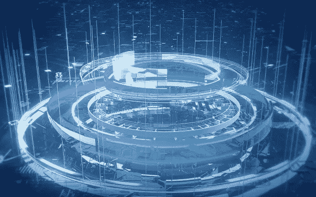
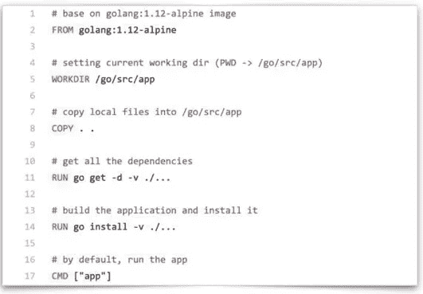

# Kubernetes 入门| Kubernetes 容器的基本概念

> 原文：<https://medium.datadriveninvestor.com/getting-started-with-kubernetes-basic-concepts-of-kubernetes-containers-e1874284ef18?source=collection_archive---------12----------------------->

*阿里云高级开发工程师付伟*

# 1)容器和图像

# 什么是容器？

在详细定义[容器](https://www.alibabacloud.com/product/container-service?spm=a2c41.14458583.0.0)之前，让我们简单回顾一下操作系统(OS)是如何管理进程的。我们可以通过登录到操作系统并执行操作(如运行 ps 命令)来查看进程。这些进程包括系统服务和用户的应用程序进程。让我们来看看这些过程的特点。

*   首先，这些进程是可见的，并且可以相互通信。
*   其次，这些进程使用相同的文件系统，因此可以读写相同的文件。
*   第三，这些进程使用相同的系统资源。

接下来，确定上面列出的特征可能引起的问题是很重要的。

*   由于这些进程对彼此可见并且可以相互通信，因此具有高级权限的进程可能会攻击其他进程。
*   此外，由于这些进程使用相同的文件系统，可能会出现一些问题。由于这些进程可能会添加、删除、修改和查询现有数据，因此具有高级权限的进程可能会删除其他进程的数据，从而影响其他进程的正常运行。此外，这些流程之间的依赖关系可能会发生冲突，这使得操作和维护(O&M)更加复杂。
*   由于这些进程使用同一主机的资源，应用程序之间可能会发生资源抢占。因此，当一个应用程序消耗了大部分 CPU 和内存资源时，其他应用程序可能无法正常提供服务。

针对这三个问题，我们来了解一下如何为这些进程提供一个独立的运行环境？

*   为了解决不同进程使用相同文件系统的问题，Linux 和 UNIX 操作系统通过使用 chroot 系统调用将子目录转换为根目录，从而实现视图级隔离。此外，chroot 允许进程拥有单独的文件系统，以确保在这些文件系统上执行添加、删除、修改或查询操作时，其他进程不会受到影响。
*   为了解决进程对彼此可见并且可以相互通信这一事实所导致的问题，命名空间技术被用于在资源视图级别隔离进程。chroot 系统和名称空间技术的结合允许进程在独立的环境中运行。
*   但是，在独立环境中，进程仍然共享同一个 OS 的资源，有些进程可能会耗尽整个系统的资源。为了减少进程之间的影响，可以使用 Cgroups 为某些进程设置资源使用限制，例如设置最大可用 CPU 数量和最大内存大小。

接下来，让我们理解如何以这种方式定义一组过程。

容器是一组进程，这些进程在视图级别上是隔离的，并且在资源利用方面受到限制，具有单独的文件系统。“视图级隔离”意味着只有部分进程是可见的，并且这些进程有独立的主机名。对资源利用的限制可能涉及存储器大小和 CPU 数量。容器与系统的其他资源相隔离，有自己的资源视图。

容器也有一个独立的文件系统。这个系统使用系统资源，因此不需要内核相关的代码或工具。因此，为容器提供所需的二进制文件、配置文件和依赖项是至关重要的。只要运行容器所需的文件集合可用，容器就可以运行。

# 什么是图像？

容器映像是指运行容器所需的所有文件的集合。通常，Dockerfile 用于构建映像。Dockerfile 提供了一个非常方便的语法糖来帮助我们描述每一个构建步骤。当然，每个构建步骤都是在现有文件系统上执行的，并且会对文件系统的内容进行更改。这些更改被称为变更集。通过将这些更改顺序应用到一个空文件夹来获得一个完整的映像。变更集以分层和可重用性为特征，提供了以下好处:

*   首先，分销效率可能会提高。如果将大图像分成小块，则图像的分发效率会提高，因为数据是并发下载的。
*   第二，当一些数据存储在本地时，只需要下载本地不可用的数据，因为图像数据是共享的。例如，要下载 Golang (Go)图像，如果本地有 Alpine 图像，则只需下载 Alpine 图像中不包含的数据，因为 Go 图像基于 Alpine 图像。
*   第三，因为图像数据是共享的，所以节省了大量的磁盘空间。假设高山图像和围棋图像被本地存储，高山图像的大小是 5 MB，围棋图像的大小是 300 MB。在这种情况下，总磁盘使用量为 305 MB。但是，通过重用功能，总磁盘使用量可能会减少到 300 MB。

# 如何建立形象

如下图所示，Dockerfile 描述了一个 Go 应用是如何构建的。

FROM 行表示执行构建步骤所基于的图像。如前所述，图像可以重用。2)工作目录行表示执行后续构建步骤的目录。它的功能类似于 shell 中的 cd 命令。
3)复制行表示将主机上的文件复制到容器映像。
4)运行行表示在特定文件系统上执行相应的操作。运行此命令后获取应用程序。
5)CMD 行表示图像中使用的默认程序名。

Dockerfile 可用后，通过运行 Docker build 命令来构建所需的应用程序。构建结果存储在本地。通常，映像是在打包工具或其他隔离环境中构建的。

 [## 云让犹豫不决的职业生涯规划者变得简单:基础|数据驱动的投资者

### 尽管 IT 在当今的商业中扮演着重要的角色，但许多 IT 求职者都不愿意从事云计算职业…

www.datadriveninvestor.com](https://www.datadriveninvestor.com/2020/03/11/cloud-made-simple-for-undecided-career-change-planners-the-fundamentals/) 

现在，下一个问题是这些映像如何在生产或测试环境中运行？在这种情况下，需要一个称为 Docker 注册表的代理或中央存储。该注册表存储所有生成的图像数据。要将本地映像推送到映像存储库，请运行 Docker pull 命令。这有助于在生产或测试环境中下载和运行相应的数据。

# 如何运行容器

要运行容器，您需要完成三个步骤:

*   步骤 1:从图像库中下载图像。
*   步骤 2:下载完映像后，通过运行 docker images 命令查看本地映像。在这种情况下，从返回的完整列表中选择所需的图像。
*   步骤 3:选择所需的映像后，执行 docker run 命令来运行映像并获得所需的容器。此外，通过多次运行该命令来获取多个容器。

图像相当于一个模板，容器是图像的运行实例。所以，树立形象，到处跑。

# 摘要

容器是一组独立于系统其余部分的进程，如其他进程、网络资源和文件系统。映像是容器所需的所有文件的集合，只需构建一次就可以在任何地方运行。

# 2)容器生命周期

# 容器运行时的生命周期

容器是一组独立的进程。通过运行 Docker run 命令，你可以指定一个镜像来提供一个单独的文件系统，并指定相应的运行程序。指定的运行程序被称为初始进程。容器以初始进程的启动开始，以初始进程的退出结束。

因此，容器的生命周期被认为与初始流程的生命周期相同。当然，一个容器可能不止包括一个初始过程。初始进程生成子进程或管理由 Docker exec 命令的执行产生的 O&M 操作。当初始进程退出时，它的所有子进程都会退出，以防止资源泄漏。然而，这种方法会带来一些问题。因为应用程序中的程序通常是有状态的，并且可能生成重要的数据。容器退出并被删除后，其数据会丢失。这对于应用程序来说是不可接受的，因此，需要持久化容器生成的重要数据。为了满足这种需求，容器直接将数据保存到指定的目录中，该目录称为卷。卷最突出的特点是卷的生命周期独立于容器。具体来说，创建、运行、停止和删除等容器操作与卷无关，因为卷是一个特殊的目录，有助于将数据持久存储在容器中。将卷装入容器，以便容器将数据写入相应的目录，并且容器的退出不会导致数据丢失。通常，卷有两种管理方式:

*   通过绑定将主机的目录直接挂载到容器中。这种方法很简单，但会产生 O&M 成本，因为当卷依赖于主机的目录时，它需要管理所有主机。
*   另一种方法是将目录管理分配给运行时引擎。

# 3)容器项目的架构

# 莫比容器引擎的体系结构

莫比是当今最流行的容器管理引擎。莫比守护程序管理上层的容器、映像、网络和卷。莫比守护进程所依赖的最重要的组件是 containerd。容器组件是一个独立于莫比守护进程的容器运行时管理引擎。它管理上层的容器和图像。

与守护进程类似，containerd 在底层包含一个 containerd shim 模块。这种设计是由于以下原因:

*   首先，需要灵活的基于插件的管理，因为 containerd 需要管理可能由不同容器运行时创建的容器的生命周期。垫片是为不同的容器运行时开发的。因此，shim 独立于 containerd，充当管理 containerd 的插件。
*   其次，填充程序的插件形式使填充程序能够由 containerd 动态托管。如果此功能不可用，当莫比守护程序或 containerd 守护程序意外退出时，容器将无人看管，然后消失并与莫比守护程序或 containerd 守护程序一起退出，这会影响应用程序的操作。
*   最后，莫比或容器可以随时升级，但不能在不影响服务升级的情况下就地升级。shim 机制允许就地升级，因此 containerd shim 非常重要。

这篇文章对莫比做了一个总体介绍。有关详细描述，请参考本系列的后续文章。

# 4)容器和虚拟机之间的比较

# 容器和虚拟机之间的区别

虚拟机(VM)通过使用基于虚拟机管理程序的虚拟化技术来模拟硬件资源，如 CPU 和内存，其中来宾操作系统构建在主机上。这个过程被称为虚拟机的安装。

每个客户操作系统，如 Ubuntu、CentOS 或 Windows，都有一个独立的内核。在这种客户操作系统中运行的所有应用程序都是相互独立的。因此，使用虚拟机可以实现更好的隔离。然而，实现这种隔离需要虚拟化某些计算资源，这导致了现有计算资源的浪费。此外，每个客户操作系统都会消耗大量磁盘空间。例如，Windows 操作系统消耗 10 GB 至 30 GB 的磁盘空间，Ubuntu 操作系统消耗 5 GB 至 6 GB 的磁盘空间。此外，在这种情况下，虚拟机的启动非常缓慢。VM 技术的弱点推动了容器技术的出现。容器面向流程，因此不需要客户操作系统。容器只需要一个单独的文件系统，为它提供所需的文件集合。在这种情况下，所有的文件隔离都是进程级的。因此，与 VM 相比，容器启动速度更快，需要的磁盘空间更少。但是，进程级隔离的效果不如虚拟机的效果理想。

一言以蔽之，容器和虚拟机都有利弊；目前，容器技术正朝着更强的隔离能力发展。

# 结论

本文简要介绍了 Kubernetes 容器的以下基本概念

*   容器是一组进程，有其独特的视图。
*   映像是运行容器所需的所有文件的集合，可以一次构建并在任何地方运行。
*   容器的生命周期与初始流程的生命周期相同。
*   容器和虚拟机各有利弊；目前，容器技术正朝着更强的隔离性发展。

# 原始来源:

 [## Kubernetes 入门| Kubernetes 容器的基本概念

### 阿里巴巴开发者 2020 年 2 月 26 日 238 由阿里云高级开发工程师付伟(宇哥)在获得…

www.alibabacloud.com](https://www.alibabacloud.com/blog/getting-started-with-kubernetes-%7C-basic-concepts-of-kubernetes-containers_595895?spm=a2c41.14458583.0.0)