# Kubernetes 入门|深入了解 Kubernetes 的核心概念

> 原文：<https://medium.datadriveninvestor.com/getting-started-with-kubernetes-deep-dive-into-kubernetes-core-concepts-eb0518935508?source=collection_archive---------9----------------------->

*阿里巴巴高级技术专家、CNCF TCO 李想*

# 什么是 Kubernetes？

[Kubernetes](https://www.alibabacloud.com/product/kubernetes?spm=a2c41.14458578.0.0) 是一个工业级容器编排平台。Kubernetes 这个名字来源于希腊语，意思是舵手或领航员。“K8s(或某些文章中的“ks”)，是通过将八个字母“ubernete”替换为“8”而得到的缩写。“如果你想知道为什么选择 Kubernetes 这个名字，意思是“舵手”，那么让我们看看下图。

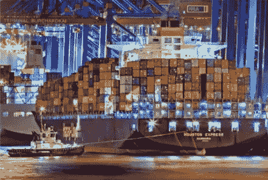

这是一艘载有一堆集装箱的船。这艘船正驶向大海，将集装箱运往目的地。在英语中，这个词也意味着包装要运输的货物的“容器”。因此，顾名思义，Kubernetes 希望成为一艘运输集装箱的船。换句话说，它打算帮助管理这些容器。因此，用“Kubernetes”这个词来代表这个项目。更具体地说，Kubernetes 是一个自动化容器编排平台，它负责部署、弹性伸缩和管理基于容器的应用程序。

# Kubernetes 的核心特征

服务发现和负载平衡

*   自动集装箱装箱:这个特性也被称为“调度”通过将容器放在集群中的一个节点上，Kubernetes 帮助协调存储系统，以便将存储的声明期与容器的生命周期联系起来。
*   自我修复:Kubernetes 有助于自动恢复失败的容器。在集群中，主机或操作系统问题可能会导致容器停止服务。如果是这种情况，Kubernetes 会自动恢复这些容器。
*   自动推出和回滚:Kubernetes 有助于自动推出和回滚应用程序，并管理应用程序相关的配置密文。
*   批处理执行:Kubernetes 允许批量运行作业。
*   水平伸缩:为了使集群和应用程序更加灵活，Kubernetes 还支持水平伸缩。

下面几节使用三个例子详细描述了 Kubernetes 的主要功能。

# 1)日程安排

在 Kubernetes 中，用户提交的容器被部署到由 Kubernetes 管理的集群中的一个节点上。Kubernetes 中的调度器就是实现这一功能的组件。它监控被调度的集装箱的尺寸和规格。例如，调度程序估计所需的 CPU 和内存容量，然后将容器放在集群中相对空闲的节点上。在这个例子中，调度器可以将红色容器放置在第二空闲节点上以完成调度任务。

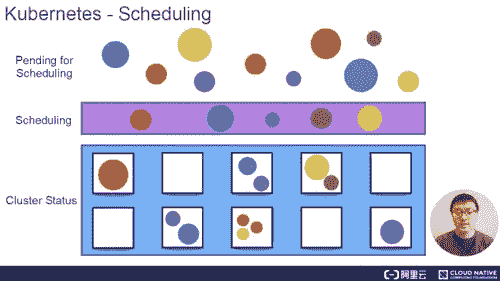

# 2)自动恢复

Kubernetes 提供节点健康检查。此功能允许系统监视群集中的所有主机。当主机或软件出现问题时，Kubernetes 会自动检测故障，并自动将故障节点上运行的容器迁移到健康的主机上，以自动恢复集群中的容器。

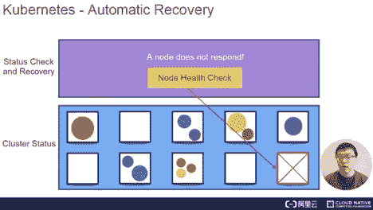

# 3)水平缩放

Kubernetes 能够通过监控检查服务负载。如果服务的 CPU 使用率过高，或者对服务的响应过慢，Kubernetes 会相应地扩展特定的服务。在下面的例子中，第一个黄色节点非常繁忙，因此，Kubernetes 将黄色节点的负载分布到三个部分。然后，通过负载均衡，Kubernetes 将第一个黄色节点上的原始负载平均分配给三个黄色节点，包括第一个黄色节点本身，以提高响应速度。

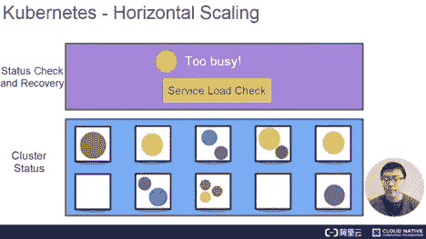

# 库伯内特建筑

Kubernetes 架构是一个典型的两层服务器-客户端架构。作为中央控制节点，主节点连接到多个节点。所有 UI 客户端和用户端组件都连接到主设备，以向主设备发送所需的状态或要执行的命令。然后，主设备将这些命令或状态发送到相应的节点进行最终执行。

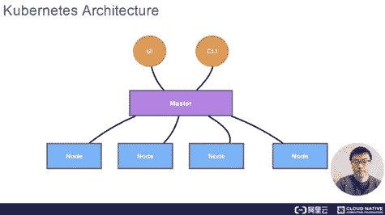

在 Kubernetes 中，主机运行四个关键组件，包括 API 服务器、控制器、调度程序和 etcd。下图显示了详细的 Kubernetes 架构。

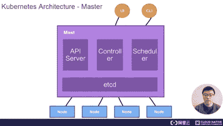

*   API 服务器:顾名思义，API 服务器处理 API 操作。Kubernetes 中的所有其他组件都连接到 API 服务器。一般来说，这些组件不是单独相互连接的。然而，它们依赖于 API 服务器来相互传输消息。
*   控制器:Kubernetes 附带的控制器监视和管理集群状态。例如，在前面的例子中，容器的自动恢复和自动水平缩放都是由 Kubernetes 中的控制器完成的。
*   调度程序:顾名思义，调度程序执行调度。如第一个示例中所述，调度器根据请求的 CPU 和内存容量，将用户提交的容器放置在适当的节点上。
*   etcd:它是一个分布式存储系统，API 服务器所需的所有原始信息都存储在 etcd 中。作为一个高可用性系统，etcd 负责确保 Kubernetes 中主服务器的所有组件都具有高可用性。

API 服务器是一个部署组件，它允许在部署结构方面进行水平扩展。此外，控制器代表实现热备份的部署组件。只有一个控制器是活动的，并有相应的调度程序。尽管如此，仍然可以实现热备份。

 [## 云让犹豫不决的职业生涯规划者变得简单:基础|数据驱动的投资者

### 尽管 IT 在当今的商业中扮演着重要的角色，但许多 IT 求职者都不愿意从事云计算职业…

www.datadriveninvestor.com](https://www.datadriveninvestor.com/2020/03/11/cloud-made-simple-for-undecided-career-change-planners-the-fundamentals/) 

# Kubernetes 架构—节点

在 Kubernetes 中，服务负载实际上是由节点承载的，每个服务负载作为一个 pod 运行。稍后将介绍 pod 的概念。此外，一个或多个容器正在 pod 中运行。实际运行这些 pod 的组件被称为 kubelet，这也是节点上最关键的组件。它从 API 服务器接收所需 pod 的运行状态，并将运行状态提交给容器运行时组件，如下图所示。

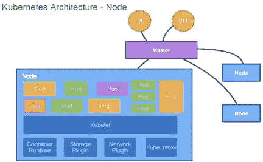

管理存储和网络对于在操作系统上为容器创建运行环境并最终运行容器或 pod 至关重要。Kubernetes 不直接执行任何存储或网络操作，而是依靠存储插件或网络插件来完成这些操作。通常情况下，用户或云厂商会开发相应的存储插件或网络插件来执行实际的存储或网络操作。

Kubernetes 还包括一个 Kubernetes 网络，为联网提供服务网络。服务的概念后面会介绍。真正完成服务联网的组件是 kube-proxy。它利用 iptables 在 Kubernetes 中建立了一个集群网络。到目前为止，您已经了解了节点上的所有四个组件。在 Kubernetes 中，节点不直接与用户交互，而是依赖于主节点。用户通过主节点向节点传递消息。在 Kubernetes 中，每个节点都运行前面的四个组件。

下面的例子展示了这些组件在 Kubernetes 架构中是如何相互作用的。

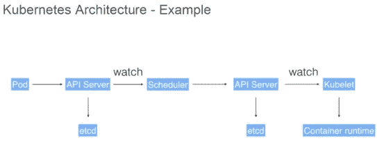

用户可以通过 UI 或 CLI 向 Kubernetes 提交 pod 部署请求。这个请求首先通过 CLI 或 UI 提交给 Kubernetes 中的 API 服务器。然后，API 服务器将请求信息写入 etcd 存储。最后，调度程序通过 API 服务器的监视或通知机制来获取这些信息。该信息表明需要对 pod 进行调度。

此时，调度器基于其存储器状态做出调度决定。完成调度后，它向 API 服务器报告“OK！这个 pod 需要调度到某个节点。”

收到这个报告后，API 服务器将调度结果写入 etcd。然后，API 服务器通知相应的节点启动 pod。在收到这个通知后，相应节点上的 kubelet 与容器运行时进行通信，以实际开始配置容器和容器的运行环境。此外，kubelet 分别安排存储插件配置存储，安排网络插件配置网络。此示例显示了这些组件如何相互通信并协同工作来完成 pod 的调度。

# Kubernetes 的核心概念和 API

# 核心概念

## 概念 1) Pod

pod 是 Kubernetes 中最小的调度和资源单位。用户通过 Kubernetes 的 pod API 创建一个 Pod，以便 Kubernetes 安排 Pod。具体来说，pod 放在 Kubernetes 管理的节点上运行。简而言之，pod 是一组容器的抽象，包含一个或多个容器。

如下图所示，pod 包含两个容器，每个容器指定其所需的资源大小，例如 1 GB 内存和 1 个 CPU 核心，或者 0.5 GB 内存和 0.5 个 CPU 核心。

此 pod 还包含其他必需的资源，例如称为卷的存储资源，或者 100 GB 或 20 GB 内存。

在 pod 中，定义运行容器的方式，例如运行容器的命令或环境变量。pod 还为其中的容器提供了一个共享的运行环境。在这种情况下，这些容器共享一个网络环境，并通过本地主机直接找到彼此。此外，豆荚是相互隔离的。

## 概念 2)体积

在 Kubernetes 中，卷用于管理存储和声明由 pod 中的容器访问的文件目录。可以将卷装载到 pod 中一个或多个容器的指定路径。

体积本身是一个抽象概念。一个卷支持多种类型的后端存储。例如，Kubernetes 中的卷支持许多存储插件。支持本地存储，支持 Ceph、GlusterFS 等分布式存储，支持阿里云、AWS、Google 中的磁盘等云存储。

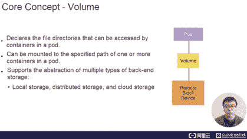

## 概念 3)部署

部署是 pod 之上的抽象，定义了一组 pod 和 pod 版本的副本数量。通常，这种抽象用于实际管理应用程序，而 pod 是构成部署的最小单元。在 Kubernetes 中，控制器维护部署中的 pod 数量，并帮助部署自动恢复失败的 pod。例如，定义一个包含两个单元的部署。如果一个 pod 发生故障，相应的控制器会检测到该故障，并通过创建 pod 将部署中的 pod 数量从一个恢复到两个。Kubernetes 中的控制器还允许我们实现已发布的策略，例如滚动升级、再生升级或版本回滚。

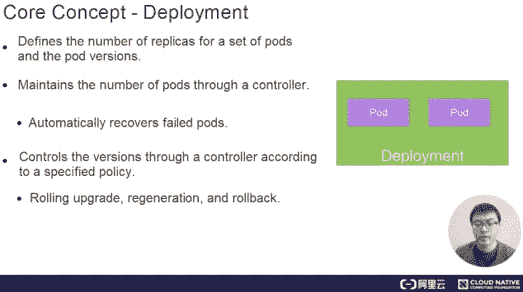

## 概念 4)服务

服务为一个或多个 pod 实例提供静态 IP 地址。在前面的示例中，一个部署可以包括两个或更多相同的 pod。对于外部用户来说，访问任何 pod 都是一样的，因此负载平衡是首选。为了实现负载平衡，用户希望访问静态虚拟 IP (VIP)地址，而不是知道所有 pod 的具体 IP 地址。如前所述，pod 可能处于终端运行(终止)状态。如果是这种情况，它可能会被一个新的吊舱所取代。

对于外部用户，如果提供了多个 pod 的特定 IP 地址，则该用户需要不断更新 pod 的 IP 地址。如果一个 pod 发生故障，然后重新启动，抽象可以将对所有 pod 的访问抽象到第三方 IP 地址中。在 Kubernetes 中实现这个特性的抽象称为服务。Kubernetes 支持服务的多种入口模式，包括 ClusterIP、NodePort 和 LoadBalancer 模式。它还支持使用 kube-proxy 通过网络进行访问。

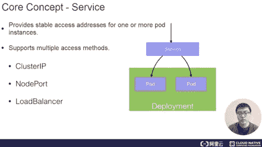

## 概念 5)名称空间

命名空间用于在集群中实现逻辑隔离，这涉及到身份验证和资源管理。Kubernetes 中的每个资源，比如 pod、部署和服务，都属于一个名称空间。资源名称在一个命名空间中必须是唯一的，但在不同的命名空间中可以是相同的。下面描述了名称空间的一个用例。在阿里巴巴，有很多业务部门(BUs)。为了在视图级别隔离每个业务部门，并使它们在身份验证和计算统一设备架构(CUDA)中有所不同，我们将使用名称空间为每个业务部门提供这样一种可视化隔离机制。

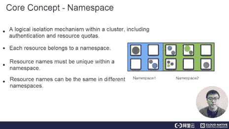

# Kubernetes API

下图描述了 Kubernetes API 的基础。从高层的角度来看，Kubernetes API 是基于 HTTP 和 JSON 的。具体来说，用户通过 HTTP 访问 API，被访问 API 的内容是 JSON 格式的。在 Kubernetes 中，kubectl 命令行工具，Kubernetes UI，或者有时 curl，用于基于 HTTP 和 JSON 直接与 Kubernetes 通信。在以下示例中，pod 的 HTTP 访问路径由以下部分组成:API、API 版本:V1、命名空间、pod 和 pod 名称。

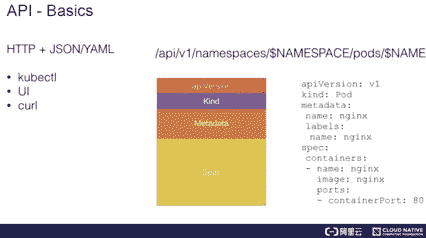

相反，如果我们提交一个 pod 或获得一个 pod，pod 的内容以 JSON 或 YAML 格式表示。上图显示了一个 YAML 文件示例。在这个 YAML 文件中，pod 的描述由几个部分组成。

一般第一部分是 API 版本。在本例中，API 版本是 V1。第二部分是正在开发的资源。例如，如果资源的种类是一个 pod，那么这个 pod 的名称就写在元数据中。如果资源的种类是 Nginx，我们会给它添加一些标签。标签的概念将在后面描述。在元数据中，有时我们也编写注释，从用户的角度额外描述资源。

另一个重要的部分是 spec，它表示 pod 的期望状态。例如，规范显示了需要在 pod 中运行的容器、包含在 pod 中的 Nginx 容器的图像以及公开端口的 ID。

当我们通过 Kubernetes API 获得这个资源时，规范通常会附带一个名为 status 的项目，它指示这个资源的当前状态。例如，pod 可能处于计划、运行或终止状态。终止状态意味着 pod 已被执行。

在描述 API 的时候，我们提到了一个有趣的元数据元素，叫做“标签”。标签可以是一组键值对。例如，对于下图中的第一个窗格，标签可能是红色，这表示该窗格是红色的。也可以添加其他标签，比如 size big，表示尺寸定义为大。此外，还可以添加一组标签。这些标签由选择器查询。事实上，这种能力与 SQL select 语句非常相似。例如，您可以从下图所示的三个窗格中进行选择。当颜色命名为红色时，意味着一个 pod 的颜色是红色，请注意，只选择了两个 pod，因为只有它们的标签指示红色。另一个 pod 的标签上写着颜色是黄色的，说明这个 pod 是黄色的，因此没有被选中。

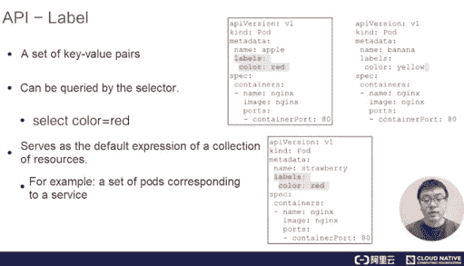

标签允许 Kubernetes API 过滤这些资源。过滤也是 Kubernetes 中指示资源集合的默认方式。

例如，一个部署可能代表一组 pod，或者是一组 pod 的抽象。这组窗格通过使用标签选择器来指示。如前所述，一个服务对应于一个或多个 pod，以便以集中的方式访问它们。在此描述中，标签选择器也选择了一组窗格。

因此，标签是 Kubernetes API 的核心概念。在后续教程中，我们将深入研究标签的概念以及如何充分利用标签。

# 示范

最后，让我们尝试一个 Kubernetes 集群演示。在此之前，通过执行以下步骤，确保在本地安装一个 Kubernetes 集群和一个 Kubernetes 沙盒环境:

*   步骤 1:安装一个虚拟机，以便在虚拟机中启用 Kubernetes。我们建议使用 VirtualBox 作为虚拟机的运行环境。

在安装之前，从 https://www.virtualbox.org/wiki/Downloads 下载 VirtualBox

*   第二步:在虚拟机中启动 Kubernetes。Kubernetes 包括一个名为 minikube 的有趣工具。这是启动一个最小的本地 Kubernetes 集群的环境。我们推荐使用[阿里云版本的 minikube](https://yq.aliyun.com/articles/221687?spm=a2c41.14458578.0.0) 。这个 minikube 版本和官方 minikube 版本的主要区别在于，后者所需的谷歌特定依赖项被替换为在中国更容易访问的图像。这有利于安装。
*   第三步:安装 VirtualBox 和 minikube 后，运行`minikube start —vm-driver virtualbox`启动命令启动 minikube。

注:如果您的计算机没有运行在 Mac 系统上，请访问下面的 this [链接](https://kubernetes.io/docs/tasks/tools/install-minikube/?spm=a2c41.14458578.0.0)了解如何在其他操作系统上安装 minikube 沙盒环境。

完成安装后，实现如下用例。

1)提交 Nginx 部署:`kubectl apply -f https://k8s.io/examples/application/deployment.yaml`
2)更新 Nginx 部署:`kubectl apply -f https://k8s.io/examples/application/deployment-update.yaml`
3)扩展 Nginx 部署:`kubectl apply -f [https://k8s.io/examples/application/deployment-update.yaml](https://k8s.io/examples/application/deployment-update.yaml)`

总的来说，首先提交一个 Nginx 部署，然后升级这个部署的版本，以更改其 pod 的版本。最后，横向扩展 Nginx 部署。现在让我们进行三个操作。首先，检查 minikube 的状态。输出显示 kubelet 主机和 kubectl 都已正确配置。

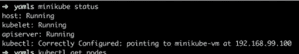

然后，通过 kubectl 检查这个集群中节点的状态。输出显示主服务器正在运行。

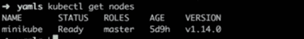

让我们基于主服务器检查集群中的部署。

输出显示该集群不包括任何部署。使用观察语义查看集群中部署的更改。现在，它准备执行前面的三个操作。首先，创建一个部署。下面的第一张图显示了 API 的内容。具体来说，种类是部署，名称是 nginx-deployment。如第二张图所示，副本数量为 2，镜像版本为 1.7.9。

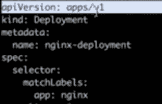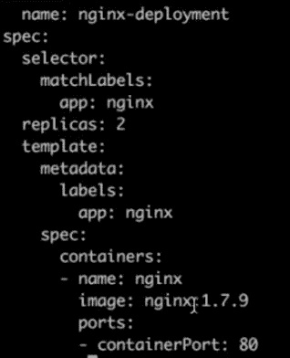

现在，运行 kubectl 命令来创建部署。请注意，一个简单的操作使部署能够不断生成副本。

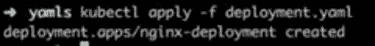

副本的数量是 2。以前不存在名为 nginx-deployment 的部署。现在让我们描述一下这个部署的当前状态。

在下图中，注意已经生成了一个名为 nginx-deployment 的部署。副本数量如所愿，选择器符合要求，镜像版本也是 1.7.9。此外，观察名为 deployment-controller 的控制器正在管理生成。

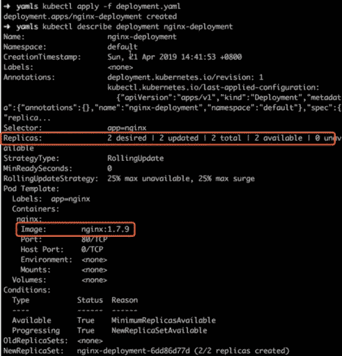

接下来，让我们更新这个部署的版本。首先，下载另一个名为`deployment-update.yaml.`的 YAML 文件。另外，请注意，该文件中的镜像版本从 1.7.9 更新到了 1.8。

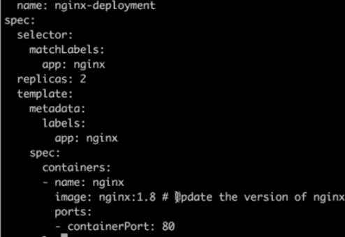

然后应用新的`deployment-update.yaml file.`这个部署更新的一些操作出现在另一边的屏幕上，最新值从 0 变为 2。这表明所有容器和单元都是最新的。运行 describe 命令检查是否所有 pod 的版本都已更新。输出显示映像版本已从 1.7.9 更新到 1.8。

此外，请注意，控制器随后会执行几个新的操作来维护部署和 pod 的状态。

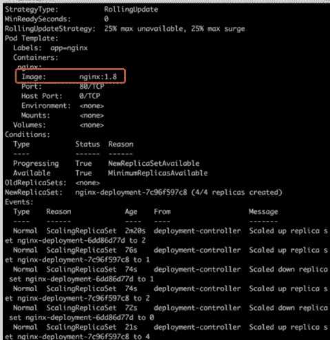

现在，让我们通过下载另一个`deployment-scale.yaml file.`来横向扩展部署。该文件显示副本的数量已从 2 个更改为 4 个。

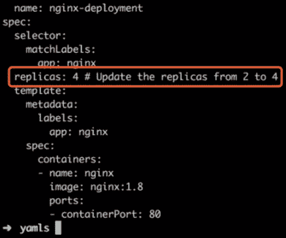

返回初始窗口，使用 kubectl 在另一个窗口中应用新的`deployment-scale.yaml file.`，注意在应用`deployment-scale.yaml`文件后，pod 的数量从 2 变为 4。再次描述当前集群中的部署。输出显示副本的数量从 2 个增加到了 4 个，控制器执行了几个新的操作。这表明扩大规模已经完成。

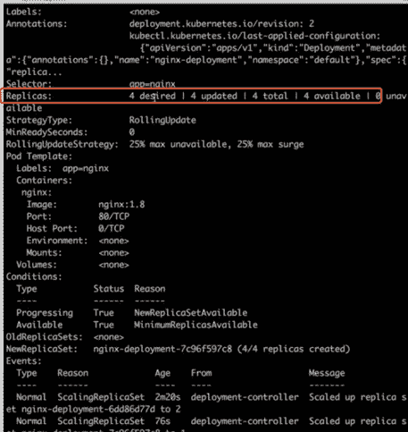

最后，让我们执行删除操作来删除生成的部署。如下图所示，kubectl delete deployment 也是原始部署的名称。删除后，所有需要的操作都完成了。因此，此部署不再存在，群集返回到其原始的干净状态。

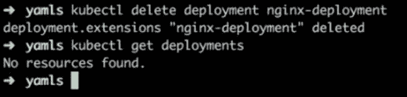

# 结论

本文重点介绍 Kubernetes 的核心概念和建筑设计，主要包括以下几点:

*   Kubernetes 是一个自动化容器编排平台。它负责部署、弹性伸缩和管理基于容器的应用程序。
*   Kubernetes 架构是一个典型的两层服务器-客户端架构。

# 原始来源:

 [## Kubernetes 入门|深入了解 Kubernetes 的核心概念

### 阿里巴巴开发者 2020 年 2 月 26 日 417 由阿里巴巴高级技术专家、CNCF Kubernetes TCO is…

www.alibabacloud.com](https://www.alibabacloud.com/blog/getting-started-with-kubernetes-%7C-deep-dive-into-kubernetes-core-concepts_595896?spm=a2c41.14458578.0.0)