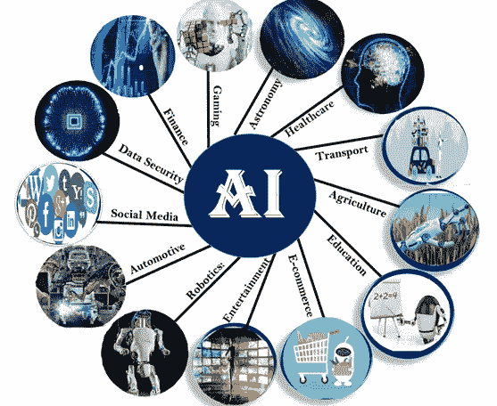
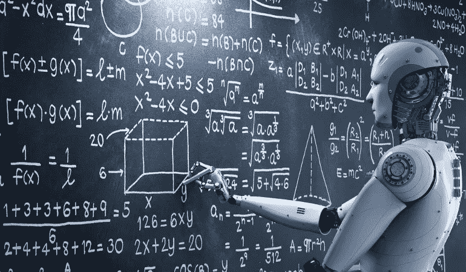

# 机器学习和人工智能入门

> 原文：<https://medium.datadriveninvestor.com/getting-started-with-machine-learning-and-artificial-intelligence-8637cd21df27?source=collection_archive---------6----------------------->

机器学习和人工智能被认为是我们日常生活中不断发展的技术之一。这些不断发展的技术让我们的生活变得比我们想象的要简单一些。机器人和基于人工智能的解决方案的使用使人类的生活变得更加轻松，也通过减少劳动力数量、节省时间和增加收入来帮助许多行业。人工智能给汽车、医疗、国防和 IT 等行业带来了很多变化。

A figure which demonstrates the various application of ai in industry

# 不同类型的人工智能

1.  弱人工智能:-也被称为狭义人工智能，专注于一项任务。在弱人工智能的情况下，没有自我意识或真正的智能。
2.  强人工智能:-也被称为真正的人工智能，是一台像人脑一样聪明的计算机。这种人工智能将能够完成人类能做的所有任务。

# 怎么才能入门 ML 和 AI

你需要做的第一件事是学习一门编程语言。虽然有很多语言可以开始学习，但 Python 是很多人更喜欢开始学习的语言，因为它的库更适合机器学习。

这里有一些我认为最适合学习 python 的网站

1. [Freecodecamp](https://www.freecodecamp.org/learn/)

2.[代码学院](https://www.codecademy.com/learn/learn-python)

3. [Coursera Python](https://www.coursera.org/specializations/python)

 [## 认知计算——一套被广泛认为是……

### 作为它的用户，我们已经习惯了科技。这些天几乎没有什么是司空见惯的…

www.datadriveninvestor.com](https://www.datadriveninvestor.com/2020/02/19/cognitive-computing-a-skill-set-widely-considered-to-be-the-most-vital-manifestation-of-artificial-intelligence/) 

在对 Python 有了基本的了解并对基础知识进行了足够的实践之后，你应该开始学习更多关于机器学习的知识。这里有一些学习 ML 的教程

1.  [Coursera 机器学习](https://www.coursera.org/learn/machine-learning)
2.  [机器学习掌握度](https://machinelearningmastery.com/)
3.  [机器学习的可视化介绍](http://www.r2d3.us/visual-intro-to-machine-learning-part-1/)

这是我的 GitHub 库链接。包括各种学习 ML 的 PPT 和资源。

 [## vmr1532/ml_workshop

### ML 研讨会的内容。在 GitHub 上创建一个帐户，为 vmr1532/ml_workshop 开发做出贡献。

github.com](https://github.com/vmr1532/ml_workshop)